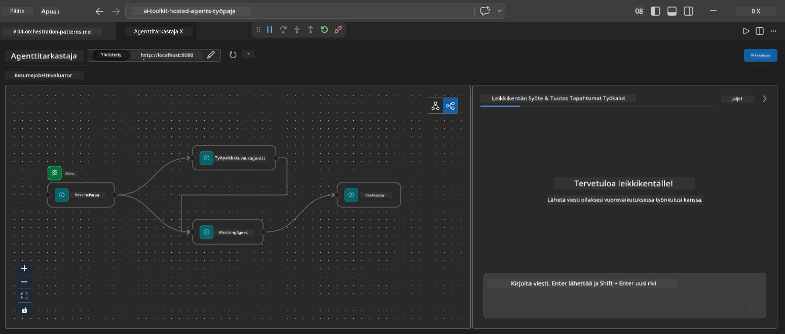
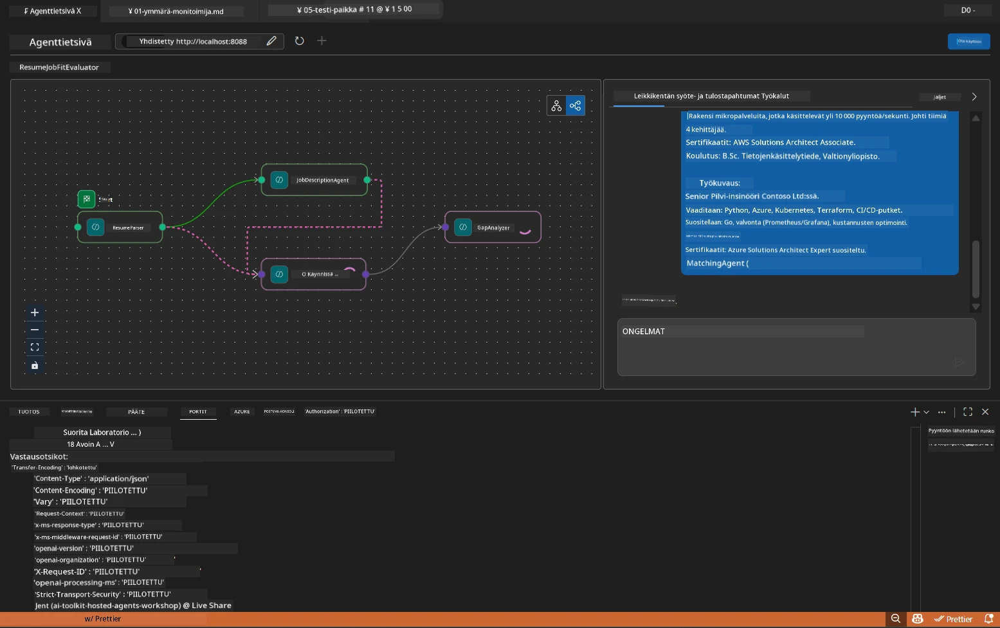
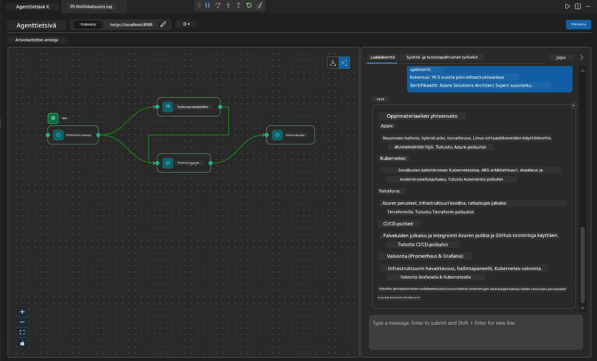

# Moduuli 5 - Testaa paikallisesti

⏱️ ~15 min

Tässä moduulissa ajat monitoimittajatyönkulun paikallisesti, testaat sitä Agent Inspectorilla ja varmistat, että kaikki neljä agenttia ja MCP-työkalu toimivat oikein ennen käyttöönottoa.

---

## Vaihe 1: Käynnistä agenttipalvelin

### Vaihtoehto A: VS Code -tehtävän käyttäminen (suositeltu)

1. Avaa `workshop/lab02-multi-agent/PersonalCareerCopilot/` VS Code -kansiona.
2. Paina `Ctrl+Shift+P` → kirjoita **Tasks: Run Task** → valitse **Run Agent HTTP Server**.
3. Tehtävä käynnistää palvelimen, johon on liitetty debugpy portissa `5679` ja agentti portissa `8088`.
4. Odota, että tuloste näyttää:

```
INFO:resume-job-fit:Starting Resume -> Job Fit Evaluator HTTP server...
INFO:resume-job-fit:Server running on http://localhost:8088
```

### Vaihtoehto B: F5:n käyttäminen (virheenkorjaustila)

1. Paina `F5` → valitse **Debug Local Agent HTTP Server**.
2. Palvelin käynnistyy täydellä breakpoint-tueella - hyödyllistä MCP-vastausten tai agentin tulosteiden tarkasteluun.

---

## Vaihe 2: Avaa Agent Inspector

1. Paina `Ctrl+Shift+P` → kirjoita **Foundry Toolkit: Open Agent Inspector**.
2. Agent Inspector avautuu VS Code -paneelina, joka on yhdistetty osoitteeseen `http://localhost:8088`.
3. Näet agentin käyttöliittymän vastaanottovalmiina viesteille.



> **Jos Agent Inspector ei aukea:** Varmista, että palvelin on kokonaan käynnistynyt (näet "Server running" lokin). Jos portti 5679 on varattu, katso [Moduuli 8 - Vianmääritys](08-troubleshooting.md).

---

## Vaihe 2b: (Valinnainen) Avaa Workflow Visualizer

Foundry Toolkit sisältää reaaliaikaisen **Workflow Visualizerin**, joka näyttää agenttien vuorovaikutuksen graafin suorittamisen aikana. Tämä on erityisen hyödyllistä monitoimittajan virheenkorjauksessa.

1. Paina `Ctrl+Shift+P` → kirjoita **Foundry Toolkit: Open Visualizer for Hosted Agents**.
2. Uusi VS Code -välilehti avautuu näyttämään suoritusgraafin reaaliajassa.
3. Kun lähetät viestejä Agent Inspectorissa, visualizer päivittyy automaattisesti - vihreät solmut tarkoittavat valmiita agenteja, ja animoidut kaaret näyttävät tietovirran niiden välillä.

> **Porttikonflikti:** Jos visualizerin portti on jo käytössä, vaihda se VS Code -asetuksissa → **Extensions** → **Microsoft Foundry Configuration** → **Hosted Agents: Visualizer Port**.

---

## Vaihe 3: Suorita savutestit

Suorita nämä kolme testiä järjestyksessä. Kukin testaa yhä laajemmin työnkulkua.

### Testi 1: Perus CV + työkuvaus

Liitä seuraava Agent Inspectoriin:

```
Resume:
Jane Doe
Senior Software Engineer with 5 years of experience in Python, Django, and AWS.
Built microservices handling 10K+ requests/second. Led a team of 4 developers.
Certifications: AWS Solutions Architect Associate.
Education: B.S. Computer Science, State University.

Job Description:
Senior Cloud Engineer at Contoso Ltd.
Required: Python, Azure, Kubernetes, Terraform, CI/CD pipelines.
Preferred: Go, monitoring (Prometheus/Grafana), cost optimization.
Experience: 5+ years in cloud infrastructure.
Certifications: Azure Solutions Architect Expert preferred.
```

**Odotettu tulosteen rakenne:**

Vasteen tulee sisältää kaikkien neljän agentin tuloste peräjälkeen:

1. **Resume Parser -tulos** - Kaksi nimettyä osiota: `[PARSED RESUME]` (ehdokasprofiili ryhmitellyillä taidoilla) ja `[JOB DESCRIPTION PASS-THROUGH]` (kirjaimellinen työkuvausteksti, joka syötetään JD Agentille)
2. **JD Agentin tulos** - Rakenteelliset vaatimukset, joissa vaaditut ja toivotut taidot eroteltuna
3. **Matching Agentin tulos** - Soveltuvuuspiste (0-100) erittelyineen, osuvat taidot, puuttuvat taidot, aukot
4. **Gap Analyzerin tulos** - Yksittäiset aukkojen kuvakortit jokaiselle puuttuvalla taidolla, jokaisessa Microsoft Learn -URL-osoite





### Mitä tarkistaa Testissä 1

| Tarkista | Odotettu | Läpäisy? |
|----------|----------|----------|
| Vaste sisältää soveltuvuuspisteen | Luku 0-100 välillä erittelyllä | |
| Osuvat taidot on listattu | Python, CI/CD (osittain), ym. | |
| Puuttuvat taidot on listattu | Azure, Kubernetes, Terraform, ym. | |
| Aukkojen kuvakortit ovat olemassa | Yksi kortti per taito | |
| Microsoft Learn -URL-osoitteet ovat läsnä | Oikeat `learn.microsoft.com` -linkit | |
| Ei virheilmoituksia vastauksessa | Siisti rakenteellinen tuloste | |

### Testi 2: Ääriesimerkki - korkean soveltuvuuden ehdokas

Liitä CV, joka vastaa työkuvausta hyvin, varmistaaksesi että GapAnalyzer osaa käsitellä korkean soveltuvuuden tilanteet:

```
Resume:
Alex Chen
Senior Cloud Engineer with 7 years of experience.
Skills: Python, Azure (AKS, Functions, DevOps), Kubernetes, Terraform, CI/CD (GitHub Actions, Azure Pipelines), Go, Prometheus, Grafana, cost optimization.
Certifications: Azure Solutions Architect Expert, Azure DevOps Engineer Expert.
Led infrastructure migration to Azure for 3 enterprise clients.
Education: M.S. Computer Science, Tech University.

Job Description:
Senior Cloud Engineer at Contoso Ltd.
Required: Python, Azure, Kubernetes, Terraform, CI/CD pipelines.
Preferred: Go, monitoring (Prometheus/Grafana), cost optimization.
Experience: 5+ years in cloud infrastructure.
Certifications: Azure Solutions Architect Expert preferred.
```

**Odotettu käyttäytyminen:**
- Soveltuvuuspisteen tulee olla **80+** (useimmat taidot täsmäävät)
- Aukkojen kuvakorttien tulisi keskittyä viimeistelyyn/haastatteluun valmistautumiseen eikä perustason oppimiseen
- GapAnalyzerin ohjeissa lukee: "Jos soveltuvuus >= 80, keskity viimeistelyyn/haastatteluun valmistautumiseen"

---

## Vaihe 4: Testaa omilla tiedoillasi (valinnainen)

Kokeile liittää oma CV:si ja oikea työkuvaus. Tämä auttaa varmistamaan:

- Agenttien käsittelevän erilaiset CV-muodot (kronologinen, funktionaalinen, hybridi)
- JD Agentin käsittelevän erilaiset työkuvaustyylit (luettelomerkit, kappaleet, rakenteellinen)
- MCP-työkalun palauttavan asiaankuuluvat resurssit todellisille taidoille
- Aukkojen kuvakorttien olevan henkilökohtaisia juuri sinun taustaasi varten

> **Yksityisyys - Polku A (Foundry-pilvi):** CV ja työkuvausteksti lähetetään Azure OpenAI -käyttöönotollesi päättelyä varten. Niitä ei kirjata tai tallenneta workshopin infrastruktuurissa. Käytä paikkamerkkinimiä (esim. "Jane Doe"), jos haluat.
>
> **Yksityisyys - Polku B (Foundry Local):** Kaikki neljä agentin päättelyä ajetaan kokonaan omalla laitteellasi. CV:si ja työkuvaustekstisi **eivät koskaan poistu koneeltasi**. Ainoa ulkoinen kutsu on MCP-työkalu, joka hakee resursseja osoitteesta `https://learn.microsoft.com/api/mcp`; siinä kyselyssä on vain taitojen nimet, ei henkilökohtaisia tietojasi.

---

### Välitarkistus

- [ ] Palvelin käynnistyi onnistuneesti portissa `8088` (lokissa näkyy "Server running")
- [ ] Agent Inspector avattiin ja yhdistettiin agenttiin
- [ ] Testi 1: Täydellinen vastaus soveltuvuuspisteineen, osuvat/puuttuvat taidot, aukkojen kuvakortit ja Microsoft Learn -linkit
- [ ] Testi 2: Korkean soveltuvuuden ehdokas saa pisteen 80+ viimeistelyyn keskittyvien suositusten kanssa
- [ ] Kaikki aukkojen kuvakortit ovat paikallaan (yksi per puuttuva taito, ei leikkausta)
- [ ] Ei virheitä tai pinojälkiä palvelimen pääteikkunassa

---

**Edellinen:** [04 - Orkestraatiomallit](04-orchestration-patterns.md) · **Seuraava:** [06 - Ota käyttöön Foundryssa →](06-deploy-to-foundry.md)

---

<!-- CO-OP TRANSLATOR DISCLAIMER START -->
**Vastuuvapauslauseke**:
Tämä asiakirja on käännetty käyttämällä tekoälypohjaista käännöspalvelua [Co-op Translator](https://github.com/Azure/co-op-translator). Vaikka pyrimme tarkkuuteen, otathan huomioon, että automaattiset käännökset saattavat sisältää virheitä tai epätarkkuuksia. Alkuperäinen asiakirja sen alkuperäiskielellä on virallinen lähde. Tärkeissä asioissa suositellaan ammattimaista ihmiskäännöstä. Emme ole vastuussa tämän käännöksen käytöstä aiheutuvista väärinymmärryksistä tai tulkinnoista.
<!-- CO-OP TRANSLATOR DISCLAIMER END -->