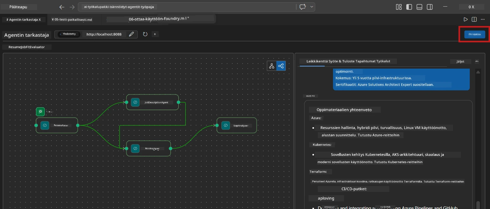
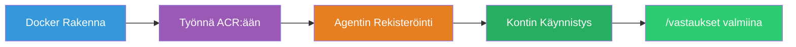
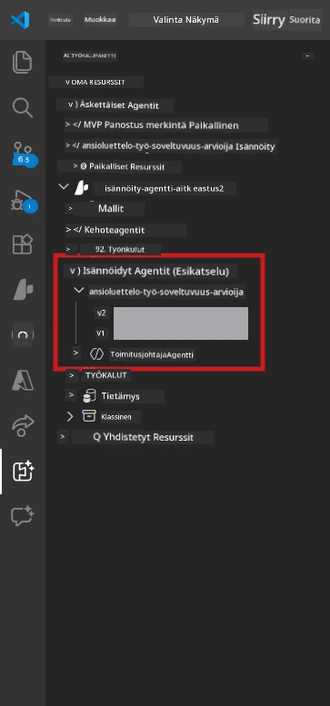

# Modul 6 - Julkaisu Foundry Agent -palveluun

Tässä moduulissa julkaiset paikallisesti testatun moniagenttisen työnkulun [Microsoft Foundryyn](https://learn.microsoft.com/azure/foundry/agents/concepts/hosted-agents) **Isännöitynä agenttina**. Julkaisuprosessi rakentaa Docker-konttikuvan, työntää sen [Azure Container Registryyn (ACR)](https://learn.microsoft.com/azure/container-registry/container-registry-intro) ja luo isännöidyn agenttiversion [Foundry Agent Serviceen](https://learn.microsoft.com/azure/foundry/agents/how-to/publish-agent).

> **Keskeinen ero Lab 01:een:** Julkaisuprosessi on identtinen. Foundry käsittelee moniagenttista työnkulkua yhtenä isännöitynä agenttina – monimutkaisuus on kontissa, mutta julkaisupinnassa on sama `/responses` -päätepiste.

---

## Vaatimusten tarkistus

Ennen julkaisua varmista seuraavat kohdat:

1. **Agentti läpäisee paikalliset savutestit:**
   - Suoritit kaikki 3 testiä [Moduulissa 5](05-test-locally.md) ja työnkulku tuotti täydellisen tulosteen, jossa oli aukko-kortit ja Microsoft Learn -URL-osoitteet.

2. **Sinulla on [Azure AI User](https://learn.microsoft.com/azure/foundry/concepts/rbac-foundry) -rooli:**
   - Määritelty [Lab 01, Moduuli 2:ssa](../../lab01-single-agent/docs/02-create-foundry-project.md). Varmista:
   - [Azure-portaali](https://portal.azure.com) → Foundry-projektisi resurssi → **Käyttöoikeuksien hallinta (IAM)** → **Roolin määrittämiset** → vahvista, että **[Azure AI User](https://aka.ms/foundry-ext-project-role)** on listattuna tilillesi.

3. **Olet kirjautuneena Azureen VS Codessa:**
   - Tarkista tilikuvake VS Coden vasemmasta alakulmasta. Tilisi nimi pitäisi näkyä.

4. **`agent.yaml` sisältää oikeat arvot:**
   - Avaa `PersonalCareerCopilot/agent.yaml` ja varmista:
     ```yaml
     environment_variables:
       - name: PROJECT_ENDPOINT
         value: ${PROJECT_ENDPOINT}
       - name: MODEL_DEPLOYMENT_NAME
         value: ${MODEL_DEPLOYMENT_NAME}
     ```
   - Näiden on vastattava `main.py`-tiedoston lukemia ympäristömuuttujia.

5. **`requirements.txt` sisältää oikeat versiot:**
   ```
   agent-framework-azure-ai==1.0.0rc3
   agent-framework-core==1.0.0rc3
   azure-ai-agentserver-agentframework==1.0.0b16
   azure-ai-agentserver-core==1.0.0b16
   debugpy
   agent-dev-cli --pre
   ```

---

## Vaihe 1: Aloita julkaisu

### Vaihtoehto A: Julkaise Agent Inspectorista (suositeltu)

Jos agentti on käynnissä F5:llä Agent Inspector avoinna:

1. Katso Agent Inspector -paneelin **yläoikeaa kulmaa**.
2. Klikkaa **Deploy**-painiketta (pilvikuvake ylänuolella ↑).
3. Julkaisun ohjattu toiminto avautuu.



### Vaihtoehto B: Julkaise komentopalettien kautta

1. Paina `Ctrl+Shift+P` avataksesi **Komentopaletti**.
2. Kirjoita: **Microsoft Foundry: Deploy Hosted Agent** ja valitse se.
3. Julkaisun ohjattu toiminto avautuu.

---

## Vaihe 2: Määritä julkaisu

### 2.1 Valitse kohdeprojekti

1. Pudotusvalikossa näkyy Foundry-projektisi.
2. Valitse se projekti, jota käytit koko työpajan ajan (esim. `workshop-agents`).

### 2.2 Valitse konttiagentin tiedosto

1. Sinua pyydetään valitsemaan agentin sisäänkäyntitiedosto.
2. Siirry kansioon `workshop/lab02-multi-agent/PersonalCareerCopilot/` ja valitse **`main.py`**.

### 2.3 Määritä resurssit

| Asetus | Suositeltu arvo | Huomautukset |
|---------|------------------|--------------|
| **CPU** | `0.25` | Oletus. Moniagenttiset työnkulut eivät tarvitse enempää, koska mallikutsut ovat I/O-sidonnaisia |
| **Muisti** | `0.5Gi` | Oletus. Nosta `1Gi`:hen, jos lisäät suuria datankäsittelytyökaluja |

---

## Vaihe 3: Vahvista ja julkaise

1. Ohjattu toiminto näyttää julkaisun yhteenvedon.
2. Tarkista tiedot ja napsauta **Vahvista ja julkaise**.
3. Seuraa etenemistä VS Codessa.

### Mitä tapahtuu julkaisun aikana

Seuraa VS Coden **Output**-paneelia (valitse "Microsoft Foundry" -valikko):


1. **Docker build** - Koota kontti `Dockerfile`-tiedostostasi:
   ```
   Step 1/6 : FROM python:3.14-slim
   Step 2/6 : WORKDIR /app
   ...
   Successfully built abc123def456
   ```

2. **Docker push** - Työntää kuvan ACR:ään (1-3 minuuttia ensimmäisellä julkaisuajalla).

3. **Agentin rekisteröinti** - Foundry luo isännöidyn agentin `agent.yaml`-metatiedoilla. Agentin nimi on `resume-job-fit-evaluator`.

4. **Kontin käynnistys** - Kontti käynnistyy Foundryn hallinnoimassa infrastruktuurissa järjestelmän hallinnoimalla identiteetillä.

> **Ensimmäinen julkaisu on hitaampi** (Docker työntää kaikki kerrokset). Seuraavat julkaisut hyödyntävät välimuistikerroksia, joten ne ovat nopeampia.

### Moniagenttikohtaiset huomiot

- **Kaikki neljä agenttia ovat yhdessä kontissa.** Foundry näkee yhden isännöidyn agentin. WorkflowBuilderin kaavio pyörii sisäisesti.
- **MCP-kutsut menevät ulospäin.** Kontilla täytyy olla internet-yhteys osoitteeseen `https://learn.microsoft.com/api/mcp`. Foundryn hallinnoima infrastruktuuri tarjoaa tämän oletuksena.
- **[Hallinnoitu identiteetti](https://learn.microsoft.com/python/api/overview/azure/identity-readme#managed-identity-support).** Isännöidyssä ympäristössä `get_credential()` `main.py`:ssä palauttaa `ManagedIdentityCredential()` (koska `MSI_ENDPOINT` on asetettu). Tämä on automaattista.

---

## Vaihe 4: Tarkista julkaisun tila

1. Avaa **Microsoft Foundry** sivupalkki (klikkaa Foundry-kuvaketta Toimintopalkissa).
2. Laajenna **Hosted Agents (Preview)** oman projektisi alta.
3. Etsi **resume-job-fit-evaluator** (tai agenttisi nimi).
4. Klikkaa agentin nimeä → laajenna versiot (esim. `v1`).
5. Klikkaa versiota → tarkista **Container Details** → **Status**:



| Tila | Merkitys |
|--------|-----------|
| **Started** / **Running** | Kontti on käynnissä, agentti on valmis |
| **Pending** | Kontti käynnistyy (odota 30–60 sekuntia) |
| **Failed** | Kontti ei käynnistynyt (tarkista lokit - alla) |

> **Moniagenttisen käynnistys kestää kauemmin** kuin yksittäisellä agentilla, koska kontti luo 4 agentti-instanssia käynnistyksessä. "Pending" jopa 2 minuuttia on normaalia.

---

## Yleisimmät julkaisun virheet ja korjaukset

### Virhe 1: Käyttöoikeus evätty - `agents/write`

```
Error: lacks the required data action 
Microsoft.CognitiveServices/accounts/AIServices/agents/write
```

**Korjaus:** Määritä **[Azure AI User](https://learn.microsoft.com/azure/foundry/concepts/rbac-foundry)** -rooli **projektitasolla**. Katso [Moduuli 8 - Vianetsintä](08-troubleshooting.md) vaihe vaiheelta.

### Virhe 2: Docker ei käynnissä

```
Error: Docker build failed / Cannot connect to Docker daemon
```

**Korjaus:**
1. Käynnistä Docker Desktop.
2. Odota "Docker Desktop is running".
3. Tarkista: `docker info`
4. **Windows:** Varmista, että WSL 2 -tuki on päällä Docker Desktop -asetuksissa.
5. Yritä uudelleen.

### Virhe 3: pip asennus epäonnistuu Docker-rakennuksessa

```
Error: Could not find a version that satisfies the requirement agent-dev-cli
```

**Korjaus:** `--pre` -lippua `requirements.txt`:ssä käsitellään Dockerissa eri tavalla. Varmista, että `requirements.txt`:ssä on:
```
agent-dev-cli --pre
```

Jos Docker epäonnistuu edelleen, luo `pip.conf` tai välitä `--pre` build-argumenttina. Katso [Moduuli 8](08-troubleshooting.md).

### Virhe 4: MCP-työkalu epäonnistuu isännöidyn agentin aikana

Jos Gap Analyzer lopettaa Microsoft Learn URL-osoitteiden tuottamisen julkaisun jälkeen:

**Perussyy:** Verkkopolitiikka voi estää ulospäin menevän HTTPS-liikenteen kontista.

**Korjaus:**
1. Tämä ei yleensä ole ongelma Foundryn oletusasetuksilla.
2. Jos ongelma esiintyy, tarkista onko Foundryn projektin virtuaaliverkossa NSG, joka estää ulospäin menevän HTTPS:n.
3. MCP-työkalussa on sisäänrakennetut varavinkit, joten agentti tuottaa silti tuloksen (vaikka elävät URL:t puuttuisivat).

---

### Tarkistuslista

- [ ] Julkaisukomento suoritettu ilman virheitä VS Codessa
- [ ] Agentti näkyy **Hosted Agents (Preview)** Foundryn sivupalkissa
- [ ] Agentin nimi on `resume-job-fit-evaluator` (tai valitsemasi nimi)
- [ ] Kontin tila näyttää **Started** tai **Running**
- [ ] (Jos virheitä) Löysit virheen, korjasit sen ja julkaisit uudelleen onnistuneesti

---

**Edellinen:** [05 - Testaa paikallisesti](05-test-locally.md) · **Seuraava:** [07 - Vahvista Pelialustalla →](07-verify-in-playground.md)

---

<!-- CO-OP TRANSLATOR DISCLAIMER START -->
**Vastuuvapauslauseke**:
Tämä asiakirja on käännetty käyttämällä tekoälykäännöspalvelua [Co-op Translator](https://github.com/Azure/co-op-translator). Vaikka pyrimme tarkkuuteen, ota huomioon, että automaattiset käännökset saattavat sisältää virheitä tai epätarkkuuksia. Alkuperäistä asiakirjaa sen alkuperäiskielellä tulee pitää virallisena lähteenä. Tärkeissä tiedoissa suositellaan ammattimaista ihmiskäännöstä. Emme ole vastuussa tämän käännöksen käytöstä aiheutuvista väärinymmärryksistä tai virhetulkintojen seurauksista.
<!-- CO-OP TRANSLATOR DISCLAIMER END -->