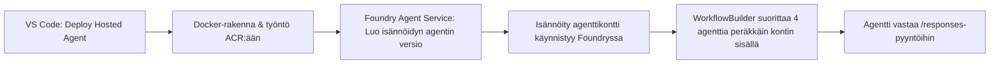
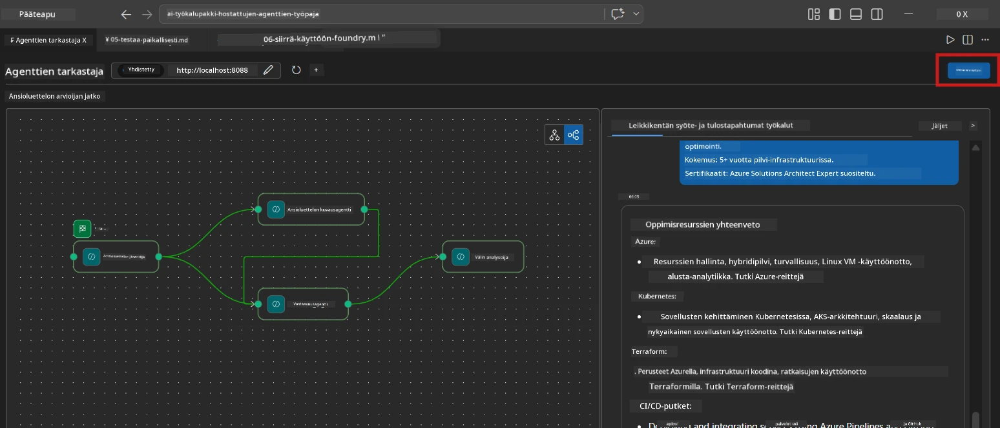
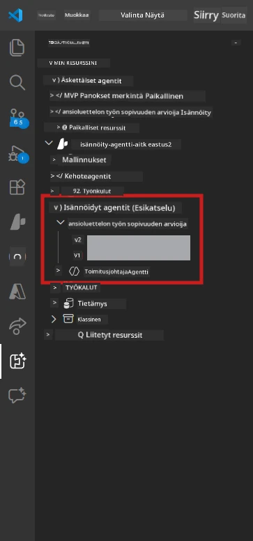

# Moduuli 6 - Julkaisu Foundry Agent Serviceen

⏱️ ~10 min

Tässä moduulissa julkaiset paikallisesti testatun moniagenttisen työnkulun [Microsoft Foundryyn](https://learn.microsoft.com/azure/foundry/agents/concepts/hosted-agents) **Isännöitynä agenttina**. Julkaisuprosessi rakentaa Docker-säilökuvan, työntää sen [Azure Container Registryyn (ACR)](https://learn.microsoft.com/azure/container-registry/container-registry-intro) ja luo isännöidyn agenttiversion [Foundry Agent Servicessä](https://learn.microsoft.com/azure/foundry/agents/how-to/publish-agent).

> **Tärkeä ero Labra 01:een:** Julkaisuprosessi on identtinen. Foundry käsittelee moniagenttista työnkulkua yhtenä isännöitynä agenttina – monimutkaisuus on säilön sisällä, mutta julkaisun päätepiste on sama `/responses`.

### Julkaisuputki


```mermaid
flowchart LR
    A[VS Code: Deploy Hosted Agent] --> B[Docker-rakenna & työntö ACR:ään]
    B --> C[Foundry Agent Service: Luo isännöidyn agentin versio]
    C --> D[Isännöity agenttikontti käynnistyy Foundryssa]
    D --> E[WorkflowBuilder suorittaa 4 agenttia peräkkäin kontin sisällä]
    E --> F[Agentti vastaa /responses-pyyntöihin]
```

---

## Esivaatimusten tarkistus

Ennen julkaisua varmista kaikki allaolevat kohdat:

1. **Agentti läpäisee paikalliset pintatestit:**
   - Suoritit kaikki 3 testiä [Moduulissa 5](05-test-locally.md) ja työnkulku tuotti täydelliset tuotokset aukko korteilla ja Microsoft Learn URL-osoitteilla.

2. **Sinulla on [Foundry User](https://learn.microsoft.com/azure/foundry/concepts/rbac-foundry) -rooli** (jotta voit julkaista, tarvitset vähintään **Foundry Project Manager** -roolin projektin laajuudessa):

   > **Huom:** Foundryn RBAC-roolit nimettiin uudelleen – **Foundry User**, **Foundry Owner** ja **Foundry Project Manager** olivat aikaisemmin Azure AI User, Azure AI Owner ja Azure AI Project Manager. Roolien tunnukset ja oikeudet säilyivät ennallaan.

   - Vahvista [Azure Portalissa](https://portal.azure.com) → Foundry-projektisi resurssi → **Access control (IAM)** → **Role assignments** → varmista, että **Foundry User** (tai korkeampi) on tililläsi.

3. **Olet kirjautunut Azureen VS Codessa:**
   - Tarkista oikeasta alakulmasta tilikuvake. Nimesi pitäisi näkyä.

4. **`agent.yaml` sisältää oikeat arvot:**
   - Avaa `PersonalCareerCopilot/agent.yaml` ja varmista:
     ```yaml
     environment_variables:
       - name: AZURE_AI_MODEL_DEPLOYMENT_NAME
         value: ${AZURE_AI_MODEL_DEPLOYMENT_NAME}
     ```
   - `FOUNDRY_PROJECT_ENDPOINT` EI ole siellä - Foundry lisää sen ajonaikaisesti. Vain `AZURE_AI_MODEL_DEPLOYMENT_NAME` täytyy määrittää.

5. **`requirements.txt` sisältää oikeat versiot:**
   ```
   agent-framework-foundry
   agent-framework-foundry-hosting
   mcp<2,>=1.24.0
   debugpy
   ```

---

## Vaihe 1: Aloita julkaisu

### Vaihtoehto A: Julkaisu Agent Inspectorista (suositeltu)

Jos agentti on käynnissä F5:lla ja Agent Inspector on auki:

1. Katso Agent Inspector -paneelin **yläoikeaan kulmaan**.
2. Klikkaa **Deploy**-painiketta (pilvikuvake ylösnuolella ↑).
3. Julkaisun asetusvelho avautuu.



### Vaihtoehto B: Julkaisu Command Paletesta

1. Paina `Ctrl+Shift+P` avataksesi **Command Paletten**.
2. Kirjoita: **Foundry Toolkit: Deploy Hosted Agent** ja valitse se.
3. Julkaisun asetusvelho avautuu.

---

## Vaihe 2: Määritä julkaisu

### 2.1 Valitse kohdeprojekti

1. Avautuvasta listasta löydät Foundry-projektisi.
2. Valitse se projekti, jota käytit työpajan aikana (esim. `workshop-agents`).

### 2.2 Valitse säilöagentin tiedosto

1. Sinulta kysytään agentin sisäänkäyntitiedostoa.
2. Selaa `workshop/lab02-multi-agent/PersonalCareerCopilot/` ja valitse **`main.py`**.

### 2.3 Määritä resurssit

| Asetus | Suositeltu arvo | Huomautukset |
|---------|------------------|-------------|
| **Deployment Method** | **Container** (suositeltu) tai **Code** | Säilö rakentaa Docker-kuvan; Code lataa lähdekoodin ZIP-tiedostona (esikatselu) |
| **Container Registry** | **Oletus ACR** | Foundry luo ja hallinnoi rekisterin puolestasi |
| **CPU** | `0.25` | Oletus. Moniagenttiset työnkulut eivät tarvitse lisä-CPU:ta, koska mallikutsut ovat I/O-sidonnaisia |
| **Memory** | `0.5Gi` | Oletus. Nosta `1Gi`:hin, jos lisäät suuria datankäsittelytyökaluja |

---

## Vaihe 3: Vahvista ja julkaise

1. Velho näyttää julkaisun yhteenvedon.
2. Tarkista ja klikkaa **Confirm and Deploy**.
3. Seuraa etenemistä VS Codessa.

### Mitä tapahtuu julkaisun aikana

Seuraa VS Coden **Output**-paneelia (valitse "Microsoft Foundry" -valikko):

1. **Docker build** - Rakentaa säilön `Dockerfile`-tiedostostasi
   ```
   Step 1/6 : FROM python:3.12-slim
   Step 2/6 : WORKDIR /app
   ...
   Successfully built abc123def456
   ```

2. **Docker push** - Työntää kuvan ACR:ään (1–3 minuuttia ensimmäisellä julkaisulla).

3. **Agentin rekisteröinti** - Foundry luo isännöidyn agentin käyttäen `agent.yaml` metatietoja. Agentin nimi on `resume-job-fit-evaluator`.

4. **Säilön käynnistys** - Säilö käynnistyy Foundryn hallinnoimassa infrastruktuurissa järjestelmän hallinnoimalla identiteetillä.

> **Ensimmäinen julkaisu on hitaampi** (Docker työntää kaikki kerrokset). Seuraavat julkaisut uudelleenkäyttävät välimuistissa olevia kerroksia, jolloin ne ovat nopeampia.

### Moniagenttikohtaiset huomautukset

- **Kaikki neljä agenttia ovat saman säilön sisällä.** Foundry näkee yhden isännöidyn agentin. WorkflowBuilderin graafi ajetaan sisäisesti.
- **MCP-kutsut ovat ulospäin.** Säilö tarvitsee internetyhteyden päästäkseen `https://learn.microsoft.com/api/mcp`-osoitteeseen. Foundryn hallinnoima infrastruktuuri tarjoaa tämän oletuksena.
- **[Hallinnoitu identiteetti](https://learn.microsoft.com/azure/foundry/agents/concepts/agent-identity).** Foundry luo automaattisesti **omistetun per-agentin Entra-identiteetin** jokaiselle Isännöidylle agentille julkaisun yhteydessä. Isännöidyssä ympäristössä `DefaultAzureCredential` ratkaisee tämän agentti-identiteetin automaattisesti – manuaalista hallinnoidun identiteetin konfigurointia ei tarvita.

---

## Vaihe 4: Varmista julkaisustatus

1. Avaa **Microsoft Foundry** -sivupalkki (klikkaa Foundry-kuvaketta Activity Barissa).
2. Laajenna **Hosted Agents (Preview)** projektisi alta.
3. Etsi **resume-job-fit-evaluator** (tai oma agenttisi).
4. Klikkaa agentin nimeä → laajenna versiot (esim. `v1`).
5. Klikkaa versiota → tarkista **Container Details** → **Status**:



| Tila | Merkitys |
|--------|---------|
| **active** | Agentti on käynnissä ja valmis vastaanottamaan pyyntöjä |
| **creating** | Säilö käynnistyy (odota 30–60 sekuntia) |
| **failed** | Säilön käynnistys epäonnistui (katso lokit - alla) |

> **Huom:** VS Coden sivupalkissa saattaa näkyä tekstejä kuten "Running" tai "Started", vaikka taustalla API tilana olisi `active`/`creating`. Molemmat ilmaisevat saman tilan.

> **Moniagenttinen käynnistys kestää pidempään** kuin yksittäisagentin, koska säilössä luodaan käynnistyksen yhteydessä 4 agentti-instanssia. `creating`-tila, joka kestää jopa 2 minuuttia, on normaali.

---

## Yleisimmät julkaisun virheet ja korjaukset

### Virhe 1: Käyttöoikeus evätty - `agents/write`

```
Error: lacks the required data action 
Microsoft.CognitiveServices/accounts/AIServices/agents/write
```

**Korjaus:** Määritä **[Foundry User](https://learn.microsoft.com/azure/foundry/concepts/rbac-foundry)** -rooli (entinen **Azure AI User**) **projektitasolla**. Katso [Moduuli 8 - Vianetsintä](08-troubleshooting.md) yksityiskohtaiset ohjeet.

### Virhe 2: Docker ei ole käynnissä

```
Error: Docker build failed / Cannot connect to Docker daemon
```

**Korjaus:**
1. Käynnistä Docker Desktop.
2. Odota, että viesti "Docker Desktop is running" näkyy.
3. Varmista: `docker info`
4. **Windows:** Varmista, että WSL 2 taustajärjestelmä on käytössä Docker Desktopin asetuksissa.
5. Yritä uudelleen.

### Virhe 3: pip install epäonnistuu Docker-rakennuksen aikana

```
Error: Could not find a version that satisfies the requirement agent-framework-foundry
```

**Korjaus:** Varmista että `requirements.txt` on seuraavanlainen:
```
agent-framework-foundry
agent-framework-foundry-hosting
mcp<2,>=1.24.0
debugpy
```

Jos rakennus edelleen epäonnistuu, Docker-verkko saattaa estää PyPI-yhteydet. Tarkista proxy-asetukset komennolla `docker info`.

### Virhe 4: MCP-työkalu epäonnistuu isännöidyssä agentissa

Jos Gap Analyzer lakkaa tuottamasta Microsoft Learn URL-osoitteita julkaisun jälkeen:

**Syynä:** Verkkopolitiikka saattaa estää ulospäin menevän HTTPS-liikenteen säilöstä.

**Korjaus:**
1. Tämä ei yleensä ole ongelma Foundryn oletusasetuksilla.
2. Jos ongelma ilmenee, tarkista onko Foundry-projektin virtuaaliverkolla NSG, joka estää ulospäin menevän HTTPS:n.
3. MCP-työkalulla on sisäänrakennetut varayhteydet, joten agentti tuottaa silti tulosteen (ilman toimivia URL-osoitteita).

---

### Tarkistuspiste

- [ ] Julkaisu onnistui ilman virheitä VS Codessa
- [ ] Agentti näkyy **Hosted Agents (Preview)** -kohdassa Foundryn sivupalkissa
- [ ] Agentin nimi on `resume-job-fit-evaluator` (tai valitsemasi nimi)
- [ ] Säilön tila näyttää **Started** tai **Running**
- [ ] (Jos virheitä) Tunnistit virheen, korjasit sen ja julkaisit uudelleen onnistuneesti

---

**Edellinen:** [05 - Testaa paikallisesti](05-test-locally.md) · **Seuraava:** [07 - Varmistus Playgroundissa →](07-verify-in-playground.md)

---

<!-- CO-OP TRANSLATOR DISCLAIMER START -->
**Vastuuvapauslauseke**:
Tämä asiakirja on käännetty käyttämällä tekoälypohjaista käännöspalvelua [Co-op Translator](https://github.com/Azure/co-op-translator). Vaikka pyrimme tarkkuuteen, otathan huomioon, että automaattiset käännökset saattavat sisältää virheitä tai epätarkkuuksia. Alkuperäinen asiakirja sen alkuperäiskielellä on virallinen lähde. Tärkeissä asioissa suositellaan ammattimaista ihmiskäännöstä. Emme ole vastuussa tämän käännöksen käytöstä aiheutuvista väärinymmärryksistä tai tulkinnoista.
<!-- CO-OP TRANSLATOR DISCLAIMER END -->