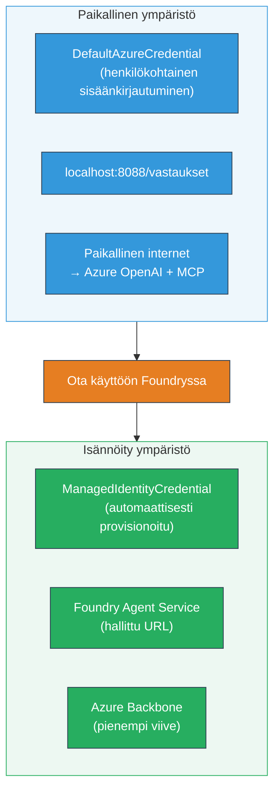

# Moduuli 7 - Tarkista Playgroundissa

Tässä moduulissa testaat käyttöönotettua moniagenttista työnkulkua sekä **VS Codessa** että **[Foundry Portalissa](https://ai.azure.com)** varmistaen, että agentti käyttäytyy yhtä lailla kuin paikallisessa testauksessa.

---

## Miksi tarkistaa käyttöönoton jälkeen?

Moniagenttinen työnkulku toimi täydellisesti paikallisesti, joten miksi testata uudelleen? Isännöity ympäristö eroaa useilla tavoilla:


| Ero | Paikallinen | Isännöity |
|-----------|-------|--------|
| **Identiteetti** | [`DefaultAzureCredential`](https://learn.microsoft.com/azure/developer/python/sdk/authentication/credential-chains#defaultazurecredential-overview) (henkilökohtainen kirjautuminen) | [`ManagedIdentityCredential`](https://learn.microsoft.com/python/api/overview/azure/identity-readme#managed-identity-support) (automaattinen provisionointi) |
| **Päätepiste** | `http://localhost:8088/responses` | [Foundry Agent Service](https://learn.microsoft.com/azure/foundry/agents/concepts/hosted-agents) päätepiste (hallittu URL) |
| **Verkko** | Paikallinen kone → Azure OpenAI + MCP ulospäin | Azure selkäranka (alhaisempi viive palveluiden välillä) |
| **MCP-yhteys** | Paikallinen internet → `learn.microsoft.com/api/mcp` | Säiliön ulospäin → `learn.microsoft.com/api/mcp` |

Jos jokin ympäristömuuttuja on virheellisesti konfiguroitu, RBAC eroaa tai MCP-ulospäynti estetty, havaitset sen tässä.

---

## Vaihtoehto A: Testaa VS Code Playgroundissa (suositeltu ensin)

[Foundry-laajennus](https://marketplace.visualstudio.com/items?itemName=TeamsDevApp.vscode-ai-foundry) sisältää integroidun Playgroundin, joka mahdollistaa keskustelun käyttöön otetun agentin kanssa ilman että poistut VS Codesta.

### Vaihe 1: Siirry isännöityyn agenttiisi

1. Klikkaa **Microsoft Foundry** -kuvaketta VS Coden **Toimintopalkissa** (vasen sivupalkki) avataksesi Foundryn paneelin.
2. Laajenna yhdistetty projektisi (esim. `workshop-agents`).
3. Laajenna **Hosted Agents (Preview)**.
4. Näet agenttisi nimen (esim. `resume-job-fit-evaluator`).

### Vaihe 2: Valitse versio

1. Klikkaa agentin nimeä laajentaaksesi sen versiot.
2. Valitse käyttöönotettu versio (esim. `v1`).
3. Tiedot-paneeli aukeaa näyttäen Säiliön tiedot.
4. Varmista, että tila on **Started** tai **Running**.

### Vaihe 3: Avaa Playground

1. Tiedot-paneelissa klikkaa **Playground**-painiketta (tai napsauta versiota hiiren oikealla → **Open in Playground**).
2. Keskustelukäyttöliittymä avautuu VS Code -välilehdelle.

### Vaihe 4: Suorita savutestit

Käytä samoja 3 testiä kuin [Moduulissa 5](05-test-locally.md). Kirjoita jokainen viesti Playgroundin syöttökenttään ja paina **Send** (tai **Enter**).

#### Testi 1 - Täysi CV + JD (vakiojärjestys)

Liitä täydellinen CV + JD -kehote Moduulista 5, Testi 1 (Jane Doe + Senior Cloud Engineer Contoso Ltd:llä).

**Odotettu:**
- Soveltuvuuspiste, sisältäen laskelman (100 pisteen asteikko)
- Yhdenmukaiset taidot -osio
- Puuttuvat taidot -osio
- **Yksi aukko-kortti per puuttuva taito** Microsoft Learn -URL-osoitteineen
- Oppimispolku aikajana mukaan

#### Testi 2 - Nopea lyhyt testi (minimaalinen syöte)

```
RESUME: 3 years Python developer, knows Django and PostgreSQL, no cloud experience.

JOB: Cloud DevOps Engineer requiring AWS, Kubernetes, Terraform, CI/CD. 5 years needed.
```

**Odotettu:**
- Alhainen soveltuvuuspiste (< 40)
- Rehellinen arvioitu vaiheittainen oppimispolku
- Useita aukko-kortteja (AWS, Kubernetes, Terraform, CI/CD, kokemuksen puute)

#### Testi 3 - Hyvin soveltuva ehdokas

```
RESUME:
10 years Azure Cloud Architect. AZ-305 certified. Expert in AKS, Terraform, Azure DevOps, 
Azure Functions, Helm, Prometheus, Grafana, Python, Go. Led platform team of 8.

JOB:
Senior Cloud Engineer. Required: AKS, Terraform, Azure DevOps, Python. Preferred: Helm, Go.
5+ years experience. AZ-305 preferred.
```

**Odotettu:**
- Korkea soveltuvuuspiste (≥ 80)
- Keskittyminen haastatteluun valmistautumiseen ja hiomiseen
- Vähän tai ei lainkaan aukko-kortteja
- Lyhyt aikajana keskittyen valmiuteen

### Vaihe 5: Vertaa paikallisiin tuloksiin

Avaa muistiinpanosi tai selaimen välilehti Moduulista 5, johon tallensit paikalliset vastaukset. Kullekin testille:

- Onko vastauksessa **sama rakenne** (soveltuvuuspiste, aukko-kortit, polku)?
- Seurataanko **samaa pisteytystapaa** (100 pisteen erittely)?
- Onko **Microsoft Learn -URL-osoitteita** edelleen aukko-korteissa?
- Onko **yksi aukko-kortti per puuttuva taito** (ei katkaistu)?

> **Pienet sanamuotoerot ovat normaaleja** – malli on epädeterministinen. Keskity rakenteeseen, pisteytyksen johdonmukaisuuteen ja MCP-työkalun käyttöön.

---

## Vaihtoehto B: Testaa Foundry Portalissa

[Foundry Portal](https://ai.azure.com) tarjoaa web-pohjaisen playgroundin, joka on hyödyllinen jakamiseen tiimin tai sidosryhmien kanssa.

### Vaihe 1: Avaa Foundry Portal

1. Avaa selaimesi ja siirry osoitteeseen [https://ai.azure.com](https://ai.azure.com).
2. Kirjaudu sisään samalla Azure-tilillä, jota olet käyttänyt koko työpajan ajan.

### Vaihe 2: Siirry projektiisi

1. Aloitussivulla katso **Viimeaikaiset projektit** vasemmalla sivupalkissa.
2. Klikkaa projektisi nimeä (esim. `workshop-agents`).
3. Jos sitä ei näy, klikkaa **All projects** ja etsi sitä.

### Vaihe 3: Etsi käyttöönotettu agenttisi

1. Projektin vasemman reunan navigaatiossa klikkaa **Build** → **Agents** (tai etsi **Agents**-osio).
2. Näet luettelon agenteista. Löydä käyttöönotettu agenttisi (esim. `resume-job-fit-evaluator`).
3. Klikkaa agentin nimeä avataksesi tiedot-sivun.

### Vaihe 4: Avaa Playground

1. Agentin tiedot-sivulla katso yläreunan työkalupalkkia.
2. Klikkaa **Open in playground** (tai **Try in playground**).
3. Keskustelukäyttöliittymä avautuu.

### Vaihe 5: Suorita samat savutestit

Toista kaikki 3 testiä kuten yllä VS Code Playground -osiosta. Vertaa kutakin vastausta sekä paikallisiin tuloksiin (Moduuli 5) että VS Code Playground -tuloksiin (vaihtoehto A yllä).

---

## Moniagenttikohtaiset tarkistukset

Peruskorrektiuden lisäksi varmista nämä moniagenttikohtaiset toiminnot:

### MCP-työkalun suoritus

| Tarkistus | Miten varmistetaan | Hyväksymisehto |
|-----------|--------------------|----------------|
| MCP-kutsut onnistuvat | Aukko-korteissa on `learn.microsoft.com` URL-osoitteita | Oikeat URL:t, ei varavaihtoehtoja |
| Useita MCP-kutsuja | Jokaisella Korkean/Keskisuuren prioriteetin aukolla on resursseja | Ei vain ensimmäisessä aukko-kortissa |
| MCP-varavaihtoehto toimii | Jos URL-osoitteet puuttuvat, tarkasta varavaihtoteksti | Agentti tuottaa silti aukko-kortteja (URL-osoitteilla tai ilman) |

### Agenttien koordinointi

| Tarkistus | Miten varmistetaan | Hyväksymisehto |
|-----------|--------------------|----------------|
| Kaikki 4 agenttia suoritti | Tuotos sisältää soveltuvuuspisteen JA aukko-kortit | Pisteet peräisin MatchingAgentilta, kortit GapAnalyzerilta |
| Rinnakkainen haarautuminen | Vastausaika kohtuullinen (< 2 min) | Jos > 3 min, rinnakkainen suoritus ei ehkä toimi |
| Tiedonkulun eheys | Aukko-kortit viittaavat taidoista matching-raportissa | Ei "kuviteltuja" taitoja, joita ei JD:ssä ole |

---

## Validointikriteerit

Käytä tätä kriteeristöä arvioidessasi moniagenttisen työnkulun isännöityä käyttäytymistä:

| # | Kriteeri | Hyväksymisehto | Hyväksytty? |
|---|----------|----------------|-------------|
| 1 | **Toiminnallinen oikeellisuus** | Agentti vastaa CV + JD:hen soveltuvuuspisteellä ja aukkoanalyysillä | |
| 2 | **Pisteytyksen johdonmukaisuus** | Soveltuvuuspiste 100 pisteen asteikolla ja erittelylaskelma | |
| 3 | **Aukko-korttien kattavuus** | Yksi kortti per puuttuva taito (ei katkaistu tai yhdistetty) | |
| 4 | **MCP-työkalun integrointi** | Aukko-korteissa on oikeat Microsoft Learn -URL:t | |
| 5 | **Rakenteen johdonmukaisuus** | Tulosten rakenne vastaa paikallisia ja isännöityjä ajoja | |
| 6 | **Vastausaika** | Isännöity agentti vastaa alle 2 minuutissa täydellisessä arvioinnissa | |
| 7 | **Ei virheitä** | Ei HTTP 500 virheitä, aikakatkaisuja tai tyhjiä vastauksia | |

> "Hyväksytty" tarkoittaa, että kaikki 7 kriteeriä täyttyvät kaikissa 3 savutestissä vähintään yhdessä playgroundissa (VS Code tai Portal).

---

## Vianmääritys Playground-ongelmissa

| Oire | Todennäköinen syy | Ratkaisu |
|-------|-------------------|----------|
| Playground ei lataudu | Säiliön tila ei ole "Started" | Palaa [Moduuliin 6](06-deploy-to-foundry.md), tarkista käyttöönoton tila. Odota, jos "Pending" |
| Agentti palauttaa tyhjän vastauksen | Mallin käyttöönoton nimi ei täsmää | Tarkista `agent.yaml` → `environment_variables` → `MODEL_DEPLOYMENT_NAME` vastaa käytössä olevaa mallia |
| Agentti palauttaa virheilmoituksen | [RBAC](https://learn.microsoft.com/azure/foundry/concepts/rbac-foundry) oikeus puuttuu | Määritä **[Azure AI User](https://aka.ms/foundry-ext-project-role)** projektin tasolla |
| Ei Microsoft Learn -URL-osoitteita aukko-korteissa | MCP ulospäynti estetty tai MCP-palvelin poissa käytöstä | Tarkista, pääseekö säiliö `learn.microsoft.com` -osoitteeseen. Katso [Moduuli 8](08-troubleshooting.md) |
| Vain 1 aukko-kortti (katkaistu) | GapAnalyzer-ohjeista puuttuu "CRITICAL" -lohko | Tarkista [Moduuli 3, vaihe 2.4](03-configure-agents.md) |
| Soveltuvuuspiste poikkeaa paljon paikallisesta | Eri malli tai ohjeet otettu käyttöön | Vertaa `agent.yaml`-ympäristömuuttujia paikalliseen `.env`:iin. Käyttöönotto uudelleen tarvittaessa |
| "Agent not found" Portaalissa | Käyttöönotto on vielä käynnissä tai epäonnistui | Odota 2 minuuttia, päivitä sivu. Jos puuttuu edelleen, ota uudelleen käyttöön [Moduuli 6](06-deploy-to-foundry.md) |

---

### Tarkistuspiste

- [ ] Testattu agentti VS Code Playgroundissa - kaikki 3 savutestiä läpäisty
- [ ] Testattu agentti [Foundry Portalissa](https://ai.azure.com) Playgroundissa - kaikki 3 savutestiä läpäisty
- [ ] Vastaukset ovat rakenteellisesti yhdenmukaisia paikallisen testauksen kanssa (soveltuvuuspiste, aukko-kortit, polku)
- [ ] Microsoft Learn URL-osoitteet ovat läsnä aukko-korteissa (MCP-työkalu toimii isännöityssä ympäristössä)
- [ ] Yksi aukko-kortti per puuttuva taito (ei katkaisua)
- [ ] Ei virheitä tai aikakatkaisuja testeissä
- [ ] Suoritettu validointikriteeristö (kaikki 7 kriteeriä hyväksytty)

---

**Edellinen:** [06 - Deploy to Foundry](06-deploy-to-foundry.md) · **Seuraava:** [08 - Vianmääritys →](08-troubleshooting.md)

---

<!-- CO-OP TRANSLATOR DISCLAIMER START -->
**Vastuuvapauslauseke**:
Tämä asiakirja on käännetty käyttämällä tekoälypohjaista käännöspalvelua [Co-op Translator](https://github.com/Azure/co-op-translator). Vaikka pyrimme tarkkuuteen, otathan huomioon, että automaattikäännöksissä voi esiintyä virheitä tai epätarkkuuksia. Alkuperäinen asiakirja omalla kielellään on sen auktoriteettinen lähde. Tärkeissä tiedoissa suosittelemme ammattimaista ihmiskäännöstä. Emme ole vastuussa tämän käännöksen käytöstä aiheutuvista väärinymmärryksistä tai virhetulkinnoista.
<!-- CO-OP TRANSLATOR DISCLAIMER END -->