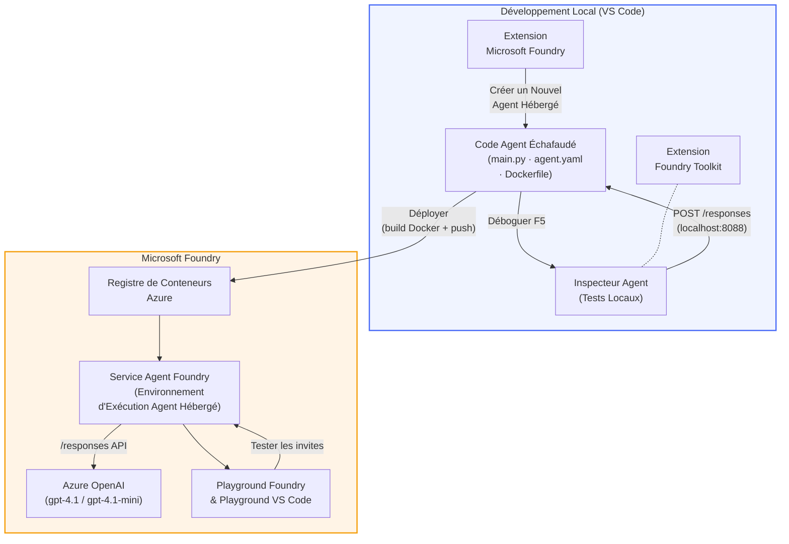

# Atelier Foundry Toolkit + Agents Hébergés Foundry

[](https://www.python.org/)
[](https://github.com/microsoft/agents)
[](https://learn.microsoft.com/azure/ai-foundry/agents/concepts/hosted-agents/)
[](https://ai.azure.com/)
[](https://learn.microsoft.com/azure/ai-services/openai/)
[](https://learn.microsoft.com/cli/azure/install-azure-cli)
[](https://learn.microsoft.com/azure/developer/azure-developer-cli/install-azd)
[](https://www.docker.com/)
[](https://marketplace.visualstudio.com/items?itemName=ms-windows-ai-studio.windows-ai-studio)
[](LICENSE)

Construisez, testez et déployez des agents IA sur le **Microsoft Foundry Agent Service** en tant qu'**Agents Hébergés** - entièrement depuis VS Code en utilisant l'**extension Microsoft Foundry** et le **Foundry Toolkit**.

> **Les Agents Hébergés sont actuellement en aperçu.** Les régions prises en charge sont limitées - voir [disponibilité par région](https://learn.microsoft.com/azure/foundry/agents/concepts/hosted-agents#region-availability).

> Le dossier `agent/` à l’intérieur de chaque atelier est **automatiquement généré** par l'extension Foundry - vous personnalisez ensuite le code, testez localement et déployez.

### 🌐 Support Multilingue

#### Pris en charge via GitHub Action (Automatisé & Toujours à Jour)

<!-- CO-OP TRANSLATOR LANGUAGES TABLE START -->
[Arabe](../ar/README.md) | [Bengali](../bn/README.md) | [Bulgare](../bg/README.md) | [Birmane (Myanmar)](../my/README.md) | [Chinois (Simplifié)](../zh-CN/README.md) | [Chinois (Traditionnel, Hong Kong)](../zh-HK/README.md) | [Chinois (Traditionnel, Macao)](../zh-MO/README.md) | [Chinois (Traditionnel, Taiwan)](../zh-TW/README.md) | [Croate](../hr/README.md) | [Tchèque](../cs/README.md) | [Danois](../da/README.md) | [Néerlandais](../nl/README.md) | [Estonien](../et/README.md) | [Finnois](../fi/README.md) | [Français](./README.md) | [Allemand](../de/README.md) | [Grec](../el/README.md) | [Hébreu](../he/README.md) | [Hindi](../hi/README.md) | [Hongrois](../hu/README.md) | [Indonésien](../id/README.md) | [Italien](../it/README.md) | [Japonais](../ja/README.md) | [Kannada](../kn/README.md) | [Khmer](../km/README.md) | [Coréen](../ko/README.md) | [Lituanien](../lt/README.md) | [Malais](../ms/README.md) | [Malayalam](../ml/README.md) | [Marathi](../mr/README.md) | [Népalais](../ne/README.md) | [Pidgin Nigérian](../pcm/README.md) | [Norvégien](../no/README.md) | [Persan (Farsi)](../fa/README.md) | [Polonais](../pl/README.md) | [Portugais (Brésil)](../pt-BR/README.md) | [Portugais (Portugal)](../pt-PT/README.md) | [Punjabi (Gurmukhi)](../pa/README.md) | [Roumain](../ro/README.md) | [Russe](../ru/README.md) | [Serbe (Cyrillique)](../sr/README.md) | [Slovaque](../sk/README.md) | [Slovène](../sl/README.md) | [Espagnol](../es/README.md) | [Swahili](../sw/README.md) | [Suédois](../sv/README.md) | [Tagalog (Filipino)](../tl/README.md) | [Tamoul](../ta/README.md) | [Télougou](../te/README.md) | [Thaï](../th/README.md) | [Turc](../tr/README.md) | [Ukrainien](../uk/README.md) | [Ourdou](../ur/README.md) | [Vietnamien](../vi/README.md)

> **Vous préférez cloner localement ?**
>
> Ce dépôt inclut plus de 50 traductions linguistiques, ce qui augmente considérablement la taille du téléchargement. Pour cloner sans les traductions, utilisez le sparse checkout :
>
> **Bash / macOS / Linux :**
> ```bash
> git clone --filter=blob:none --sparse https://github.com/microsoft-foundry/Foundry_Toolkit_for_VSCode_Lab.git
> cd Foundry_Toolkit_for_VSCode_Lab
> git sparse-checkout set --no-cone '/*' '!translations' '!translated_images'
> ```
>
> **CMD (Windows) :**
> ```cmd
> git clone --filter=blob:none --sparse https://github.com/microsoft-foundry/Foundry_Toolkit_for_VSCode_Lab.git
> cd Foundry_Toolkit_for_VSCode_Lab
> git sparse-checkout set --no-cone "/*" "!translations" "!translated_images"
> ```
>
> Cela vous fournit tout ce dont vous avez besoin pour compléter le cours avec un téléchargement beaucoup plus rapide.
<!-- CO-OP TRANSLATOR LANGUAGES TABLE END -->

---

## Architecture


**Flux :** L’extension Foundry génère l’agent → vous personnalisez le code et les instructions → testez localement avec Agent Inspector → déployez sur Foundry (image Docker poussée vers ACR) → vérifiez dans le Playground.

---

## Ce que vous allez construire

| Atelier | Description | Statut |
|-----|-------------|--------|
| **Atelier 01 - Agent unique** | Construisez l’**Agent "Explique comme si j’étais un cadre dirigeant"**, testez-le localement et déployez-le sur Foundry | ✅ Disponible |
| **Atelier 02 - Flux de travail multi-agent** | Construisez l’**"Évaluateur CV → adéquation emploi"** - 4 agents collaborent pour noter l’adéquation d’un CV et générer une feuille de route d’apprentissage | ✅ Disponible |

---

## Découvrez l’Agent Cadre

Dans cet atelier, vous construirez l’**Agent "Explique comme si j’étais un cadre dirigeant"** - un agent IA qui prend un jargon technique complexe et le traduit en résumés calmes, prêts pour une salle de conseil. Parce qu’avouons-le, personne dans le comité de direction ne veut entendre parler de "l'épuisement du pool de threads causé par des appels synchrones introduits en v3.2."

J'ai créé cet agent après bien trop d’incidents où mon post-mortem parfaitement rédigé obtenait la réponse : *« Donc... est-ce que le site web est planté ou pas ? »*

### Comment ça marche

Vous lui fournissez une mise à jour technique. Il vous renvoie un résumé exécutif - trois points clés, sans jargon, sans traces de pile, sans angoisse existentielle. Juste **ce qui s’est passé**, **l’impact business**, et **la prochaine étape**.

### Voyez-le en action

**Vous dites :**
> "La latence de l’API a augmenté à cause de l'épuisement du pool de threads causé par des appels synchrones introduits en v3.2."

**L’agent répond :**

> **Résumé exécutif :**
> - **Ce qui s’est passé :** Après la dernière version, le système a ralenti.
> - **Impact business :** Certains utilisateurs ont rencontré des délais en utilisant le service.
> - **Prochaine étape :** Le changement a été annulé et une correction est en préparation avant le redéploiement.

### Pourquoi cet agent ?

C’est un agent très simple, à usage unique - parfait pour apprendre le flux de travail des agents hébergés de bout en bout sans se perdre dans des chaînes d’outils complexes. Et honnêtement ? Toute équipe d’ingénierie pourrait en avoir un comme celui-ci.

---

## Structure de l’atelier

```
📂 Foundry_Toolkit_for_VSCode_Lab/
├── 📄 README.md                      ← You are here
├── 📂 ExecutiveAgent/                ← Standalone hosted agent project
│   ├── agent.yaml
│   ├── Dockerfile
│   ├── main.py
│   └── requirements.txt
└── 📂 workshop/
    ├── 📂 lab01-single-agent/        ← Full lab: docs + agent code
    │   ├── README.md                 ← Hands-on lab instructions
    │   ├── 📂 docs/                  ← Step-by-step tutorial modules
    │   │   ├── 00-prerequisites.md
    │   │   ├── 01-install-foundry-toolkit.md
    │   │   ├── 02-create-foundry-project.md
    │   │   ├── 03-create-hosted-agent.md
    │   │   ├── 04-configure-and-code.md
    │   │   ├── 05-test-locally.md
    │   │   ├── 06-deploy-to-foundry.md
    │   │   ├── 07-verify-in-playground.md
    │   │   └── 08-troubleshooting.md
    │   └── 📂 agent/                 ← Reference solution (auto-scaffolded by Foundry extension)
    │       ├── agent.yaml
    │       ├── Dockerfile
    │       ├── main.py
    │       └── requirements.txt
    └── 📂 lab02-multi-agent/         ← Resume → Job Fit Evaluator
        ├── README.md                 ← Hands-on lab instructions (end-to-end)
        ├── 📂 docs/                  ← Step-by-step tutorial modules
        │   ├── 00-prerequisites.md
        │   ├── 01-understand-multi-agent.md
        │   ├── 02-scaffold-multi-agent.md
        │   ├── 03-configure-agents.md
        │   ├── 04-orchestration-patterns.md
        │   ├── 05-test-locally.md
        │   ├── 06-deploy-to-foundry.md
        │   ├── 07-verify-in-playground.md
        │   └── 08-troubleshooting.md
        └── 📂 PersonalCareerCopilot/ ← Reference solution (multi-agent workflow)
            ├── agent.yaml
            ├── Dockerfile
            ├── main.py
            └── requirements.txt
```

> **Note :** Le dossier `agent/` à l’intérieur de chaque atelier est ce que l’**extension Microsoft Foundry** génère quand vous exécutez `Microsoft Foundry : Create a New Hosted Agent` depuis la palette de commandes. Les fichiers sont ensuite personnalisés avec les instructions, outils et configurations de votre agent. L’atelier 01 vous guide pour recréer cela de zéro.

---

## Pour commencer

### 1. Cloner le dépôt

```bash
git clone https://github.com/microsoft-foundry/Foundry_Toolkit_for_VSCode_Lab.git
cd Foundry_Toolkit_for_VSCode_Lab
```

### 2. Configurer un environnement virtuel Python

```bash
python -m venv venv
```

Activez-le :

- **Windows (PowerShell) :**
  ```powershell
  .\venv\Scripts\Activate.ps1
  ```
- **macOS / Linux :**
  ```bash
  source venv/bin/activate
  ```

### 3. Installer les dépendances

```bash
pip install -r workshop/lab01-single-agent/agent/requirements.txt
```

### 4. Configurer les variables d’environnement

Copiez le fichier `.env` d’exemple à l’intérieur du dossier agent et remplissez vos valeurs :

```bash
cp workshop/lab01-single-agent/agent/.env.example workshop/lab01-single-agent/agent/.env
```

Éditez `workshop/lab01-single-agent/agent/.env` :

```env
AZURE_AI_PROJECT_ENDPOINT=https://<your-account>.services.ai.azure.com/api/projects/<your-project>
MODEL_DEPLOYMENT_NAME=<your-model-deployment-name>
```

### 5. Suivez les ateliers pratiques

Chaque atelier est autonome avec ses propres modules. Commencez par **Atelier 01** pour apprendre les fondamentaux, puis passez à **Atelier 02** pour des flux de travail multi-agents.

#### Atelier 01 - Agent unique ([instructions complètes](workshop/lab01-single-agent/README.md))

| # | Module | Lien |
|---|--------|------|
| 1 | Lire les prérequis | [00-prerequisites.md](workshop/lab01-single-agent/docs/00-prerequisites.md) |
| 2 | Installer Foundry Toolkit & extension Foundry | [01-install-foundry-toolkit.md](workshop/lab01-single-agent/docs/01-install-foundry-toolkit.md) |
| 3 | Créer un projet Foundry | [02-create-foundry-project.md](workshop/lab01-single-agent/docs/02-create-foundry-project.md) |
| 4 | Créer un agent hébergé | [03-create-hosted-agent.md](workshop/lab01-single-agent/docs/03-create-hosted-agent.md) |
| 5 | Configurer instructions & environnement | [04-configure-and-code.md](workshop/lab01-single-agent/docs/04-configure-and-code.md) |
| 6 | Tester localement | [05-test-locally.md](workshop/lab01-single-agent/docs/05-test-locally.md) |
| 7 | Déployer sur Foundry | [06-deploy-to-foundry.md](workshop/lab01-single-agent/docs/06-deploy-to-foundry.md) |
| 8 | Vérifier dans le playground | [07-verify-in-playground.md](workshop/lab01-single-agent/docs/07-verify-in-playground.md) |
| 9 | Dépannage | [08-troubleshooting.md](workshop/lab01-single-agent/docs/08-troubleshooting.md) |

#### Atelier 02 - Flux de travail multi-agent ([instructions complètes](workshop/lab02-multi-agent/README.md))

| # | Module | Lien |
|---|--------|------|
| 1 | Prérequis (Atelier 02) | [00-prerequisites.md](workshop/lab02-multi-agent/docs/00-prerequisites.md) |
| 2 | Comprendre l’architecture multi-agent | [01-understand-multi-agent.md](workshop/lab02-multi-agent/docs/01-understand-multi-agent.md) |
| 3 | Générer le projet multi-agent | [02-scaffold-multi-agent.md](workshop/lab02-multi-agent/docs/02-scaffold-multi-agent.md) |
| 4 | Configurer agents & environnement | [03-configure-agents.md](workshop/lab02-multi-agent/docs/03-configure-agents.md) |
| 5 | Modèles d’orchestration | [04-orchestration-patterns.md](workshop/lab02-multi-agent/docs/04-orchestration-patterns.md) |
| 6 | Tester localement (multi-agent) | [05-test-locally.md](workshop/lab02-multi-agent/docs/05-test-locally.md) |
| 7 | Déployer sur Foundry | [06-deploy-to-foundry.md](workshop/lab02-multi-agent/docs/06-deploy-to-foundry.md) |
| 8 | Vérifier dans le playground | [07-verify-in-playground.md](workshop/lab02-multi-agent/docs/07-verify-in-playground.md) |
| 9 | Dépannage (multi-agent) | [08-troubleshooting.md](workshop/lab02-multi-agent/docs/08-troubleshooting.md) |

---

## Mainteneur

<table>
<tr>
    <td align="center"><a href="https://github.com/ShivamGoyal03">
        <br />
        <sub><b>Shivam Goyal</b></sub>
    </a><br />
    </td>
</tr>
</table>

---

## Autorisations requises (référence rapide)

| Scénario | Rôles requis |
|----------|--------------|
| Créer un nouveau projet Foundry | **Propriétaire Azure AI** sur la ressource Foundry |
| Déployer sur un projet existant (nouvelles ressources) | **Propriétaire Azure AI** + **Collaborateur** sur l’abonnement |
| Déployer sur un projet entièrement configuré | **Lecteur** sur le compte + **Utilisateur Azure AI** sur le projet |

> **Important :** Les rôles Azure `Propriétaire` et `Collaborateur` incluent uniquement les autorisations de *gestion*, pas les autorisations de *développement* (actions sur les données). Vous avez besoin de **Utilisateur Azure AI** ou **Propriétaire Azure AI** pour créer et déployer des agents.

---

## Références

- [Démarrage rapide : déployez votre premier agent hébergé (VS Code)](https://learn.microsoft.com/azure/foundry/agents/quickstarts/quickstart-hosted-agent)
- [Qu’est-ce qu’un agent hébergé ?](https://learn.microsoft.com/azure/foundry/agents/concepts/hosted-agents)
- [Créer des workflows d’agent hébergé dans VS Code](https://learn.microsoft.com/azure/foundry/agents/how-to/vs-code-agents-workflow-pro-code)
- [Déployer un agent hébergé](https://learn.microsoft.com/azure/foundry/agents/how-to/deploy-hosted-agent)
- [RBAC pour Microsoft Foundry](https://learn.microsoft.com/azure/foundry/concepts/rbac-foundry)
- [Exemple d’agent de revue d’architecture](https://github.com/Azure-Samples/agent-architecture-review-sample) - Agent hébergé réel avec outils MCP, diagrammes Excalidraw et déploiement double

---

## Licence

[MIT](../../LICENSE)

---

<!-- CO-OP TRANSLATOR DISCLAIMER START -->
**Avertissement** :  
Ce document a été traduit à l’aide du service de traduction IA [Co-op Translator](https://github.com/Azure/co-op-translator). Bien que nous fassions tout notre possible pour garantir l’exactitude, veuillez noter que les traductions automatiques peuvent contenir des erreurs ou des inexactitudes. Le document original dans sa langue native doit être considéré comme la source officielle. Pour les informations critiques, une traduction professionnelle réalisée par un humain est recommandée. Nous déclinons toute responsabilité en cas de malentendus ou de mauvaises interprétations résultant de l’utilisation de cette traduction.
<!-- CO-OP TRANSLATOR DISCLAIMER END -->