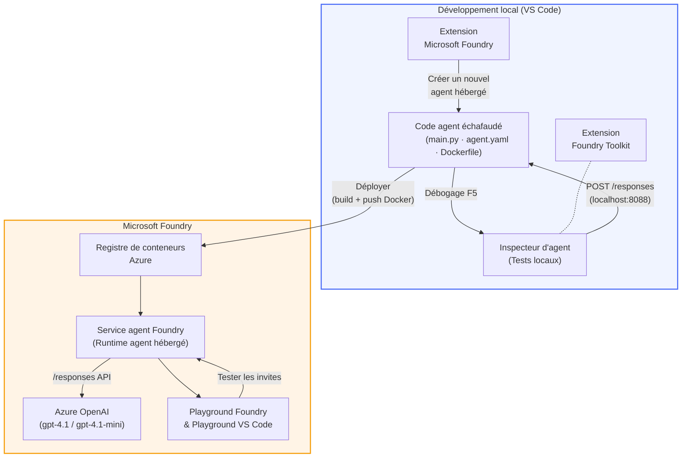

# Atelier Foundry Toolkit + Agents Hébergés Foundry

[](https://www.python.org/)
[](https://github.com/microsoft/agents)
[](https://learn.microsoft.com/azure/ai-foundry/agents/concepts/hosted-agents/)
[](https://ai.azure.com/)
[](https://learn.microsoft.com/azure/ai-services/openai/)
[](https://learn.microsoft.com/cli/azure/install-azure-cli)
[](https://learn.microsoft.com/azure/developer/azure-developer-cli/install-azd)
[](https://www.docker.com/)
[](https://marketplace.visualstudio.com/items?itemName=ms-windows-ai-studio.windows-ai-studio)
[](LICENSE)

Créez, testez et déployez des agents IA vers le **Microsoft Foundry Agent Service** en tant qu'**Agents Hébergés** - entièrement depuis VS Code grâce à l'**extension Microsoft Foundry** et au **Foundry Toolkit**.

> **Les agents hébergés sont actuellement en aperçu.** Les régions prises en charge sont limitées - voir [disponibilité par région](https://learn.microsoft.com/azure/foundry/agents/concepts/hosted-agents#region-availability).

> Le dossier `agent/` à l'intérieur de chaque atelier est **généré automatiquement** par l'extension Foundry - vous personnalisez ensuite le code, testez localement et déployez.

<!-- CO-OP TRANSLATOR LANGUAGES TABLE START -->
[Arabic](../ar/README.md) | [Bengali](../bn/README.md) | [Bulgarian](../bg/README.md) | [Burmese (Myanmar)](../my/README.md) | [Chinese (Simplified)](../zh-CN/README.md) | [Chinese (Traditional, Hong Kong)](../zh-HK/README.md) | [Chinese (Traditional, Macau)](../zh-MO/README.md) | [Chinese (Traditional, Taiwan)](../zh-TW/README.md) | [Croatian](../hr/README.md) | [Czech](../cs/README.md) | [Danish](../da/README.md) | [Dutch](../nl/README.md) | [Estonian](../et/README.md) | [Finnish](../fi/README.md) | [French](./README.md) | [German](../de/README.md) | [Greek](../el/README.md) | [Hebrew](../he/README.md) | [Hindi](../hi/README.md) | [Hungarian](../hu/README.md) | [Indonesian](../id/README.md) | [Italian](../it/README.md) | [Japanese](../ja/README.md) | [Kannada](../kn/README.md) | [Khmer](../km/README.md) | [Korean](../ko/README.md) | [Lithuanian](../lt/README.md) | [Malay](../ms/README.md) | [Malayalam](../ml/README.md) | [Marathi](../mr/README.md) | [Nepali](../ne/README.md) | [Nigerian Pidgin](../pcm/README.md) | [Norwegian](../no/README.md) | [Persian (Farsi)](../fa/README.md) | [Polish](../pl/README.md) | [Portuguese (Brazil)](../pt-BR/README.md) | [Portuguese (Portugal)](../pt-PT/README.md) | [Punjabi (Gurmukhi)](../pa/README.md) | [Romanian](../ro/README.md) | [Russian](../ru/README.md) | [Serbian (Cyrillic)](../sr/README.md) | [Slovak](../sk/README.md) | [Slovenian](../sl/README.md) | [Spanish](../es/README.md) | [Swahili](../sw/README.md) | [Swedish](../sv/README.md) | [Tagalog (Filipino)](../tl/README.md) | [Tamil](../ta/README.md) | [Telugu](../te/README.md) | [Thai](../th/README.md) | [Turkish](../tr/README.md) | [Ukrainian](../uk/README.md) | [Urdu](../ur/README.md) | [Vietnamese](../vi/README.md)

> **Préférez cloner localement ?**
>
> Ce dépôt inclut plus de 50 traductions linguistiques ce qui augmente considérablement la taille du téléchargement. Pour cloner sans traductions, utilisez le sparse checkout :
>
> **Bash / macOS / Linux :**
> ```bash
> git clone --filter=blob:none --sparse https://github.com/microsoft-foundry/Foundry_Toolkit_for_VSCode_Lab.git
> cd Foundry_Toolkit_for_VSCode_Lab
> git sparse-checkout set --no-cone '/*' '!translations' '!translated_images'
> ```
>
> **CMD (Windows) :**
> ```cmd
> git clone --filter=blob:none --sparse https://github.com/microsoft-foundry/Foundry_Toolkit_for_VSCode_Lab.git
> cd Foundry_Toolkit_for_VSCode_Lab
> git sparse-checkout set --no-cone "/*" "!translations" "!translated_images"
> ```
>
> Cela vous donne tout ce dont vous avez besoin pour compléter le cours avec un téléchargement beaucoup plus rapide.
<!-- CO-OP TRANSLATOR LANGUAGES TABLE END -->

---

## Architecture


**Flux:** L’extension Foundry génère la structure de l’agent → vous personnalisez le code et les instructions → testez localement avec Agent Inspector → déployez sur Foundry (image Docker poussée dans ACR) → vérifiez dans Playground.

---

## Ce que vous allez construire

| Atelier | Description | Statut |
|-----|-------------|--------|
| **Atelier 01 - Agent Unique** | Créez l’agent **"Explique-moi comme si j'étais un cadre"**, testez-le localement, puis déployez-le sur Foundry | ✅ Disponible |
| **Atelier 02 - Workflow Multi-Agent** | Construisez l’**"Évaluateur d’adéquation CV → emploi"** - 4 agents collaborent pour noter l’adéquation du CV et générer une feuille de route d’apprentissage | ✅ Disponible |

---

## Présentation de l’agent cadre

Dans cet atelier, vous construirez l’agent **"Explique-moi comme si j'étais un cadre"** - un agent IA qui prend un jargon technique pointu et le traduit en résumés calmes, prêts pour le conseil d’administration. Parce qu’en toute honnêteté, personne dans les cadres supérieurs ne veut entendre parler de "l'épuisement du pool de threads causé par des appels synchrones introduits en v3.2."

J’ai créé cet agent après un trop grand nombre d'incidents où mon compte rendu post-mortem parfaitement rédigé recevait la réponse : *« Alors... le site est-il en panne ou pas ? »*

### Comment ça marche

Vous lui donnez une mise à jour technique. Il renvoie un résumé exécutif - trois points clés, sans jargon, sans traces de pile, sans angoisse existentielle. Juste **ce qui s’est passé**, **l’impact business** et **la prochaine étape**.

### Voir en action

**Vous dites :**
> « La latence de l’API a augmenté en raison d’un épuisement du pool de threads causé par des appels synchrones introduits dans la v3.2. »

**L’agent répond :**

> **Résumé Exécutif :**
> - **Ce qui s’est passé :** Après la dernière version, le système a ralenti.
> - **Impact business :** Certains utilisateurs ont subi des ralentissements en utilisant le service.
> - **Prochaine étape :** Le changement a été annulé et une correction est en préparation avant le redéploiement.

### Pourquoi cet agent ?

C’est un agent ultra-simple et mono-objectif - parfait pour apprendre le workflow des agents hébergés de bout en bout sans s’embourber dans des chaînes d’outils complexes. Et honnêtement ? Chaque équipe technique pourrait en utiliser un comme celui-ci.

---

## Structure de l’atelier

```
📂 Foundry_Toolkit_for_VSCode_Lab/
├── 📄 README.md                      ← You are here
├── 📂 ExecutiveAgent/                ← Standalone hosted agent project
│   ├── agent.yaml
│   ├── Dockerfile
│   ├── main.py
│   └── requirements.txt
└── 📂 workshop/
    ├── 📂 lab01-single-agent/        ← Full lab: docs + agent code
    │   ├── README.md                 ← Hands-on lab instructions
    │   ├── 📂 docs/                  ← Step-by-step tutorial modules
    │   │   ├── 00-prerequisites.md
    │   │   ├── 01-install-foundry-toolkit.md
    │   │   ├── 02-create-foundry-project.md
    │   │   ├── 03-create-hosted-agent.md
    │   │   ├── 04-configure-and-code.md
    │   │   ├── 05-test-locally.md
    │   │   ├── 06-deploy-to-foundry.md
    │   │   ├── 07-verify-in-playground.md
    │   │   └── 08-troubleshooting.md
    │   └── 📂 agent/                 ← Reference solution (auto-scaffolded by Foundry extension)
    │       ├── agent.yaml
    │       ├── Dockerfile
    │       ├── main.py
    │       └── requirements.txt
    └── 📂 lab02-multi-agent/         ← Resume → Job Fit Evaluator
        ├── README.md                 ← Hands-on lab instructions (end-to-end)
        ├── 📂 docs/                  ← Step-by-step tutorial modules
        │   ├── 00-prerequisites.md
        │   ├── 01-understand-multi-agent.md
        │   ├── 02-scaffold-multi-agent.md
        │   ├── 03-configure-agents.md
        │   ├── 04-orchestration-patterns.md
        │   ├── 05-test-locally.md
        │   ├── 06-deploy-to-foundry.md
        │   ├── 07-verify-in-playground.md
        │   └── 08-troubleshooting.md
        └── 📂 PersonalCareerCopilot/ ← Reference solution (multi-agent workflow)
            ├── agent.yaml
            ├── Dockerfile
            ├── main.py
            └── requirements.txt
```

> **Note :** Le dossier `agent/` à l’intérieur de chaque atelier est ce que l’**extension Microsoft Foundry** génère lorsque vous exécutez `Microsoft Foundry: Create a New Hosted Agent` depuis la Liste de Commandes. Les fichiers sont ensuite personnalisés avec les instructions, outils et configurations de votre agent. L’atelier 01 vous guide pour recréer cela à partir de zéro.

---

## Pour commencer

### 1. Clonez le dépôt

```bash
git clone https://github.com/microsoft-foundry/Foundry_Toolkit_for_VSCode_Lab.git
cd Foundry_Toolkit_for_VSCode_Lab
```

### 2. Configurez un environnement virtuel Python

```bash
python -m venv venv
```

Activez-le :

- **Windows (PowerShell) :**
  ```powershell
  .\venv\Scripts\Activate.ps1
  ```
- **macOS / Linux :**
  ```bash
  source venv/bin/activate
  ```

### 3. Installez les dépendances

```bash
pip install -r workshop/lab01-single-agent/agent/requirements.txt
```

### 4. Configurez les variables d’environnement

Copiez le fichier `.env` d'exemple à l'intérieur du dossier agent et remplissez vos valeurs :

```bash
cp workshop/lab01-single-agent/agent/.env.example workshop/lab01-single-agent/agent/.env
```

Modifiez `workshop/lab01-single-agent/agent/.env` :

```env
AZURE_AI_PROJECT_ENDPOINT=https://<your-account>.services.ai.azure.com/api/projects/<your-project>
MODEL_DEPLOYMENT_NAME=<your-model-deployment-name>
```

### 5. Suivez les ateliers

Chaque atelier est autonome avec ses propres modules. Commencez par **Atelier 01** pour apprendre les bases, puis passez à **Atelier 02** pour les workflows multi-agents.

#### Atelier 01 - Agent Unique ([instructions complètes](workshop/lab01-single-agent/README.md))

| # | Module | Lien |
|---|--------|------|
| 1 | Lire les prérequis | [00-prerequisites.md](workshop/lab01-single-agent/docs/00-prerequisites.md) |
| 2 | Installer Foundry Toolkit & extension Foundry | [01-install-foundry-toolkit.md](workshop/lab01-single-agent/docs/01-install-foundry-toolkit.md) |
| 3 | Créer un projet Foundry | [02-create-foundry-project.md](workshop/lab01-single-agent/docs/02-create-foundry-project.md) |
| 4 | Créer un agent hébergé | [03-create-hosted-agent.md](workshop/lab01-single-agent/docs/03-create-hosted-agent.md) |
| 5 | Configurer instructions & environnement | [04-configure-and-code.md](workshop/lab01-single-agent/docs/04-configure-and-code.md) |
| 6 | Tester localement | [05-test-locally.md](workshop/lab01-single-agent/docs/05-test-locally.md) |
| 7 | Déployer sur Foundry | [06-deploy-to-foundry.md](workshop/lab01-single-agent/docs/06-deploy-to-foundry.md) |
| 8 | Vérifier dans playground | [07-verify-in-playground.md](workshop/lab01-single-agent/docs/07-verify-in-playground.md) |
| 9 | Résolution des problèmes | [08-troubleshooting.md](workshop/lab01-single-agent/docs/08-troubleshooting.md) |

#### Atelier 02 - Workflow Multi-Agent ([instructions complètes](workshop/lab02-multi-agent/README.md))

| # | Module | Lien |
|---|--------|------|
| 1 | Prérequis (Atelier 02) | [00-prerequisites.md](workshop/lab02-multi-agent/docs/00-prerequisites.md) |
| 2 | Comprendre l’architecture multi-agent | [01-understand-multi-agent.md](workshop/lab02-multi-agent/docs/01-understand-multi-agent.md) |
| 3 | Générer le projet multi-agent | [02-scaffold-multi-agent.md](workshop/lab02-multi-agent/docs/02-scaffold-multi-agent.md) |
| 4 | Configurer les agents & environnement | [03-configure-agents.md](workshop/lab02-multi-agent/docs/03-configure-agents.md) |
| 5 | Modèles d’orchestration | [04-orchestration-patterns.md](workshop/lab02-multi-agent/docs/04-orchestration-patterns.md) |
| 6 | Tester localement (multi-agent) | [05-test-locally.md](workshop/lab02-multi-agent/docs/05-test-locally.md) |
| 7 | Déployer sur Foundry | [06-deploy-to-foundry.md](workshop/lab02-multi-agent/docs/06-deploy-to-foundry.md) |
| 8 | Vérifier dans le playground | [07-verify-in-playground.md](workshop/lab02-multi-agent/docs/07-verify-in-playground.md) |
| 9 | Dépannage (multi-agent) | [08-troubleshooting.md](workshop/lab02-multi-agent/docs/08-troubleshooting.md) |

---

## Mainteneur

<table>
<tr>
    <td align="center"><a href="https://github.com/ShivamGoyal03">
        <br />
        <sub><b>Shivam Goyal</b></sub>
    </a><br />
    </td>
</tr>
</table>

---

## Autorisations requises (référence rapide)

| Scénario | Rôles requis |
|----------|--------------|
| Créer un nouveau projet Foundry | **Propriétaire Azure AI** sur la ressource Foundry |
| Déployer sur un projet existant (nouvelles ressources) | **Propriétaire Azure AI** + **Contributeur** sur l’abonnement |
| Déployer sur un projet entièrement configuré | **Lecteur** sur le compte + **Utilisateur Azure AI** sur le projet |

> **Important :** Les rôles `Owner` et `Contributor` d’Azure n’incluent que les autorisations de *gestion*, pas les autorisations de *développement* (actions sur les données). Vous devez disposer de **Utilisateur Azure AI** ou **Propriétaire Azure AI** pour créer et déployer des agents.

---

## Références

- [Démarrage rapide : déployez votre premier agent hébergé (VS Code)](https://learn.microsoft.com/azure/foundry/agents/quickstarts/quickstart-hosted-agent)
- [Que sont les agents hébergés ?](https://learn.microsoft.com/azure/foundry/agents/concepts/hosted-agents)
- [Créer des workflows d'agents hébergés dans VS Code](https://learn.microsoft.com/azure/foundry/agents/how-to/vs-code-agents-workflow-pro-code)
- [Déployer un agent hébergé](https://learn.microsoft.com/azure/foundry/agents/how-to/deploy-hosted-agent)
- [RBAC pour Microsoft Foundry](https://learn.microsoft.com/azure/foundry/concepts/rbac-foundry)
- [Exemple d’agent de révision d’architecture](https://github.com/Azure-Samples/agent-architecture-review-sample) - Agent hébergé réel avec outils MCP, diagrammes Excalidraw et double déploiement

---

## Licence

[MIT](../../LICENSE)

---

<!-- CO-OP TRANSLATOR DISCLAIMER START -->
**Avertissement** :  
Ce document a été traduit à l’aide du service de traduction automatisée [Co-op Translator](https://github.com/Azure/co-op-translator). Bien que nous fassions de notre mieux pour garantir l’exactitude, veuillez noter que les traductions automatiques peuvent contenir des erreurs ou des inexactitudes. Le document original dans sa langue d’origine doit être considéré comme la source officielle. Pour les informations critiques, une traduction professionnelle humaine est recommandée. Nous ne sommes pas responsables des malentendus ou des erreurs d’interprétation résultant de l’utilisation de cette traduction.
<!-- CO-OP TRANSLATOR DISCLAIMER END -->