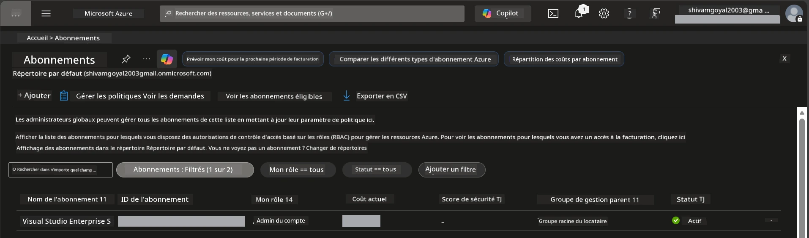

# Module 0 - Pré-requis

Avant de commencer l'atelier, confirmez que vous disposez des outils, accès et environnement suivants. Suivez chaque étape ci-dessous - ne sautez aucune étape.

---

## 1. Compte et abonnement Azure

### 1.1 Créer ou vérifier votre abonnement Azure

1. Ouvrez un navigateur et accédez à [https://azure.microsoft.com/free/](https://azure.microsoft.com/free/).
2. Si vous n'avez pas de compte Azure, cliquez sur **Démarrer gratuitement** et suivez le processus d'inscription. Vous aurez besoin d'un compte Microsoft (ou d'en créer un) et d'une carte bancaire pour la vérification d'identité.
3. Si vous avez déjà un compte, connectez-vous via [https://portal.azure.com](https://portal.azure.com).
4. Dans le Portail, cliquez sur le volet **Abonnements** dans la navigation à gauche (ou recherchez "Abonnements" dans la barre de recherche en haut).
5. Vérifiez que vous voyez au moins un abonnement **Actif**. Notez l’**ID d’abonnement** - vous en aurez besoin plus tard.



### 1.2 Comprendre les rôles RBAC requis

Le déploiement de [Hosted Agent](https://learn.microsoft.com/azure/foundry/agents/concepts/hosted-agents) nécessite des autorisations d’**actions sur les données** que les rôles Azure standards `Owner` et `Contributor` ne couvrent **pas**. Vous aurez besoin d'une de ces [combinaisons de rôles](https://learn.microsoft.com/azure/foundry/concepts/rbac-foundry#built-in-roles) :

| Scénario | Rôles requis | Où les attribuer |
|----------|--------------|------------------|
| Créer un nouveau projet Foundry | **Azure AI Owner** sur la ressource Foundry | Ressource Foundry dans le Portail Azure |
| Déployer dans un projet existant (nouvelles ressources) | **Azure AI Owner** + **Contributor** sur l’abonnement | Abonnement + ressource Foundry |
| Déployer dans un projet entièrement configuré | **Reader** sur le compte + **Azure AI User** sur le projet | Compte + Projet dans le Portail Azure |

> **Point clé :** Les rôles Azure `Owner` et `Contributor` couvrent uniquement les autorisations de *gestion* (opérations ARM). Vous avez besoin de [**Azure AI User**](https://learn.microsoft.com/azure/foundry/concepts/rbac-foundry#built-in-roles) (ou supérieur) pour les *actions sur les données* comme `agents/write` qui est nécessaire pour créer et déployer des agents. Vous attribuerez ces rôles dans le [Module 2](02-create-foundry-project.md).

---

## 2. Installer les outils locaux

Installez chaque outil ci-dessous. Après l'installation, vérifiez qu'il fonctionne en exécutant la commande de vérification.

### 2.1 Visual Studio Code

1. Rendez-vous sur [https://code.visualstudio.com/](https://code.visualstudio.com/).
2. Téléchargez l’installateur pour votre système d’exploitation (Windows/macOS/Linux).
3. Lancez l’installateur avec les paramètres par défaut.
4. Ouvrez VS Code pour confirmer qu’il se lance.

### 2.2 Python 3.10+

1. Rendez-vous sur [https://www.python.org/downloads/](https://www.python.org/downloads/).
2. Téléchargez Python 3.10 ou une version ultérieure (3.12+ recommandé).
3. **Windows :** Pendant l’installation, cochez **"Add Python to PATH"** sur le premier écran.
4. Ouvrez un terminal et vérifiez :

   ```powershell
   python --version
   ```

   Sortie attendue : `Python 3.10.x` ou supérieur.

### 2.3 Azure CLI

1. Rendez-vous sur [https://learn.microsoft.com/cli/azure/install-azure-cli](https://learn.microsoft.com/cli/azure/install-azure-cli).
2. Suivez les instructions d’installation pour votre système.
3. Vérifiez :

   ```powershell
   az --version
   ```

   Attendu : `azure-cli 2.80.0` ou supérieur.

4. Connectez-vous :

   ```powershell
   az login
   ```

### 2.4 Azure Developer CLI (azd)

1. Rendez-vous sur [https://learn.microsoft.com/azure/developer/azure-developer-cli/install-azd](https://learn.microsoft.com/azure/developer/azure-developer-cli/install-azd).
2. Suivez les instructions d’installation pour votre système. Sur Windows :

   ```powershell
   winget install microsoft.azd
   ```

3. Vérifiez :

   ```powershell
   azd version
   ```

   Attendu : `azd version 1.x.x` ou supérieur.

4. Connectez-vous :

   ```powershell
   azd auth login
   ```

### 2.5 Docker Desktop (optionnel)

Docker n’est nécessaire que si vous souhaitez construire et tester localement l’image du conteneur avant le déploiement. L’extension Foundry gère automatiquement la construction des conteneurs lors du déploiement.

1. Rendez-vous sur [https://docs.docker.com/get-docker/](https://docs.docker.com/get-docker/).
2. Téléchargez et installez Docker Desktop pour votre système d’exploitation.
3. **Windows :** Assurez-vous que le backend WSL 2 est sélectionné lors de l’installation.
4. Lancez Docker Desktop et attendez que l’icône dans la barre système affiche **"Docker Desktop is running"**.
5. Ouvrez un terminal et vérifiez :

   ```powershell
   docker info
   ```

   Cela devrait afficher les informations système Docker sans erreurs. Si vous voyez `Cannot connect to the Docker daemon`, attendez encore quelques secondes que Docker démarre complètement.

---

## 3. Installer les extensions VS Code

Vous avez besoin de trois extensions. Installez-les **avant** le début de l’atelier.

### 3.1 Microsoft Foundry pour VS Code

1. Ouvrez VS Code.
2. Pressez `Ctrl+Shift+X` pour ouvrir le panneau Extensions.
3. Dans la zone de recherche, tapez **"Microsoft Foundry"**.
4. Trouvez **Microsoft Foundry for Visual Studio Code** (éditeur : Microsoft, ID : `TeamsDevApp.vscode-ai-foundry`).
5. Cliquez sur **Installer**.
6. Après l’installation, vous devriez voir l’icône **Microsoft Foundry** apparaître dans la barre d’activités (barre latérale gauche).

### 3.2 Foundry Toolkit

1. Dans le panneau Extensions (`Ctrl+Shift+X`), cherchez **"Foundry Toolkit"**.
2. Trouvez **Foundry Toolkit** (éditeur : Microsoft, ID : `ms-windows-ai-studio.windows-ai-studio`).
3. Cliquez sur **Installer**.
4. L’icône **Foundry Toolkit** devrait apparaître dans la barre d’activités.

### 3.3 Python

1. Dans le panneau Extensions, cherchez **"Python"**.
2. Trouvez **Python** (éditeur : Microsoft, ID : `ms-python.python`).
3. Cliquez sur **Installer**.

---

## 4. Se connecter à Azure depuis VS Code

Le [Microsoft Agent Framework](https://learn.microsoft.com/agent-framework/overview/) utilise [`DefaultAzureCredential`](https://learn.microsoft.com/azure/developer/python/sdk/authentication/credential-chains#defaultazurecredential-overview) pour l'authentification. Vous devez être connecté à Azure dans VS Code.

### 4.1 Connexion via VS Code

1. Regardez en bas à gauche dans VS Code et cliquez sur l’icône **Comptes** (silhouette de personne).
2. Cliquez sur **Se connecter pour utiliser Microsoft Foundry** (ou **Se connecter avec Azure**).
3. Une fenêtre de navigateur s’ouvre - connectez-vous avec le compte Azure ayant accès à votre abonnement.
4. Retournez à VS Code. Vous devriez voir le nom de votre compte en bas à gauche.

### 4.2 (Optionnel) Connexion via Azure CLI

Si vous avez installé Azure CLI et préférez l’authentification via ligne de commande :

```powershell
az login
```

Cela ouvre un navigateur pour la connexion. Après vous être connecté, définissez l’abonnement correct :

```powershell
az account set --subscription "<your-subscription-id>"
```

Vérifiez :

```powershell
az account show --query "{name:name, id:id, state:state}" --output table
```

Vous devriez voir le nom, l’ID et l’état de votre abonnement = `Enabled`.

### 4.3 (Alternative) Authentification par principal de service

Pour les environnements CI/CD ou partagés, définissez ces variables d’environnement à la place :

```powershell
$env:AZURE_TENANT_ID = "<your-tenant-id>"
$env:AZURE_CLIENT_ID = "<your-client-id>"
$env:AZURE_CLIENT_SECRET = "<your-client-secret>"
```

---

## 5. Limitations en aperçu

Avant de continuer, soyez conscient des limitations actuelles :

- Les [**Hosted Agents**](https://learn.microsoft.com/azure/foundry/agents/concepts/hosted-agents) sont actuellement en **aperçu public** - non recommandés pour les charges de production.
- **Les régions supportées sont limitées** - vérifiez [la disponibilité par région](https://learn.microsoft.com/azure/foundry/agents/concepts/hosted-agents#region-availability) avant de créer des ressources. Si vous choisissez une région non supportée, le déploiement échouera.
- Le package `azure-ai-agentserver-agentframework` est en pré-version (`1.0.0b16`) - les API peuvent changer.
- Limites d’échelle : les agents hébergés supportent de 0 à 5 réplicas (y compris mise à l’échelle à zéro).

---

## 6. Liste de contrôle préliminaire

Passez en revue chaque élément ci-dessous. Si une étape échoue, revenez en arrière et corrigez-la avant de continuer.

- [ ] VS Code s’ouvre sans erreur
- [ ] Python 3.10+ est sur votre PATH (`python --version` affiche `3.10.x` ou supérieur)
- [ ] Azure CLI est installé (`az --version` affiche `2.80.0` ou supérieur)
- [ ] Azure Developer CLI est installé (`azd version` affiche les infos de version)
- [ ] L’extension Microsoft Foundry est installée (icône visible dans la barre d’activités)
- [ ] L’extension Foundry Toolkit est installée (icône visible dans la barre d’activités)
- [ ] L’extension Python est installée
- [ ] Vous êtes connecté à Azure dans VS Code (vérifiez l’icône Comptes, en bas à gauche)
- [ ] `az account show` retourne votre abonnement
- [ ] (Optionnel) Docker Desktop est en fonctionnement (`docker info` renvoie des infos système sans erreurs)

### Point de contrôle

Ouvrez la barre d’activités de VS Code et confirmez que vous voyez les deux vues en barre latérale **Foundry Toolkit** et **Microsoft Foundry**. Cliquez sur chacune pour vérifier qu’elles se chargent sans erreur.

---

**Suivant :** [01 - Installer Foundry Toolkit & Extension Foundry →](01-install-foundry-toolkit.md)

---

<!-- CO-OP TRANSLATOR DISCLAIMER START -->
**Avertissement** :  
Ce document a été traduit à l’aide du service de traduction AI [Co-op Translator](https://github.com/Azure/co-op-translator). Bien que nous nous efforçons d’assurer l’exactitude, veuillez noter que les traductions automatiques peuvent contenir des erreurs ou des inexactitudes. Le document original dans sa langue d’origine doit être considéré comme la source faisant autorité. Pour les informations critiques, une traduction professionnelle humaine est recommandée. Nous déclinons toute responsabilité en cas de malentendus ou de mauvaises interprétations résultant de l’utilisation de cette traduction.
<!-- CO-OP TRANSLATOR DISCLAIMER END -->