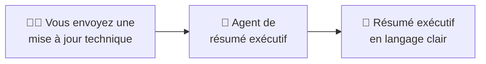

# Module 0 - Introduction

⏱️ ~10 min

> [!WARNING]
> **Aperçu & Limitations :** Les [agents hébergés](https://learn.microsoft.com/azure/foundry/agents/concepts/hosted-agents) sont actuellement en **aperçu public** - non recommandés pour des charges de travail en production. Prenez en compte ce qui suit :
> - **Les régions prises en charge sont limitées** - vérifiez la [disponibilité par région](https://learn.microsoft.com/azure/foundry/agents/concepts/hosted-agents#region-availability) avant de créer des ressources. Si vous choisissez une région non prise en charge, le déploiement échouera.
> - Le package `azure-ai-agentserver-agentframework` est en pré-version - les API peuvent changer entre les versions.
> - Limites d'échelle : les agents hébergés supportent 0 à 5 réplicas (y compris le passage à zéro).
> - Certaines fonctionnalités présentées dans cet atelier peuvent évoluer à mesure que le service se dirige vers la GA.

## Ce que vous allez construire

Dans cet atelier, vous construirez un agent **« Expliquez-le-moi comme si j’étais un cadre »** — un agent IA hébergé qui prend des mises à jour techniques complexes et les reformule sous forme de résumés exécutifs en anglais clair.

```mermaid
flowchart LR
    A["🧑‍💻 Vous envoyez une\nmise à jour technique"] --> B["🤖 Agent de\nrésumé exécutif"]
    B --> C["📝 Résumé exécutif\nen langage clair"]
```

**L’agent utilise :**
- **Microsoft Agent Framework** - pour la logique et la structure de l’agent
- **Foundry Toolkit for VS Code** - pour générer la structure, tester localement, et déployer
- **Un modèle IA** (ex. `gpt-4.1-mini/gpt-5-mini`) - pour générer les résumés

À la fin de ce laboratoire, vous aurez un agent fonctionnel que vous pourrez tester localement via l’Agent Inspector, et éventuellement déployer dans le cloud.

---

## Qu’est-ce qu’un agent hébergé ?

Un **agent hébergé** est un agent IA qui s’exécute en tant que service géré dans Microsoft Foundry. Plutôt que de gérer votre propre infrastructure, vous empaquetez le code de votre agent dans un conteneur et Foundry s’occupe de la montée en charge, de l’hébergement, et de l’exposition via un point de terminaison HTTP standard.

| Concept | Ce que ça signifie |
|---------|--------------|
| **Agent** | Votre code Python qui reçoit un message utilisateur, appelle un modèle IA, et renvoie une réponse structurée |
| **Hébergé** | Foundry exécute votre conteneur pour vous - pas de VM, pas de Kubernetes, pas d’infrastructure à gérer |
| **Protocole des réponses** | Une API HTTP standard (`POST /responses`) que tout client peut appeler pour interagir avec votre agent |
| **Agent Inspector** | Une interface de test locale (intégrée dans Foundry Toolkit) qui vous permet de dialoguer avec votre agent avant le déploiement |

Dans cet atelier, vous passerez de zéro à un agent entièrement hébergé – ou vous pourrez vous arrêter au test local si vous préférez.

---

## Choisissez votre chemin

> ⚠️ **Choisissez un chemin avant de continuer.** Votre choix déterminera les outils à installer et les modules à suivre. Vous pouvez basculer du Chemin B → Chemin A plus tard si vous obtenez un abonnement.

<strong>🅰️ Chemin A - Cloud Azure (nécessite un abonnement Azure)</strong>

| | Détails |
|---|---|
| **Pour qui ?** | Vous avez un abonnement Azure actif et pouvez créer des ressources Foundry |
| **Modèle** | Azure OpenAI via Foundry (ex. `gpt-4.1-mini/gpt-5-mini`) |
| **Modules couverts** | Tous les modules (00–07) |
| **Déploiement dans le cloud ?** | ✅ Oui - déploiement complet de bout en bout |

<strong>🅱️ Chemin B - Local / niveau gratuit (pas besoin d’abonnement Azure)</strong>

| | Détails |
|---|---|
| **Pour qui ?** | MVPs, étudiants, ou toute personne sans accès Azure |
| **Modèle** | **Foundry Local** (gratuit, s’exécute sur votre machine) |
| **Modules couverts** | Modules 00–04 (pas de déploiement ni de vérification cloud) |
| **Déploiement dans le cloud ?** | ❌ Non - test local uniquement via Agent Inspector |

---

## Tous chemins : Outils requis

Installez chaque outil ci-dessous. Après installation, vérifiez qu’il fonctionne en lançant la commande de vérification.

| # | Outil | Version | Installation | Vérification (Sortie attendue) |
|---|------|---------|---------|---------------------------|
| 1 | **Visual Studio Code** | Dernière version | [code.visualstudio.com](https://code.visualstudio.com/) | S’ouvre sans erreurs |
| 2 | **Python** | 3.12 ou supérieur| [python.org/downloads](https://www.python.org/downloads/) | `python --version` $\rightarrow$ `Python 3.12.x` |
| 3 | **Foundry Toolkit for VS Code** | Dernière version | ID d’extension : `ms-windows-ai-studio.windows-ai-studio` | Icône Foundry dans la barre d’activité |
| 4 | **Extension Python pour VS Code** | Dernière version | ID d’extension : `ms-python.python` | Installée dans le panneau Extensions |

> [!TIP]
> **Conseils pro pour l’installation :**
> - **Chemin Python (Windows) :** Cochez toujours **« Ajouter Python au PATH »** à l’écran initial de l’installeur Python. Sans cela, `python` ne sera pas reconnu dans votre terminal.
> - **Versions multiples de Python :** Si vous avez Python 3.10 et 3.12 installés, utilisez `python3.12 -m venv .venv` pour garantir l’utilisation de la bonne version dans votre environnement virtuel.
> - **Docker WSL 2 (Windows) :** Lors de l’installation de Docker Desktop, assurez-vous que **l’arrière-plan WSL 2** est sélectionné. Docker avec Hyper-V est plus lent et peut poser des problèmes lors des builds de conteneurs Foundry.
> - **Docker ne démarre pas ?** Attendez 30 à 60 secondes après le lancement de Docker Desktop. Lancez `docker info` - si vous voyez « Cannot connect to the Docker daemon », Docker est encore en cours d’initialisation.
> - **Extensions VS Code qui ne se chargent pas ?** Après avoir installé les extensions, rechargez la fenêtre : `Ctrl+Shift+P` → `Developer: Reload Window`.

> **Utilisateurs Windows :** Cochez **« Ajouter Python au PATH »** lors de l’installation de Python.

**Suivant :** [01 - Setup →](01-setup.md)

---

<!-- CO-OP TRANSLATOR DISCLAIMER START -->
**Avertissement** :
Ce document a été traduit à l'aide du service de traduction automatique [Co-op Translator](https://github.com/Azure/co-op-translator). Bien que nous nous efforçions d'assurer l'exactitude, veuillez noter que les traductions automatisées peuvent contenir des erreurs ou des inexactitudes. Le document original dans sa langue native doit être considéré comme la source faisant autorité. Pour les informations critiques, il est recommandé de recourir à une traduction professionnelle réalisée par un humain. Nous ne saurions être tenus responsables des malentendus ou erreurs d'interprétation découlant de l'utilisation de cette traduction.
<!-- CO-OP TRANSLATOR DISCLAIMER END -->