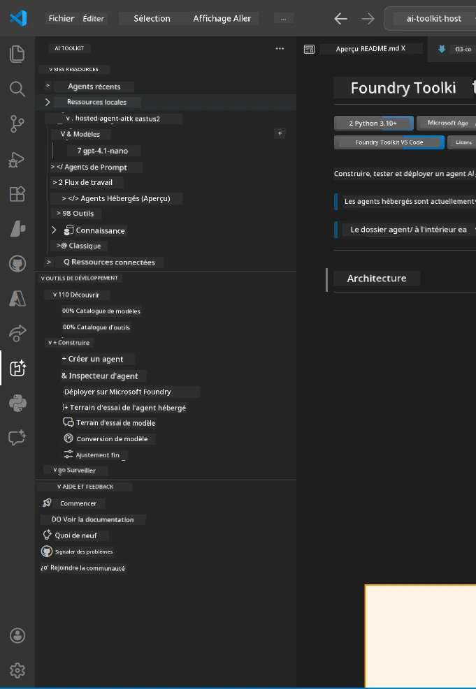
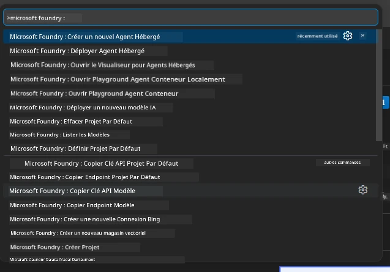

# Module 1 - Installer Foundry Toolkit & Extension Foundry

Ce module vous guide à travers l'installation et la vérification des deux extensions clés de VS Code pour cet atelier. Si vous les avez déjà installées lors du [Module 0](00-prerequisites.md), utilisez ce module pour vérifier qu'elles fonctionnent correctement.

---

## Étape 1 : Installer l'extension Microsoft Foundry

L'extension **Microsoft Foundry pour VS Code** est votre outil principal pour créer des projets Foundry, déployer des modèles, générer des agents hébergés et déployer directement depuis VS Code.

1. Ouvrez VS Code.
2. Appuyez sur `Ctrl+Shift+X` pour ouvrir le panneau **Extensions**.
3. Dans la zone de recherche en haut, tapez : **Microsoft Foundry**
4. Recherchez le résultat intitulé **Microsoft Foundry for Visual Studio Code**.
   - Éditeur : **Microsoft**
   - ID de l’extension : `TeamsDevApp.vscode-ai-foundry`
5. Cliquez sur le bouton **Installer**.
6. Attendez que l'installation se termine (vous verrez un petit indicateur de progression).
7. Après l'installation, regardez la **Barre d'activité** (la barre d’icônes verticale sur le côté gauche de VS Code). Vous devriez voir une nouvelle icône **Microsoft Foundry** (ressemble à un diamant/icône AI).
8. Cliquez sur l'icône **Microsoft Foundry** pour ouvrir son panneau latéral. Vous devriez voir des sections pour :
   - **Ressources** (ou Projets)
   - **Agents**
   - **Modèles**

> **Si l'icône n'apparaît pas :** Essayez de recharger VS Code (`Ctrl+Shift+P` → `Developer: Reload Window`).

---

## Étape 2 : Installer l'extension Foundry Toolkit

L'extension **Foundry Toolkit** fournit l'[**Agent Inspector**](https://learn.microsoft.com/azure/foundry/agents/how-to/vs-code-agents-workflow-pro-code) - une interface visuelle pour tester et déboguer les agents localement - ainsi qu'un playground, la gestion des modèles et des outils d'évaluation.

1. Dans le panneau Extensions (`Ctrl+Shift+X`), videz la zone de recherche et tapez : **Foundry Toolkit**
2. Trouvez **Foundry Toolkit** dans les résultats.
   - Éditeur : **Microsoft**
   - ID de l’extension : `ms-windows-ai-studio.windows-ai-studio`
3. Cliquez sur **Installer**.
4. Après l'installation, l'icône **Foundry Toolkit** apparaît dans la Barre d'activité (ressemble à un robot/icône scintillante).
5. Cliquez sur l'icône **Foundry Toolkit** pour ouvrir son panneau latéral. Vous devriez voir l'écran d'accueil de Foundry Toolkit avec des options pour :
   - **Modèles**
   - **Playground**
   - **Agents**

---

## Étape 3 : Vérifier que les deux extensions fonctionnent

### 3.1 Vérifier l'extension Microsoft Foundry

1. Cliquez sur l'icône **Microsoft Foundry** dans la Barre d'activité.
2. Si vous êtes connecté à Azure (depuis le Module 0), vous devriez voir vos projets listés sous **Ressources**.
3. Si on vous invite à vous connecter, cliquez sur **Se connecter** et suivez le processus d'authentification.
4. Confirmez que vous pouvez voir le panneau latéral sans erreurs.

### 3.2 Vérifier l'extension Foundry Toolkit

1. Cliquez sur l'icône **Foundry Toolkit** dans la Barre d'activité.
2. Confirmez que la vue d'accueil ou le panneau principal se charge sans erreurs.
3. Vous n'avez pas besoin de configurer quoi que ce soit pour l'instant - nous utiliserons l'Agent Inspector dans le [Module 5](05-test-locally.md).

### 3.3 Vérifier via la Command Palette

1. Appuyez sur `Ctrl+Shift+P` pour ouvrir la Command Palette.
2. Tapez **"Microsoft Foundry"** - vous devriez voir des commandes comme :
   - `Microsoft Foundry: Create a New Hosted Agent`
   - `Microsoft Foundry: Deploy Hosted Agent`
   - `Microsoft Foundry: Open Model Catalog`
3. Appuyez sur `Échap` pour fermer la Command Palette.
4. Ouvrez de nouveau la Command Palette et tapez **"Foundry Toolkit"** - vous devriez voir des commandes telles que :
   - `Foundry Toolkit: Open Agent Inspector`

> Si vous ne voyez pas ces commandes, les extensions ne sont peut-être pas installées correctement. Essayez de les désinstaller puis de les réinstaller.

---

## Ce que ces extensions font dans cet atelier

| Extension | Fonction | Quand vous l'utiliserez |
|-----------|----------|------------------------|
| **Microsoft Foundry pour VS Code** | Créer des projets Foundry, déployer des modèles, **générer des [agents hébergés](https://learn.microsoft.com/azure/foundry/agents/concepts/hosted-agents)** (génère automatiquement `agent.yaml`, `main.py`, `Dockerfile`, `requirements.txt`), déployer sur le [Foundry Agent Service](https://learn.microsoft.com/azure/foundry/agents/overview) | Modules 2, 3, 6, 7 |
| **Foundry Toolkit** | Agent Inspector pour test/debug local, interface playground, gestion des modèles | Modules 5, 7 |

> **L'extension Foundry est l'outil le plus important de cet atelier.** Elle gère du début à la fin le cycle de vie : générer → configurer → déployer → vérifier. Le Foundry Toolkit vient en complément en fournissant l'Agent Inspector visuel pour les tests locaux.

---

### Point de contrôle

- [ ] L’icône Microsoft Foundry est visible dans la Barre d’activité
- [ ] Cliquer dessus ouvre le panneau latéral sans erreurs
- [ ] L’icône Foundry Toolkit est visible dans la Barre d’activité
- [ ] Cliquer dessus ouvre le panneau latéral sans erreurs
- [ ] `Ctrl+Shift+P` → taper "Microsoft Foundry" affiche les commandes disponibles
- [ ] `Ctrl+Shift+P` → taper "Foundry Toolkit" affiche les commandes disponibles

---

**Précédent :** [00 - Prérequis](00-prerequisites.md) · **Suivant :** [02 - Créer un projet Foundry →](02-create-foundry-project.md)

---

<!-- CO-OP TRANSLATOR DISCLAIMER START -->
**Avertissement** :  
Ce document a été traduit à l’aide du service de traduction automatique [Co-op Translator](https://github.com/Azure/co-op-translator). Bien que nous nous efforcions d’assurer l’exactitude, veuillez noter que les traductions automatiques peuvent contenir des erreurs ou des inexactitudes. Le document original dans sa langue d’origine doit être considéré comme la source faisant autorité. Pour les informations critiques, une traduction professionnelle réalisée par un humain est recommandée. Nous ne sommes pas responsables des malentendus ou des mauvaises interprétations résultant de l’utilisation de cette traduction.
<!-- CO-OP TRANSLATOR DISCLAIMER END -->