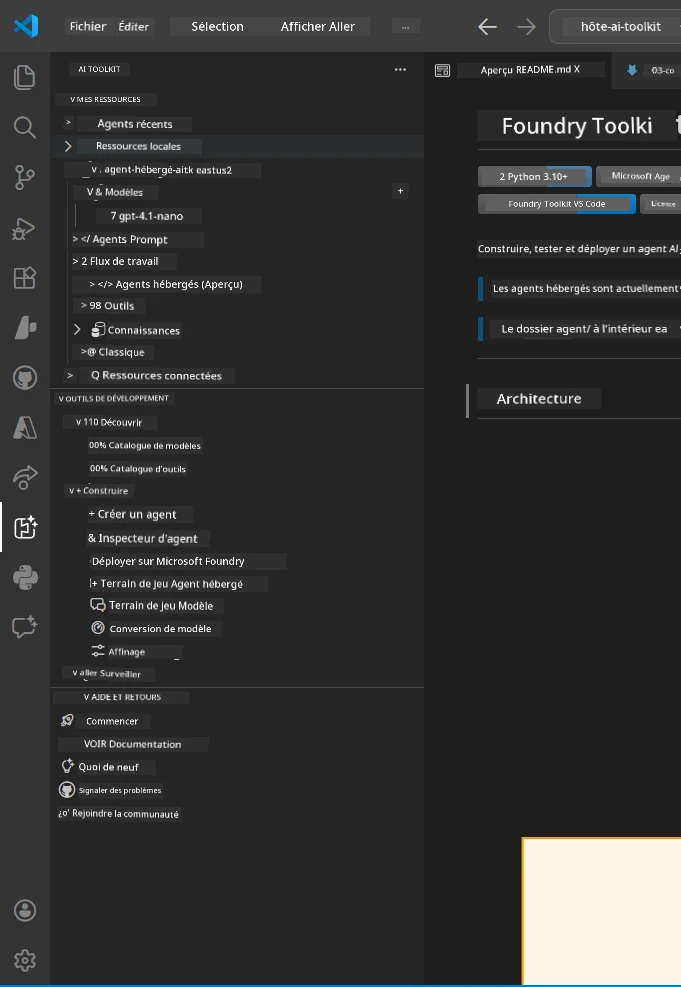
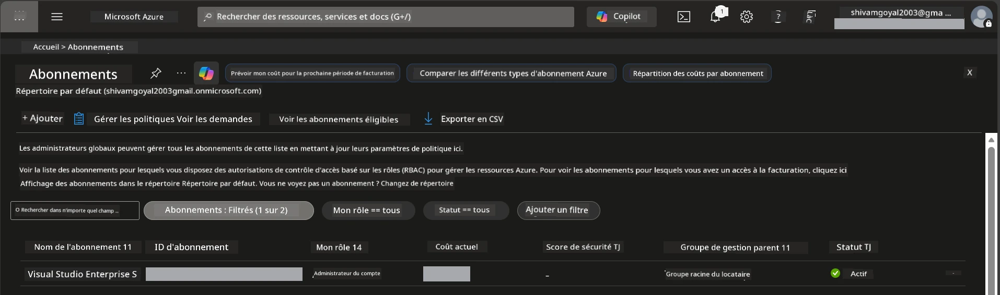
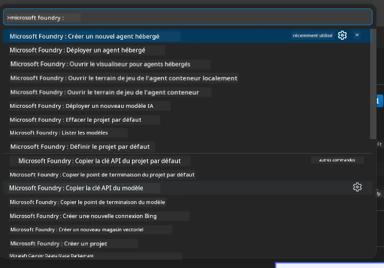
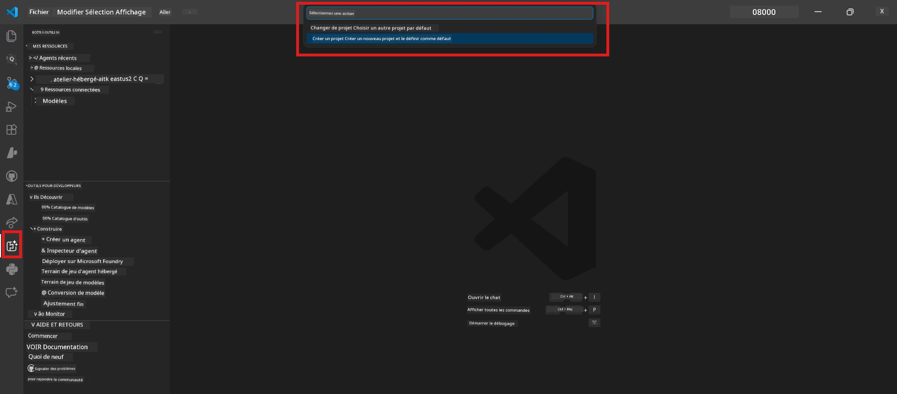
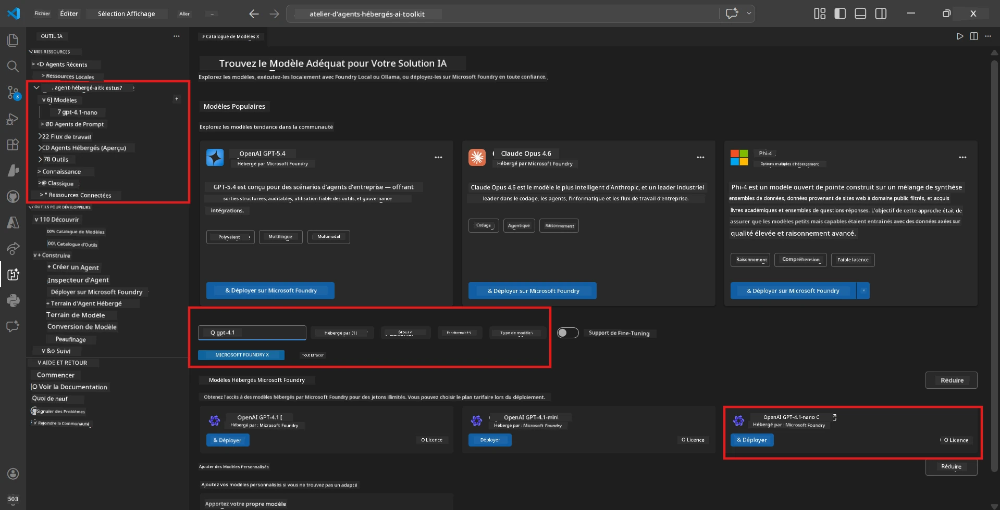
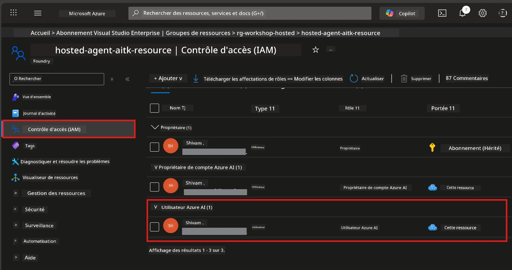

# Configuration : Extension, Projet & Modèle

⏱️ ~15 min

Dans ce module, vous installez et vérifiez l'extension Foundry Toolkit, créez (ou connectez-vous à) un projet Foundry, et déployez un modèle que votre agent utilisera.

## Étape 1 : Installer Foundry Toolkit

**Foundry Toolkit pour VS Code** est l’extension principale pour cet atelier. Elle offre la création de projet, le déploiement de modèles, le scaffolding d'agent, les tests locaux (Agent Inspector) et le déploiement dans le cloud - tout cela depuis VS Code.

1. Ouvrez VS Code puis appuyez sur `Ctrl+Shift+X` pour ouvrir le panneau **Extensions**.
2. Recherchez **Foundry Toolkit**.
3. Installez **Foundry Toolkit for VS Code** (Éditeur : Microsoft, ID : `ms-windows-ai-studio.windows-ai-studio`).
4. Après l'installation, l'icône **Foundry Toolkit** apparaît dans la barre d’activités (barre latérale gauche).

> *Note : La barre d’activités peut afficher "AI TOOLKIT" dans les anciennes versions de l’extension. La fonctionnalité est identique.*



## Étape 2 : Configuration selon votre accès

> **Choisissez votre chemin :** Dépliez la section correspondant à votre configuration. Vous devez compléter **un seul** chemin.

<details>
<summary><strong>🅰️ Chemin A - Cloud Azure (nécessite un abonnement Azure)</strong></summary>

### Azure CLI

1. Installez depuis [learn.microsoft.com/cli/azure/install-azure-cli](https://learn.microsoft.com/cli/azure/install-azure-cli).
2. Vérifiez : `az --version` (version attendue 2.80.0+).
3. Connectez-vous : `az login`

### Options d'authentification

Le [Microsoft Agent Framework](https://learn.microsoft.com/agent-framework/overview/) utilise [`DefaultAzureCredential`](https://learn.microsoft.com/azure/developer/python/sdk/authentication/credential-chains#defaultazurecredential-overview) qui essaie plusieurs méthodes d’authentification dans l’ordre. Choisissez celle qui correspond à votre environnement :

#### Option 1 : Comptes VS Code (recommandé pour les ateliers)
1. Cliquez sur l’icône **Comptes** (silhouette de personne) en bas à gauche de VS Code.
2. Sélectionnez **Se connecter pour utiliser Microsoft Foundry** (ou **Se connecter avec Azure**).
3. Un navigateur s’ouvre - connectez-vous avec le compte Azure ayant accès à votre abonnement.
4. Revenez dans VS Code. Vous devriez voir votre nom de compte en bas à gauche.

#### Option 2 : Azure CLI
```bash
az login
az account set --subscription "<your-subscription-id>"
```

#### Option 3 : Principal de service (Entreprise/CI)
Pour les environnements verrouillés ou les pipelines CI/CD, définissez ces variables d’environnement dans votre fichier `.env` :
```env
AZURE_TENANT_ID=<your-tenant-id>
AZURE_CLIENT_ID=<your-client-id>
AZURE_CLIENT_SECRET=<your-client-secret>
```

> **Comment fonctionne `DefaultAzureCredential` :** Il teste d'abord les variables d’environnement, puis l’identité gérée, ensuite la connexion VS Code, puis Azure CLI - et utilise celle qui réussit en premier. Voir la [documentation sur la chaîne d’identifiants](https://learn.microsoft.com/azure/developer/python/sdk/authentication/credential-chains#defaultazurecredential-overview).

### Azure Developer CLI (azd)

1. Installez : `winget install microsoft.azd` (Windows) ou consultez la [documentation d’installation](https://learn.microsoft.com/azure/developer/azure-developer-cli/install-azd).
2. Vérifiez : `azd version`
3. Connectez-vous : `azd auth login`

### Docker Desktop (optionnel)

Docker est nécessaire seulement si vous souhaitez construire des conteneurs localement. L’extension Foundry gère automatiquement les builds lors du déploiement.

1. Installez depuis [docs.docker.com/get-docker](https://docs.docker.com/get-docker/).
2. Vérifiez : `docker info`

### Abonnement Azure et RBAC

1. Connectez-vous sur [portal.azure.com](https://portal.azure.com).
2. Allez dans **Abonnements** et confirmez qu’au moins un est **Actif**.
3. Notez votre **ID d’abonnement** - vous en aurez besoin dans le Module 01.



#### Tableau des scénarios RBAC

Le déploiement [Hosted Agent](https://learn.microsoft.com/azure/foundry/agents/concepts/hosted-agents) nécessite des permissions d’*action sur les données* que les rôles standard Azure `Owner` et `Contributor` n’incluent **pas**. Utilisez le tableau ci-dessous pour déterminer les rôles requis :

| Scénario | Rôles requis | Où les assigner |
|----------|--------------|-----------------|
| Créer un nouveau projet Foundry | **Azure AI Owner** sur la ressource Foundry | Ressource Foundry dans le portail Azure |
| Déployer dans un projet existant (nouvelles ressources) | **Azure AI Owner** + **Contributor** sur l'abonnement | Abonnement + ressource Foundry |
| Déployer dans un projet entièrement configuré | **Reader** sur le compte + **Azure AI User** sur le projet | Compte + projet dans le portail Azure |
| Tests locaux uniquement (pas de déploiement) | **Azure AI User** sur le projet | Projet dans le portail Azure |

> **Point clé :** Les rôles Azure `Owner` et `Contributor` couvrent uniquement les permissions de *gestion* (opérations ARM). Vous avez besoin de [**Azure AI User**](https://learn.microsoft.com/azure/foundry/concepts/rbac-foundry#built-in-roles) (ou supérieur) pour les *actions sur les données* comme `agents/write` nécessaires pour créer et déployer des agents.

## Connecter ou créer un projet Foundry



1. Appuyez sur `Ctrl+Shift+P` → tapez **Foundry Toolkit: Create Project** → sélectionnez-la.
2. Sélectionnez votre **abonnement Azure** dans la liste déroulante.
3. Sélectionnez ou créez un **groupe de ressources** (ex. `rg-hosted-agents-workshop`).
4. Choisissez une **région** supportant les agents hébergés : `East US`, `West US 2`, ou `Sweden Central`. Voir la [disponibilité des régions](https://learn.microsoft.com/azure/foundry/agents/concepts/hosted-agents#region-availability).
5. Entrez un nom de projet (ex. `workshop-agents`).
6. Patientez 2 à 5 minutes pour la provision. Une notification de progression s’affiche dans VS Code.
7. Une fois terminé, votre projet apparaît dans la barre latérale **Foundry Toolkit** sous **MES RESSOURCES**.



## Déployer un modèle & assigner RBAC

Votre agent hébergé a besoin d’un modèle IA pour générer des réponses.

#### Matrice de sélection du modèle
Selon vos besoins, vous pouvez choisir parmi différents niveaux de modèles :

| Modèle | Idéal pour | Coût | Remarques |
|--------|------------|------|----------|
| `gpt-4.1` | Réponses de haute qualité et nuancées | Plus élevé | Meilleurs résultats, recommandé pour le test final |
| `gpt-4.1-mini/gpt-5-mini` | Itération rapide, coût plus faible | Plus bas | Bon pour le développement en atelier et tests rapides |
| `gpt-4.1-nano` | Tâches légères | Le plus bas | Plus économique, mais réponses plus simples |

1. Appuyez sur `Ctrl+Shift+P` → **Foundry Toolkit: Open Model Catalog** (ou cliquez sur **Model Catalog** dans la barre latérale sous OUTILS DE DÉVELOPPEUR → Découvrir).
2. Recherchez **gpt-4.1** dans le catalogue.
3. Trouvez **OpenAI GPT-4.1-mini** (ou `gpt-5-mini` pour meilleure qualité) et cliquez sur **Déployer**.



4. Dans la configuration de déploiement :
   - **Nom de déploiement :** Laissez le nom par défaut ou saisissez un nom personnalisé. **Retenez ce nom.**
   - **Cible:** Sélectionnez **Déployer sur Foundry Toolkit** → choisissez votre projet.
5. Cliquez sur **Déployer** et attendez 1 à 3 minutes.

> **Recommandation :** Utilisez `gpt-4.1-mini/gpt-5-mini` pour l’atelier - rapide, abordable, et produit de bons résultats.

### Notez vos valeurs

Après le déploiement, notez ces deux valeurs (vous en aurez besoin dans le Module 03) :

| Valeur | Où la trouver |
|-------|--------------|
| **Point de terminaison du projet** | Cliquez sur votre projet dans la barre latérale → la vue détaillée affiche l’URL (ex. `https://<account>.services.ai.azure.com/api/projects/<project>`) |
| **Nom du déploiement du modèle** | Dépliez le projet → **Modèles** → le nom à côté de votre modèle déployé (ex. `gpt-4.1-mini/gpt-5-mini`) |

### Assigner un rôle RBAC

> ⚠️ **C’est l’étape la plus souvent oubliée.** Sans le rôle correct, le déploiement du Module 05 échouera.

#### Quel rôle me faut-il ?
Selon votre scénario, vous avez besoin des combinaisons de rôle suivantes :

| Scénario | Rôles requis | Où les assigner |
|----------|--------------|-----------------|
| Créer un nouveau projet Foundry | **Azure AI Owner** sur la ressource Foundry | Ressource Foundry dans le portail Azure |
| Déployer dans un projet existant (nouvelles ressources) | **Azure AI Owner** + **Contributor** sur l'abonnement | Abonnement + ressource Foundry |
| Déployer dans un projet entièrement configuré | **Reader** sur le compte + **Azure AI User** sur le projet | Compte + projet dans le portail Azure |

**Point clé :** Les rôles Azure `Owner` et `Contributor` ne couvrent que les permissions de *gestion*. Vous avez besoin de **Azure AI User** (ou supérieur) pour les *actions sur les données* comme `agents/write` nécessaires pour créer et déployer des agents.

1. Ouvrez [portal.azure.com](https://portal.azure.com).
2. Recherchez le nom de votre **projet Foundry** → cliquez sur le résultat de type **"Projet Foundry Toolkit"** (PAS sur le compte parent).
3. Cliquez sur **Contrôle d’accès (IAM)** dans la navigation gauche.
4. Cliquez sur **+ Ajouter** → **Ajouter une attribution de rôle**.
5. **Onglet Rôle :** Cherchez **Azure AI User**, sélectionnez-le, cliquez sur **Suivant**.
6. **Onglet Membres :** Sélectionnez **Utilisateur, groupe ou principal de service** → cliquez sur **+ Sélectionner les membres** → trouvez-vous et sélectionnez-vous → cliquez sur **Sélectionner**.
7. Cliquez sur **Examiner + attribuer** → **Examiner + attribuer** à nouveau.
8. **Patientez 1 à 2 minutes** pour la propagation.

> **Pourquoi ce rôle ?** Les rôles Azure `Owner`/`Contributor` ne donnent que des permissions de gestion. Le rôle **Azure AI User** donne l’action sur les données `agents/write` nécessaire pour créer et déployer des agents. Voir la [doc RBAC Foundry](https://learn.microsoft.com/azure/foundry/concepts/rbac-foundry#built-in-roles).



</details>

<details>
<summary><strong>🅱️ Chemin B - Local / niveau gratuit (pas d’abonnement Azure nécessaire)</strong></summary>

### Foundry Local

Foundry Local vous permet d’exécuter des modèles IA sur votre propre machine - pas de compte cloud nécessaire. Vous pouvez accéder aux modèles Foundry Local avec Foundry Toolkit via le catalogue de modèles comme suit :

1. Allez dans l’extension Foundry Toolkit.
2. Dans la navigation Foundry Toolkit, allez dans **Outils de développeur** > et sélectionnez **Catalogue de modèles**
3. Dans la nouvelle fenêtre, sélectionnez **local** dans la barre de navigation.
4. Faites défiler jusqu’à **Phi 4 Mini,** et cliquez sur le **bouton ajouter** une fenêtre s’ouvre indiquant que le modèle est en cours de téléchargement.
5. Une fois le modèle téléchargé, vous pouvez passer à l’étape suivante.

</details>

### ✅ Point de contrôle


- [ ] `Ctrl+Shift+P` → "Foundry Toolkit" affiche les commandes disponibles
- [ ] Extension Foundry Toolkit installée et la barre latérale se charge sans erreurs
- [ ] VS Code s’ouvre et fonctionne correctement
- [ ] `python --version` affiche 3.10+
- [ ] Icône Foundry Toolkit visible dans la barre d’activités de VS Code
- [ ] **Chemin A :** `az login` réussi, abonnement actif
- [ ] **Chemin B :** Foundry Local est en cours d’exécution (`foundry local status`)
- [ ] **Chemin A :** Projet Foundry visible dans la barre latérale, modèle déployé, rôle Azure AI User attribué
- [ ] **Chemin B :** Foundry Local en cours d’exécution avec un modèle
- [ ] Vous avez noté votre **point de terminaison** et **nom de déploiement du modèle**


**Précédent :** [00 - Prérequis](00-prerequisites.md) · **Suivant :** [02 - Créer un agent hébergé →](02-create-hosted-agent.md)

---

<!-- CO-OP TRANSLATOR DISCLAIMER START -->
**Avertissement** :
Ce document a été traduit à l'aide du service de traduction automatique [Co-op Translator](https://github.com/Azure/co-op-translator). Bien que nous nous efforçions d'assurer l'exactitude, veuillez noter que les traductions automatisées peuvent contenir des erreurs ou des inexactitudes. Le document original dans sa langue native doit être considéré comme la source faisant autorité. Pour les informations critiques, il est recommandé de recourir à une traduction professionnelle réalisée par un humain. Nous ne saurions être tenus responsables des malentendus ou erreurs d'interprétation découlant de l'utilisation de cette traduction.
<!-- CO-OP TRANSLATOR DISCLAIMER END -->