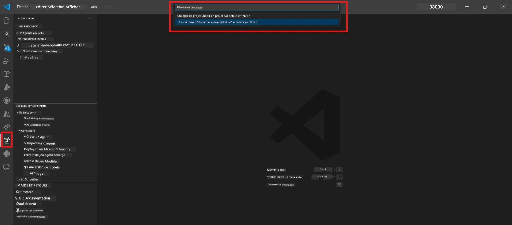
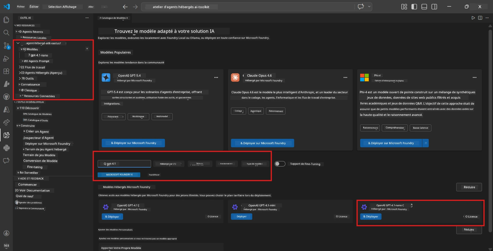
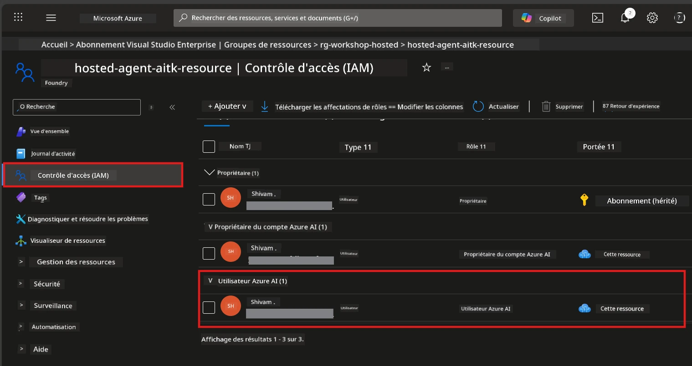

# Module 2 - Créer un projet Foundry et déployer un modèle

Dans ce module, vous créez (ou sélectionnez) un projet Microsoft Foundry et déployez un modèle que votre agent utilisera. Chaque étape est explicitement détaillée - suivez-les dans l'ordre.

> Si vous avez déjà un projet Foundry avec un modèle déployé, passez au [Module 3](03-create-hosted-agent.md).

---

## Étape 1 : Créer un projet Foundry depuis VS Code

Vous utiliserez l’extension Microsoft Foundry pour créer un projet sans quitter VS Code.

1. Appuyez sur `Ctrl+Shift+P` pour ouvrir la **Palette de commandes**.
2. Tapez : **Microsoft Foundry: Create Project** et sélectionnez-le.
3. Un menu déroulant apparaît - sélectionnez votre **abonnement Azure** dans la liste.
4. Il vous sera demandé de sélectionner ou créer un **groupe de ressources** :
   - Pour en créer un nouveau : tapez un nom (par ex., `rg-hosted-agents-workshop`) et appuyez sur Entrée.
   - Pour utiliser un groupe existant : sélectionnez-le dans le menu déroulant.
5. Sélectionnez une **région**. **Important :** Choisissez une région supportant les agents hébergés. Vérifiez la [disponibilité par région](https://learn.microsoft.com/azure/foundry/agents/concepts/hosted-agents#region-availability) - les choix courants sont `East US`, `West US 2`, ou `Sweden Central`.
6. Saisissez un **nom** pour le projet Foundry (par ex., `workshop-agents`).
7. Appuyez sur Entrée et attendez la fin de la création.

> **La création prend 2 à 5 minutes.** Vous verrez une notification de progression dans le coin inférieur droit de VS Code. Ne fermez pas VS Code pendant cette opération.

8. Une fois terminé, la barre latérale **Microsoft Foundry** affichera votre nouveau projet sous **Resources**.
9. Cliquez sur le nom du projet pour l’agrandir et vérifier qu’il affiche des sections comme **Models + endpoints** et **Agents**.



### Alternative : Créer via le portail Foundry

Si vous préférez utiliser le navigateur :

1. Ouvrez [https://ai.azure.com](https://ai.azure.com) et connectez-vous.
2. Cliquez sur **Create project** sur la page d’accueil.
3. Entrez un nom de projet, sélectionnez votre abonnement, groupe de ressources et région.
4. Cliquez sur **Create** et attendez la création.
5. Une fois créé, retournez à VS Code - le projet devrait apparaître dans la barre latérale Foundry après un rafraîchissement (cliquez sur l’icône de rafraîchissement).

---

## Étape 2 : Déployer un modèle

Votre [agent hébergé](https://learn.microsoft.com/azure/foundry/agents/concepts/hosted-agents) nécessite un modèle Azure OpenAI pour générer des réponses. Vous allez [en déployer un maintenant](https://learn.microsoft.com/azure/ai-foundry/openai/how-to/create-resource#deploy-a-model).

1. Appuyez sur `Ctrl+Shift+P` pour ouvrir la **Palette de commandes**.
2. Tapez : **Microsoft Foundry: Open [Model Catalog](https://learn.microsoft.com/azure/ai-foundry/openai/concepts/models)** et sélectionnez-le.
3. La vue du catalogue de modèles s’ouvre dans VS Code. Parcourez ou utilisez la barre de recherche pour trouver le modèle **gpt-4.1**.
4. Cliquez sur la carte du modèle **gpt-4.1** (ou `gpt-4.1-mini` si vous préférez un coût inférieur).
5. Cliquez sur **Deploy**.

  
6. Dans la configuration du déploiement :  
   - **Deployment name** : Laissez le nom par défaut (par ex., `gpt-4.1`) ou entrez un nom personnalisé. **Retenez ce nom** - vous en aurez besoin au Module 4.  
   - **Target** : Sélectionnez **Deploy to Microsoft Foundry** et choisissez le projet que vous venez de créer.  
7. Cliquez sur **Deploy** et attendez la fin du déploiement (1-3 minutes).

### Choix du modèle

| Modèle | Idéal pour | Coût | Remarques |
|--------|------------|------|-----------|
| `gpt-4.1` | Réponses de haute qualité et nuancées | Plus élevé | Meilleurs résultats, recommandé pour les tests finaux |
| `gpt-4.1-mini` | Itération rapide, coût plus bas | Moins élevé | Bon pour le développement et les tests rapides |
| `gpt-4.1-nano` | Tâches légères | Le plus bas | Le plus économique, mais réponses plus simples |

> **Recommandation pour cet atelier :** Utilisez `gpt-4.1-mini` pour le développement et les tests. Il est rapide, peu coûteux, et produit de bons résultats pour les exercices.

### Vérifier le déploiement du modèle

1. Dans la barre latérale **Microsoft Foundry**, développez votre projet.
2. Regardez sous **Models + endpoints** (ou une section similaire).
3. Vous devriez voir votre modèle déployé (par ex., `gpt-4.1-mini`) avec un statut **Succeeded** ou **Active**.
4. Cliquez sur le déploiement du modèle pour voir ses détails.
5. **Notez** ces deux valeurs - vous en aurez besoin au Module 4 :

   | Paramètre | Où le trouver | Exemple |
   |-----------|---------------|---------|
   | **Project endpoint** | Cliquez sur le nom du projet dans la barre latérale Foundry. L’URL de l’endpoint s’affiche dans la vue des détails. | `https://<account>.services.ai.azure.com/api/projects/<project>` |
   | **Model deployment name** | Le nom affiché à côté du modèle déployé. | `gpt-4.1-mini` |

---

## Étape 3 : Assigner les rôles RBAC requis

C’est l’**étape la plus souvent oubliée**. Sans les bons rôles, le déploiement du Module 6 échouera avec une erreur de permissions.

### 3.1 Assigner le rôle Azure AI User à vous-même

1. Ouvrez un navigateur et allez sur [https://portal.azure.com](https://portal.azure.com).
2. Dans la barre de recherche en haut, tapez le nom de votre **projet Foundry** et cliquez dessus dans les résultats.
   - **Important :** Naviguez vers la ressource de **projet** (type : "Microsoft Foundry project"), **pas** vers la ressource parente de compte/hub.
3. Dans la navigation gauche du projet, cliquez sur **Contrôle d’accès (IAM)**.
4. Cliquez sur le bouton **+ Ajouter** en haut → sélectionnez **Ajouter une attribution de rôle**.
5. Dans l’onglet **Rôle**, recherchez [**Azure AI User**](https://learn.microsoft.com/azure/foundry/concepts/rbac-foundry#built-in-roles) et sélectionnez-le. Cliquez sur **Suivant**.
6. Dans l’onglet **Membres** :
   - Sélectionnez **Utilisateur, groupe ou principal de service**.
   - Cliquez sur **+ Sélectionner des membres**.
   - Recherchez votre nom ou courriel, sélectionnez-vous, puis cliquez sur **Sélectionner**.
7. Cliquez sur **Examiner + attribuer** → puis à nouveau sur **Examiner + attribuer** pour confirmer.



### 3.2 (Optionnel) Assigner le rôle Azure AI Developer

Si vous devez créer des ressources supplémentaires dans le projet ou gérer les déploiements de manière programmatique :

1. Reprenez les étapes ci-dessus, mais à l’étape 5 sélectionnez **Azure AI Developer**.
2. Assignez ce rôle au niveau de la **ressource Foundry (compte)**, pas seulement au niveau du projet.

### 3.3 Vérifier vos attributions de rôle

1. Sur la page **Contrôle d’accès (IAM)** du projet, cliquez sur l’onglet **Attributions de rôle**.
2. Recherchez votre nom.
3. Vous devriez voir au moins **Azure AI User** listé pour la portée du projet.

> **Pourquoi c’est important :** Le rôle [`Azure AI User`](https://learn.microsoft.com/azure/foundry/concepts/rbac-foundry#built-in-roles) accorde l’action de données `Microsoft.CognitiveServices/accounts/AIServices/agents/write`. Sans cela, vous rencontrerez cette erreur lors du déploiement :
>
> ```
> Error: lacks the required data action 
> Microsoft.CognitiveServices/accounts/AIServices/agents/write 
> to perform POST /api/projects/{projectName}/assistants operation.
> ```
>
> Consultez le [Module 8 - Dépannage](08-troubleshooting.md) pour plus de détails.

---

### Point de contrôle

- [ ] Le projet Foundry existe et est visible dans la barre latérale Microsoft Foundry de VS Code
- [ ] Au moins un modèle est déployé (par ex., `gpt-4.1-mini`) avec le statut **Succeeded**
- [ ] Vous avez noté l’URL **project endpoint** et le **nom du déploiement du modèle**
- [ ] Vous avez le rôle **Azure AI User** assigné au niveau du **projet** (vérifié dans Azure Portal → IAM → Attributions de rôle)
- [ ] Le projet est dans une [région prise en charge](https://learn.microsoft.com/azure/foundry/agents/concepts/hosted-agents#region-availability) pour les agents hébergés

---

**Précédent :** [01 - Installer Foundry Toolkit](01-install-foundry-toolkit.md) · **Suivant :** [03 - Créer un agent hébergé →](03-create-hosted-agent.md)

---

<!-- CO-OP TRANSLATOR DISCLAIMER START -->
**Avis de non-responsabilité** :  
Ce document a été traduit à l’aide du service de traduction automatique [Co-op Translator](https://github.com/Azure/co-op-translator). Bien que nous nous efforcions d’assurer l’exactitude, veuillez noter que les traductions automatiques peuvent contenir des erreurs ou des inexactitudes. Le document original dans sa langue native doit être considéré comme la source faisant autorité. Pour les informations critiques, une traduction professionnelle humaine est recommandée. Nous déclinons toute responsabilité pour tout malentendu ou interprétation erronée résultant de l’utilisation de cette traduction.
<!-- CO-OP TRANSLATOR DISCLAIMER END -->