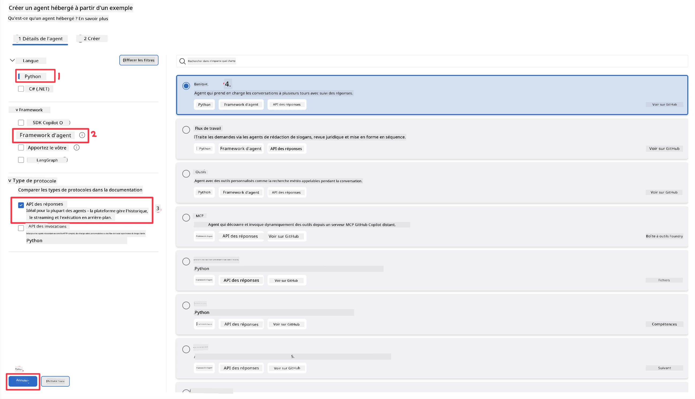
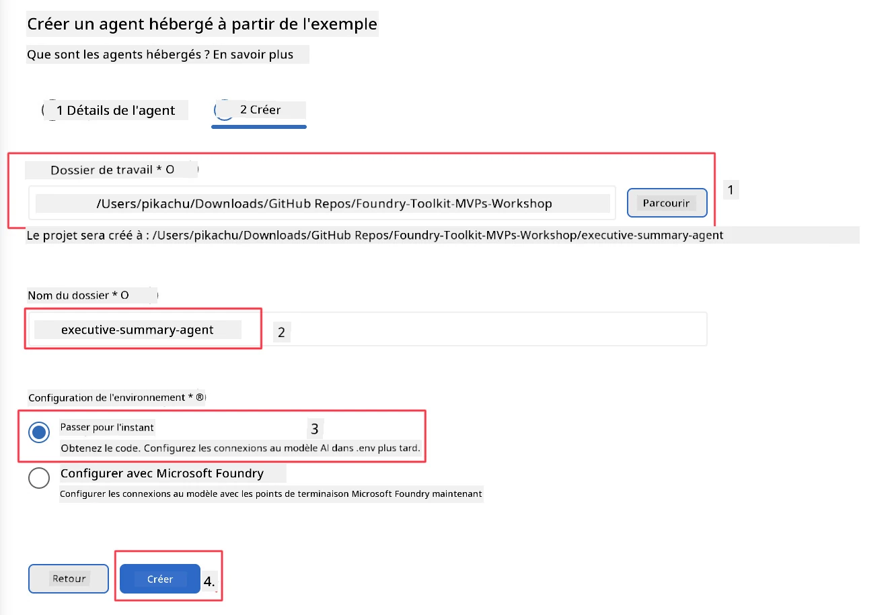

# Module 2 - Créer un nouvel agent hébergé

⏱️ ~5 min

Dans ce module, vous utilisez Foundry Toolkit pour **générer la structure d'un projet d'agent hébergé**. Le générateur crée la structure complète du projet - `agent.yaml`, `main.py`, `Dockerfile`, `requirements.txt`, et la configuration de débogage de VS Code - afin que vous puissiez vous concentrer sur la personnalisation du comportement de l’agent.

> **Concept clé :** Le dossier `agent/` dans ce laboratoire est un exemple de ce que Foundry Toolkit génère. Vous ne rédigez pas ces fichiers de zéro.

### Processus de l'assistant de génération

```mermaid
flowchart LR
    A["Command Palette:
    Create new Hosted Agent"] --> B["Language:
    Python"]
    B --> C["API type:
    Response API"]
    C --> D["Template:
    Basic - Agent Framework"]
    D --> E["Sélectionner un modèle"]
    E --> F["Workspace folder
    & agent name"]
    F --> G["Projet généré"]

    style A fill:#4A90D9,color:#fff
    style B fill:#7B68EE,color:#fff
    style C fill:#7B68EE,color:#fff
    style D fill:#7B68EE,color:#fff
    style E fill:#7B68EE,color:#fff
    style F fill:#7B68EE,color:#fff
    style G fill:#27AE60,color:#fff
```



---

## Étape 1 : Ouvrir l’assistant de création d’un agent hébergé

1. Appuyez sur `Ctrl+Shift+P` pour ouvrir la **palette de commandes**.
2. Tapez : **Foundry Toolkit : Créer un nouvel agent hébergé** et sélectionnez-le.

> **Alternative : Création via Foundry Portal**
> Si vous préférez le navigateur, vous pouvez créer votre projet sur [https://ai.azure.com](https://ai.azure.com). Une fois le projet provisionné, revenez à VS Code et utilisez la barre latérale **Foundry Toolkit** pour vous y connecter.

> **Alternative :** Cliquez sur l’icône **+** à côté de **Hosted Agents (Preview)** dans la barre latérale Foundry Toolkit.

## Étape 2 : Choisissez les réglages



1. Dans la section de navigation/options à gauche, sélectionnez ce qui suit :

| Menu | Sélection | Remarques |
|--------|-----------|-------|
| **Langue** | Python | C# est également pris en charge |
| **Framework** | Agent Framework | Point de départ simple utilisant le SDK Agent Framework |
| **Type d’API** | Response API | `POST /responses` – conversationnel, avec historique géré par la plateforme |
| **Modèle** | Basic | Point de départ simple utilisant le SDK Agent Framework |

2. Une fois sélectionné, cliquez sur **Suivant**



3. Dans la fenêtre suivante, sélectionnez ce qui suit :

| Menu | Sélection | Remarques |
|--------|-----------|-------|
| **Dossier de travail** | Choisissez un dossier cible | ex. `/workspace/Foundry_Toolkit_for_VSCode_Lab/` ou un sous-dossier de ce dépôt |
| **Nom de l’agent** | Entrez un nom | ex. `executive-summary-agent` |
| **Configuration de l’environnement** | passer la configuration pour l’instant |  |

Cliquez sur **créer** pour créer notre agent. Un nouveau dossier sera créé avec le nom de l’agent hébergé.

## Étape 3 : Inspecter le projet généré

Après la génération, vérifiez que vous voyez ces fichiers dans l’Explorateur (`Ctrl+Shift+E`) :

```
📂 my-agent/
├── .env                ← Environment variables (placeholders)
├── .vscode/
│   ├── launch.json     ← Debug config (F5 → run + Agent Inspector)
│   └── tasks.json      ← VS Code task definitions
├── agent.yaml          ← Agent definition (kind: hosted)
├── Dockerfile          ← Container config for deployment
├── main.py             ← Agent entry point (your main code)
└── requirements.txt    ← Python dependencies
```

### Explication des fichiers clés

| Fichier | Objectif |
|------|---------|
| `agent.yaml` | Déclare l’agent comme `kind: hosted`, mappe les variables d’environnement, définit le protocole `/responses` |
| `main.py` | Crée un `FoundryChatClient` → l’enveloppe dans un `Agent` avec des instructions → sert via `ResponsesHostServer` sur le port 8088 |
| `Dockerfile` | Utilise `python:3.12-slim`, installe les dépendances, expose le port 8088, exécute `main.py` |
| `requirements.txt` | `agent-framework-foundry`, `agent-framework-foundry-hosting`, `mcp`, `debugpy` |

> **Important :** Ouvrez directement le dossier de l’agent généré dans VS Code (le dossier `agent/` lui-même) afin que `.vscode/launch.json` et `tasks.json` fonctionnent correctement pour le débogage F5.

---

### ✅ Points de contrôle

- [ ] Projet généré avec tous les fichiers attendus
- [ ] `agent.yaml` affiche `kind: hosted` et `protocol: responses`
- [ ] `main.py` importe `Agent`, `FoundryChatClient`, `ResponsesHostServer`
- [ ] Le dossier de l’agent est ouvert dans VS Code en tant que racine de l’espace de travail

---

**Précédent :** [01 - Configuration](01-setup.md) · **Suivant :** [03 - Configurer & coder →](03-configure-and-code.md)

---

<!-- CO-OP TRANSLATOR DISCLAIMER START -->
**Avertissement** :
Ce document a été traduit à l'aide du service de traduction automatique [Co-op Translator](https://github.com/Azure/co-op-translator). Bien que nous nous efforçions d'assurer l'exactitude, veuillez noter que les traductions automatisées peuvent contenir des erreurs ou des inexactitudes. Le document original dans sa langue native doit être considéré comme la source faisant autorité. Pour les informations critiques, il est recommandé de recourir à une traduction professionnelle réalisée par un humain. Nous ne saurions être tenus responsables des malentendus ou erreurs d'interprétation découlant de l'utilisation de cette traduction.
<!-- CO-OP TRANSLATOR DISCLAIMER END -->