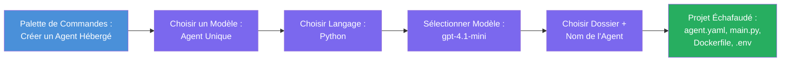

# Module 3 - Créer un nouvel agent hébergé (Généré automatiquement par l’extension Foundry)

Dans ce module, vous utilisez l’extension Microsoft Foundry pour **générer un nouveau projet d’[agent hébergé](https://learn.microsoft.com/azure/foundry/agents/concepts/hosted-agents)**. L’extension crée toute la structure du projet pour vous – incluant `agent.yaml`, `main.py`, `Dockerfile`, `requirements.txt`, un fichier `.env` et une configuration de débogage VS Code. Après la génération, vous personnalisez ces fichiers avec les instructions, outils et configurations de votre agent.

> **Concept clé :** Le dossier `agent/` dans ce laboratoire est un exemple de ce que l’extension Foundry génère quand vous exécutez cette commande de génération. Vous ne créez pas ces fichiers à partir de zéro – l’extension les crée, puis vous les modifiez.

### Flux de l’assistant de génération


---

## Étape 1 : Ouvrir l’assistant de création d’agent hébergé

1. Appuyez sur `Ctrl+Shift+P` pour ouvrir la **Palette de commandes**.
2. Tapez : **Microsoft Foundry : Créer un nouvel agent hébergé** et sélectionnez-le.
3. L’assistant de création d’agent hébergé s’ouvre.

> **Chemin alternatif :** Vous pouvez également accéder à cet assistant depuis la barre latérale Microsoft Foundry → cliquez sur l’icône **+** à côté de **Agents** ou faites un clic droit et sélectionnez **Créer un nouvel agent hébergé**.

---

## Étape 2 : Choisir votre modèle

L’assistant vous demande de sélectionner un modèle. Vous verrez des options telles que :

| Modèle | Description | Quand l’utiliser |
|--------|-------------|-----------------|
| **Agent unique** | Un agent avec son propre modèle, instructions et outils optionnels | Cet atelier (Lab 01) |
| **Workflow multi-agent** | Plusieurs agents collaborant en séquence | Lab 02 |

1. Sélectionnez **Agent unique**.
2. Cliquez sur **Suivant** (ou la sélection se fait automatiquement).

---

## Étape 3 : Choisir le langage de programmation

1. Sélectionnez **Python** (recommandé pour cet atelier).
2. Cliquez sur **Suivant**.

> **Le C# est aussi supporté** si vous préférez .NET. La structure générée est similaire (utilise `Program.cs` au lieu de `main.py`).

---

## Étape 4 : Sélectionner votre modèle

1. L’assistant affiche les modèles déployés dans votre projet Foundry (depuis le Module 2).
2. Sélectionnez le modèle que vous avez déployé – par exemple **gpt-4.1-mini**.
3. Cliquez sur **Suivant**.

> Si vous ne voyez aucun modèle, retournez au [Module 2](02-create-foundry-project.md) et déployez-en un d’abord.

---

## Étape 5 : Choisir l’emplacement du dossier et le nom de l’agent

1. Une fenêtre de dialogue s’ouvre – choisissez un **dossier cible** où le projet sera créé. Pour cet atelier :
   - Si vous partez de zéro : choisissez n’importe quel dossier (par ex., `C:\Projects\my-agent`)
   - Si vous travaillez dans le dépôt de l’atelier : créez un nouveau sous-dossier sous `workshop/lab01-single-agent/agent/`
2. Entrez un **nom** pour l’agent hébergé (par ex., `executive-summary-agent` ou `my-first-agent`).
3. Cliquez sur **Créer** (ou appuyez sur Entrée).

---

## Étape 6 : Attendre la fin de la génération

1. VS Code ouvre une **nouvelle fenêtre** avec le projet généré.
2. Attendez quelques secondes que le projet soit complètement chargé.
3. Vous devriez voir les fichiers suivants dans le panneau Explorateur (`Ctrl+Shift+E`) :

```
📂 my-first-agent/
├── .env                ← Environment variables (auto-generated with placeholders)
├── .vscode/
│   └── launch.json     ← Debug configuration (F5 to run + Agent Inspector)
├── agent.yaml          ← Agent definition (kind: hosted)
├── Dockerfile          ← Container configuration for deployment
├── main.py             ← Agent entry point (your main code file)
└── requirements.txt    ← Python dependencies
```

> **C’est la même structure que le dossier `agent/`** dans ce laboratoire. L’extension Foundry génère ces fichiers automatiquement – vous n’avez pas besoin de les créer manuellement.

> **Note atelier :** Dans ce dépôt d’atelier, le dossier `.vscode/` est à la **racine de l’espace de travail** (pas dans chaque projet). Il contient un `launch.json` et un `tasks.json` partagés avec deux configurations de débogage – **"Lab01 - Single Agent"** et **"Lab02 - Multi-Agent"** – chacun pointant vers le `cwd` correct du laboratoire. Quand vous appuyez sur F5, sélectionnez la configuration correspondant au laboratoire sur lequel vous travaillez dans la liste déroulante.

---

## Étape 7 : Comprendre chaque fichier généré

Prenez un moment pour inspecter chaque fichier créé par l’assistant. Les comprendre est important pour le Module 4 (personnalisation).

### 7.1 `agent.yaml` - Définition de l’agent

Ouvrez `agent.yaml`. Il ressemble à ceci :

```yaml
# yaml-language-server: $schema=https://raw.githubusercontent.com/microsoft/AgentSchema/refs/heads/main/schemas/v1.0/ContainerAgent.yaml

kind: hosted
name: my-first-agent
description: >
  A hosted agent deployed to Microsoft Foundry Agent Service.
metadata:
  authors:
    - Microsoft
  tags:
    - Azure AI AgentServer
    - Microsoft Agent Framework
    - Hosted Agent
protocols:
  - protocol: responses
    version: v1
environment_variables:
  - name: AZURE_AI_PROJECT_ENDPOINT
    value: ${PROJECT_ENDPOINT}
  - name: AZURE_AI_MODEL_DEPLOYMENT_NAME
    value: ${MODEL_DEPLOYMENT_NAME}
dockerfile_path: Dockerfile
resources:
  cpu: '0.25'
  memory: 0.5Gi
```

**Champs clés :**

| Champ | But |
|-------|-----|
| `kind: hosted` | Indique que c’est un agent hébergé (basé sur un conteneur, déployé sur le [Foundry Agent Service](https://learn.microsoft.com/azure/foundry/agents/overview)) |
| `protocols: responses v1` | L’agent expose un endpoint HTTP `/responses` compatible OpenAI |
| `environment_variables` | Associe les valeurs du fichier `.env` aux variables d’environnement du conteneur au moment du déploiement |
| `dockerfile_path` | Indique le Dockerfile utilisé pour construire l’image du conteneur |
| `resources` | Allocation CPU et mémoire pour le conteneur (0,25 CPU, 0,5Gi mémoire) |

### 7.2 `main.py` - Point d’entrée de l’agent

Ouvrez `main.py`. C’est le fichier Python principal où vit la logique de votre agent. Le squelette inclut :

```python
from agent_framework.azure import AzureAIAgentClient
from azure.ai.agentserver.agentframework import from_agent_framework
from azure.identity.aio import DefaultAzureCredential
```

**Importations clés :**

| Import | But |
|--------|-----|
| `AzureAIAgentClient` | Se connecte à votre projet Foundry et crée des agents via `.as_agent()` |
| [`DefaultAzureCredential`](https://learn.microsoft.com/azure/developer/python/sdk/authentication/credential-chains#defaultazurecredential-overview) | Gère l’authentification (Azure CLI, connexion VS Code, identité managée ou principal de service) |
| `from_agent_framework` | Enveloppe l’agent en serveur HTTP exposant le endpoint `/responses` |

Le flux principal est :
1. Créer uncredential → créer un client → appeler `.as_agent()` pour obtenir un agent (gestionnaire de contexte async) → l’envelopper en serveur → exécuter

### 7.3 `Dockerfile` - Image du conteneur

```dockerfile
FROM python:3.14-slim

WORKDIR /app

COPY ./ .

RUN pip install --upgrade pip && \
    if [ -f requirements.txt ]; then \
        pip install -r requirements.txt; \
    else \
        echo "No requirements.txt found" >&2; exit 1; \
    fi

EXPOSE 8088

CMD ["python", "main.py"]
```

**Détails clés :**
- Utilise `python:3.14-slim` comme image de base.
- Copie tous les fichiers du projet dans `/app`.
- Met à jour `pip`, installe les dépendances du `requirements.txt`, et échoue rapidement si ce fichier manque.
- **Expose le port 8088** – c’est le port requis pour les agents hébergés. Ne le changez pas.
- Démarre l’agent avec `python main.py`.

### 7.4 `requirements.txt` - Dépendances

```
agent-framework-azure-ai==1.0.0rc3
agent-framework-core==1.0.0rc3
azure-ai-agentserver-agentframework==1.0.0b16
azure-ai-agentserver-core==1.0.0b16
debugpy
agent-dev-cli
```

| Package | But |
|---------|-----|
| `agent-framework-azure-ai` | Intégration Azure AI pour le Microsoft Agent Framework |
| `agent-framework-core` | Runtime principal pour construire des agents (inclut `python-dotenv`) |
| `azure-ai-agentserver-agentframework` | Runtime serveur agent hébergé pour Foundry Agent Service |
| `azure-ai-agentserver-core` | Abstractions cœur du serveur agent |
| `debugpy` | Support débogage Python (permet le débogage F5 dans VS Code) |
| `agent-dev-cli` | CLI de développement local pour tester les agents (utilisé par la configuration debug/run) |

---

## Comprendre le protocole de l’agent

Les agents hébergés communiquent via le protocole **OpenAI Responses API**. En fonctionnement (local ou cloud), l’agent expose un unique endpoint HTTP :

```
POST http://localhost:8088/responses
Content-Type: application/json

{
  "input": "Your prompt here",
  "stream": false
}
```

Le Foundry Agent Service appelle ce endpoint pour envoyer les invites utilisateur et recevoir les réponses de l’agent. C’est le même protocole que l’API OpenAI, votre agent est donc compatible avec tout client supportant le format OpenAI Responses.

---

### Point de contrôle

- [ ] L’assistant de génération s’est terminé avec succès et une **nouvelle fenêtre VS Code** s’est ouverte
- [ ] Vous voyez les 5 fichiers : `agent.yaml`, `main.py`, `Dockerfile`, `requirements.txt`, `.env`
- [ ] Le fichier `.vscode/launch.json` existe (active le débogage F5 – dans cet atelier il est à la racine avec des configs spécifiques au labo)
- [ ] Vous avez lu chaque fichier et comprenez leur rôle
- [ ] Vous comprenez que le port `8088` est requis et que le endpoint `/responses` est le protocole

---

**Précédent :** [02 - Créer un projet Foundry](02-create-foundry-project.md) · **Suivant :** [04 - Configurer & coder →](04-configure-and-code.md)

---

<!-- CO-OP TRANSLATOR DISCLAIMER START -->
**Avertissement** :  
Ce document a été traduit à l’aide du service de traduction automatique [Co-op Translator](https://github.com/Azure/co-op-translator). Bien que nous nous efforcions d’assurer l’exactitude, veuillez noter que les traductions automatiques peuvent contenir des erreurs ou des inexactitudes. Le document original dans sa langue d’origine doit être considéré comme la source faisant foi. Pour les informations critiques, une traduction professionnelle humaine est recommandée. Nous ne sommes pas responsables des malentendus ou mauvaises interprétations résultant de l’utilisation de cette traduction.
<!-- CO-OP TRANSLATOR DISCLAIMER END -->