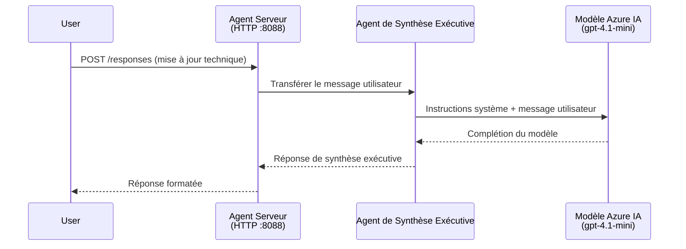
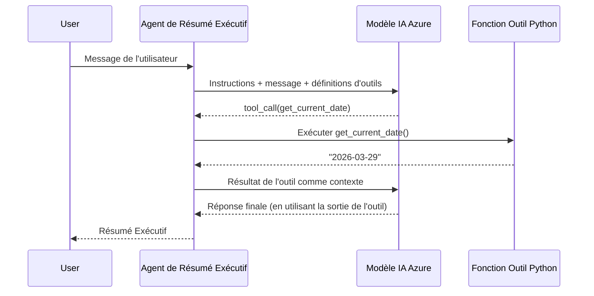

# Module 4 - Configurer les instructions, l'environnement & installer les dépendances

Dans ce module, vous personnalisez les fichiers d'agent générés automatiquement dans le Module 3. C'est ici que vous transformez le squelette générique en **votre** agent - en écrivant des instructions, en configurant des variables d'environnement, en ajoutant éventuellement des outils, et en installant des dépendances.

> **Rappel :** L'extension Foundry a généré automatiquement vos fichiers de projet. Vous allez maintenant les modifier. Consultez le dossier [`agent/`](../../../../../workshop/lab01-single-agent/agent) pour un exemple complet d'agent personnalisé.

---

## Comment les composants s'articulent ensemble

### Cycle de vie de la requête (agent unique)


> **Avec outils :** Si l'agent a des outils enregistrés, le modèle peut retourner un appel d'outil au lieu d'une complétion directe. Le framework exécute l'outil localement, renvoie le résultat au modèle, puis le modèle génère la réponse finale.


---

## Étape 1 : Configurer les variables d'environnement

Le squelette a créé un fichier `.env` avec des valeurs factices. Vous devez remplir les vraies valeurs fournies dans le Module 2.

1. Dans votre projet généré, ouvrez le fichier **`.env`** (il se trouve à la racine du projet).
2. Remplacez les valeurs factices par vos véritables informations de projet Foundry :

   ```env
   PROJECT_ENDPOINT=https://<your-account>.services.ai.azure.com/api/projects/<your-project>
   MODEL_DEPLOYMENT_NAME=gpt-4.1-mini
   ```

3. Enregistrez le fichier.

### Où trouver ces valeurs

| Valeur | Comment la trouver |
|--------|-------------------|
| **Point de terminaison du projet** | Ouvrez la barre latérale **Microsoft Foundry** dans VS Code → cliquez sur votre projet → l'URL du point de terminaison est affichée dans la vue détaillée. Elle ressemble à `https://<account-name>.services.ai.azure.com/api/projects/<project-name>` |
| **Nom de déploiement du modèle** | Dans la barre latérale Foundry, développez votre projet → regardez sous **Models + endpoints** → le nom est listé à côté du modèle déployé (ex. `gpt-4.1-mini`) |

> **Sécurité :** Ne validez jamais le fichier `.env` dans le contrôle de version. Il est déjà inclus par défaut dans `.gitignore`. S'il ne l'est pas, ajoutez-le :
> ```
> .env
> ```

### Flux des variables d'environnement

La chaîne de correspondance est : `.env` → `main.py` (lu via `os.getenv`) → `agent.yaml` (transfère vers les variables d'env du conteneur au moment du déploiement).

Dans `main.py`, le squelette lit ces valeurs ainsi :

```python
PROJECT_ENDPOINT = os.getenv("AZURE_AI_PROJECT_ENDPOINT") or os.getenv("PROJECT_ENDPOINT")
MODEL_DEPLOYMENT_NAME = os.getenv("AZURE_AI_MODEL_DEPLOYMENT_NAME", os.getenv("MODEL_DEPLOYMENT_NAME", "gpt-4.1-mini"))
```

Les deux variables `AZURE_AI_PROJECT_ENDPOINT` et `PROJECT_ENDPOINT` sont acceptées (le fichier `agent.yaml` utilise le préfixe `AZURE_AI_*`).

---

## Étape 2 : Rédiger les instructions de l'agent

C'est l'étape de personnalisation la plus importante. Les instructions définissent la personnalité, le comportement, le format de sortie et les contraintes de sécurité de votre agent.

1. Ouvrez `main.py` dans votre projet.
2. Trouvez la chaîne d'instructions (le squelette inclut une instruction générique par défaut).
3. Remplacez-la par des instructions détaillées et structurées.

### Ce que doivent contenir de bonnes instructions

| Composant | But | Exemple |
|-----------|-----|---------|
| **Rôle** | Ce qu'est l'agent et ce qu'il fait | "Vous êtes un agent de résumé exécutif" |
| **Audience** | Pour qui sont destinées les réponses | "Les cadres supérieurs avec peu de connaissances techniques" |
| **Définition des entrées** | Types de requêtes traitées | "Rapports d'incidents techniques, mises à jour opérationnelles" |
| **Format de sortie** | Structure exacte des réponses | "Résumé Exécutif : - Ce qui s'est passé : ... - Impact business : ... - Prochaine étape : ..." |
| **Règles** | Contraintes et conditions de refus | "NE PAS ajouter d'informations non fournies" |
| **Sécurité** | Prévenir les usages abusifs et hallucinations | "Si l'entrée est floue, demandez des précisions" |
| **Exemples** | Paires entrée/sortie pour orienter le comportement | Inclure 2-3 exemples avec différentes entrées |

### Exemple : Instructions d'un agent de résumé exécutif

Voici les instructions utilisées dans le [`agent/main.py`](../../../../../workshop/lab01-single-agent/agent/main.py) du workshop :

```python
AGENT_INSTRUCTIONS = """You are an "Explain Like I'm an Executive" agent.

Purpose:
Your job is to translate complex technical or operational information into
clear, concise, and outcome-focused summaries that can be easily understood
by non-technical executives.

Audience:
Senior leaders with limited technical background who care about impact,
risk, and what happens next.

What you must do:
- Rephrase the input so it is understandable to a non-technical audience
- Prioritize clarity, brevity, and outcomes over technical accuracy
- Remove technical jargon, logs, metrics, stack traces, and deep root-cause details
- Translate technical causes into simple cause-and-effect statements
- Explicitly call out business impact
- Always include a clear next step or action
- Maintain a neutral, factual, and calm executive tone
- Do NOT add new facts or speculate beyond the input

Standard Output Structure (always use this wording):

Executive Summary:
- What happened: <plain-language description>
- Business impact: <clear, non-technical impact>
- Next step: <clear action or mitigation>

Rules:
- Keep responses under 100 words
- Do NOT add facts beyond the input
- If input is unclear, ask for clarification
"""
```

4. Remplacez la chaîne d'instructions existante dans `main.py` par vos instructions personnalisées.
5. Enregistrez le fichier.

---

## Étape 3 : (Optionnel) Ajouter des outils personnalisés

Les agents hébergés peuvent exécuter des **fonctions Python locales** comme [outils](https://learn.microsoft.com/azure/foundry/agents/concepts/tool-catalog). C'est un avantage clé des agents hébergés basés sur le code par rapport aux agents uniquement par invite - votre agent peut exécuter n'importe quelle logique serveur.

### 3.1 Définir une fonction outil

Ajoutez une fonction outil dans `main.py` :

```python
from agent_framework import tool

@tool
def get_current_date() -> str:
    """Returns the current date in YYYY-MM-DD format."""
    from datetime import date
    return str(date.today())
```

Le décorateur `@tool` transforme une fonction Python standard en outil pour l'agent. La docstring devient la description de l'outil visible pour le modèle.

### 3.2 Enregistrer l'outil auprès de l'agent

Lors de la création de l'agent via le gestionnaire de contexte `.as_agent()`, passez l'outil dans le paramètre `tools` :

```python
async with AzureAIAgentClient(
    project_endpoint=PROJECT_ENDPOINT,
    model_deployment_name=MODEL_DEPLOYMENT_NAME,
    credential=credential,
).as_agent(
    name="my-agent",
    instructions=AGENT_INSTRUCTIONS,
    tools=[get_current_date],
) as agent:
    server = from_agent_framework(agent)
    await server.run_async()
```

### 3.3 Fonctionnement des appels d'outil

1. L'utilisateur envoie une invite.
2. Le modèle décide si un outil est nécessaire (en fonction de l'invite, des instructions, et des descriptions d'outil).
3. Si un outil est requis, le framework appelle votre fonction Python localement (à l'intérieur du conteneur).
4. La valeur retournée par l'outil est renvoyée au modèle comme contexte.
5. Le modèle génère la réponse finale.

> **Les outils s'exécutent côté serveur** - ils tournent dans votre conteneur, pas dans le navigateur de l'utilisateur ou le modèle. Cela signifie que vous pouvez accéder aux bases de données, API, systèmes de fichiers ou n'importe quelle bibliothèque Python.

---

## Étape 4 : Créer et activer un environnement virtuel

Avant d'installer les dépendances, créez un environnement Python isolé.

### 4.1 Créer l'environnement virtuel

Ouvrez un terminal dans VS Code (`` Ctrl+` ``) et lancez :

```powershell
python -m venv .venv
```

Cela crée un dossier `.venv` dans votre répertoire de projet.

### 4.2 Activer l'environnement virtuel

**PowerShell (Windows) :**

```powershell
.\.venv\Scripts\Activate.ps1
```

**Invite de commandes (Windows) :**

```cmd
.venv\Scripts\activate.bat
```

**macOS/Linux (Bash) :**

```bash
source .venv/bin/activate
```

Vous devriez voir `(.venv)` apparaître au début du prompt du terminal, indiquant que l'environnement virtuel est activé.

### 4.3 Installer les dépendances

Avec l'environnement virtuel activé, installez les paquets requis :

```powershell
pip install -r requirements.txt
```

Cela installe :

| Package | Utilité |
|---------|---------|
| `agent-framework-azure-ai==1.0.0rc3` | Intégration Azure AI pour le [Microsoft Agent Framework](https://learn.microsoft.com/agent-framework/overview/) |
| `agent-framework-core==1.0.0rc3` | Runtime de base pour construire des agents (inclut `python-dotenv`) |
| `azure-ai-agentserver-agentframework==1.0.0b16` | Runtime serveur pour agents hébergés du [Foundry Agent Service](https://learn.microsoft.com/azure/foundry/agents/overview) |
| `azure-ai-agentserver-core==1.0.0b16` | Abstractions cœur du serveur d'agents |
| `debugpy` | Debugging Python (active le débogage F5 dans VS Code) |
| `agent-dev-cli` | CLI de développement local pour tester les agents |

### 4.4 Vérifier l'installation

```powershell
pip list | Select-String "agent-framework|agentserver"
```

Sortie attendue :
```
agent-framework-azure-ai   1.0.0rc3
agent-framework-core       1.0.0rc3
azure-ai-agentserver-agentframework 1.0.0b16
azure-ai-agentserver-core  1.0.0b16
```

---

## Étape 5 : Vérifier l'authentification

L'agent utilise [`DefaultAzureCredential`](https://learn.microsoft.com/azure/developer/python/sdk/authentication/credential-chains#defaultazurecredential-overview) qui essaie plusieurs méthodes d'authentification dans cet ordre :

1. **Variables d'environnement** - `AZURE_CLIENT_ID`, `AZURE_TENANT_ID`, `AZURE_CLIENT_SECRET` (principal de service)
2. **Azure CLI** - récupère votre session `az login`
3. **VS Code** - utilise le compte connecté dans VS Code
4. **Identité gérée** - utilisée lors d'une exécution dans Azure (au moment du déploiement)

### 5.1 Vérification pour développement local

Au moins une de ces options doit fonctionner :

**Option A : Azure CLI (recommandé)**

```powershell
az account show --query "{name:name, id:id}" --output table
```

Attendu : Affiche le nom et l'ID de votre abonnement.

**Option B : Connexion VS Code**

1. Regardez en bas à gauche dans VS Code l'icône **Comptes**.
2. Si vous voyez votre nom de compte, vous êtes authentifié.
3. Sinon, cliquez sur l'icône → **Se connecter pour utiliser Microsoft Foundry**.

**Option C : Principal de service (pour CI/CD)**

```powershell
$env:AZURE_TENANT_ID = "<your-tenant-id>"
$env:AZURE_CLIENT_ID = "<your-client-id>"
$env:AZURE_CLIENT_SECRET = "<your-client-secret>"
```

### 5.2 Problème d'authentification courant

Si vous êtes connecté à plusieurs comptes Azure, assurez-vous que le bon abonnement est sélectionné :

```powershell
az account set --subscription "<your-subscription-id>"
```

---

### Point de contrôle

- [ ] Le fichier `.env` contient des `PROJECT_ENDPOINT` et `MODEL_DEPLOYMENT_NAME` valides (pas des valeurs factices)
- [ ] Les instructions de l'agent sont personnalisées dans `main.py` - elles définissent rôle, audience, format de sortie, règles et contraintes de sécurité
- [ ] (Optionnel) Des outils personnalisés sont définis et enregistrés
- [ ] L'environnement virtuel est créé et activé (`(.venv)` visible dans le prompt terminal)
- [ ] `pip install -r requirements.txt` s'exécute sans erreurs
- [ ] `pip list | Select-String "azure-ai-agentserver"` affiche le paquet installé
- [ ] L'authentification est valide - `az account show` renvoie votre abonnement OU vous êtes connecté dans VS Code

---

**Précédent :** [03 - Créer un agent hébergé](03-create-hosted-agent.md) · **Suivant :** [05 - Tester localement →](05-test-locally.md)

---

<!-- CO-OP TRANSLATOR DISCLAIMER START -->
**Avis de non-responsabilité** :  
Ce document a été traduit à l'aide du service de traduction automatique [Co-op Translator](https://github.com/Azure/co-op-translator). Bien que nous fassions de notre mieux pour garantir l'exactitude, veuillez noter que les traductions automatiques peuvent contenir des erreurs ou des inexactitudes. Le document original dans sa langue d'origine doit être considéré comme la source faisant foi. Pour les informations critiques, une traduction professionnelle humaine est recommandée. Nous déclinons toute responsabilité en cas de malentendus ou de mauvaises interprétations résultant de l'utilisation de cette traduction.
<!-- CO-OP TRANSLATOR DISCLAIMER END -->