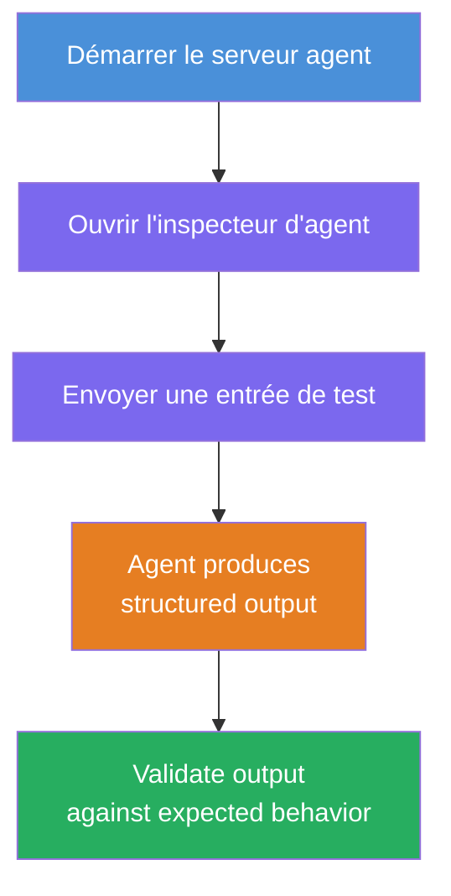
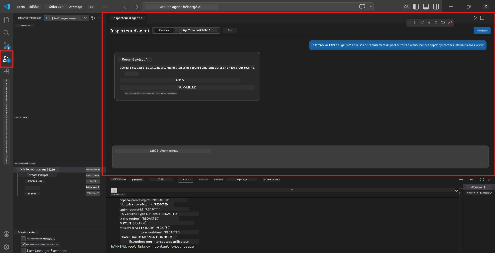
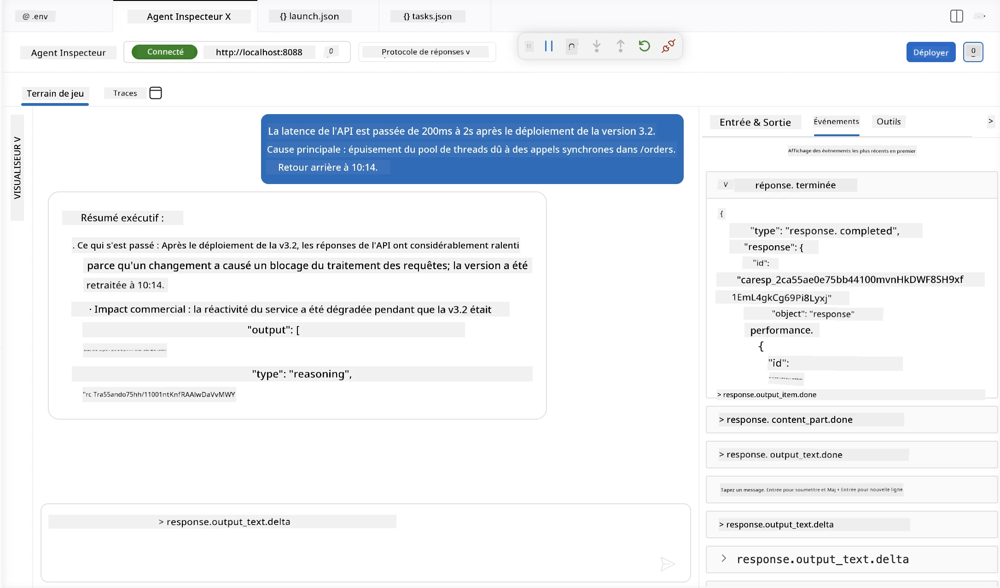

# Module 4 - Testez localement

⏱️ ~10 min

Dans ce module, vous exécutez votre agent localement et validez qu'il fonctionne correctement en utilisant des **tests fonctionnels du chemin heureux**. Vous utiliserez l’Agent Inspector (interface visuelle) ou des appels HTTP directs pour confirmer que l’agent produit des réponses structurées et précises.

### Flux de test local



---

## Option 1 : Appuyez sur F5 - Débogage avec Agent Inspector (recommandé)

### Démarrer le débogueur

1. Ouvrez directement le dossier **executive-summary-agent/** dans VS Code (`Fichier → Ouvrir un dossier`).
2. Ouvrez le panneau **Exécuter et déboguer** (`Ctrl+Maj+D`).
3. Sélectionnez **Debug Local Agent Server** dans la liste déroulante.
4. Appuyez sur **F5** (ou cliquez sur ▶ Démarrer le débogage).

> ⚠️ **Important : Sélectionnez votre interpréteur Python**
> Si vous obtenez une erreur "ModuleNotFoundError" ou si le débogueur ne démarre pas, vous devez indiquer à VS Code d’utiliser votre environnement virtuel :
  > 1. Appuyez sur `Ctrl+Maj+P` → tapez **Python: Sélectionner l’interpréteur**.
  > 2. Sélectionnez l’interpréteur situé dans le dossier `.venv` de votre projet (par exemple, `.\.venv\Scripts\python.exe` sur Windows).
  > 3. Redémarrez la session de débogage.
> Si vous avez toujours des erreurs, mettez à jour manuellement votre fichier `tasks.json` de la manière suivante :
  > 1. Allez dans le fichier `.vscode/tasks.json`
  > 2. Trouvez la commande intitulée : `Run Agent/Workflow HTTP Server`
  > 3. Modifiez la valeur de la commande comme suit : `"value": "${workspaceFolder}/.venv/bin/python",`

### Ce qui se passe

1. Le serveur HTTP démarre sur `http://localhost:8088/responses`.
2. Le panneau **Agent Inspector** s’ouvre automatiquement - une interface de chat visuelle pour tester.
3. Les points d’arrêt sont activés dans `main.py`.

Surveillez le Terminal pour :
```
Starting executive summary hosted agent
Executive agent server running on http://localhost:8088
```

> **Si Agent Inspector ne s’ouvre pas :** Appuyez sur `Ctrl+Maj+P` → **Foundry Toolkit : Ouvrir Agent Inspector**.



> *La capture d’écran peut montrer une ancienne marque 'AI TOOLKIT' d’une version précédente de l’extension.*

---

## Option 2 : Test via Terminal (alternative)

Lancez l’agent dans un terminal, envoyez les requêtes depuis un autre :

```bash
# Terminal 1 : Démarrer l'agent
cd executive-summary-agent/
source .venv/bin/activate
python main.py
```

```bash
# Terminal 2 : Envoyer un test (curl)
curl -sS -X POST http://localhost:8088/responses \
  -H "Content-Type: application/json" \
  -d '{"input": "The API latency increased due to thread pool exhaustion caused by sync calls in v3.2.", "stream": false}'
```

---

## Tests de scénario : Validation fonctionnelle du chemin heureux

Exécutez **les trois** scénarios ci-dessous. Ils valident que votre agent produit des résultats corrects et structurés pour des entrées réalistes.



### Scénario 1 : Incident IT - Pic de latence API

**Entrée :**
```
The API latency increased from 200ms to 2s after deploying v3.2.
Root cause: thread pool starvation from synchronous calls in /orders.
Rolled back at 10:14.
```

**Comportement attendu :**
- ✅ Suit la structure "Executive Summary" (Ce qui s’est passé / Impact business / Étape suivante)
- ✅ Pas de jargon technique (pas de "thread pool", pas de "/orders", pas de "v3.2")
- ✅ Impact business clairement indiqué (ex., les utilisateurs ont subi des délais)
- ✅ Contient une étape suivante (ex., correctif déployé, surveillance en place)

---

### Scénario 2 : Pipeline de données - Échec ETL

**Entrée :**
```
The nightly ETL job failed because the upstream schema changed. APAC dashboards show missing data.
```

**Comportement attendu :**
- ✅ Résume l’échec de la mise à jour des données en langage clair
- ✅ Mentionne l’impact sur le tableau de bord APAC
- ✅ Contient une étape de remédiation suivante
- ✅ NE mentionne PAS "ETL", "schéma" ou autres termes techniques

---

### Scénario 3 : Sécurité - Identifiant exposé

**Entrée :**
```
Static analysis flagged a hardcoded secret in the repository.
The secret may have been exposed in commit history.
```

**Comportement attendu :**
- ✅ Décrit un problème d’identifiant/sécurité en langage accessible aux cadres
- ✅ Signale un risque potentiel (accès non autorisé)
- ✅ Indique une action de remédiation (rotation d’identifiants, audit)
- ✅ NE comprend PAS des termes comme "analyse statique", "historique des commits" ou "codé en dur"

---

## Critères de validation

Pour chaque scénario, vérifiez :

| # | Critères | Condition de réussite |
|---|----------|---------------------|
| 1 | **Structure** | La réponse utilise le format "Executive Summary" avec les trois points |
| 2 | **Langage clair** | Pas de jargon technique qu’un cadre ne comprendrait pas |
| 3 | **Exactitude** | Le résumé reflète l’entrée - aucun détail fabriqué |
| 4 | **Concision** | La réponse fait moins de 100 mots |
| 5 | **Prochaine étape** | Une action claire ou une mesure d’atténuation est indiquée |

---

## Astuces pour déboguer

| Problème | Solution |
|---------|---------|
| L’agent ne démarre pas | Vérifiez les valeurs dans `.env`, assurez-vous que le venv est activé, exécutez `pip install -r requirements.txt` |
| Réponse vide ou générique | Vérifiez les instructions dans `main.py` - assurez-vous que le format de sortie est spécifié |
| La réponse contient du jargon | Renforcez les règles “supprimer les termes techniques” dans les instructions |
| Agent Inspector ne s’ouvre pas | `Ctrl+Maj+P` → **Foundry Toolkit : Ouvrir Agent Inspector** |
| Erreurs de modèle dans le Terminal | Vérifiez que `AZURE_AI_MODEL_DEPLOYMENT_NAME` correspond exactement (respect de la casse) |

---

### ✅ Point de contrôle

- [ ] L’agent démarre localement sans erreurs
- [ ] Agent Inspector s’ouvre et affiche une interface de chat (si utilisation de F5)
- [ ] **Scénario 1** (incident IT) - Executive Summary structuré, sans jargon
- [ ] **Scénario 2** (pipeline de données) - résumé pertinent avec impact business
- [ ] **Scénario 3** (alerte sécurité) - communication adaptée des risques
- [ ] Toutes les réponses suivent la structure de sortie définie

> **Sauvegardez vos réponses** (copie ou capture d’écran) - vous les comparerez avec les résultats cloud dans le Module 06.

---

**Précédent :** [03 - Configuration et codage](03-configure-and-code.md) · **Suivant :** [05 - Déployer vers Foundry →](05-deploy-to-foundry.md)

---

<!-- CO-OP TRANSLATOR DISCLAIMER START -->
**Avertissement** :
Ce document a été traduit à l'aide du service de traduction automatique [Co-op Translator](https://github.com/Azure/co-op-translator). Bien que nous nous efforçions d'assurer l'exactitude, veuillez noter que les traductions automatisées peuvent contenir des erreurs ou des inexactitudes. Le document original dans sa langue native doit être considéré comme la source faisant autorité. Pour les informations critiques, il est recommandé de recourir à une traduction professionnelle réalisée par un humain. Nous ne saurions être tenus responsables des malentendus ou erreurs d'interprétation découlant de l'utilisation de cette traduction.
<!-- CO-OP TRANSLATOR DISCLAIMER END -->