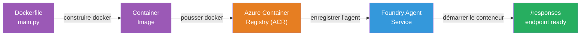
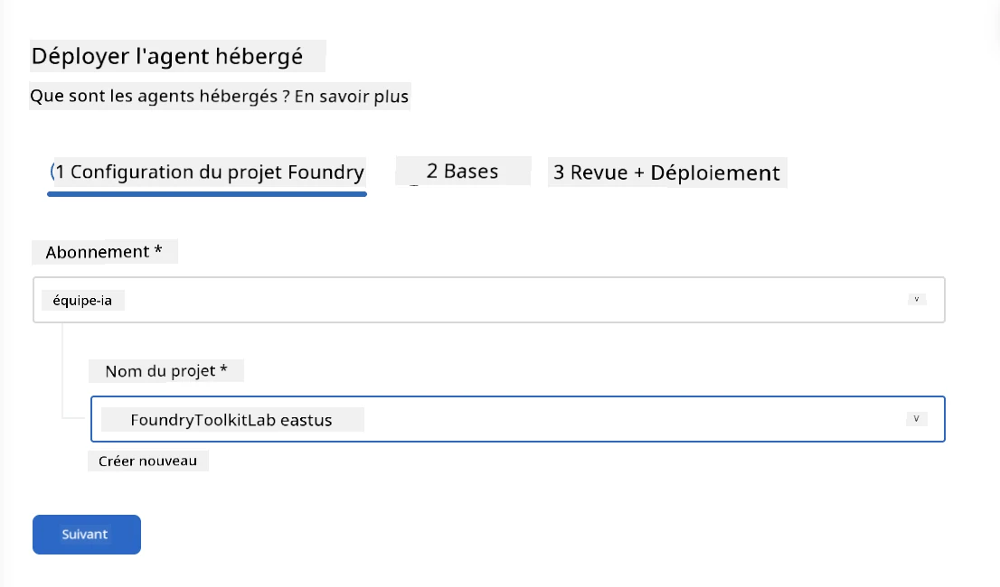
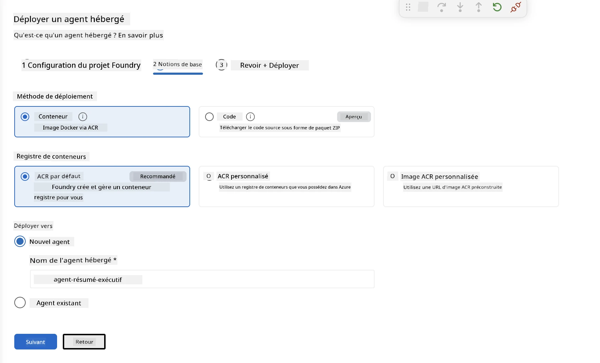
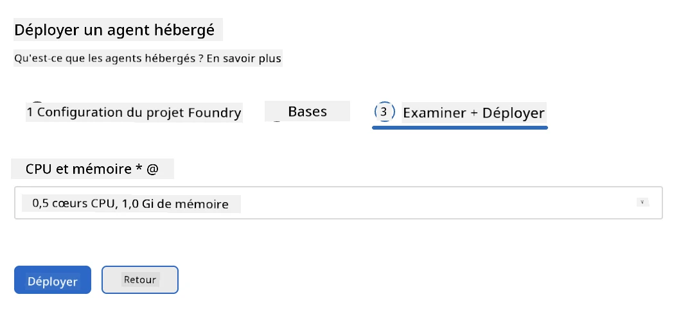
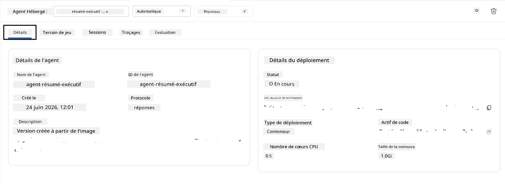

# Module 5 - Déployer vers le service Foundry Agent

⏱️ ~10 min

> ⚠️ **Utilisateurs du chemin B :** Ce module nécessite un abonnement Foundry. Si vous utilisez Foundry Local, passez au [Module 07 - Résumé](07-summary.md). Vous avez réussi le flux de travail de développement local !

Dans ce module, vous déployez votre agent testé localement sur Microsoft Foundry en tant qu'**Agent Hébergé**. Le déploiement construit une image de conteneur, la pousse vers Azure Container Registry, et démarre l'agent dans l'infrastructure gérée de Foundry.

### Pipeline de déploiement

---

## Vérification des prérequis

Avant de déployer, vérifiez :

- [ ] L'agent passe les 3 scénarios locaux du [Module 04](04-test-locally.md)
- [ ] Vous avez le rôle **Utilisateur Azure AI** au niveau du projet ([Module 01, Assigner RBAC](01-setup.md#deploy-a-model--assign-rbac))
- [ ] Vous êtes connecté à Azure dans VS Code (l’icône Comptes affiche votre nom)

---

## Étape 1 : Démarrer le déploiement

### Option A : Déployer depuis Agent Inspector (recommandé)

Si Agent Inspector est ouvert (après test) :
1. Cliquez sur le bouton **Déployer** en haut à droite (icône nuage ↑).

### Option B : Déployer depuis la palette de commandes

1. Appuyez sur `Ctrl+Shift+P` → **Foundry Toolkit : Déployer Agent Hébergé**.

---

## Étape 2 : Configurer le déploiement

L’assistant vous demande :

| Champ | Sélection |
|--------|-----------|
| **Abonnement** | Votre abonnement Azure |
| **Projet cible** | Votre projet Foundry (ex. `workshop-agents`) |

Cliquez sur **suivant** pour configurer votre agent.

| Champ | Sélection |
|--------|-----------|
| **Méthode de déploiement** | Conteneur |
| **Registre de conteneurs** | **ACR par défaut** (Microsoft Foundry en crée et gère un pour vous) |
| **Déployer sur** | Nouvel Agent (nom, `executive-summary-agent`) |

Cliquez sur **suivant** pour réviser et déployer votre agent.

| Champ | Sélection |
|--------|-----------|
| **CPU et mémoire** | **0.25 cœurs CPU, 0.5 Gi mémoire** (suffisant pour l’atelier) |

---

## Étape 3 : Déployer et surveiller

1. Cliquez sur **Déployer**.
2. Surveillez le panneau **Sortie** (sélectionnez **Microsoft Foundry** dans le menu déroulant).
3. Le déploiement suit ces étapes :
   - **Construction Docker** - construit le conteneur depuis votre Dockerfile
   - **Push Docker** - pousse l’image vers ACR (1–3 minutes au premier déploiement)
   - **Enregistrement de l’agent** - crée l’agent hébergé dans Foundry
   - **Démarrage du conteneur** - démarre avec une identité gérée par le système

4. Une notification apparaît à la fin :
   > **my-agent a été déployé avec succès.** `Afficher les logs` `Lancer l'agent`

5. Cliquez sur **Lancer l'agent** pour ouvrir l’Agent Playground.

### Valeurs du statut de déploiement

| Statut | Signification |
|--------|---------|
| **En cours** | Conteneur prêt, agent répond |
| **En attente** | Conteneur démarre - attendre 30–60 secondes |
| **Échoué** | Vérifiez les logs (voir dépannage ci-dessous) |

---

## Erreurs courantes de déploiement

| Erreur | Cause racine | Solution |
|-------|-----------|-----|
| Permission `agents/write` refusée | Rôle **Utilisateur Azure AI** manquant au niveau du projet | [Module 01, Assigner RBAC](01-setup.md#deploy-a-model--assign-rbac) |
| Docker non lancé | Docker Desktop non démarré | Démarrez Docker Desktop → vérifiez `docker info` |
| Autorisation ACR | L’identité gérée ne peut pas extraire l’image | Voir [Module 08 - Dépannage](08-troubleshooting.md) |

---

### ✅ Point de contrôle

- [ ] Déploiement terminé sans erreurs
- [ ] L’agent apparaît sous **Agents Hébergés (Aperçu)** dans la barre latérale Foundry
- [ ] Le statut du conteneur est **En cours**
- [ ] L’onglet Agent Playground est ouvert montrant les détails de l’agent et l’URL du point de terminaison

---

**Précédent :** [04 - Tester localement](04-test-locally.md) · **Suivant :** [06 - Vérifier dans Playground →](06-verify-in-playground.md)

---

<!-- CO-OP TRANSLATOR DISCLAIMER START -->
**Avertissement** :
Ce document a été traduit à l'aide du service de traduction automatique [Co-op Translator](https://github.com/Azure/co-op-translator). Bien que nous nous efforçions d'assurer l'exactitude, veuillez noter que les traductions automatisées peuvent contenir des erreurs ou des inexactitudes. Le document original dans sa langue native doit être considéré comme la source faisant autorité. Pour les informations critiques, il est recommandé de recourir à une traduction professionnelle réalisée par un humain. Nous ne saurions être tenus responsables des malentendus ou erreurs d'interprétation découlant de l'utilisation de cette traduction.
<!-- CO-OP TRANSLATOR DISCLAIMER END -->