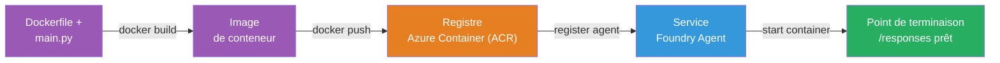
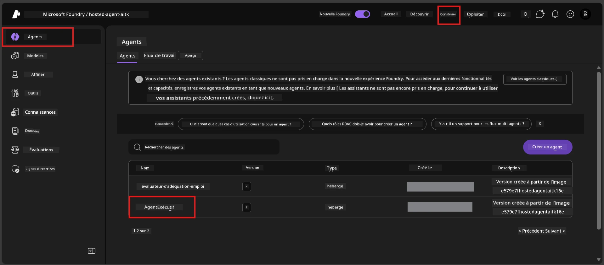

# Module 6 - Déployer sur Foundry Agent Service

Dans ce module, vous déployez votre agent testé localement sur Microsoft Foundry en tant que [**Agent Hébergé**](https://learn.microsoft.com/azure/foundry/agents/concepts/hosted-agents). Le processus de déploiement construit une image de conteneur Docker à partir de votre projet, la pousse vers [Azure Container Registry (ACR)](https://learn.microsoft.com/azure/container-registry/container-registry-intro), et crée une version hébergée de l’agent dans le [Foundry Agent Service](https://learn.microsoft.com/azure/foundry/agents/overview).

### Pipeline de déploiement


---

## Vérification des prérequis

Avant de déployer, vérifiez chaque élément ci-dessous. Passer ces étapes est la cause la plus courante des échecs de déploiement.

1. **L’agent réussit les tests de fumée locaux :**
   - Vous avez complété les 4 tests dans [Module 5](05-test-locally.md) et l’agent a répondu correctement.

2. **Vous avez le rôle [Azure AI User](https://learn.microsoft.com/azure/foundry/concepts/rbac-foundry#built-in-roles) :**
   - Celui-ci a été attribué dans [Module 2, Étape 3](02-create-foundry-project.md). Si vous n’êtes pas sûr, vérifiez maintenant :
   - Portail Azure → ressource **projet** Foundry → **Contrôle d’accès (IAM)** → onglet **Attributions de rôle** → cherchez votre nom → confirmez que **Azure AI User** est listé.

3. **Vous êtes connecté à Azure dans VS Code :**
   - Vérifiez l’icône Comptes en bas à gauche de VS Code. Votre nom de compte doit être visible.

4. **(Optionnel) Docker Desktop est en cours d’exécution :**
   - Docker n’est nécessaire que si l’extension Foundry vous demande une construction locale. Dans la plupart des cas, l’extension gère automatiquement les builds de conteneurs pendant le déploiement.
   - Si Docker est installé, vérifiez qu’il fonctionne : `docker info`

---

## Étape 1 : Démarrer le déploiement

Vous avez deux manières de déployer - les deux aboutissent au même résultat.

### Option A : Déployer depuis l’Agent Inspector (recommandé)

Si vous exécutez l’agent avec le débogueur (F5) et que l’Agent Inspector est ouvert :

1. Regardez en **haut à droite** du panneau Agent Inspector.
2. Cliquez sur le bouton **Déployer** (icône nuage avec une flèche vers le haut ↑).
3. L’assistant de déploiement s’ouvre.

### Option B : Déployer depuis la Command Palette

1. Appuyez sur `Ctrl+Shift+P` pour ouvrir la **Command Palette**.
2. Tapez : **Microsoft Foundry: Deploy Hosted Agent** et sélectionnez-le.
3. L’assistant de déploiement s’ouvre.

---

## Étape 2 : Configurer le déploiement

L’assistant de déploiement vous guide dans la configuration. Remplissez chaque invite :

### 2.1 Sélectionnez le projet cible

1. Un menu déroulant affiche vos projets Foundry.
2. Sélectionnez le projet que vous avez créé dans le Module 2 (par ex., `workshop-agents`).

### 2.2 Sélectionnez le fichier agent du conteneur

1. On vous demande de sélectionner le point d’entrée de l’agent.
2. Choisissez **`main.py`** (Python) – c’est le fichier que l’assistant utilise pour identifier votre projet agent.

### 2.3 Configurer les ressources

| Paramètre | Valeur recommandée | Notes |
|---------|------------------|-------|
| **CPU** | `0.25` | Par défaut, suffisant pour l’atelier. Augmentez pour les charges de production |
| **Mémoire** | `0.5Gi` | Par défaut, suffisant pour l’atelier |

Ces valeurs correspondent à celles dans `agent.yaml`. Vous pouvez accepter les valeurs par défaut.

---

## Étape 3 : Confirmer et déployer

1. L’assistant affiche un résumé du déploiement avec :
   - Nom du projet cible
   - Nom de l’agent (depuis `agent.yaml`)
   - Fichier conteneur et ressources
2. Vérifiez le résumé et cliquez sur **Confirmer et Déployer** (ou **Déployer**).
3. Suivez la progression dans VS Code.

### Ce qui se passe pendant le déploiement (étape par étape)

Le déploiement est un processus en plusieurs étapes. Regardez le panneau **Sortie** de VS Code (sélectionnez « Microsoft Foundry » dans le menu déroulant) pour suivre :

1. **Build Docker** – VS Code construit une image de conteneur Docker à partir de votre `Dockerfile`. Vous verrez les messages de couches Docker :
   ```
   Step 1/6 : FROM python:<version>-slim
   Step 2/6 : WORKDIR /app
   ...
   Successfully built abc123def456
   ```

2. **Push Docker** – L’image est poussée dans le **Azure Container Registry (ACR)** associé à votre projet Foundry. Cela peut prendre 1-3 minutes au premier déploiement (l’image de base fait >100 Mo).

3. **Enregistrement de l’agent** – Foundry Agent Service crée un nouvel agent hébergé (ou une nouvelle version si l’agent existe déjà). Les métadonnées de l’agent depuis `agent.yaml` sont utilisées.

4. **Démarrage du conteneur** – Le conteneur démarre dans l’infrastructure gérée par Foundry. La plateforme assigne une [identité gérée par le système](https://learn.microsoft.com/azure/foundry/agents/concepts/agent-identity) et expose le point de terminaison `/responses`.

> **Le premier déploiement est plus lent** (Docker doit pousser toutes les couches). Les déploiements suivants sont plus rapides car Docker met en cache les couches inchangées.

---

## Étape 4 : Vérifier le statut du déploiement

Après la fin de la commande de déploiement :

1. Ouvrez la barre latérale **Microsoft Foundry** en cliquant sur l’icône Foundry dans la barre d’activités.
2. Développez la section **Hosted Agents (Preview)** sous votre projet.
3. Vous devriez voir le nom de votre agent (ex. `ExecutiveAgent` ou le nom depuis `agent.yaml`).
4. **Cliquez sur le nom de l’agent** pour l’étendre.
5. Vous verrez une ou plusieurs **versions** (par ex., `v1`).
6. Cliquez sur la version pour voir les **Détails du conteneur**.
7. Vérifiez le champ **Statut** :

   | Statut | Signification |
   |--------|---------------|
   | **Started** ou **Running** | Le conteneur fonctionne et l’agent est prêt |
   | **Pending** | Le conteneur est en cours de démarrage (attendez 30-60 secondes) |
   | **Failed** | Le conteneur a échoué à démarrer (vérifiez les logs - voir dépannage ci-dessous) |



> **Si vous voyez "Pending" pendant plus de 2 minutes :** Le conteneur peut être en train de récupérer l’image de base. Patientez un peu plus. Si cela persiste, consultez les logs du conteneur.

---

## Erreurs courantes de déploiement et solutions

### Erreur 1 : Permission refusée - `agents/write`

```
Error: lacks the required data action 
Microsoft.CognitiveServices/accounts/AIServices/agents/write 
to perform POST /api/projects/{projectName}/assistants operation.
```

**Cause racine :** Vous n’avez pas le rôle `Azure AI User` au niveau du **projet**.

**Solution étape par étape :**

1. Ouvrez [https://portal.azure.com](https://portal.azure.com).
2. Dans la barre de recherche, tapez le nom de votre **projet** Foundry et cliquez dessus.
   - **Critique :** Assurez-vous de naviguer vers la ressource **projet** (type : "Microsoft Foundry project"), PAS vers la ressource parente de compte/hub.
3. Dans la navigation à gauche, cliquez sur **Contrôle d’accès (IAM)**.
4. Cliquez sur **+ Ajouter** → **Ajouter une attribution de rôle**.
5. Dans l’onglet **Rôle**, cherchez [**Azure AI User**](https://learn.microsoft.com/azure/foundry/concepts/rbac-foundry#built-in-roles) et sélectionnez-le. Cliquez sur **Suivant**.
6. Dans l’onglet **Membres**, sélectionnez **Utilisateur, groupe ou principal de service**.
7. Cliquez sur **+ Sélectionner des membres**, cherchez votre nom/email, sélectionnez-vous, cliquez sur **Sélectionner**.
8. Cliquez sur **Examiner + attribuer** → encore **Examiner + attribuer**.
9. Attendez 1-2 minutes pour que l’attribution soit prise en compte.
10. **Relancez le déploiement** à partir de l’Étape 1.

> Le rôle doit être défini au niveau du **projet**, pas seulement au niveau du compte. C’est la cause #1 la plus fréquente d’échecs de déploiement.

### Erreur 2 : Docker non démarré

```
Error: Docker build failed / Cannot connect to Docker daemon
```

**Solution :**
1. Lancez Docker Desktop (cherchez-le dans votre menu Démarrer ou barre de tâche).
2. Patientez jusqu’à ce que « Docker Desktop is running » s’affiche (30-60 secondes).
3. Vérifiez : `docker info` dans un terminal.
4. **Spécifique Windows :** Assurez-vous que le backend WSL 2 est activé dans les paramètres Docker Desktop → **Général** → **Utiliser le moteur basé sur WSL 2**.
5. Réessayez le déploiement.

### Erreur 3 : Autorisation ACR - `AcrPullUnauthorized`

```
Error: AcrPullUnauthorized
```

**Cause racine :** L’identité gérée du projet Foundry n’a pas les droits de pull sur le registre de conteneurs.

**Solution :**
1. Dans le Portail Azure, allez à votre **[Registre de Conteneurs](https://learn.microsoft.com/azure/container-registry/container-registry-intro)** (il est dans le même groupe de ressources que votre projet Foundry).
2. Allez dans **Contrôle d’accès (IAM)** → **Ajouter** → **Ajouter une attribution de rôle**.
3. Sélectionnez le rôle **[AcrPull](https://learn.microsoft.com/azure/container-registry/container-registry-roles)**.
4. Sous Membres, sélectionnez **Identité gérée** → trouvez l’identité gérée du projet Foundry.
5. **Examiner + attribuer**.

> Ceci est généralement configuré automatiquement par l’extension Foundry. Si vous voyez cette erreur, cela peut indiquer un échec de la configuration automatique.

### Erreur 4 : Incompatibilité plateforme conteneur (Apple Silicon)

Si vous déployez depuis un Mac Apple Silicon (M1/M2/M3), le conteneur doit être construit pour `linux/amd64` :

```bash
docker build --platform linux/amd64 -t myagent:v1 .
```

> L’extension Foundry gère cela automatiquement pour la plupart des utilisateurs.

---

### Checkpoint

- [ ] La commande de déploiement s’est terminée sans erreurs dans VS Code
- [ ] L’agent apparaît sous **Hosted Agents (Preview)** dans la barre latérale Foundry
- [ ] Vous avez cliqué sur l’agent → sélectionné une version → vu les **Détails du conteneur**
- [ ] Le statut du conteneur indique **Started** ou **Running**
- [ ] (En cas d’erreurs) Vous avez identifié l’erreur, appliqué la solution, et redéployé avec succès

---

**Précédent :** [05 - Testez localement](05-test-locally.md) · **Suivant :** [07 - Vérifier dans Playground →](07-verify-in-playground.md)

---

<!-- CO-OP TRANSLATOR DISCLAIMER START -->
**Avertissement** :  
Ce document a été traduit à l’aide du service de traduction automatique [Co-op Translator](https://github.com/Azure/co-op-translator). Bien que nous nous efforçons d’assurer l’exactitude, veuillez noter que les traductions automatisées peuvent contenir des erreurs ou des inexactitudes. Le document original dans sa langue d’origine doit être considéré comme la source faisant foi. Pour les informations critiques, une traduction professionnelle humaine est recommandée. Nous ne saurions être tenus responsables des malentendus ou des interprétations erronées découlant de l’utilisation de cette traduction.
<!-- CO-OP TRANSLATOR DISCLAIMER END -->