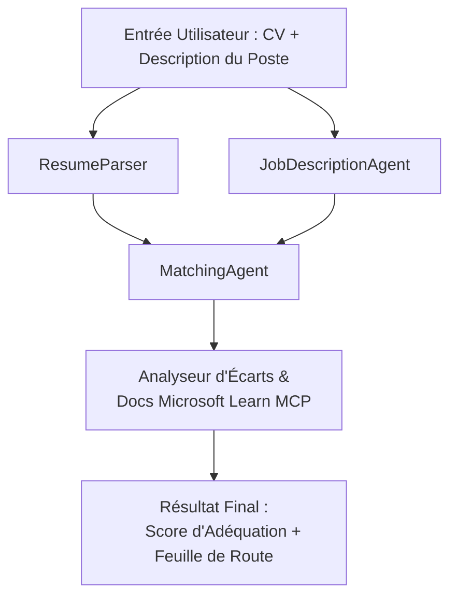

# PersonalCareerCopilot - Évaluateur d'adéquation CV → poste

Un workflow multi-agent qui évalue dans quelle mesure un CV correspond à une description de poste, puis génère une feuille de route d'apprentissage personnalisée pour combler les lacunes.

---

## Agents

| Agent | Rôle | Outils |
|-------|------|-------|
| **ResumeParser** | Extrait des compétences, expériences, certifications structurées du texte du CV | - |
| **JobDescriptionAgent** | Extrait les compétences, expériences, certifications requises/préférées d'une description de poste | - |
| **MatchingAgent** | Compare le profil aux exigences → score d'adéquation (0-100) + compétences trouvées/manquantes | - |
| **GapAnalyzer** | Construit une feuille de route d'apprentissage personnalisée avec des ressources Microsoft Learn | `search_microsoft_learn_for_plan` (MCP) |

## Workflow


---

## Démarrage rapide

### 1. Configurer l'environnement

```powershell
cd workshop\lab02-multi-agent\PersonalCareerCopilot
python -m venv .venv
.\.venv\Scripts\Activate.ps1          # Windows PowerShell
# source .venv/bin/activate            # macOS / Linux
pip install -r requirements.txt
```

### 2. Configurer les identifiants

Copiez le fichier env exemple et renseignez les détails de votre projet Foundry :

```powershell
cp .env.example .env
```

Modifiez `.env` :

```env
PROJECT_ENDPOINT=https://<your-account>.services.ai.azure.com/api/projects/<your-project>
MODEL_DEPLOYMENT_NAME=gpt-4.1-mini
```

| Valeur | Où la trouver |
|---------|--------------|
| `PROJECT_ENDPOINT` | Barre latérale Microsoft Foundry dans VS Code → clic droit sur votre projet → **Copier le point de terminaison du projet** |
| `MODEL_DEPLOYMENT_NAME` | Barre latérale Foundry → développez le projet → **Modèles + points de terminaison** → nom du déploiement |

### 3. Exécuter localement

```powershell
python -m debugpy --listen 127.0.0.1:5679 -m agentdev run main.py --verbose --port 8088
```

Ou utilisez la tâche VS Code : `Ctrl+Maj+P` → **Tâches : Exécuter une tâche** → **Exécuter le serveur HTTP Lab02**.

### 4. Tester avec Agent Inspector

Ouvrez Agent Inspector : `Ctrl+Maj+P` → **Foundry Toolkit : Ouvrir Agent Inspector**.

Collez cette invite de test :

```
Resume:
Jane Doe
Senior Software Engineer with 5 years of experience in Python, Django, and AWS.
Built microservices handling 10K+ requests/second. Led a team of 4 developers.
Certifications: AWS Solutions Architect Associate.
Education: B.S. Computer Science, State University.

Job Description:
Senior Cloud Engineer at Contoso Ltd.
Required: Python, Azure, Kubernetes, Terraform, CI/CD pipelines.
Preferred: Go, monitoring (Prometheus/Grafana), cost optimization.
Experience: 5+ years in cloud infrastructure.
Certifications: Azure Solutions Architect Expert preferred.
```

**Attendu :** Un score d'adéquation (0-100), compétences trouvées/manquantes, et une feuille de route d'apprentissage personnalisée avec des URL Microsoft Learn.

### 5. Déployer sur Foundry

`Ctrl+Maj+P` → **Microsoft Foundry : Déployer l'agent hébergé** → sélectionnez votre projet → confirmez.

---

## Structure du projet

```
PersonalCareerCopilot/
├── .env.example        ← Template for environment variables
├── .env                ← Your credentials (git-ignored)
├── agent.yaml          ← Hosted agent definition (name, resources, env vars)
├── Dockerfile          ← Container image for Foundry deployment
├── main.py             ← 4-agent workflow (instructions, MCP tool, WorkflowBuilder)
└── requirements.txt    ← Python dependencies
```

## Fichiers clés

### `agent.yaml`

Définit l'agent hébergé pour Foundry Agent Service :
- `kind: hosted` - s’exécute en conteneur géré
- `protocols: [responses v1]` - expose le point de terminaison HTTP `/responses`
- `environment_variables` - `PROJECT_ENDPOINT` et `MODEL_DEPLOYMENT_NAME` sont injectés au déploiement

### `main.py`

Contient :
- **Instructions des agents** - quatre constantes `*_INSTRUCTIONS`, une par agent
- **Outil MCP** - `search_microsoft_learn_for_plan()` appelle `https://learn.microsoft.com/api/mcp` via HTTP Streamable
- **Création des agents** - gestionnaire de contexte `create_agents()` utilisant `AzureAIAgentClient.as_agent()`
- **Graphe du workflow** - `create_workflow()` utilise `WorkflowBuilder` pour connecter les agents avec des modèles fan-out/fan-in/séquentiels
- **Démarrage du serveur** - `from_agent_framework(agent).run_async()` sur le port 8088

### `requirements.txt`

| Package | Version | Objectif |
|---------|---------|----------|
| `agent-framework-azure-ai` | `1.0.0rc3` | Intégration Azure AI pour Microsoft Agent Framework |
| `agent-framework-core` | `1.0.0rc3` | Runtime central (inclut WorkflowBuilder) |
| `azure-ai-agentserver-agentframework` | `1.0.0b16` | Runtime du serveur d’agent hébergé |
| `azure-ai-agentserver-core` | `1.0.0b16` | Abstractions du serveur d’agent centrales |
| `debugpy` | latest | Débogage Python (F5 dans VS Code) |
| `agent-dev-cli` | `--pre` | CLI de dev local + backend Agent Inspector |

---

## Dépannage

| Problème | Solution |
|----------|----------|
| `RuntimeError: Missing required environment variable(s)` | Créez un fichier `.env` avec `PROJECT_ENDPOINT` et `MODEL_DEPLOYMENT_NAME` |
| `ModuleNotFoundError: No module named 'agent_framework'` | Activez venv et exécutez `pip install -r requirements.txt` |
| Pas d’URL Microsoft Learn dans la sortie | Vérifiez la connectivité internet vers `https://learn.microsoft.com/api/mcp` |
| Une seule carte de lacune (troncature) | Vérifiez que `GAP_ANALYZER_INSTRUCTIONS` inclut le bloc `CRITICAL:` |
| Port 8088 occupé | Arrêtez d’autres serveurs : `netstat -ano \| findstr :8088` |

Pour un dépannage détaillé, consultez [Module 8 - Dépannage](../docs/08-troubleshooting.md).

---

**Guide complet :** [Docs Lab 02](../docs/README.md) · **Retour à :** [README Lab 02](../README.md) · [Accueil Atelier](../../../README.md)

---

<!-- CO-OP TRANSLATOR DISCLAIMER START -->
**Avertissement** :  
Ce document a été traduit à l’aide du service de traduction automatique [Co-op Translator](https://github.com/Azure/co-op-translator). Bien que nous nous efforcions d’assurer l’exactitude, veuillez noter que les traductions automatiques peuvent contenir des erreurs ou des imprécisions. Le document original dans sa langue native doit être considéré comme la source faisant foi. Pour les informations critiques, une traduction professionnelle réalisée par un humain est recommandée. Nous déclinons toute responsabilité en cas de malentendus ou d’interprétations erronées résultant de l’utilisation de cette traduction.
<!-- CO-OP TRANSLATOR DISCLAIMER END -->