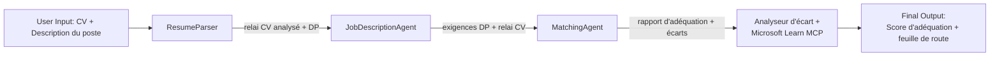

# PersonalCareerCopilot - Évaluateur de correspondance CV → emploi

Une application multi-agent centrée sur le workflow qui évalue dans quelle mesure un CV correspond à une description de poste, puis génère une feuille de route d’apprentissage personnalisée pour combler les lacunes.

---

## Agents

| Agent | Rôle | Outils |
|-------|------|-------|
| **ResumeParser** | Extrait les compétences structurées, l’expérience, les certifications du texte du CV | - |
| **JobDescriptionAgent** | Extrait les compétences, expériences, certifications requises/préférées d’une description de poste | - |
| **MatchingAgent** | Compare le profil avec les exigences → score de correspondance (0-100) + compétences correspondantes/manquantes | - |
| **GapAnalyzer** | Construit une feuille de route d’apprentissage personnalisée avec des ressources Microsoft Learn | `search_microsoft_learn_for_plan` (MCP) |

## Workflow


```mermaid
flowchart LR
    UserInput["User Input: CV + Description du poste"] --> ResumeParser
    ResumeParser -- "relai CV analysé + DP" --> JobDescriptionAgent
    JobDescriptionAgent -- "exigences DP + relai CV" --> MatchingAgent
    MatchingAgent -- "rapport d'adéquation + écarts" --> GapAnalyzerMCP["Analyseur d'écart +\nMicrosoft Learn MCP"]
    GapAnalyzerMCP --> FinalOutput["Final Output:\nScore d'adéquation + feuille de route"]
```

---

## Démarrage rapide

### 1. Configurer l’environnement

Ce dossier est l’implémentation de référence pour la structure basée sur le workflow du Lab 02. Son `main.py` utilise les blocs d’invite existants plus `WorkflowBuilder` pour connecter les quatre agents ensemble.

```powershell
cd workshop\lab02-multi-agent\PersonalCareerCopilot
python -m venv .venv
.\.venv\Scripts\Activate.ps1          # Windows PowerShell
# source .venv/bin/activate            # macOS / Linux
pip install -r requirements.txt
```

### 2. Configurer les identifiants

Créez un fichier `.env` dans ce dossier :

```powershell
copy .env .env.bak 2>$null; echo $null > .env
```

Modifiez `.env` :

```env
FOUNDRY_PROJECT_ENDPOINT=https://<your-account>.services.ai.azure.com/api/projects/<your-project>
AZURE_AI_MODEL_DEPLOYMENT_NAME=gpt-4.1-mini
```

| Valeur | Où la trouver |
|-------|---------------|
| `FOUNDRY_PROJECT_ENDPOINT` | Barre latérale Foundry Toolkit → clic droit sur votre projet → **Copier point de terminaison du projet** |
| `AZURE_AI_MODEL_DEPLOYMENT_NAME` | Barre latérale Foundry → développez le projet → **Modèles + points de terminaison** → nom du déploiement |

### 3. Exécuter localement

```powershell
python -m debugpy --listen 127.0.0.1:5679 main.py --port 8088
```

Ou utilisez la tâche VS Code : `Ctrl+Shift+P` → **Tâches : Exécuter la tâche** → **Exécuter serveur HTTP de l’agent**.

Pour le débogage F5, utilisez **Déboguer serveur HTTP local de l’agent**.

### 4. Tester avec Agent Inspector

Ouvrez Agent Inspector : `Ctrl+Shift+P` → **Foundry Toolkit : Ouvrir Agent Inspector**.

Collez cette invite test :

```
Resume:
Jane Doe
Senior Software Engineer with 5 years of experience in Python, Django, and AWS.
Built microservices handling 10K+ requests/second. Led a team of 4 developers.
Certifications: AWS Solutions Architect Associate.
Education: B.S. Computer Science, State University.

Job Description:
Senior Cloud Engineer at Contoso Ltd.
Required: Python, Azure, Kubernetes, Terraform, CI/CD pipelines.
Preferred: Go, monitoring (Prometheus/Grafana), cost optimization.
Experience: 5+ years in cloud infrastructure.
Certifications: Azure Solutions Architect Expert preferred.
```

**Attendu :** Un score de correspondance (0-100), compétences correspondantes/manquantes, et une feuille de route d’apprentissage personnalisée avec les URL Microsoft Learn.

### 5. Déployer sur Foundry

`Ctrl+Shift+P` → **Foundry Toolkit : Déployer agent hébergé** → sélectionnez votre projet → confirmez.

---

## Structure du projet

```
PersonalCareerCopilot/
├── .env                ← Your credentials (git-ignored)
├── agent.yaml          ← Hosted agent definition (name, resources, env vars)
├── Dockerfile          ← Container image for Foundry deployment
├── main.py             ← 4-agent workflow (instructions, MCP tool, WorkflowBuilder)
└── requirements.txt    ← Python dependencies
```

## Fichiers clés

### `agent.yaml`

Définit l’agent hébergé pour Foundry Agent Service :
- `kind: hosted` - s’exécute en tant que conteneur géré
- `protocols` - protocole `responses` avec `version : 1.0.0`, exposant le point de terminaison HTTP `/responses`
- `environment_variables` - `AZURE_AI_MODEL_DEPLOYMENT_NAME` est déclaré ici ; `FOUNDRY_PROJECT_ENDPOINT` est injecté automatiquement au moment du déploiement

### `main.py`

Contient :
- **Instructions des agents** - quatre constantes `*_INSTRUCTIONS`, une par agent
- **Outil MCP** - `search_microsoft_learn_for_plan()` appelle `https://learn.microsoft.com/api/mcp` via Streamable HTTP
- **Création des agents** - quatre instances `Agent()` + `AgentExecutor()` partageant un `FoundryChatClient`
- **Graph du workflow** - `WorkflowBuilder` connecte les agents en pipeline séquentiel : ResumeParser → JD Agent → MatchingAgent → GapAnalyzer
- **Démarrage du serveur** - `ResponsesHostServer` fonctionne sur le port 8088

### `requirements.txt`

| Package | Objectif |
|---------|----------|
| `agent-framework-foundry` | Runtime principale : `Agent`, `AgentExecutor`, `WorkflowBuilder`, `@tool`, `FoundryChatClient` |
| `agent-framework-foundry-hosting` | `ResponsesHostServer` + intégration de l’hébergement Foundry |
| `mcp<2,>=1.24.0` | Client MCP pour GapAnalyzer (`streamable_http_client`) |
| `debugpy` | Débogage Python (F5 dans VS Code) |

---

## Résolution des problèmes

| Problème | Solution |
|---------|---------|
| `KeyError: 'FOUNDRY_PROJECT_ENDPOINT'` ou `KeyError: 'AZURE_AI_MODEL_DEPLOYMENT_NAME'` | Créez `.env` avec `FOUNDRY_PROJECT_ENDPOINT` et `AZURE_AI_MODEL_DEPLOYMENT_NAME` définis |
| `ModuleNotFoundError: No module named 'agent_framework'` | Activez le venv et exécutez `pip install -r requirements.txt` |
| Pas d’URL Microsoft Learn dans la sortie | Vérifiez la connexion internet vers `https://learn.microsoft.com/api/mcp` |
| Une seule carte de lacune (troncature) | Vérifiez que `GAP_ANALYZER_INSTRUCTIONS` inclut le bloc `CRITICAL:` |
| Port 8088 utilisé | Arrêtez les autres serveurs : `netstat -ano \| findstr :8088` |

Pour une résolution détaillée, voir [Module 8 - Résolution des problèmes](../docs/08-troubleshooting.md).

---

**Guide complet :** [Docs Lab 02](../docs/README.md) · **Retour à :** [Lab 02 README](../README.md) · [Accueil de l’atelier](../../../README.md)

---

<!-- CO-OP TRANSLATOR DISCLAIMER START -->
**Avertissement** :
Ce document a été traduit à l'aide du service de traduction automatique [Co-op Translator](https://github.com/Azure/co-op-translator). Bien que nous nous efforçions d'assurer l'exactitude, veuillez noter que les traductions automatisées peuvent contenir des erreurs ou des inexactitudes. Le document original dans sa langue native doit être considéré comme la source faisant autorité. Pour les informations critiques, il est recommandé de recourir à une traduction professionnelle réalisée par un humain. Nous ne saurions être tenus responsables des malentendus ou erreurs d'interprétation découlant de l'utilisation de cette traduction.
<!-- CO-OP TRANSLATOR DISCLAIMER END -->