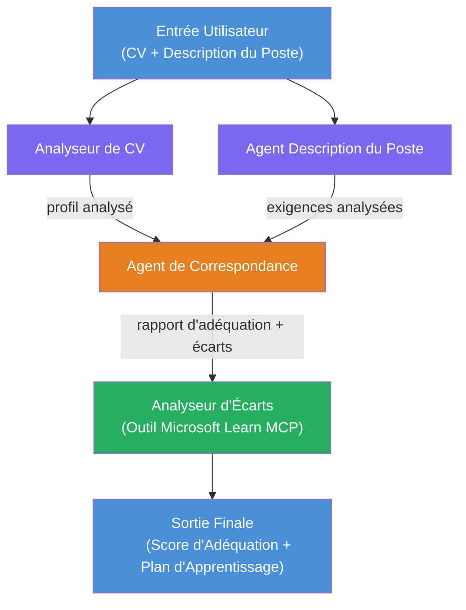

# Lab 02 - Flux de Travail Multi-Agent : Évaluateur de Correspondance CV → Emploi

---

## Ce que vous allez construire

Un **Évaluateur de Correspondance CV → Emploi** - un flux de travail multi-agent où quatre agents spécialisés collaborent pour évaluer à quel point le CV d’un candidat correspond à une description de poste, puis génèrent une feuille de route d’apprentissage personnalisée pour combler les lacunes.

### Les agents

| Agent | Rôle |
|-------|------|
| **Analyseur de CV** | Extrait les compétences, expériences, certifications structurées depuis le texte du CV |
| **Agent de Description de Poste** | Extrait les compétences, expériences, certifications requises/préférées d’une description de poste |
| **Agent de Correspondance** | Compare profil vs exigences → score de correspondance (0-100) + compétences correspondantes/manquantes |
| **Analyste des Lacunes** | Crée une feuille de route d’apprentissage personnalisée avec ressources, calendriers et projets à gains rapides |

### Déroulement de la démo

Téléchargez un **CV + description de poste** → obtenez un **score de correspondance + compétences manquantes** → recevez une **feuille de route d’apprentissage personnalisée**.

### Architecture du flux de travail

> Violet = agents en parallèle | Orange = point d’agrégation | Vert = agent final avec outils. Voir [Module 1 - Comprendre l’Architecture](docs/01-understand-multi-agent.md) et [Module 4 - Modèles d’Orchestration](docs/04-orchestration-patterns.md) pour des diagrammes détaillés et le flux de données.

### Sujets abordés

- Création d’un flux de travail multi-agent avec **WorkflowBuilder**
- Définition des rôles des agents et du flux d’orchestration (parallèle + séquentiel)
- Modèles de communication inter-agents
- Tests locaux avec l’Agent Inspector
- Déploiement de flux de travail multi-agents sur Foundry Agent Service

---

## Prérequis

Complétez d’abord le Lab 01 :

- [Lab 01 - Agent Unique](../lab01-single-agent/README.md)

---

## Pour commencer

Consultez l’intégralité des instructions d’installation, la revue du code et les commandes de test dans :

- [Lab 2 Docs - Prérequis](docs/00-prerequisites.md)
- [Lab 2 Docs - Parcours Complet d’Apprentissage](docs/README.md)
- [Guide d’exécution PersonalCareerCopilot](PersonalCareerCopilot/README.md)

## Modèles d’orchestration (alternatives agentiques)

Le Lab 2 inclut le flux par défaut **parallèle → agrégateur → planificateur**, et les docs
décrivent également des modèles alternatifs pour démontrer un comportement agentique plus prononcé :

- **Fan-out/Fan-in avec consensus pondéré**
- **Passage par un relecteur/critique avant la feuille de route finale**
- **Routeur conditionnel** (sélection du chemin basée sur le score de correspondance et les compétences manquantes)

Voir [docs/04-orchestration-patterns.md](docs/04-orchestration-patterns.md).

---

**Précédent :** [Lab 01 - Agent Unique](../lab01-single-agent/README.md) · **Retour à :** [Accueil de l’Atelier](../../README.md)

---

<!-- CO-OP TRANSLATOR DISCLAIMER START -->
**Avertissement** :  
Ce document a été traduit à l’aide du service de traduction automatisée [Co-op Translator](https://github.com/Azure/co-op-translator). Bien que nous nous efforcions d’assurer la précision, veuillez noter que les traductions automatiques peuvent contenir des erreurs ou des inexactitudes. Le document original dans sa langue native doit être considéré comme la source faisant foi. Pour les informations critiques, il est recommandé de recourir à une traduction professionnelle humaine. Nous déclinons toute responsabilité en cas de malentendus ou d’interprétations erronées résultant de l’utilisation de cette traduction.
<!-- CO-OP TRANSLATOR DISCLAIMER END -->