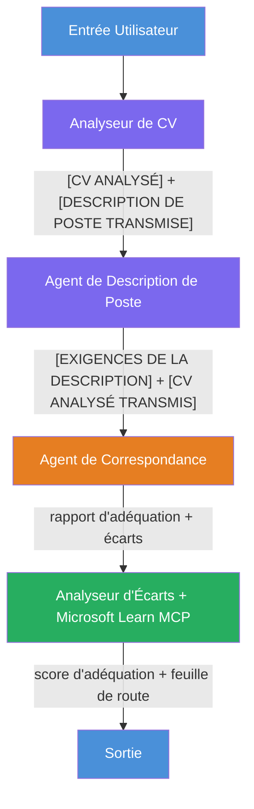

# Laboratoire 02 - Workflow Multi-Agent : Évaluateur d’adéquation CV → Poste

## Aperçu

Dans ce laboratoire pratique, vous allez créer une **application multi-agent priorisant le workflow** en utilisant Foundry Toolkit dans VS Code et la déployer sur Microsoft Foundry Agent Service.

**Ce que vous allez construire :** un Évaluateur d’adéquation CV → Poste qui analyse un CV et une description de poste, attribue un score d’adéquation, et produit une feuille de route d’apprentissage personnalisée utilisant les ressources Microsoft Learn.

---

## Architecture

```mermaid
flowchart TD
    A["Entrée Utilisateur"] --> B["Analyseur de CV"]
    B -->|"[CV ANALYSÉ] + [DESCRIPTION DE POSTE TRANSMISE]"| C["Agent de Description de Poste"]
    C -->|"[EXIGENCES DE LA DESCRIPTION] + [CV ANALYSÉ TRANSMIS]"| D["Agent de Correspondance"]
    D -->|rapport d'adéquation + écarts| E["Analyseur d'Écarts + Microsoft Learn MCP"]
    E -->|score d'adéquation + feuille de route| F["Sortie"]

    style A fill:#4A90D9,color:#fff
    style B fill:#7B68EE,color:#fff
    style C fill:#7B68EE,color:#fff
    style D fill:#E67E22,color:#fff
    style E fill:#27AE60,color:#fff
    style F fill:#4A90D9,color:#fff
```

**Comment ça fonctionne :**
1. L’utilisateur colle un CV et une description de poste.
2. **ResumeParser** analyse le CV et copie la description du poste mot à mot dans une section `[JOB DESCRIPTION PASS-THROUGH]`.
3. **JD Agent** extrait les exigences structurées du pass-through, puis transmet le `[PARSED RESUME]` en avant sous forme de `[PARSED RESUME PASS-THROUGH]`.
4. **MatchingAgent** compare `[PARSED RESUME PASS-THROUGH]` et `[JD REQUIREMENTS]` et produit un score d’adéquation.
5. **GapAnalyzer** transforme les écarts en une feuille de route pratique et récupère de vrais liens Microsoft Learn via MCP.

---

## Prérequis

Complétez d’abord le Laboratoire 01 :

- [Laboratoire 01 - Agent Unique](../lab01-single-agent/README.md)

---

## Partie 1 : Lire les modules dans l’ordre

Voir le parcours d’apprentissage complet dans :

- [Docs Laboratoire 2 - Prérequis](docs/00-prerequisites.md)
- [Docs Laboratoire 2 - Parcours d’apprentissage complet](docs/README.md)
- [Guide d’utilisation PersonalCareerCopilot](PersonalCareerCopilot/README.md)

---

## Partie 2 : Construire et tester le workflow

1. Utilisez l’assistant Foundry Toolkit pour générer la structure du projet basé sur le workflow.
2. Copiez les blocs de prompt et le graphe du workflow depuis `PersonalCareerCopilot/main.py` dans votre espace de travail.
3. Exécutez localement avec Agent Inspector et vérifiez les quatre agents ainsi que l’outil MCP.
4. Déployez l’agent hébergé sur Foundry lorsque les tests locaux réussissent.

---

## Modèles d’orchestration

Le Laboratoire 02 inclut le flux par défaut **fan-out → fan-in → séquentiel**, et les docs décrivent aussi des modèles d’orchestration alternatifs pour l’expérimentation.

- **Fan-out/Fan-in avec consensus pondéré**
- **Passage de relecteur/critique avant la feuille de route finale**
- **Routeur conditionnel** basé sur le score d’adéquation et les compétences manquantes

Voir [docs/04-orchestration-patterns.md](docs/04-orchestration-patterns.md).

---

**Précédent :** [Laboratoire 01 - Agent Unique](../lab01-single-agent/README.md) · **Retour à :** [Page d’accueil de l’atelier](../../README.md)

---

<!-- CO-OP TRANSLATOR DISCLAIMER START -->
**Avertissement** :
Ce document a été traduit à l'aide du service de traduction automatique [Co-op Translator](https://github.com/Azure/co-op-translator). Bien que nous nous efforçions d'assurer l'exactitude, veuillez noter que les traductions automatisées peuvent contenir des erreurs ou des inexactitudes. Le document original dans sa langue native doit être considéré comme la source faisant autorité. Pour les informations critiques, il est recommandé de recourir à une traduction professionnelle réalisée par un humain. Nous ne saurions être tenus responsables des malentendus ou erreurs d'interprétation découlant de l'utilisation de cette traduction.
<!-- CO-OP TRANSLATOR DISCLAIMER END -->