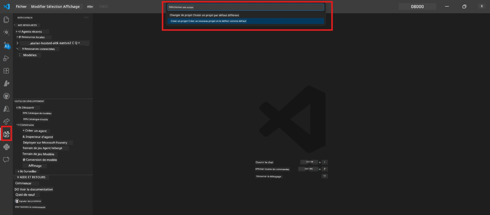

# Module 0 - Prérequis

Avant de commencer le Lab 02, confirmez que vous avez réalisé ce qui suit. Ce laboratoire s'appuie directement sur le Lab 01 - ne le sautez pas.

---

## 1. Terminer le Lab 01

Le Lab 02 suppose que vous avez déjà :

- [x] Terminé les 8 modules du [Lab 01 - Agent Unique](../../lab01-single-agent/README.md)
- [x] Déployé avec succès un agent unique sur Foundry Agent Service
- [x] Vérifié que l'agent fonctionne à la fois dans l'Agent Inspector local et Foundry Playground

Si vous n'avez pas terminé le Lab 01, revenez en arrière et terminez-le maintenant : [Docs Lab 01](../../lab01-single-agent/docs/00-prerequisites.md)

---

## 2. Vérifier la configuration existante

Tous les outils du Lab 01 doivent toujours être installés et fonctionnels. Exécutez ces vérifications rapides :

### 2.1 Azure CLI

```powershell
az account show --query "{name:name, id:id}" --output table
```

Attendu : Affiche le nom et l'ID de votre abonnement. En cas d'échec, exécutez [`az login`](https://learn.microsoft.com/cli/azure/authenticate-azure-cli-interactively).

### 2.2 Extensions VS Code

1. Appuyez sur `Ctrl+Shift+P` → tapez **"Microsoft Foundry"** → confirmez que vous voyez des commandes (ex. `Microsoft Foundry: Create a New Hosted Agent`).
2. Appuyez sur `Ctrl+Shift+P` → tapez **"Foundry Toolkit"** → confirmez que vous voyez des commandes (ex. `Foundry Toolkit: Open Agent Inspector`).

### 2.3 Projet & modèle Foundry

1. Cliquez sur l'icône **Microsoft Foundry** dans la barre d'activité VS Code.
2. Confirmez que votre projet est listé (ex. `workshop-agents`).
3. Déployez le projet → vérifiez qu'un modèle déployé existe (ex. `gpt-4.1-mini`) avec le statut **Succeeded**.

> **Si le déploiement de votre modèle a expiré :** Certains déploiements gratuits expirent automatiquement. Redéployez depuis le [Catalogue des modèles](https://learn.microsoft.com/azure/foundry/foundry-models/concepts/models-sold-directly-by-azure) (`Ctrl+Shift+P` → **Microsoft Foundry: Open Model Catalog**).



### 2.4 Rôles RBAC

Vérifiez que vous avez le rôle **Azure AI User** sur votre projet Foundry :

1. [Azure Portal](https://portal.azure.com) → ressource **projet** Foundry → **Contrôle d'accès (IAM)** → onglet **[Attributions de rôle](https://learn.microsoft.com/azure/foundry/concepts/rbac-foundry)**.
2. Recherchez votre nom → confirmez que **[Azure AI User](https://aka.ms/foundry-ext-project-role)** est listé.

---

## 3. Comprendre les concepts multi-agent (nouveauté du Lab 02)

Le Lab 02 introduit des concepts non abordés dans le Lab 01. Lisez-les avant de continuer :

### 3.1 Qu'est-ce qu'un workflow multi-agent ?

Au lieu qu'un agent gère tout, un **workflow multi-agent** répartit le travail entre plusieurs agents spécialisés. Chaque agent a :

- Ses propres **instructions** (invite système)
- Son propre **rôle** (ce dont il est responsable)
- Des **outils** optionnels (fonctions qu'il peut appeler)

Les agents communiquent via un **graphe d'orchestration** qui définit comment les données circulent entre eux.

### 3.2 WorkflowBuilder

La classe [`WorkflowBuilder`](https://learn.microsoft.com/agent-framework/workflows/agents-in-workflows) dans `agent_framework` est le composant SDK qui connecte les agents entre eux :

```python
from agent_framework import WorkflowBuilder

workflow = (
    WorkflowBuilder(
        name="MyWorkflow",
        start_executor=agent_a,
        output_executors=[agent_d],
    )
    .add_edge(agent_a, agent_b)
    .add_edge(agent_a, agent_c)
    .add_edge(agent_b, agent_d)
    .add_edge(agent_c, agent_d)
    .build()
)
```

- **`start_executor`** - Le premier agent qui reçoit l'entrée utilisateur
- **`output_executors`** - L'(les) agent(s) dont la sortie devient la réponse finale
- **`add_edge(source, target)`** - Définit que `target` reçoit la sortie de `source`

### 3.3 Outils MCP (Model Context Protocol)

Le Lab 02 utilise un **outil MCP** qui appelle l’API Microsoft Learn pour récupérer des ressources d’apprentissage. [MCP (Model Context Protocol)](https://modelcontextprotocol.io/introduction) est un protocole standardisé pour connecter des modèles IA à des sources de données et outils externes.

| Terme | Définition |
|-------|------------|
| **Serveur MCP** | Service exposant des outils/ressources via le [protocole MCP](https://learn.microsoft.com/azure/foundry/agents/how-to/tools/model-context-protocol) |
| **Client MCP** | Votre code agent qui se connecte à un serveur MCP et appelle ses outils |
| **[Streamable HTTP](https://learn.microsoft.com/agent-framework/agents/tools/hosted-mcp-tools)** | Méthode de transport utilisée pour communiquer avec le serveur MCP |

### 3.4 Comment le Lab 02 diffère du Lab 01

| Aspect | Lab 01 (Agent Unique) | Lab 02 (Multi-Agent) |
|--------|----------------------|---------------------|
| Agents | 1 | 4 (rôles spécialisés) |
| Orchestration | Aucune | WorkflowBuilder (parallèle + séquentiel) |
| Outils | Fonction `@tool` optionnelle | Outil MCP (appel API externe) |
| Complexité | Invite simple → réponse | CV + JD → score d’adéquation → feuille de route |
| Flux de contexte | Direct | Transmission agent-à-agent |

---

## 4. Structure du dépôt d’atelier pour Lab 02

Assurez-vous de savoir où se trouvent les fichiers du Lab 02 :

```
workshop/
└── lab02-multi-agent/
    ├── README.md                       ← Lab overview
    ├── docs/                           ← You are here
    │   ├── README.md                   ← Learning path index
    │   ├── 00-prerequisites.md         ← This file
    │   ├── 01-understand-multi-agent.md
    │   ├── ...
    │   └── 08-troubleshooting.md
    └── PersonalCareerCopilot/          ← The agent project
        ├── agent.yaml                  ← Agent definition
        ├── main.py                     ← 4-agent workflow code
        ├── Dockerfile                  ← Container configuration
        └── requirements.txt            ← Python dependencies
```

---

### Point de contrôle

- [ ] Lab 01 entièrement terminé (les 8 modules, agent déployé et vérifié)
- [ ] `az account show` retourne votre abonnement
- [ ] Extensions Microsoft Foundry et Foundry Toolkit installées et opérationnelles
- [ ] Projet Foundry avec modèle déployé (ex. `gpt-4.1-mini`)
- [ ] Vous avez le rôle **Azure AI User** sur le projet
- [ ] Vous avez lu la section concepts multi-agent ci-dessus et comprenez WorkflowBuilder, MCP et l’orchestration des agents

---

**Suivant :** [01 - Comprendre l’architecture multi-agent →](01-understand-multi-agent.md)

---

<!-- CO-OP TRANSLATOR DISCLAIMER START -->
**Avertissement** :  
Ce document a été traduit à l’aide du service de traduction IA [Co-op Translator](https://github.com/Azure/co-op-translator). Bien que nous nous efforcions d’assurer l'exactitude, veuillez noter que les traductions automatiques peuvent contenir des erreurs ou des inexactitudes. Le document original dans sa langue d’origine doit être considéré comme la source faisant foi. Pour les informations critiques, une traduction professionnelle humaine est recommandée. Nous ne sommes pas responsables des malentendus ou interprétations erronées résultant de l’utilisation de cette traduction.
<!-- CO-OP TRANSLATOR DISCLAIMER END -->