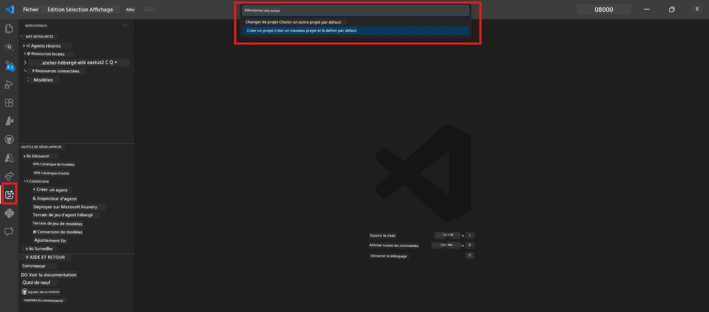

# Module 0 - Introduction

⏱️ ~10 min

> [!WARNING]
> **Aperçu et limitations :** Les [agents hébergés](https://learn.microsoft.com/azure/foundry/agents/concepts/hosted-agents) sont actuellement en **aperçu public** - non recommandés pour les charges de travail en production. Certaines fonctionnalités présentées dans cet atelier peuvent évoluer à mesure que le service progresse vers la GA.

## Ce que vous allez construire

Dans ce laboratoire, vous étendez les compétences d'agent unique du Lab 01 pour construire un **flux de travail multi-agent** - l'Évaluateur de Correspondance CV → Offre d'emploi.

Vous collez un **CV** et une **description de poste**. Quatre agents spécialisés traitent les entrées séquentiellement, puis retournent :
- Un score d'adéquation (0–100 avec répartition du score)
- Une liste des écarts de compétences et certifications
- Une feuille de route d'apprentissage personnalisée avec de vrais liens Microsoft Learn pour chaque manque

**Le flux de travail utilise :**
- **Microsoft Agent Framework** - `WorkflowBuilder` pour l'orchestration en pipeline séquentiel
- **Foundry Toolkit pour VS Code** - générer l’ossature, tester localement, déployer
- **Un modèle d'IA** (par exemple, `gpt-4.1-mini`) - utilisé par les quatre agents
- **Serveur Microsoft Learn MCP** - fournit de vrais liens vers des ressources d'apprentissage pour chaque lacune de compétence

---

## Choisissez votre parcours

> ⚠️ **Continuez avec le même parcours que celui utilisé dans le Lab 01.**

<details open>
<summary><strong>🅰️ Parcours A - Cloud Azure (nécessite une souscription Azure)</strong></summary>

| | Détails |
|---|---|
| **Pour qui ?** | Vous avez terminé le Lab 01 en utilisant une souscription Azure |
| **Modèle** | Azure OpenAI via Foundry (par exemple, `gpt-4.1-mini`) |
| **Modules couverts** | Tous les modules (00–09) |
| **Déployer dans le cloud ?** | ✅ Oui - déploiement complet de bout en bout |

</details>

<details open>
<summary><strong>🅱️ Parcours B - Foundry Local (pas besoin de souscription Azure)</strong></summary>

| | Détails |
|---|---|
| **Pour qui ?** | Vous avez terminé le Lab 01 en utilisant Foundry Local |
| **Modèle** | Foundry Local (gratuit, s’exécute sur votre machine) |
| **Modules couverts** | Modules 00–05 (sauter 06–07 - déploiement & vérification cloud) |
| **Déployer dans le cloud ?** | ❌ Non - tests locaux uniquement via Agent Inspector |

</details>

---

## Vérification du Lab 01

Le Lab 02 s’appuie directement sur le Lab 01. Complétez d’abord le Lab 01 avant de commencer ici.

Vous n'avez pas encore fait le Lab 01 ? Commencez ici : [Lab 01 - Introduction](../../lab01-single-agent/docs/00-prerequisites.md)

<details open>
<summary><strong>🅰️ Parcours A - Cloud Azure</strong></summary>

```powershell
az account show --query "{name:name, id:id}" --output table
```

En cas d’échec, exécutez `az login`. Puis vérifiez dans VS Code :

1. `Ctrl+Shift+P` → tapez **Foundry Toolkit** → confirmez que les commandes apparaissent.
2. Cliquez sur l’icône **Foundry Toolkit** → votre projet et modèle déployé affichent **Réussi**.



> **RBAC :** Vous avez attribué **Foundry User** dans le Lab 01. Si vous devez la réattribuer, voir [Lab 01, Module 1](../../lab01-single-agent/docs/01-setup.md#deploy-a-model--assign-rbac). Le rôle était auparavant nommé **Azure AI User** - mêmes permissions.

</details>

<details open>
<summary><strong>🅱️ Parcours B - Foundry Local</strong></summary>

```powershell
Invoke-WebRequest -Uri "http://localhost:5273/v1/health" -UseBasicParsing | Select-Object StatusCode
```

Attendu : `StatusCode: 200`. Sinon, redémarrez Foundry Local depuis la barre latérale Foundry Toolkit.

> Toute l'inférence s'exécute sur votre machine. Le seul appel sortant est l’outil MCP vers `https://learn.microsoft.com/api/mcp`.

</details>

---

## Nouveautés du Lab 02

| | Lab 01 | Lab 02 |
|--|--------|--------|
| Agents | 1 | 4 (enchaînés avec WorkflowBuilder) |
| Modèle d'ossature | Basique - Agent Framework | Workflows - Agent Framework |
| Nouveau package | - | `mcp` |
| Orchestration | Agent conversationnel unique | Pipeline séquentiel (WorkflowBuilder) |
| Nouvel outil | - | `search_microsoft_learn_for_plan` (MCP) |

---

**Suivant :** [01 - Comprendre l’architecture →](01-understand-multi-agent.md)

---

<!-- CO-OP TRANSLATOR DISCLAIMER START -->
**Avertissement** :
Ce document a été traduit à l'aide du service de traduction automatique [Co-op Translator](https://github.com/Azure/co-op-translator). Bien que nous nous efforçions d'assurer l'exactitude, veuillez noter que les traductions automatisées peuvent contenir des erreurs ou des inexactitudes. Le document original dans sa langue native doit être considéré comme la source faisant autorité. Pour les informations critiques, il est recommandé de recourir à une traduction professionnelle réalisée par un humain. Nous ne saurions être tenus responsables des malentendus ou erreurs d'interprétation découlant de l'utilisation de cette traduction.
<!-- CO-OP TRANSLATOR DISCLAIMER END -->