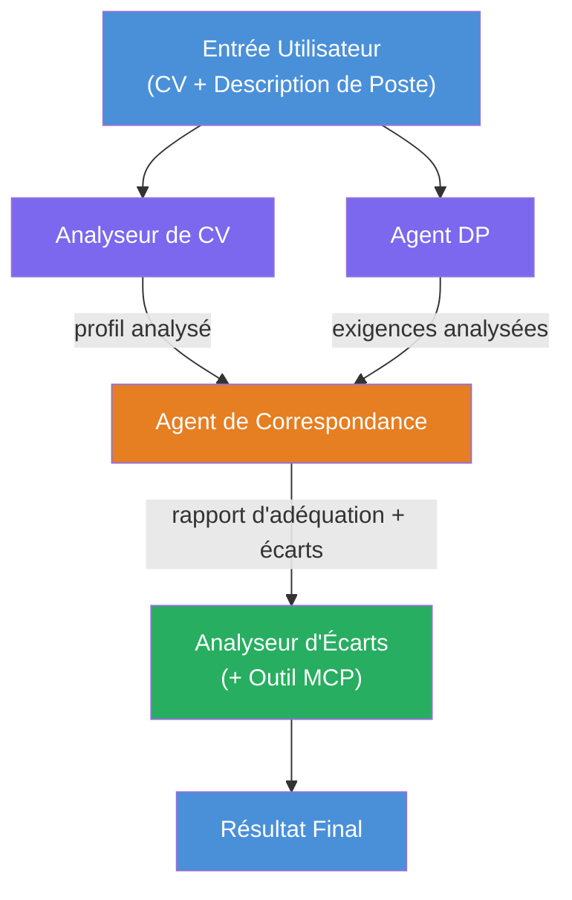
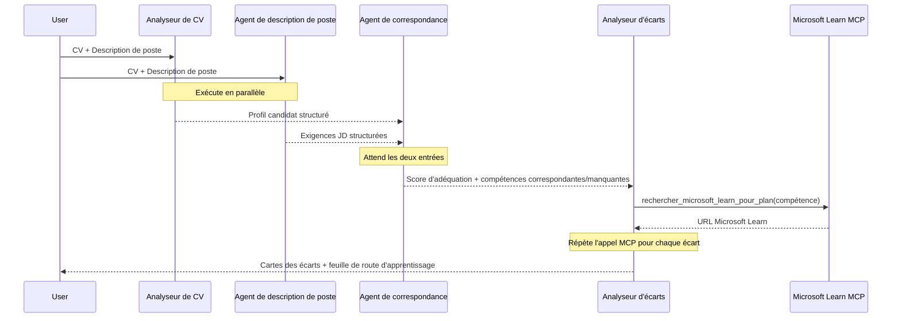
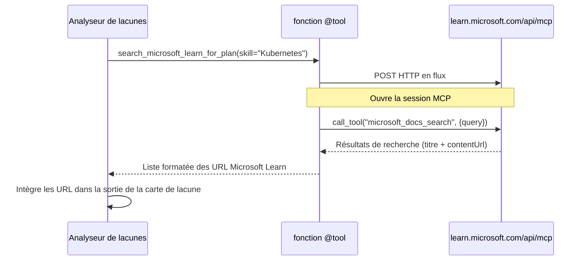

# Module 1 - Comprendre l'architecture multi-agents

Dans ce module, vous découvrez l'architecture de l'Évaluateur d'adéquation CV → poste avant d'écrire du code. Comprendre le graphe d'orchestration, les rôles des agents et le flux de données est essentiel pour déboguer et étendre les [workflows multi-agents](https://learn.microsoft.com/azure/architecture/ai-ml/idea/multiple-agent-workflow-automation).

---

## Le problème résolu

Faire correspondre un CV à une description de poste implique plusieurs compétences distinctes :

1. **Analyse** - Extraire des données structurées à partir d'un texte non structuré (CV)
2. **Analyse** - Extraire les exigences d'une description de poste
3. **Comparaison** - Évaluer l'alignement entre les deux
4. **Planification** - Construire une feuille de route d'apprentissage pour combler les lacunes

Un seul agent effectuant les quatre tâches dans une même requête produit souvent :
- Une extraction incomplète (il accélère l'analyse pour arriver au score)
- Un score superficiel (absence de décomposition basée sur des preuves)
- Des feuilles de route génériques (non adaptées aux lacunes spécifiques)

En divisant en **quatre agents spécialisés**, chacun se concentre sur sa tâche avec des instructions dédiées, produisant une sortie de meilleure qualité à chaque étape.

---

## Les quatre agents

Chaque agent est un agent complet [Microsoft Foundry](https://learn.microsoft.com/azure/foundry/agents/concepts/hosted-agents) créé via `AzureAIAgentClient.as_agent()`. Ils partagent le même déploiement de modèle mais ont des instructions différentes et (optionnellement) des outils différents.

| # | Nom de l'agent | Rôle | Entrée | Sortie |
|---|----------------|-------|--------|--------|
| 1 | **ResumeParser** | Extrait un profil structuré à partir du texte du CV | Texte brut du CV (de l'utilisateur) | Profil du candidat, Compétences techniques, Compétences comportementales, Certifications, Expérience sectorielle, Réalisations |
| 2 | **JobDescriptionAgent** | Extrait des exigences structurées d'une description de poste | Texte brut de la description de poste (de l'utilisateur, transmis via ResumeParser) | Aperçu du poste, Compétences requises, Compétences préférées, Expérience, Certifications, Formation, Responsabilités |
| 3 | **MatchingAgent** | Calcule un score d'adéquation basé sur des preuves | Sorties de ResumeParser + JobDescriptionAgent | Score d'adéquation (0-100 avec décomposition), Compétences correspondantes, Compétences manquantes, Lacunes |
| 4 | **GapAnalyzer** | Élabore une feuille de route d'apprentissage personnalisée | Sortie de MatchingAgent | Cartes de lacunes (par compétence), Ordre d'apprentissage, Chronologie, Ressources de Microsoft Learn |

---

## Le graphe d'orchestration

Le workflow utilise un **éclatement parallèle** suivi d'une **agrégation séquentielle** :


> **Légende :** Violet = agents parallèles, Orange = point d'agrégation, Vert = agent final avec outils

### Comment les données circulent


1. **L'utilisateur envoie** un message contenant un CV et une description de poste.
2. **ResumeParser** reçoit l'entrée complète de l'utilisateur et extrait un profil candidat structuré.
3. **JobDescriptionAgent** reçoit l'entrée utilisateur en parallèle et extrait des exigences structurées.
4. **MatchingAgent** reçoit les sorties de **ResumeParser** et de **JobDescriptionAgent** (le framework attend que les deux terminent avant d'exécuter MatchingAgent).
5. **GapAnalyzer** reçoit la sortie de MatchingAgent et appelle l'**outil MCP Microsoft Learn** pour récupérer des ressources d'apprentissage réelles pour chaque lacune.
6. La **sortie finale** est la réponse de GapAnalyzer, qui inclut le score d'adéquation, les cartes de lacunes, et une feuille de route complète d'apprentissage.

### Pourquoi l'éclatement parallèle est important

ResumeParser et JobDescriptionAgent s'exécutent **en parallèle** car aucun ne dépend de l'autre. Cela :
- Réduit la latence totale (les deux s'exécutent simultanément au lieu de séquentiellement)
- Constitue une séparation naturelle (analyser un CV vs analyser une description de poste sont des tâches indépendantes)
- Illustre un schéma classique multi-agents : **éclater → agréger → agir**

---

## WorkflowBuilder dans le code

Voici comment le graphe ci-dessus se traduit en appels API [`WorkflowBuilder`](https://learn.microsoft.com/agent-framework/workflows/agents-in-workflows) dans `main.py` :

```python
from agent_framework import WorkflowBuilder

workflow = (
    WorkflowBuilder(
        name="ResumeJobFitEvaluator",
        start_executor=resume_parser,       # Premier agent à recevoir l'entrée utilisateur
        output_executors=[gap_analyzer],     # Agent final dont la sortie est retournée
    )
    .add_edge(resume_parser, jd_agent)      # ResumeParser → JobDescriptionAgent
    .add_edge(resume_parser, matching_agent) # ResumeParser → MatchingAgent
    .add_edge(jd_agent, matching_agent)      # JobDescriptionAgent → MatchingAgent
    .add_edge(matching_agent, gap_analyzer)  # MatchingAgent → GapAnalyzer
    .build()
)
```

**Comprendre les arêtes :**

| Arête | Signification |
|-------|--------------|
| `resume_parser → jd_agent` | L'agent JD reçoit la sortie de ResumeParser |
| `resume_parser → matching_agent` | MatchingAgent reçoit la sortie de ResumeParser |
| `jd_agent → matching_agent` | MatchingAgent reçoit aussi la sortie de l'agent JD (il attend les deux) |
| `matching_agent → gap_analyzer` | GapAnalyzer reçoit la sortie de MatchingAgent |

Parce que `matching_agent` a **deux arêtes entrantes** (`resume_parser` et `jd_agent`), le framework attend automatiquement que les deux terminent avant de lancer MatchingAgent.

---

## L'outil MCP

L'agent GapAnalyzer dispose d'un outil : `search_microsoft_learn_for_plan`. C'est un **[outil MCP](https://learn.microsoft.com/agent-framework/agents/tools/hosted-mcp-tools)** qui appelle l'API Microsoft Learn pour récupérer des ressources d'apprentissage sélectionnées.

### Comment ça fonctionne

```python
@tool
async def search_microsoft_learn_for_plan(
    skill: str, role: str = "", max_results: int = 5
) -> str:
    """Search Microsoft Learn MCP and return curated official links."""
    # Se connecte à https://learn.microsoft.com/api/mcp via HTTP pouvant être diffusé
    # Appelle l'outil 'microsoft_docs_search' sur le serveur MCP
    # Retourne une liste formatée des URLs de Microsoft Learn
```

### Flux d'appel MCP


1. GapAnalyzer décide qu'il a besoin de ressources d'apprentissage pour une compétence (par ex., "Kubernetes")
2. Le framework appelle `search_microsoft_learn_for_plan(skill="Kubernetes")`
3. La fonction ouvre une connexion [HTTP Streamable](https://learn.microsoft.com/agent-framework/agents/tools/hosted-mcp-tools) vers `https://learn.microsoft.com/api/mcp`
4. Elle appelle l'outil `microsoft_docs_search` sur le [serveur MCP](https://learn.microsoft.com/azure/foundry/agents/how-to/tools/model-context-protocol)
5. Le serveur MCP renvoie les résultats de recherche (titre + URL)
6. La fonction formate les résultats et les retourne sous forme de chaîne de caractères
7. GapAnalyzer utilise les URL retournées dans la sortie des cartes de lacunes

### Journaux MCP attendus

Quand l'outil s'exécute, vous verrez des entrées de journal comme :

```
GET https://learn.microsoft.com/api/mcp → 405 (Method Not Allowed)
POST https://learn.microsoft.com/api/mcp → 200
DELETE https://learn.microsoft.com/api/mcp → 405 (Method Not Allowed)
```

**C'est normal.** Le client MCP effectue des sondes avec GET et DELETE pendant l'initialisation - ces retours 405 sont attendus. L'appel effectif utilise POST et retourne 200. Inquiétez-vous seulement si les appels POST échouent.

---

## Schéma de création des agents

Chaque agent est créé avec le **gestionnaire de contexte asynchrone [`AzureAIAgentClient.as_agent()`](https://learn.microsoft.com/python/api/overview/azure/ai-agents-readme)**. C'est le schéma Foundry pour créer des agents automatiquement nettoyés :

```python
async with (
    get_credential() as credential,
    AzureAIAgentClient(
        project_endpoint=PROJECT_ENDPOINT,
        model_deployment_name=MODEL_DEPLOYMENT_NAME,
        credential=credential,
    ).as_agent(
        name="ResumeParser",
        instructions=RESUME_PARSER_INSTRUCTIONS,
    ) as resume_parser,
    # ... répétez pour chaque agent ...
):
    # Les 4 agents existent tous ici
    workflow = create_workflow(resume_parser, jd_agent, matching_agent, gap_analyzer)
```

**Points clés :**
- Chaque agent reçoit sa propre instance `AzureAIAgentClient` (le SDK exige que le nom de l'agent soit scoped au client)
- Tous les agents partagent les mêmes `credential`, `PROJECT_ENDPOINT`, et `MODEL_DEPLOYMENT_NAME`
- Le bloc `async with` garantit que tous les agents sont nettoyés à la fermeture du serveur
- GapAnalyzer reçoit en plus `tools=[search_microsoft_learn_for_plan]`

---

## Démarrage du serveur

Après avoir créé les agents et construit le workflow, le serveur démarre :

```python
from azure.ai.agentserver.agentframework import from_agent_framework

agent = create_workflow(resume_parser, jd_agent, matching_agent, gap_analyzer)
await from_agent_framework(agent).run_async()
```

`from_agent_framework()` enveloppe le workflow en serveur HTTP exposant le point de terminaison `/responses` sur le port 8088. C'est le même schéma que dans le Lab 01, mais l'"agent" est maintenant le [graphe complet du workflow](https://learn.microsoft.com/agent-framework/workflows/as-agents).

---

### Point de contrôle

- [ ] Vous comprenez l'architecture à 4 agents et le rôle de chaque agent
- [ ] Vous pouvez tracer le flux de données : Utilisateur → ResumeParser → (en parallèle) Agent JD + MatchingAgent → GapAnalyzer → Sortie
- [ ] Vous comprenez pourquoi MatchingAgent attend à la fois ResumeParser et Agent JD (deux arêtes entrantes)
- [ ] Vous comprenez l'outil MCP : ce qu'il fait, comment il est appelé, et que les logs GET 405 sont normaux
- [ ] Vous comprenez le schéma `AzureAIAgentClient.as_agent()` et la raison pour laquelle chaque agent a sa propre instance client
- [ ] Vous savez lire le code `WorkflowBuilder` et le relier au graphe visuel

---

**Précédent:** [00 - Prérequis](00-prerequisites.md) · **Suivant:** [02 - Scaffolder le projet multi-agents →](02-scaffold-multi-agent.md)

---

<!-- CO-OP TRANSLATOR DISCLAIMER START -->
**Avertissement** :  
Ce document a été traduit à l’aide du service de traduction automatisée [Co-op Translator](https://github.com/Azure/co-op-translator). Bien que nous nous efforcions d’assurer l’exactitude, veuillez noter que les traductions automatiques peuvent contenir des erreurs ou des inexactitudes. Le document original dans sa langue native doit être considéré comme la source faisant foi. Pour des informations critiques, une traduction professionnelle effectuée par un humain est recommandée. Nous ne sommes pas responsables des malentendus ou interprétations erronées résultant de l’utilisation de cette traduction.
<!-- CO-OP TRANSLATOR DISCLAIMER END -->