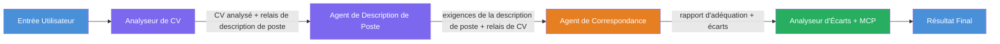

# Module 1 - Comprendre l’architecture

⏱️ ~5 min

Avant d’écrire le code, voici un aperçu rapide de ce que vous construisez et de son fonctionnement.

---

## Ce que vous construisez

Vous collez un **CV** et une **description de poste**. Le workflow retourne :

- Un score d’adéquation (0–100 avec une ventilation)
- Une liste des écarts de compétences et de certifications
- Une feuille de route d’apprentissage personnalisée avec des liens Microsoft Learn pour chaque écart

---

## Les quatre agents

Un seul agent qui essaie de parser, scorer et planifier tout en même temps a tendance à se précipiter et à produire un résultat superficiel. Répartir le travail en quatre agents spécialisés donne de meilleurs résultats :

| Agent | Ce qu’il fait |
|-------|-------------|
| **ResumeParser** | Parse le CV ; copie la description de poste mot pour mot dans `[JOB DESCRIPTION PASS-THROUGH]` pour les agents en aval |
| **JobDescriptionAgent** | Extrait les exigences de la description de poste depuis le passage ; transmet `[PARSED RESUME]` en avant sous `[PARSED RESUME PASS-THROUGH]` |
| **MatchingAgent** | Compare les deux sections étiquetées ; produit un score d’adéquation de 0 à 100 et une liste des écarts |
| **GapAnalyzer** | Construit une feuille de route d’apprentissage ; recherche Microsoft Learn pour chaque écart |

---

## Le graph d’orchestration

Le workflow est une **pipeline séquentielle** - chaque agent transmet sa sortie au suivant :


```mermaid
flowchart LR
    A["Entrée Utilisateur"] --> B["Analyseur de CV"]
    B -- "CV analysé + relais de description de poste" --> C["Agent de Description de Poste"]
    C -- "exigences de la description de poste + relais de CV" --> D["Agent de Correspondance"]
    D -- "rapport d'adéquation + écarts" --> E["Analyseur d'Écarts + MCP"]
    E --> F["Résultat Final"]

    style A fill:#4A90D9,color:#fff
    style B fill:#7B68EE,color:#fff
    style C fill:#7B68EE,color:#fff
    style D fill:#E67E22,color:#fff
    style E fill:#27AE60,color:#fff
    style F fill:#4A90D9,color:#fff
```

1. **ResumeParser** reçoit l’entrée utilisateur, analyse le CV et copie la description de poste dans `[JOB DESCRIPTION PASS-THROUGH]`.
2. **JD Agent** extrait les exigences structurées et transmet `[PARSED RESUME PASS-THROUGH]` en avant.
3. **MatchingAgent** compare les deux sections et produit un score d’adéquation et une liste des écarts.
4. **GapAnalyzer** construit la feuille de route et appelle l’outil Microsoft Learn MCP pour chaque écart.

---

## Comment cela se traduit en code

Dans `main.py`, vous décrivez ce graph avec `WorkflowBuilder` :

```python
workflow_agent = (
    WorkflowBuilder(
        start_executor=resume_executor,       # premier agent à recevoir l'entrée utilisateur
        output_executors=[gap_executor],      # dernier agent - sa sortie est la réponse
    )
    .add_edge(resume_executor, jd_executor)       # ResumeParser → Agent JD
    .add_edge(jd_executor, matching_executor)     # Agent JD → MatchingAgent
    .add_edge(matching_executor, gap_executor)    # MatchingAgent → GapAnalyzer
    .build()
    .as_agent()
)
```

Chaque `Agent` est enveloppé dans un `AgentExecutor`. Les appels `add_edge()` définissent une pipeline strictement séquentielle - chaque agent reçoit uniquement la sortie de son prédécesseur direct.

> `context_mode="last_agent"` signifie que chaque exécuteur voit uniquement la sortie de son prédécesseur direct. ResumeParser et JD Agent transmettent les données en avant dans des sections étiquetées afin que chaque agent en aval ait exactement ce dont il a besoin.

---

## L’outil MCP

GapAnalyzer a un seul outil : `search_microsoft_learn_for_plan`. Il se connecte à `https://learn.microsoft.com/api/mcp` et retourne de vrais liens Microsoft Learn pour chaque écart de compétences.

Lorsque l’outil fonctionne, vous verrez ces logs - tout est attendu :

```
GET  https://learn.microsoft.com/api/mcp → 405   ← connection probe, normal
POST https://learn.microsoft.com/api/mcp → 200   ← actual tool call
DELETE https://learn.microsoft.com/api/mcp → 405 ← cleanup probe, normal
```

Ne vous inquiétez que si le `POST` retourne une erreur.

---

**Précédent :** [00 - Prérequis](00-prerequisites.md) · **Suivant :** [02 - Échafauder le projet →](02-scaffold-multi-agent.md)

---

<!-- CO-OP TRANSLATOR DISCLAIMER START -->
**Avertissement** :
Ce document a été traduit à l'aide du service de traduction automatique [Co-op Translator](https://github.com/Azure/co-op-translator). Bien que nous nous efforçions d'assurer l'exactitude, veuillez noter que les traductions automatisées peuvent contenir des erreurs ou des inexactitudes. Le document original dans sa langue native doit être considéré comme la source faisant autorité. Pour les informations critiques, il est recommandé de recourir à une traduction professionnelle réalisée par un humain. Nous ne saurions être tenus responsables des malentendus ou erreurs d'interprétation découlant de l'utilisation de cette traduction.
<!-- CO-OP TRANSLATOR DISCLAIMER END -->