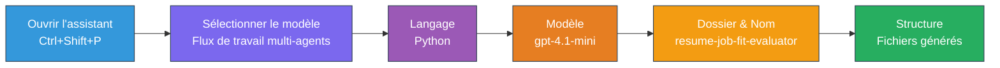
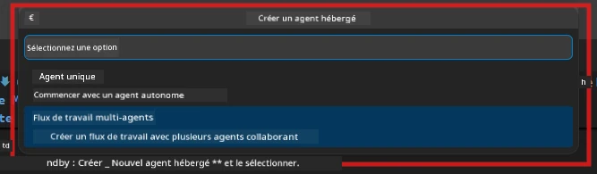

# Module 2 - Échafauder le projet multi-agent

Dans ce module, vous utilisez l’[extension Microsoft Foundry](https://marketplace.visualstudio.com/items?itemName=TeamsDevApp.vscode-ai-foundry) pour **échafauder un projet de workflow multi-agent**. L’extension génère toute la structure du projet - `agent.yaml`, `main.py`, `Dockerfile`, `requirements.txt`, `.env`, et la configuration de débogage. Vous personnaliserez ensuite ces fichiers dans les Modules 3 et 4.

> **Note :** Le dossier `PersonalCareerCopilot/` dans ce laboratoire est un exemple complet et fonctionnel d’un projet multi-agent personnalisé. Vous pouvez soit échafauder un projet neuf (recommandé pour l’apprentissage), soit étudier directement le code existant.

---

## Étape 1 : Ouvrir l’assistant de création d’agent hébergé


1. Appuyez sur `Ctrl+Shift+P` pour ouvrir la **Palette de commandes**.
2. Tapez : **Microsoft Foundry : Créer un nouvel agent hébergé** et sélectionnez-le.
3. L’assistant de création d’agent hébergé s’ouvre.

> **Alternative :** Cliquez sur l’icône **Microsoft Foundry** dans la barre d’activités → cliquez sur l’icône **+** à côté de **Agents** → **Créer un nouvel agent hébergé**.

---

## Étape 2 : Choisir le modèle de workflow multi-agent

L’assistant vous demande de sélectionner un modèle :

| Modèle | Description | Quand l’utiliser |
|--------|-------------|-----------------|
| Agent unique | Un agent avec des instructions et des outils optionnels | Laboratoire 01 |
| **Workflow multi-agent** | Plusieurs agents qui collaborent via WorkflowBuilder | **Ce laboratoire (Laboratoire 02)** |

1. Sélectionnez **Workflow multi-agent**.
2. Cliquez sur **Suivant**.



---

## Étape 3 : Choisir le langage de programmation

1. Sélectionnez **Python**.
2. Cliquez sur **Suivant**.

---

## Étape 4 : Sélectionner votre modèle

1. L’assistant affiche les modèles déployés dans votre projet Foundry.
2. Sélectionnez le même modèle que celui utilisé dans le Laboratoire 01 (par exemple, **gpt-4.1-mini**).
3. Cliquez sur **Suivant**.

> **Astuce :** [`gpt-4.1-mini`](https://learn.microsoft.com/azure/foundry/foundry-models/concepts/models-sold-directly-by-azure#gpt-41-series) est recommandé pour le développement - il est rapide, économique et gère bien les workflows multi-agents. Passez à `gpt-4.1` pour le déploiement final en production si vous souhaitez une sortie de meilleure qualité.

---

## Étape 5 : Choisir l’emplacement du dossier et le nom de l’agent

1. Une boîte de dialogue de fichiers s’ouvre. Choisissez un dossier cible :
   - Si vous suivez le dépôt de l’atelier : naviguez vers `workshop/lab02-multi-agent/` et créez un nouveau sous-dossier
   - Si vous commencez à neuf : choisissez n’importe quel dossier
2. Saisissez un **nom** pour l’agent hébergé (par exemple, `resume-job-fit-evaluator`).
3. Cliquez sur **Créer**.

---

## Étape 6 : Attendre la fin de l’échafaudage

1. VS Code ouvre une nouvelle fenêtre (ou la fenêtre actuelle se met à jour) avec le projet échafaudé.
2. Vous devriez voir cette structure de fichiers :

```
resume-job-fit-evaluator/
├── .env                ← Environment variables (placeholders)
├── .vscode/
│   └── launch.json     ← Debug configuration
├── agent.yaml          ← Agent definition (kind: hosted)
├── Dockerfile          ← Container configuration
├── main.py             ← Multi-agent workflow code (scaffold)
└── requirements.txt    ← Python dependencies
```

> **Note de l’atelier :** Dans le dépôt de l’atelier, le dossier `.vscode/` est à la **racine de l’espace de travail** avec les fichiers partagés `launch.json` et `tasks.json`. Les configurations de débogage pour le Laboratoire 01 et le Laboratoire 02 sont toutes deux incluses. Lorsque vous appuyez sur F5, sélectionnez **"Lab02 - Multi-Agent"** dans la liste déroulante.

---

## Étape 7 : Comprendre les fichiers échafaudés (spécificités multi-agent)

L’échafaudage multi-agent diffère de celui de l’agent unique à plusieurs égards :

### 7.1 `agent.yaml` - Définition de l’agent

```yaml
kind: hosted
name: resume-job-fit-evaluator
description: >
  A multi-agent workflow that evaluates resume-to-job fit.
metadata:
  authors:
    - Microsoft
  tags:
    - Multi-Agent Workflow
    - Resume Evaluator
protocols:
  - protocol: responses
    version: v1
environment_variables:
  - name: PROJECT_ENDPOINT
    value: ${PROJECT_ENDPOINT}
  - name: MODEL_DEPLOYMENT_NAME
    value: ${MODEL_DEPLOYMENT_NAME}
```

**Différence clé avec le Laboratoire 01 :** La section `environment_variables` peut inclure des variables supplémentaires pour les points de terminaison MCP ou d’autres configurations d’outils. Le `name` et la `description` reflètent le cas d’usage multi-agent.

### 7.2 `main.py` - Code du workflow multi-agent

L’échafaudage inclut :
- **Plusieurs chaînes d’instructions d’agent** (une constante par agent)
- **Plusieurs gestionnaires de contexte [`AzureAIAgentClient.as_agent()`](https://learn.microsoft.com/python/api/overview/azure/ai-agents-readme)** (un par agent)
- **[`WorkflowBuilder`](https://learn.microsoft.com/agent-framework/workflows/agents-in-workflows)** pour relier les agents entre eux
- **`from_agent_framework()`** pour exposer le workflow en tant que point de terminaison HTTP

```python
from agent_framework import WorkflowBuilder, tool
from agent_framework.azure import AzureAIAgentClient
from azure.ai.agentserver.agentframework import from_agent_framework
```

L’import supplémentaire [`WorkflowBuilder`](https://learn.microsoft.com/agent-framework/workflows/agents-in-workflows) est nouvelle par rapport au Laboratoire 01.

### 7.3 `requirements.txt` - Dépendances supplémentaires

Le projet multi-agent utilise les mêmes packages de base que le Laboratoire 01, plus tous les packages liés à MCP :

```
agent-framework-azure-ai==1.0.0rc3
agent-framework-core==1.0.0rc3
azure-ai-agentserver-agentframework==1.0.0b16
azure-ai-agentserver-core==1.0.0b16
debugpy
agent-dev-cli --pre
```

> **Note importante sur la version :** Le package `agent-dev-cli` nécessite le flag `--pre` dans `requirements.txt` pour installer la dernière version preview. Ceci est nécessaire pour la compatibilité d’Agent Inspector avec `agent-framework-core==1.0.0rc3`. Voir [Module 8 - Dépannage](08-troubleshooting.md) pour plus de détails sur les versions.

| Package | Version | Usage |
|---------|---------|-------|
| [`agent-framework-azure-ai`](https://learn.microsoft.com/agent-framework/overview/) | `1.0.0rc3` | Intégration Azure AI pour le [Microsoft Agent Framework](https://github.com/microsoft/agent-framework) |
| [`agent-framework-core`](https://learn.microsoft.com/agent-framework/overview/) | `1.0.0rc3` | Runtime principal (inclut WorkflowBuilder) |
| `azure-ai-agentserver-agentframework` | `1.0.0b16` | Runtime du serveur d’agent hébergé |
| `azure-ai-agentserver-core` | `1.0.0b16` | Abstractions centrales du serveur d’agent |
| `debugpy` | dernière version | Débogage Python (F5 dans VS Code) |
| `agent-dev-cli` | `--pre` | CLI de développement local + backend Agent Inspector |

### 7.4 `Dockerfile` - Identique au Laboratoire 01

Le Dockerfile est identique à celui du Laboratoire 01 - il copie les fichiers, installe les dépendances depuis `requirements.txt`, expose le port 8088, et lance `python main.py`.

```dockerfile
FROM python:3.14-slim
WORKDIR /app
COPY ./ .
RUN pip install --upgrade pip && \
    if [ -f requirements.txt ]; then \
        pip install -r requirements.txt; \
    else \
      echo "No requirements.txt found" >&2; exit 1; \
    fi
EXPOSE 8088
CMD ["python", "main.py"]
```

---

### Point de contrôle

- [ ] Assistant d’échafaudage terminé → nouvelle structure de projet visible
- [ ] Vous voyez tous les fichiers : `agent.yaml`, `main.py`, `Dockerfile`, `requirements.txt`, `.env`
- [ ] `main.py` inclut l’import `WorkflowBuilder` (confirme que le modèle multi-agent a été sélectionné)
- [ ] `requirements.txt` inclut à la fois `agent-framework-core` et `agent-framework-azure-ai`
- [ ] Vous comprenez comment l’échafaudage multi-agent diffère de l’échafaudage à agent unique (agents multiples, WorkflowBuilder, outils MCP)

---

**Précédent :** [01 - Comprendre l’architecture multi-agent](01-understand-multi-agent.md) · **Suivant :** [03 - Configurer les agents et l’environnement →](03-configure-agents.md)

---

<!-- CO-OP TRANSLATOR DISCLAIMER START -->
**Avertissement** :  
Ce document a été traduit à l’aide du service de traduction automatique [Co-op Translator](https://github.com/Azure/co-op-translator). Bien que nous nous efforcions d’assurer l’exactitude, veuillez noter que les traductions automatisées peuvent contenir des erreurs ou des inexactitudes. Le document original dans sa langue native doit être considéré comme la source faisant autorité. Pour les informations critiques, une traduction professionnelle réalisée par un humain est recommandée. Nous ne sommes pas responsables des malentendus ou des erreurs d’interprétation résultant de l’utilisation de cette traduction.
<!-- CO-OP TRANSLATOR DISCLAIMER END -->