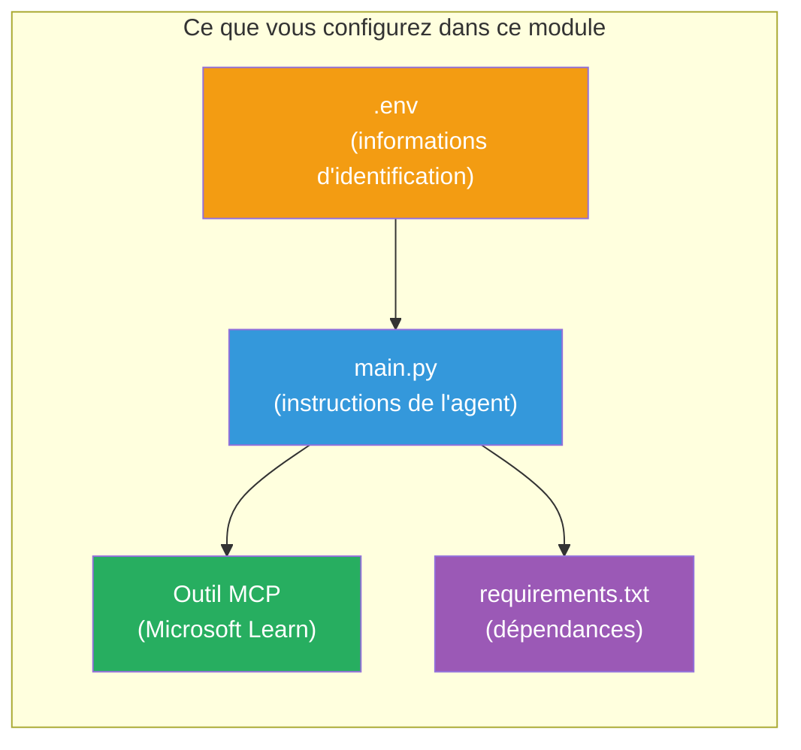

# Module 3 - Configurer les Agents, l’Outil MCP et l’Environnement

Dans ce module, vous personnalisez le projet multi-agent généré. Vous allez écrire les instructions pour les quatre agents, configurer l’outil MCP pour Microsoft Learn, définir les variables d’environnement et installer les dépendances.


> **Référence :** Le code complet fonctionnel se trouve dans [`PersonalCareerCopilot/main.py`](../../../../../workshop/lab02-multi-agent/PersonalCareerCopilot/main.py). Utilisez-le comme référence lors de la construction de votre propre projet.

---

## Étape 1 : Configurer les variables d’environnement

1. Ouvrez le fichier **`.env`** à la racine de votre projet.
2. Remplissez les détails de votre projet Foundry :

   ```env
   PROJECT_ENDPOINT=https://<your-account>.services.ai.azure.com/api/projects/<your-project>
   MODEL_DEPLOYMENT_NAME=gpt-4.1-mini
   ```

3. Enregistrez le fichier.

### Où trouver ces valeurs

| Valeur | Comment la trouver |
|--------|--------------------|
| **Point de terminaison du projet** | Barre latérale Microsoft Foundry → cliquez sur votre projet → URL du point de terminaison dans la vue détaillée |
| **Nom du déploiement du modèle** | Barre latérale Foundry → développez le projet → **Models + endpoints** → nom à côté du modèle déployé |

> **Sécurité :** Ne jamais commettre `.env` dans le contrôle de version. Ajoutez-le à `.gitignore` si ce n’est pas déjà fait.

### Correspondance des variables d’environnement

Le fichier `main.py` du multi-agent lit à la fois les noms de variables d’environnement standards et spécifiques à l’atelier :

```python
PROJECT_ENDPOINT = os.getenv("AZURE_AI_PROJECT_ENDPOINT") or os.getenv("PROJECT_ENDPOINT")
MODEL_DEPLOYMENT_NAME = os.getenv(
    "AZURE_AI_MODEL_DEPLOYMENT_NAME",
    os.getenv("MODEL_DEPLOYMENT_NAME", "gpt-4.1-mini"),
)
MICROSOFT_LEARN_MCP_ENDPOINT = os.getenv(
    "MICROSOFT_LEARN_MCP_ENDPOINT", "https://learn.microsoft.com/api/mcp"
)
```

Le point de terminaison MCP a une valeur par défaut raisonnable - vous n’avez pas besoin de la définir dans `.env` à moins de vouloir la remplacer.

---

## Étape 2 : Écrire les instructions des agents

C’est l’étape la plus critique. Chaque agent a besoin d’instructions soigneusement rédigées qui définissent son rôle, son format de sortie et ses règles. Ouvrez `main.py` et créez (ou modifiez) les constantes d’instructions.

### 2.1 Agent d’analyse de CV

```python
RESUME_PARSER_INSTRUCTIONS = """\
You are the Resume Parser.
Extract resume text into a compact, structured profile for downstream matching.

Output exactly these sections:
1) Candidate Profile
2) Technical Skills (grouped categories)
3) Soft Skills
4) Certifications & Awards
5) Domain Experience
6) Notable Achievements

Rules:
- Use only explicit or strongly implied evidence.
- Do not invent skills, titles, or experience.
- Keep concise bullets; no long paragraphs.
- If input is not a resume, return a short warning and request resume text.
"""
```

**Pourquoi ces sections ?** Le MatchingAgent a besoin de données structurées pour faire le scoring. Des sections cohérentes rendent la transmission entre agents fiable.

### 2.2 Agent de description de poste

```python
JOB_DESCRIPTION_INSTRUCTIONS = """\
You are the Job Description Analyst.
Extract a structured requirement profile from a JD.

Output exactly these sections:
1) Role Overview
2) Required Skills
3) Preferred Skills
4) Experience Required
5) Certifications Required
6) Education
7) Domain / Industry
8) Key Responsibilities

Rules:
- Keep required vs preferred clearly separated.
- Only use what the JD states; do not invent hidden requirements.
- Flag vague requirements briefly.
- If input is not a JD, return a short warning and request JD text.
"""
```

**Pourquoi séparer requis et préféré ?** Le MatchingAgent utilise un poids différent pour chacun (Compétences requises = 40 points, Compétences préférées = 10 points).

### 2.3 Agent de matching

```python
MATCHING_AGENT_INSTRUCTIONS = """\
You are the Matching Agent.
Compare parsed resume output vs JD output and produce an evidence-based fit report.

Scoring (100 total):
- Required Skills 40
- Experience 25
- Certifications 15
- Preferred Skills 10
- Domain Alignment 10

Output exactly these sections:
1) Fit Score (with breakdown math)
2) Matched Skills
3) Missing Skills
4) Partially Matched
5) Experience Alignment
6) Certification Gaps
7) Overall Assessment

Rules:
- Be objective and evidence-only.
- Keep partial vs missing separate.
- Keep Missing Skills precise; it feeds roadmap planning.
"""
```

**Pourquoi un scoring explicite ?** Un scoring reproductible permet de comparer les exécutions et de déboguer les problèmes. L’échelle de 100 points est facile à interpréter pour les utilisateurs finaux.

### 2.4 Agent d’analyse des lacunes

```python
GAP_ANALYZER_INSTRUCTIONS = """\
You are the Gap Analyzer and Roadmap Planner.
Create a practical upskilling plan from the matching report.

Microsoft Learn MCP usage (required):
- For EVERY High and Medium priority gap, call tool `search_microsoft_learn_for_plan`.
- Use returned Learn links in Suggested Resources.
- Prefer Microsoft Learn for free resources.

CRITICAL: You MUST produce a SEPARATE detailed gap card for EVERY skill listed in
the Missing Skills and Certification Gaps sections of the matching report. Do NOT
skip or combine gaps. Do NOT summarize multiple gaps into one card.

Output format:
1) Personalized Learning Roadmap for [Role Title]
2) One DETAILED card per gap (produce ALL cards, not just the first):
   - Skill
   - Priority (High/Medium/Low)
   - Current Level
   - Target Level
   - Suggested Resources (include Learn URL from tool results)
   - Estimated Time
   - Quick Win Project
3) Recommended Learning Order (numbered list)
4) Timeline Summary (week-by-week)
5) Motivational Note

Rules:
- Produce every gap card before writing the summary sections.
- Keep it specific, realistic, and actionable.
- Tailor to candidate's existing stack.
- If fit >= 80, focus on polish/interview readiness.
- If fit < 40, be honest and provide a staged path.
"""
```

**Pourquoi insister sur « CRITIQUE » ?** Sans instructions explicites pour produire TOUTES les cartes de lacunes, le modèle tend à n’en générer que 1-2 et à résumer le reste. Le bloc « CRITIQUE » empêche cette troncature.

---

## Étape 3 : Définir l’outil MCP

Le GapAnalyzer utilise un outil qui appelle le [serveur MCP Microsoft Learn](https://learn.microsoft.com/azure/foundry/agents/how-to/tools/model-context-protocol). Ajoutez ceci dans `main.py` :

```python
import json
from agent_framework import tool
from mcp.client.session import ClientSession
from mcp.client.streamable_http import streamable_http_client

@tool
async def search_microsoft_learn_for_plan(
    skill: str, role: str = "", max_results: int = 5
) -> str:
    """Search Microsoft Learn MCP and return curated official links for roadmap planning."""
    query = " ".join(part for part in [skill, role, "learning path module"] if part).strip()
    query = query or "job skills learning path"

    try:
        async with streamable_http_client(MICROSOFT_LEARN_MCP_ENDPOINT) as (
            read_stream, write_stream, _,
        ):
            async with ClientSession(read_stream, write_stream) as session:
                await session.initialize()
                result = await session.call_tool(
                    "microsoft_docs_search", {"query": query}
                )

        if not result.content:
            return (
                "No results returned from Microsoft Learn MCP. "
                "Fallback: https://learn.microsoft.com/training/support/catalog-api"
            )

        payload_text = getattr(result.content[0], "text", "")
        data = json.loads(payload_text) if payload_text else {}
        items = data.get("results", [])[:max(1, min(max_results, 10))]

        if not items:
            return f"No direct Microsoft Learn results found for '{skill}'."

        lines = [f"Microsoft Learn resources for '{skill}':"]
        for i, item in enumerate(items, start=1):
            title = item.get("title") or item.get("url") or "Microsoft Learn Resource"
            url = item.get("url") or item.get("link") or ""
            lines.append(f"{i}. {title} - {url}".rstrip(" -"))
        return "\n".join(lines)
    except Exception as ex:
        return (
            f"Microsoft Learn MCP lookup unavailable. Reason: {ex}. "
            "Fallbacks: https://learn.microsoft.com/api/mcp"
        )
```

### Fonctionnement de l’outil

| Étape | Ce qui se passe |
|-------|-----------------|
| 1 | GapAnalyzer décide qu’il a besoin de ressources pour une compétence (ex. : « Kubernetes ») |
| 2 | Le framework appelle `search_microsoft_learn_for_plan(skill="Kubernetes")` |
| 3 | La fonction ouvre une connexion [HTTP Streamable](https://learn.microsoft.com/agent-framework/agents/tools/hosted-mcp-tools) vers `https://learn.microsoft.com/api/mcp` |
| 4 | Appelle `microsoft_docs_search` sur le [serveur MCP](https://learn.microsoft.com/azure/foundry/agents/how-to/tools/model-context-protocol) |
| 5 | Le serveur MCP retourne les résultats de recherche (titre + URL) |
| 6 | La fonction formate les résultats sous forme de liste numérotée |
| 7 | GapAnalyzer intègre les URLs dans la carte de lacune |

### Dépendances MCP

Les bibliothèques clients MCP sont incluses transitivement via [`agent-framework-core`](https://learn.microsoft.com/agent-framework/overview/). Vous n’avez **pas** besoin de les ajouter à `requirements.txt` séparément. En cas d’erreurs d’importation, vérifiez :

```powershell
pip list | Select-String "mcp"
```

Attendu : le paquet `mcp` est installé (version 1.x ou ultérieure).

---

## Étape 4 : Connecter les agents et le workflow

### 4.1 Créer les agents avec des gestionnaires de contexte

```python
from contextlib import asynccontextmanager

@asynccontextmanager
async def create_agents():
    async with (
        get_credential() as credential,
        AzureAIAgentClient(
            project_endpoint=PROJECT_ENDPOINT,
            model_deployment_name=MODEL_DEPLOYMENT_NAME,
            credential=credential,
        ).as_agent(
            name="ResumeParser",
            instructions=RESUME_PARSER_INSTRUCTIONS,
        ) as resume_parser,
        AzureAIAgentClient(
            project_endpoint=PROJECT_ENDPOINT,
            model_deployment_name=MODEL_DEPLOYMENT_NAME,
            credential=credential,
        ).as_agent(
            name="JobDescriptionAgent",
            instructions=JOB_DESCRIPTION_INSTRUCTIONS,
        ) as jd_agent,
        AzureAIAgentClient(
            project_endpoint=PROJECT_ENDPOINT,
            model_deployment_name=MODEL_DEPLOYMENT_NAME,
            credential=credential,
        ).as_agent(
            name="MatchingAgent",
            instructions=MATCHING_AGENT_INSTRUCTIONS,
        ) as matching_agent,
        AzureAIAgentClient(
            project_endpoint=PROJECT_ENDPOINT,
            model_deployment_name=MODEL_DEPLOYMENT_NAME,
            credential=credential,
        ).as_agent(
            name="GapAnalyzer",
            instructions=GAP_ANALYZER_INSTRUCTIONS,
            tools=[search_microsoft_learn_for_plan],
        ) as gap_analyzer,
    ):
        yield resume_parser, jd_agent, matching_agent, gap_analyzer
```

**Points clés :**
- Chaque agent possède sa propre instance `AzureAIAgentClient`
- Seul GapAnalyzer reçoit `tools=[search_microsoft_learn_for_plan]`
- `get_credential()` retourne [`ManagedIdentityCredential`](https://learn.microsoft.com/python/api/overview/azure/identity-readme#managed-identity-support) dans Azure, [`DefaultAzureCredential`](https://learn.microsoft.com/azure/developer/python/sdk/authentication/credential-chains#defaultazurecredential-overview) localement

### 4.2 Construire le graphe du workflow

```python
def create_workflow(resume_parser, jd_agent, matching_agent, gap_analyzer):
    workflow = (
        WorkflowBuilder(
            name="ResumeJobFitEvaluator",
            start_executor=resume_parser,
            output_executors=[gap_analyzer],
        )
        .add_edge(resume_parser, jd_agent)
        .add_edge(resume_parser, matching_agent)
        .add_edge(jd_agent, matching_agent)
        .add_edge(matching_agent, gap_analyzer)
        .build()
    )
    return workflow.as_agent()
```

> Voir [Les workflows comme agents](https://learn.microsoft.com/agent-framework/workflows/as-agents) pour comprendre le modèle `.as_agent()`.

### 4.3 Démarrer le serveur

```python
async def main() -> None:
    validate_configuration()
    async with create_agents() as (resume_parser, jd_agent, matching_agent, gap_analyzer):
        agent = create_workflow(resume_parser, jd_agent, matching_agent, gap_analyzer)
        from azure.ai.agentserver.agentframework import from_agent_framework
        await from_agent_framework(agent).run_async()

if __name__ == "__main__":
    asyncio.run(main())
```

---

## Étape 5 : Créer et activer l’environnement virtuel

### 5.1 Créer l’environnement

```powershell
cd workshop\lab02-multi-agent\PersonalCareerCopilot
python -m venv .venv
```

### 5.2 L’activer

**PowerShell (Windows) :**
```powershell
.\.venv\Scripts\Activate.ps1
```

**macOS/Linux :**
```bash
source .venv/bin/activate
```

### 5.3 Installer les dépendances

```powershell
pip install -r requirements.txt
```

> **Note :** La ligne `agent-dev-cli --pre` dans `requirements.txt` garantit l’installation de la dernière version preview. Cela est nécessaire pour la compatibilité avec `agent-framework-core==1.0.0rc3`.

### 5.4 Vérifier l’installation

```powershell
pip list | Select-String "agent-framework|agentserver|agent-dev"
```

Sortie attendue :
```
agent-dev-cli                  0.0.1b260316
agent-framework-azure-ai       1.0.0rc3
agent-framework-core            1.0.0rc3
azure-ai-agentserver-agentframework 1.0.0b16
azure-ai-agentserver-core      1.0.0b16
```

> **Si `agent-dev-cli` affiche une version plus ancienne** (ex. `0.0.1b260119`), l’Agent Inspector échouera avec des erreurs 403/404. Mettez à jour : `pip install agent-dev-cli --pre --upgrade`

---

## Étape 6 : Vérifier l’authentification

Exécutez la même vérification d’authentification que dans le Lab 01 :

```powershell
az account show --query "{name:name, id:id}" --output table
```

Si cela échoue, lancez [`az login`](https://learn.microsoft.com/cli/azure/authenticate-azure-cli-interactively).

Pour les workflows multi-agents, les quatre agents partagent les mêmes identifiants. Si l’authentification fonctionne pour l’un, elle fonctionne pour tous.

---

### Point de contrôle

- [ ] `.env` contient des valeurs valides pour `PROJECT_ENDPOINT` et `MODEL_DEPLOYMENT_NAME`
- [ ] Les 4 constantes d’instructions des agents sont définies dans `main.py` (ResumeParser, JD Agent, MatchingAgent, GapAnalyzer)
- [ ] L’outil MCP `search_microsoft_learn_for_plan` est défini et enregistré avec GapAnalyzer
- [ ] `create_agents()` crée les 4 agents avec des instances individuelles `AzureAIAgentClient`
- [ ] `create_workflow()` construit le graphe correct avec `WorkflowBuilder`
- [ ] L’environnement virtuel est créé et activé (`(.venv)` visible)
- [ ] `pip install -r requirements.txt` s’exécute sans erreurs
- [ ] `pip list` affiche tous les paquets attendus aux bonnes versions (rc3 / b16)
- [ ] `az account show` retourne votre abonnement

---

**Précédent :** [02 - Générer un projet multi-agent](02-scaffold-multi-agent.md) · **Suivant :** [04 - Modèles d’orchestration →](04-orchestration-patterns.md)

---

<!-- CO-OP TRANSLATOR DISCLAIMER START -->
**Avertissement** :  
Ce document a été traduit à l'aide du service de traduction automatique [Co-op Translator](https://github.com/Azure/co-op-translator). Bien que nous nous efforcions d'assurer l'exactitude, veuillez noter que les traductions automatisées peuvent contenir des erreurs ou des inexactitudes. Le document original dans sa langue native doit être considéré comme la source faisant autorité. Pour les informations critiques, une traduction professionnelle humaine est recommandée. Nous déclinons toute responsabilité en cas de malentendus ou de mauvaises interprétations résultant de l'utilisation de cette traduction.
<!-- CO-OP TRANSLATOR DISCLAIMER END -->