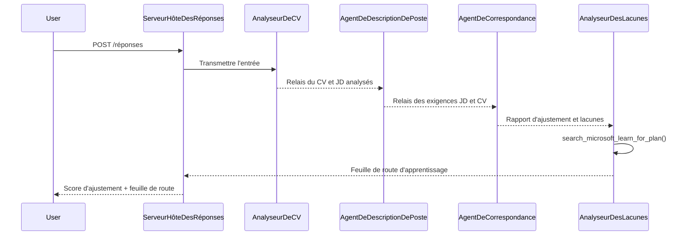

# Module 3 - Configurer les instructions, l’environnement et installer les dépendances

⏱️ ~15 min

Dans ce module, vous transformez l’ébauche générée en **votre** flux de travail multi-agent - en configurant des variables d’environnement, en écrivant les instructions des agents, en ajoutant l’outil MCP, en câblant le graphe du flux de travail et en installant les dépendances.

> **Référence :** Le code complet fonctionnel se trouve dans [`PersonalCareerCopilot/main.py`](../../../../../workshop/lab02-multi-agent/PersonalCareerCopilot/main.py). Utilisez-le comme référence lors de la construction de votre propre graphe de flux de travail et des blocs d’invite.

---

## Comment les quatre agents s’articulent entre eux


```mermaid
sequenceDiagram
    participant User
    participant Server as ServeurHôteDesRéponses
    participant RP as AnalyseurDeCV
    participant JD as AgentDeDescriptionDePoste
    participant MA as AgentDeCorrespondance
    participant GA as AnalyseurDesLacunes

    User->>Server: POST /réponses
    Server->>RP: Transmettre l'entrée
    RP-->>JD: Relais du CV et JD analysés
    JD-->>MA: Relais des exigences JD et CV
    MA-->>GA: Rapport d'ajustement et lacunes
    GA->>GA: search_microsoft_learn_for_plan()
    GA-->>Server: Feuille de route d'apprentissage
    Server-->>User: Score d'ajustement + feuille de route
```

---

## Étape 1 : Configurer les variables d’environnement

1. Ouvrez le fichier **`.env`** à la racine de votre projet (créé par l’assistant de génération).
2. Remplacez les valeurs fictives par vos valeurs réelles issues du Lab 01.

<details open>
<summary><strong>🅰️ Chemin A - abonnement Foundry</strong></summary>

```env
FOUNDRY_PROJECT_ENDPOINT=https://<your-account>.services.ai.azure.com/api/projects/<your-project>
AZURE_AI_MODEL_DEPLOYMENT_NAME=gpt-4.1-mini
```

> **Où trouver les valeurs :** Voir [Lab 01, Module 1](../../lab01-single-agent/docs/01-setup.md#deploy-a-model--assign-rbac).

</details>

<details open>
<summary><strong>🅱️ Chemin B - Foundry Local</strong></summary>

```env
FOUNDRY_PROJECT_ENDPOINT=http://localhost:5273/v1
AZURE_AI_MODEL_DEPLOYMENT_NAME=phi-4-mini
```

> Toutes les inférences s’exécutent sur votre machine - aucune donnée ne quitte votre appareil. Exécutez `foundry model list` pour confirmer l’alias exact du modèle. La seule requête sortante est l’appel de l’outil MCP vers `https://learn.microsoft.com/api/mcp`.

> **Où trouver les valeurs :** Voir [Lab 01, Module 1 - chemin local](../../lab01-single-agent/docs/01-setup.md#step-2-set-up-based-on-your-access).

</details>

> **Sécurité :** Ne jamais commettre `.env` dans le contrôle de version. Il devrait déjà être inclu dans `.gitignore`.

---

## Étape 2 : Rédiger les instructions des agents

Les instructions définissent le rôle, le format de sortie et les règles de chaque agent. Ouvrez `main.py` et définissez (ou remplacez) les quatre constantes d’instruction - les chaînes complètes se trouvent dans [`PersonalCareerCopilot/main.py`](../../../../../workshop/lab02-multi-agent/PersonalCareerCopilot/main.py).

### 2.1 `RESUME_PARSER_INSTRUCTIONS`
Analyse le CV en un profil candidat structuré **et** copie la description de poste textuellement dans `[JOB DESCRIPTION PASS-THROUGH]`. Les deux sections étiquetées doivent apparaître dans la sortie.

> **Pourquoi le passage direct ?** Avec `context_mode="last_agent"`, ResumeParser est le **seul** agent à voir le message original de l’utilisateur. S’il ne copie pas la JD, les agents en aval ne la verront jamais.

### 2.2 `JOB_DESCRIPTION_INSTRUCTIONS`
Lit `[PARSED RESUME]` et `[JOB DESCRIPTION PASS-THROUGH]` de la sortie de ResumeParser. Produit `[JD REQUIREMENTS]` (exigences structurées) et `[PARSED RESUME PASS-THROUGH]` (copie textuelle du CV pour MatchingAgent).

### 2.3 `MATCHING_AGENT_INSTRUCTIONS`
Lit `[JD REQUIREMENTS]` et `[PARSED RESUME PASS-THROUGH]`. Produit un rapport de correspondance noté (0–100) avec détails mathématiques, compétences associées, compétences manquantes et alignement d’expérience.

### 2.4 `GAP_ANALYZER_INSTRUCTIONS`
Lit le rapport de correspondance. Pour **chaque** compétence manquante, appelle `search_microsoft_learn_for_plan` pour récupérer des ressources Microsoft Learn. Génère une fiche détaillée par compétence et une feuille de route d’apprentissage semaine par semaine.

---

## Étape 3 : Ajouter l’outil MCP

Le GapAnalyzer appelle le [serveur MCP Microsoft Learn](https://learn.microsoft.com/azure/foundry/agents/how-to/tools/model-context-protocol) pour récupérer de vraies ressources d’apprentissage pour chaque lacune de compétence. La fonction complète `search_microsoft_learn_for_plan` est dans [`PersonalCareerCopilot/main.py`](../../../../../workshop/lab02-multi-agent/PersonalCareerCopilot/main.py).

Enregistrez l’outil sur le GapAnalyzer lors de la création de l’agent :

```python
gap_analyzer = Agent(
    client=client,
    instructions=GAP_ANALYZER_INSTRUCTIONS,
    name="GapAnalyzer",
    tools=[search_microsoft_learn_for_plan],
)
```

> Voir [`PersonalCareerCopilot/main.py`](../../../../../workshop/lab02-multi-agent/PersonalCareerCopilot/main.py) pour le graphe complet `WorkflowBuilder` avec `FoundryChatClient`, `AgentExecutor` et tous les appels `add_edge()`.

---

## Étape 4 : Créer un environnement virtuel & installer les dépendances

> ⚠️ **Ne sautez pas cette étape.** Sans dépendances installées, le débogage F5 échouera.

### 4.1 Créer l’environnement virtuel

```powershell
python -m venv .venv
```

### 4.2 L’activer

| OS | Commande |
|----|---------|
| **Windows (PowerShell)** | `.\.venv\Scripts\Activate.ps1` |
| **Windows (CMD)** | `.venv\Scripts\activate.bat` |
| **macOS / Linux** | `source .venv/bin/activate` |

Vous devriez voir `(.venv)` dans l’invite de terminal.

### 4.3 Installer les dépendances

```powershell
pip install -r requirements.txt
```

### 4.4 Vérifier

```powershell
pip list | Select-String "agent-framework|mcp|debugpy"
```

Attendu : `agent-framework-foundry`, `agent-framework-foundry-hosting`, `mcp` et `debugpy` sont listés.

---

## Étape 5 : Vérifier l’authentification

<details open>
<summary><strong>🅰️ Chemin A - identifiants Azure</strong></summary>

```powershell
az account show --query "{name:name, id:id}" --output table
```

En cas d’échec, lancez [`az login`](https://learn.microsoft.com/cli/azure/authenticate-azure-cli-interactively).

Les quatre agents partagent un même `FoundryChatClient` et un même `DefaultAzureCredential`. Si l’authentification fonctionne pour un agent, elle fonctionnera pour tous.

</details>

<details open>
<summary><strong>🅱️ Chemin B - Foundry Local</strong></summary>

Aucune authentification requise pour les tests locaux.

</details>

---

### ✅ Point de contrôle

> Ne **passez pas** au Module 04 tant que : **(1)** `(.venv)` est visible dans votre invite ET **(2)** `pip install -r requirements.txt` s’est terminé avec succès.

- [ ] `.env` contient une URL valide et le nom de déploiement du modèle (pas de valeurs fictives)
- [ ] Les 4 constantes d’instructions des agents sont définies dans `main.py` (ResumeParser, JD Agent, MatchingAgent, GapAnalyzer)
- [ ] L’outil MCP `search_microsoft_learn_for_plan` est défini et enregistré sur GapAnalyzer
- [ ] Les objets `FoundryChatClient`, 4 `Agent` et 4 `AgentExecutor` sont créés dans `main()`
- [ ] `WorkflowBuilder` construit le bon graphe séquentiel avec les 3 appels `add_edge()`
- [ ] L’environnement virtuel est créé et activé (`(.venv)` visible dans l’invite)
- [ ] `pip install -r requirements.txt` s’est terminé sans erreurs
- [ ] **Chemin A :** `az account show` réussit OU l’icône Comptes VS Code affiche un compte connecté

---

**Précédent :** [02 - Échafaudage du projet multi-agent](02-scaffold-multi-agent.md) · **Suivant :** [04 - Modèles d’orchestration →](04-orchestration-patterns.md)

---

<!-- CO-OP TRANSLATOR DISCLAIMER START -->
**Avertissement** :
Ce document a été traduit à l'aide du service de traduction automatique [Co-op Translator](https://github.com/Azure/co-op-translator). Bien que nous nous efforçions d'assurer l'exactitude, veuillez noter que les traductions automatisées peuvent contenir des erreurs ou des inexactitudes. Le document original dans sa langue native doit être considéré comme la source faisant autorité. Pour les informations critiques, il est recommandé de recourir à une traduction professionnelle réalisée par un humain. Nous ne saurions être tenus responsables des malentendus ou erreurs d'interprétation découlant de l'utilisation de cette traduction.
<!-- CO-OP TRANSLATOR DISCLAIMER END -->