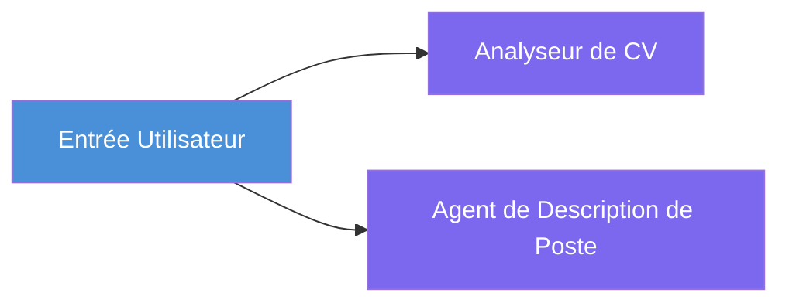
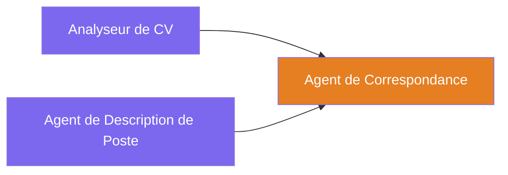
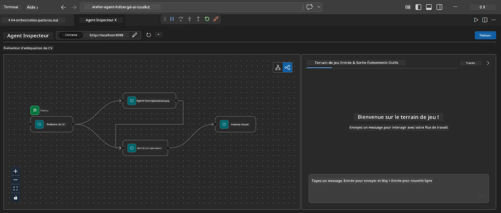
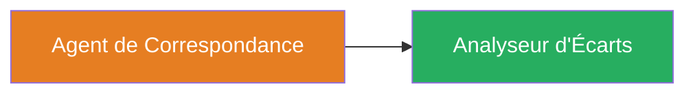
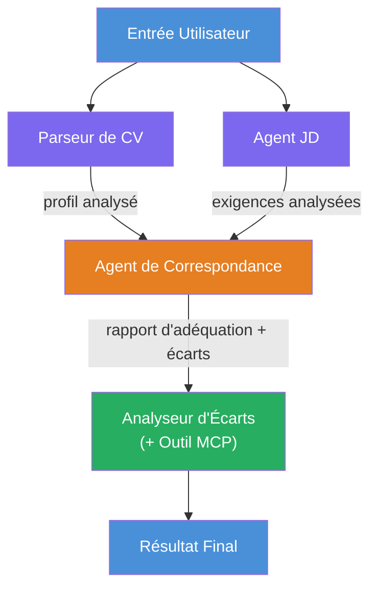
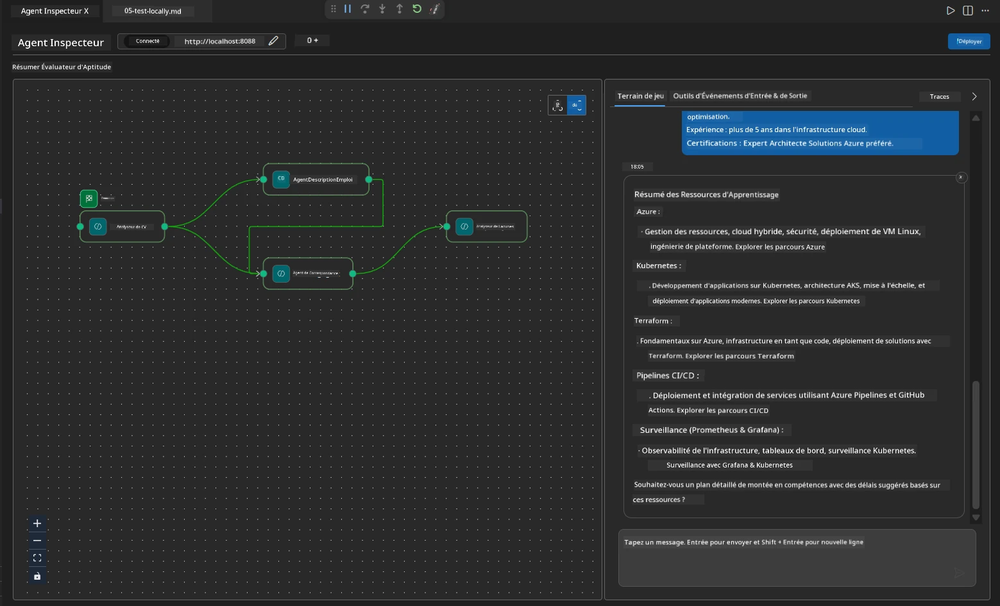

# Module 4 - Modèles d'orchestration

Dans ce module, vous explorez les modèles d'orchestration utilisés dans le Resume Job Fit Evaluator et apprenez à lire, modifier et étendre le graphe du workflow. Comprendre ces modèles est essentiel pour déboguer les problèmes de flux de données et construire vos propres [workflows multi-agents](https://learn.microsoft.com/agent-framework/workflows/).

---

## Modèle 1 : Divergence (fractionnement parallèle)

Le premier modèle dans le workflow est la **divergence** - une seule entrée est envoyée simultanément à plusieurs agents.


Dans le code, cela se produit parce que `resume_parser` est le `start_executor` - il reçoit d'abord le message de l'utilisateur. Ensuite, puisque `jd_agent` et `matching_agent` ont tous deux des arêtes depuis `resume_parser`, le framework redirige la sortie de `resume_parser` vers les deux agents :

```python
.add_edge(resume_parser, jd_agent)         # Sortie ResumeParser → Agent JD
.add_edge(resume_parser, matching_agent)   # Sortie ResumeParser → Agent de correspondance
```

**Pourquoi cela fonctionne :** ResumeParser et JD Agent traitent différents aspects de la même entrée. Les exécuter en parallèle réduit la latence totale par rapport à une exécution séquentielle.

### Quand utiliser la divergence

| Cas d'utilisation | Exemple |
|-------------------|---------|
| Sous-tâches indépendantes | Analyse du CV vs analyse de la description du poste |
| Redondance / vote | Deux agents analysent les mêmes données, un troisième choisit la meilleure réponse |
| Sortie multi-format | Un agent génère du texte, un autre génère du JSON structuré |

---

## Modèle 2 : Convergence (agrégation)

Le deuxième modèle est la **convergence** - plusieurs sorties d'agents sont collectées et envoyées à un agent aval unique.


Dans le code :

```python
.add_edge(resume_parser, matching_agent)   # Sortie de ResumeParser → MatchingAgent
.add_edge(jd_agent, matching_agent)        # Sortie de JD Agent → MatchingAgent
```

**Comportement clé :** Lorsqu’un agent a **deux arêtes entrantes ou plus**, le framework attend automatiquement que **tous** les agents en amont aient terminé avant d’exécuter l’agent aval. MatchingAgent ne démarre pas tant que ResumeParser et JD Agent n'ont pas fini.

### Ce que reçoit MatchingAgent

Le framework concatène les sorties de tous les agents en amont. L'entrée de MatchingAgent ressemble à :

```
[ResumeParser output]
---
Candidate Profile:
  Name: Jane Doe
  Technical Skills: Python, Azure, Kubernetes, ...
  ...

[JobDescriptionAgent output]
---
Role Overview: Senior Cloud Engineer
Required Skills: Python, Azure, Terraform, ...
...
```

> **Note :** Le format exact de concaténation dépend de la version du framework. Les instructions de l'agent doivent être conçues pour gérer à la fois les sorties structurées et non structurées en amont.



---

## Modèle 3 : Chaîne séquentielle

Le troisième modèle est la **chaîne séquentielle** - la sortie d’un agent alimente directement le suivant.


Dans le code :

```python
.add_edge(matching_agent, gap_analyzer)    # Sortie de MatchingAgent → GapAnalyzer
```

C’est le modèle le plus simple. GapAnalyzer reçoit le score de pertinence, les compétences correspondantes/manquantes et les écarts de MatchingAgent. Il appelle ensuite l’[outil MCP](https://learn.microsoft.com/azure/foundry/agents/how-to/tools/model-context-protocol) pour chaque écart afin de récupérer des ressources Microsoft Learn.

---

## Le graphe complet

La combinaison des trois modèles produit le workflow complet :


### Chronologie d’exécution

```mermaid
gantt
    title Chronologie d'exécution de l'agent
    dateFormat X
    axisFormat %s

    section Parallèle
    Analyseur de CV       :rp, 0, 3
    Agent JD              :jd, 0, 2

    section Séquentiel
    Agent de correspondance :ma, 3, 5
    Analyseur d'écart       :ga, 5, 9
```


> Le temps total est approximativement `max(ResumeParser, JD Agent) + MatchingAgent + GapAnalyzer`. GapAnalyzer est généralement le plus lent car il effectue plusieurs appels à l’outil MCP (un par écart).

---

## Lecture du code de WorkflowBuilder

Voici la fonction complète `create_workflow()` de `main.py`, annotée :

```python
def create_workflow(resume_parser, jd_agent, matching_agent, gap_analyzer):
    workflow = (
        WorkflowBuilder(
            name="ResumeJobFitEvaluator",

            # Le premier agent à recevoir l'entrée de l'utilisateur
            start_executor=resume_parser,

            # L'agent(s) dont la sortie devient la réponse finale
            output_executors=[gap_analyzer],
        )
        # Divergence : la sortie de ResumeParser va à la fois à l'agent JD et à MatchingAgent
        .add_edge(resume_parser, jd_agent)
        .add_edge(resume_parser, matching_agent)

        # Convergence : MatchingAgent attend à la fois ResumeParser et l'agent JD
        .add_edge(jd_agent, matching_agent)

        # Séquentiel : la sortie de MatchingAgent alimente GapAnalyzer
        .add_edge(matching_agent, gap_analyzer)

        .build()
    )
    return workflow.as_agent()
```

### Tableau récapitulatif des arêtes

| # | Arête | Modèle | Effet |
|---|-------|--------|-------|
| 1 | `resume_parser → jd_agent` | Divergence | JD Agent reçoit la sortie de ResumeParser (plus l’entrée utilisateur originale) |
| 2 | `resume_parser → matching_agent` | Divergence | MatchingAgent reçoit la sortie de ResumeParser |
| 3 | `jd_agent → matching_agent` | Convergence | MatchingAgent reçoit aussi la sortie de JD Agent (attend les deux) |
| 4 | `matching_agent → gap_analyzer` | Séquentiel | GapAnalyzer reçoit le rapport d’aptitude + la liste des écarts |

---

## Modification du graphe

### Ajouter un nouvel agent

Pour ajouter un cinquième agent (par exemple, un **InterviewPrepAgent** qui génère des questions d’entretien basées sur l’analyse des écarts) :

```python
# 1. Définir les instructions
INTERVIEW_PREP_INSTRUCTIONS = """\
You are the Interview Prep Agent.
Given a gap analysis and fit report, generate 10 targeted interview questions
the candidate should prepare for.
"""

# 2. Créer l'agent (à l'intérieur du bloc async with)
AzureAIAgentClient(
    project_endpoint=PROJECT_ENDPOINT,
    model_deployment_name=MODEL_DEPLOYMENT_NAME,
    credential=credential,
).as_agent(
    name="InterviewPrepAgent",
    instructions=INTERVIEW_PREP_INSTRUCTIONS,
) as interview_prep,

# 3. Ajouter des arêtes dans create_workflow()
.add_edge(matching_agent, interview_prep)   # reçoit le rapport de conformité
.add_edge(gap_analyzer, interview_prep)     # reçoit également les cartes d'écart

# 4. Mettre à jour output_executors
output_executors=[interview_prep],  # maintenant l'agent final
```

### Modifier l’ordre d’exécution

Pour faire exécuter JD Agent **après** ResumeParser (séquentiel au lieu de parallèle) :

```python
# Supprimer : .add_edge(resume_parser, jd_agent) ← existe déjà, le garder
# Supprimez le parallélisme implicite en NE faisant PAS que jd_agent reçoive directement les entrées utilisateur
# Le start_executor envoie d'abord à resume_parser, et jd_agent obtient uniquement
# la sortie de resume_parser via le lien. Cela les rend séquentiels.
```

> **Important :** Le `start_executor` est le seul agent qui reçoit l'entrée brute de l’utilisateur. Tous les autres agents reçoivent la sortie de leurs arêtes amont. Si vous voulez qu’un agent reçoive également l’entrée brute utilisateur, il doit avoir une arête depuis le `start_executor`.

---

## Erreurs courantes dans le graphe

| Erreur | Symptôme | Correction |
|--------|----------|------------|
| Arête manquante vers `output_executors` | Agent s’exécute mais la sortie est vide | Assurez-vous qu’il existe un chemin du `start_executor` à chaque agent dans `output_executors` |
| Dépendance circulaire | Boucle infinie ou timeout | Vérifiez qu’aucun agent ne rétroalimente un agent en amont |
| Agent dans `output_executors` sans arête entrante | Sortie vide | Ajoutez au moins un `add_edge(source, that_agent)` |
| Plusieurs `output_executors` sans convergence | La sortie contient uniquement la réponse d’un agent | Utilisez un agent de sortie unique qui agrège, ou acceptez plusieurs sorties |
| `start_executor` manquant | `ValueError` à la compilation | Spécifiez toujours `start_executor` dans `WorkflowBuilder()` |

---

## Débogage du graphe

### Utilisation de Agent Inspector

1. Démarrez l’agent localement (F5 ou terminal - voir [Module 5](05-test-locally.md)).
2. Ouvrez Agent Inspector (`Ctrl+Shift+P` → **Foundry Toolkit: Open Agent Inspector**).
3. Envoyez un message test.
4. Dans le panneau de réponse de l’Inspector, regardez la **sortie en streaming** - elle montre la contribution de chaque agent en séquence.



### Utilisation du logging

Ajoutez du logging dans `main.py` pour tracer le flux de données :

```python
import logging
logger = logging.getLogger("resume-job-fit")

# Dans create_workflow(), après la construction :
logger.info("Workflow graph built with edges: RP→JD, RP→MA, JD→MA, MA→GA")
```

Les logs du serveur montrent l’ordre d’exécution des agents et les appels à l’outil MCP :

```
INFO:resume-job-fit:Starting Resume -> Job Fit Evaluator HTTP server...
INFO:resume-job-fit:Server running on http://localhost:8088
INFO:agent_framework:Executing agent: ResumeParser
INFO:agent_framework:Executing agent: JobDescriptionAgent
INFO:agent_framework:Waiting for upstream agents: ResumeParser, JobDescriptionAgent
INFO:agent_framework:Executing agent: MatchingAgent
INFO:agent_framework:Executing agent: GapAnalyzer
INFO:agent_framework:Tool call: search_microsoft_learn_for_plan(skill="Kubernetes")
POST https://learn.microsoft.com/api/mcp → 200
INFO:agent_framework:Tool call: search_microsoft_learn_for_plan(skill="Terraform")
POST https://learn.microsoft.com/api/mcp → 200
```

---

### Point de contrôle

- [ ] Vous pouvez identifier les trois modèles d’orchestration dans le workflow : divergence, convergence, et chaîne séquentielle
- [ ] Vous comprenez que les agents avec plusieurs arêtes entrantes attendent que tous les agents amont aient fini
- [ ] Vous pouvez lire le code `WorkflowBuilder` et faire correspondre chaque appel à `add_edge()` au graphe visuel
- [ ] Vous comprenez la chronologie d’exécution : les agents parallèles s’exécutent d’abord, puis l’agrégation, puis la séquence
- [ ] Vous savez comment ajouter un nouvel agent au graphe (définir des instructions, créer l’agent, ajouter des arêtes, mettre à jour la sortie)
- [ ] Vous pouvez identifier les erreurs courantes dans le graphe et leurs symptômes

---

**Précédent :** [03 - Configurer Agents & Environnement](03-configure-agents.md) · **Suivant :** [05 - Testez localement →](05-test-locally.md)

---

<!-- CO-OP TRANSLATOR DISCLAIMER START -->
**Avertissement** :  
Ce document a été traduit à l’aide du service de traduction automatique [Co-op Translator](https://github.com/Azure/co-op-translator). Bien que nous nous efforcions d’assurer l’exactitude, veuillez noter que les traductions automatiques peuvent contenir des erreurs ou des imprécisions. Le document original dans sa langue native doit être considéré comme la source faisant foi. Pour les informations critiques, une traduction professionnelle réalisée par un humain est recommandée. Nous ne sommes pas responsables des malentendus ou interprétations erronées résultant de l’utilisation de cette traduction.
<!-- CO-OP TRANSLATOR DISCLAIMER END -->