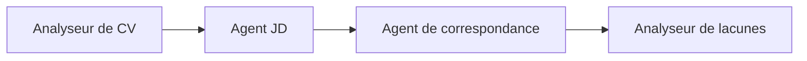
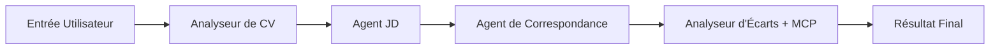

# Module 4 - Modèles d'orchestration

⏱️ ~10 min

Dans ce module, vous explorez les modèles d'orchestration utilisés dans le Resume Job Fit Evaluator et apprenez à lire, modifier et étendre le graphique du workflow. Comprendre ces modèles est essentiel pour déboguer les problèmes de flux de données et construire vos propres [workflows multi-agents](https://learn.microsoft.com/agent-framework/workflows/).

---

## Modèle 1 : chaîne séquentielle

Le modèle fondamental dans le workflow est une **chaîne séquentielle** - la sortie de chaque agent alimente directement le suivant.


```mermaid
flowchart LR
    RP[Analyseur de CV] --> JD[Agent JD]
    JD --> MA[Agent de correspondance]
    MA --> GA[Analyseur de lacunes]
```

Dans le code, chaque appel à `add_edge()` crée une étape dans la chaîne :

```python
.add_edge(resume_executor, jd_executor)       # Sortie de ResumeParser → Agent JD
.add_edge(jd_executor, matching_executor)     # Sortie de Agent JD → MatchingAgent
.add_edge(matching_executor, gap_executor)    # Sortie de MatchingAgent → GapAnalyzer
```

> **Pourquoi séquentiel et non fan-out/fan-in ?** `WorkflowBuilder` utilise une **sémantique OU** pour les arêtes entrantes : un exécuteur en aval se déclenche dès que **l'un** des prédécesseurs se termine. Si `matching_executor` avait deux arêtes entrantes (depuis `resume_executor` et `jd_executor`), il se déclencherait deux fois - une fois lorsque ResumeParser se termine, et une autre fois quand JD Agent se termine - ce qui ferait exécuter GapAnalyzer aussi deux fois et la sortie apparaîtrait en double. Le pipeline séquentiel évite complètement ce problème.

## Modèle 2 : relais de contenu

Parce que `context_mode="last_agent"` signifie que chaque exécuteur ne voit que la sortie de son **prédécesseur direct**, les agents dans une chaîne séquentielle doivent explicitement transmettre les données dont les agents en aval ont besoin.

Dans ce workflow :
- **ResumeParser** copie la description de poste textuellement dans `[JOB DESCRIPTION PASS-THROUGH]` (afin que JD Agent puisse la trouver).
- **JD Agent** copie le `[PARSED RESUME]` textuellement dans `[PARSED RESUME PASS-THROUGH]` (pour que MatchingAgent puisse comparer les deux profils).

```
ResumeParser output
└─ [PARSED RESUME]               ← extracted by JD Agent
└─ [JOB DESCRIPTION PASS-THROUGH] ← extracted by JD Agent

JD Agent output
└─ [JD REQUIREMENTS]             ← extracted by MatchingAgent
└─ [PARSED RESUME PASS-THROUGH]  ← extracted by MatchingAgent
```

Chaque section relais doit être copiée **textuellement** - résumer ou paraphraser casse l'agent en aval qui en dépend.

---

## Le graphique complet

La combinaison des modèles chaîne séquentielle et relais de contenu produit le workflow complet :


```mermaid
flowchart LR
    U[Entrée Utilisateur] --> RP[Analyseur de CV]
    RP --> JD[Agent JD]
    JD --> MA[Agent de Correspondance]
    MA --> GA[Analyseur d'Écarts + MCP]
    GA --> O[Résultat Final]
```

L'Agent Inspector montre cette même structure de graphe lorsque l'agent fonctionne localement. Reportez-vous au [Module 5 - Test en local](05-test-locally.md) pour des captures d'écran.

---

## Lecture du code WorkflowBuilder

La fonction complète `create_workflow()` se trouve dans [`PersonalCareerCopilot/main.py`](../../../../../workshop/lab02-multi-agent/PersonalCareerCopilot/main.py). Les trois appels à `add_edge()` construisent la pipeline séquentielle :

| # | Arête | Effet |
|---|------|--------|
| 1 | `resume_executor → jd_executor` | JD Agent reçoit `[PARSED RESUME]` + `[JOB DESCRIPTION PASS-THROUGH]` |
| 2 | `jd_executor → matching_executor` | MatchingAgent reçoit `[JD REQUIREMENTS]` + `[PARSED RESUME PASS-THROUGH]` |
| 3 | `matching_executor → gap_executor` | GapAnalyzer reçoit le rapport d'adéquation + la liste des écarts |

---

## Modification du graphe

### Ajouter un nouvel agent

Pour ajouter un cinquième agent (par exemple, un **InterviewPrepAgent** après GapAnalyzer) :

1. Définir une constante `INTERVIEW_PREP_INSTRUCTIONS`.
2. Créer les objets `Agent` + `AgentExecutor` (même modèle que les quatre existants).
3. Ajouter `.add_edge(gap_executor, interview_exec)` dans `WorkflowBuilder`.
4. Mettre à jour `output_executors=[interview_exec]`.

> **Important :** `start_executor` est le seul agent qui reçoit directement l'entrée utilisateur brute. Tous les autres agents reçoivent la sortie de leur arête en amont.

---

## Erreurs courantes dans le graphe

| Erreur | Symptôme | Correctif |
|---------|---------|-----|
| Arête manquante vers `output_executors` | L'agent s'exécute mais la sortie est vide | S'assurer qu'il existe un chemin entre `start_executor` et chaque agent dans `output_executors` |
| Dépendance circulaire | Boucle infinie ou délai d'attente | Vérifier qu'aucun agent ne renvoie ses données à un agent en amont |
| Agent dans `output_executors` sans arête entrante | Sortie vide | Ajouter au moins un `add_edge(source, that_agent)` |
| Plusieurs `output_executors` sans fan-in | La sortie contient seulement la réponse d'un agent | Utiliser un agent de sortie unique qui agrège, ou accepter plusieurs sorties |
| `start_executor` manquant | `ValueError` à la compilation | Toujours spécifier `start_executor` dans `WorkflowBuilder()` |

---

## Débogage du graphe

### Utilisation de Agent Inspector

1. Démarrer l'agent localement avec F5.
2. Ouvrir Agent Inspector (`Ctrl+Shift+P` → **Foundry Toolkit: Open Agent Inspector**).
3. Envoyer un message de test.
4. Dans le panneau de réponse de l'Inspector, chercher la **sortie en streaming** - elle montre la contribution de chaque agent dans l'ordre.


### Utilisation des logs

Ajouter des logs dans `main.py` pour tracer le flux de données :

```python
import logging
logger = logging.getLogger("resume-job-fit")

# Dans main(), après avoir construit le flux de travail :
logger.info("Workflow graph built with edges: RP→JD, JD→MA, MA→GA")
```

Les logs du serveur montrent l'ordre d'exécution des agents et les appels aux outils MCP :

```
INFO:agent_framework:Executing agent: ResumeParser
INFO:agent_framework:Executing agent: JobDescriptionAgent
INFO:agent_framework:Executing agent: MatchingAgent
INFO:agent_framework:Executing agent: GapAnalyzer
INFO:agent_framework:Tool call: search_microsoft_learn_for_plan(skill="Kubernetes")
POST https://learn.microsoft.com/api/mcp → 200
INFO:agent_framework:Tool call: search_microsoft_learn_for_plan(skill="Terraform")
POST https://learn.microsoft.com/api/mcp → 200
```

---

### Point de contrôle

- [ ] Vous pouvez identifier les deux modèles d'orchestration dans le workflow : la chaîne séquentielle et le relais de contenu
- [ ] Vous comprenez pourquoi `context_mode="last_agent"` nécessite un relais explicite des données entre les agents
- [ ] Vous savez lire le code `WorkflowBuilder` et associer chaque appel `add_edge()` au graphe visuel
- [ ] Vous savez comment ajouter un nouvel agent à la fin de la pipeline
- [ ] Vous pouvez identifier les erreurs courantes dans le graphe et leurs symptômes

---

**Précédent :** [03 - Configure Agents & Environment](03-configure-agents.md) · **Suivant :** [05 - Test en local →](05-test-locally.md)

---

<!-- CO-OP TRANSLATOR DISCLAIMER START -->
**Avertissement** :
Ce document a été traduit à l'aide du service de traduction automatique [Co-op Translator](https://github.com/Azure/co-op-translator). Bien que nous nous efforçions d'assurer l'exactitude, veuillez noter que les traductions automatisées peuvent contenir des erreurs ou des inexactitudes. Le document original dans sa langue native doit être considéré comme la source faisant autorité. Pour les informations critiques, il est recommandé de recourir à une traduction professionnelle réalisée par un humain. Nous ne saurions être tenus responsables des malentendus ou erreurs d'interprétation découlant de l'utilisation de cette traduction.
<!-- CO-OP TRANSLATOR DISCLAIMER END -->