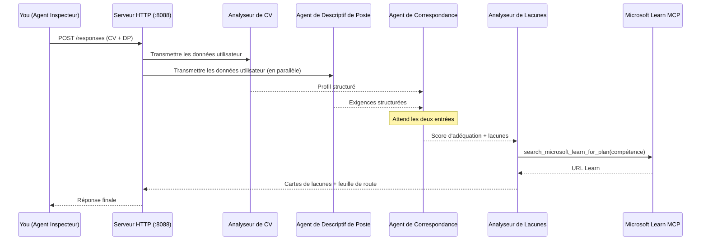
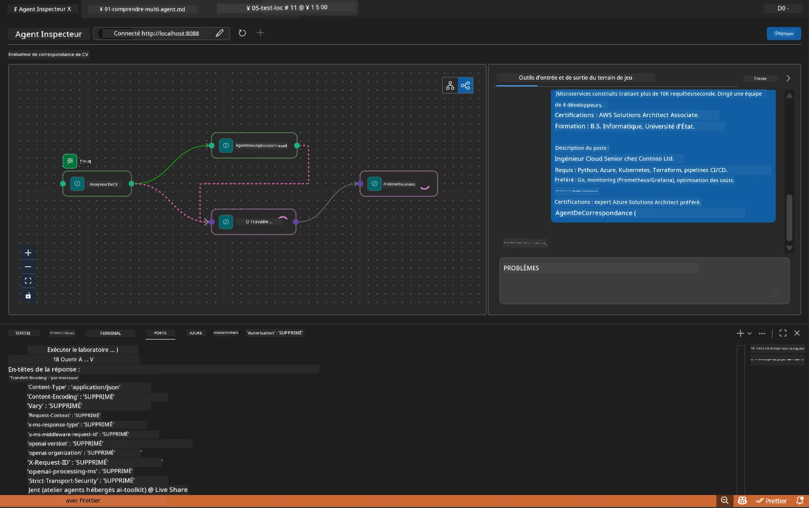

# Module 5 - Testez localement (Multi-Agent)

Dans ce module, vous exécutez le workflow multi-agent localement, le testez avec Agent Inspector, et vérifiez que les quatre agents ainsi que l’outil MCP fonctionnent correctement avant de déployer sur Foundry.

### Ce qui se passe pendant un test local


---

## Étape 1 : Démarrer le serveur d’agent

### Option A : Utiliser la tâche VS Code (recommandé)

1. Appuyez sur `Ctrl+Shift+P` → tapez **Tasks: Run Task** → sélectionnez **Run Lab02 HTTP Server**.
2. La tâche démarre le serveur avec debugpy attaché au port `5679` et l’agent au port `8088`.
3. Attendez que la sortie affiche :

```
INFO:resume-job-fit:Starting Resume -> Job Fit Evaluator HTTP server...
INFO:resume-job-fit:Server running on http://localhost:8088
```

### Option B : Utiliser manuellement le terminal

```powershell
cd workshop\lab02-multi-agent\PersonalCareerCopilot
```

Activez l’environnement virtuel :

**PowerShell (Windows) :**
```powershell
.\.venv\Scripts\Activate.ps1
```

**macOS/Linux :**
```bash
source .venv/bin/activate
```

Démarrer le serveur :

```powershell
python -m debugpy --listen 127.0.0.1:5679 -m agentdev run main.py --verbose --port 8088
```

### Option C : Utiliser F5 (mode débug)

1. Appuyez sur `F5` ou allez dans **Run and Debug** (`Ctrl+Shift+D`).
2. Sélectionnez la configuration de lancement **Lab02 - Multi-Agent** dans le menu déroulant.
3. Le serveur démarre avec le support complet des points d’arrêt.

> **Astuce :** Le mode débug vous permet de poser des points d’arrêt dans `search_microsoft_learn_for_plan()` pour inspecter les réponses MCP, ou dans les chaînes d’instructions de chaque agent pour voir ce que chaque agent reçoit.

---

## Étape 2 : Ouvrir Agent Inspector

1. Appuyez sur `Ctrl+Shift+P` → tapez **Foundry Toolkit: Open Agent Inspector**.
2. Agent Inspector s’ouvre dans un onglet de navigateur à l’adresse `http://localhost:5679`.
3. Vous devriez voir l’interface de l’agent prête à recevoir des messages.

> **Si Agent Inspector ne s’ouvre pas :** Assurez-vous que le serveur est complètement démarré (vous voyez le journal « Server running »). Si le port 5679 est occupé, consultez [Module 8 - Dépannage](08-troubleshooting.md).

---

## Étape 3 : Exécuter les tests rapides

Exécutez ces trois tests dans l’ordre. Chacun teste progressivement plus de la chaîne de traitement.

### Test 1 : CV basique + description de poste

Collez ce qui suit dans Agent Inspector :

```
Resume:
Jane Doe
Senior Software Engineer with 5 years of experience in Python, Django, and AWS.
Built microservices handling 10K+ requests/second. Led a team of 4 developers.
Certifications: AWS Solutions Architect Associate.
Education: B.S. Computer Science, State University.

Job Description:
Senior Cloud Engineer at Contoso Ltd.
Required: Python, Azure, Kubernetes, Terraform, CI/CD pipelines.
Preferred: Go, monitoring (Prometheus/Grafana), cost optimization.
Experience: 5+ years in cloud infrastructure.
Certifications: Azure Solutions Architect Expert preferred.
```

**Structure de sortie attendue :**

La réponse doit contenir la sortie des quatre agents dans l’ordre :

1. **Sortie du Resume Parser** – Profil candidat structuré avec compétences regroupées par catégorie
2. **Sortie de l’agent JD** – Exigences structurées avec compétences requises vs préférées séparées
3. **Sortie de l’agent Matching** – Score de correspondance (0-100) avec détail, compétences trouvées, compétences manquantes, lacunes
4. **Sortie du Gap Analyzer** – Cartes de lacunes individuelles pour chaque compétence manquante, avec URLs Microsoft Learn



### Ce qu’il faut vérifier au Test 1

| Vérification | Attendu | OK ? |
|--------------|---------|-------|
| La réponse contient un score de correspondance | Nombre entre 0 et 100 avec détail | |
| Les compétences trouvées sont listées | Python, CI/CD (partiel), etc. | |
| Les compétences manquantes sont listées | Azure, Kubernetes, Terraform, etc. | |
| Cartes de lacunes pour chaque compétence manquante | Une carte par compétence | |
| URLs Microsoft Learn présentes | Vrais liens `learn.microsoft.com` | |
| Pas de messages d’erreur dans la réponse | Sortie propre et structurée | |

### Test 2 : Vérifier l’exécution de l’outil MCP

Pendant que le Test 1 tourne, vérifiez les entrées du journal dans le **terminal serveur** :

```
GET https://learn.microsoft.com/api/mcp → 405 (Method Not Allowed)
POST https://learn.microsoft.com/api/mcp → 200
DELETE https://learn.microsoft.com/api/mcp → 405 (Method Not Allowed)
```

| Entrée journal | Signification | Attendu ? |
|---------------|---------------|-----------|
| `GET ... → 405` | Le client MCP teste avec GET lors de l’initialisation | Oui - normal |
| `POST ... → 200` | Appel réel de l’outil vers le serveur MCP Microsoft Learn | Oui - c’est l’appel réel |
| `DELETE ... → 405` | Le client MCP teste avec DELETE pendant le nettoyage | Oui - normal |
| `POST ... → 4xx/5xx` | L’appel de l’outil a échoué | Non - voir [Dépannage](08-troubleshooting.md) |

> **Point clé :** Les lignes `GET 405` et `DELETE 405` sont un **comportement attendu**. Ne vous inquiétez que si les appels `POST` retournent un code différent de 200.

### Test 3 : Cas limite - candidat très adapté

Collez un CV qui correspond étroitement à la description de poste pour vérifier que le GapAnalyzer gère les scénarios de haute adéquation :

```
Resume:
Alex Chen
Senior Cloud Engineer with 7 years of experience.
Skills: Python, Azure (AKS, Functions, DevOps), Kubernetes, Terraform, CI/CD (GitHub Actions, Azure Pipelines), Go, Prometheus, Grafana, cost optimization.
Certifications: Azure Solutions Architect Expert, Azure DevOps Engineer Expert.
Led infrastructure migration to Azure for 3 enterprise clients.
Education: M.S. Computer Science, Tech University.

Job Description:
Senior Cloud Engineer at Contoso Ltd.
Required: Python, Azure, Kubernetes, Terraform, CI/CD pipelines.
Preferred: Go, monitoring (Prometheus/Grafana), cost optimization.
Experience: 5+ years in cloud infrastructure.
Certifications: Azure Solutions Architect Expert preferred.
```

**Comportement attendu :**
- Le score de correspondance doit être **≥ 80** (la plupart des compétences correspondent)
- Les cartes de lacunes doivent se concentrer sur la finition/préparation à l’entretien plutôt que sur l’apprentissage fondamental
- Les instructions du GapAnalyzer indiquent : "Si fit >= 80, se concentrer sur la finition/préparation à l’entretien"

---

## Étape 4 : Vérifier la complétude de la sortie

Après les tests, vérifiez que la sortie correspond aux critères suivants :

### Checklist de la structure de sortie

| Section | Agent | Présent ? |
|---------|-------|-----------|
| Profil candidat | Resume Parser | |
| Compétences techniques (groupées) | Resume Parser | |
| Vue d’ensemble du rôle | JD Agent | |
| Compétences requises vs préférées | JD Agent | |
| Score de correspondance avec détail | Matching Agent | |
| Compétences trouvées / manquantes / partielles | Matching Agent | |
| Carte de lacune par compétence manquante | Gap Analyzer | |
| URLs Microsoft Learn dans les cartes de lacunes | Gap Analyzer (MCP) | |
| Ordre d’apprentissage (numéroté) | Gap Analyzer | |
| Résumé du calendrier | Gap Analyzer | |

### Problèmes courants à ce stade

| Problème | Cause | Solution |
|----------|-------|----------|
| Une seule carte de lacune (les autres tronquées) | Instructions du GapAnalyzer manquent le paragraphe CRITICAL | Ajoutez le paragraphe `CRITICAL:` dans `GAP_ANALYZER_INSTRUCTIONS` - voir [Module 3](03-configure-agents.md) |
| Pas d’URLs Microsoft Learn | Point de terminaison MCP inaccessible | Vérifiez votre connexion Internet. Vérifiez que `MICROSOFT_LEARN_MCP_ENDPOINT` dans `.env` est `https://learn.microsoft.com/api/mcp` |
| Réponse vide | `PROJECT_ENDPOINT` ou `MODEL_DEPLOYMENT_NAME` non défini | Vérifiez les valeurs dans `.env`. Exécutez `echo $env:PROJECT_ENDPOINT` dans le terminal |
| Score de correspondance nul ou manquant | MatchingAgent n’a reçu aucune donnée en entrée | Vérifiez que `add_edge(resume_parser, matching_agent)` et `add_edge(jd_agent, matching_agent)` existent dans `create_workflow()` |
| Agent démarre puis s’arrête immédiatement | Erreur d’import ou dépendance manquante | Exécutez `pip install -r requirements.txt` à nouveau. Vérifiez les traces d’erreur dans le terminal |
| Erreur `validate_configuration` | Variables d’environnement manquantes | Créez un fichier `.env` avec `PROJECT_ENDPOINT=<votre-endpoint>` et `MODEL_DEPLOYMENT_NAME=<votre-modèle>` |

---

## Étape 5 : Tester avec vos propres données (optionnel)

Essayez de coller votre propre CV et une vraie description de poste. Cela permet de vérifier :

- Que les agents gèrent différents formats de CV (chronologique, fonctionnel, hybride)
- Que l’agent JD supporte différents styles de descriptions (puces, paragraphes, structurées)
- Que l’outil MCP retourne des ressources pertinentes pour des compétences réelles
- Que les cartes de lacunes sont personnalisées à votre profil spécifique

> **Note confidentialité :** En test local, vos données restent sur votre machine et sont envoyées uniquement à votre déploiement Azure OpenAI. Elles ne sont ni journalisées ni stockées par l’infrastructure de l’atelier. Utilisez des noms fictifs si vous préférez (par exemple, "Jane Doe" au lieu de votre vrai nom).

---

### Point de contrôle

- [ ] Serveur démarré avec succès au port `8088` (le journal affiche "Server running")
- [ ] Agent Inspector ouvert et connecté à l’agent
- [ ] Test 1 : Réponse complète avec score de correspondance, compétences trouvées/manquantes, cartes de lacunes et URLs Microsoft Learn
- [ ] Test 2 : Les journaux MCP affichent `POST ... → 200` (appels outils réussis)
- [ ] Test 3 : Candidat très adapté obtient un score ≥ 80 avec recommandations axées sur la finition
- [ ] Toutes les cartes de lacunes présentes (une par compétence manquante, pas de troncature)
- [ ] Pas d’erreurs ou traces de pile dans le terminal serveur

---

**Précédent :** [04 - Orchestration Patterns](04-orchestration-patterns.md) · **Suivant :** [06 - Deploy to Foundry →](06-deploy-to-foundry.md)

---

<!-- CO-OP TRANSLATOR DISCLAIMER START -->
**Avertissement** :  
Ce document a été traduit à l'aide du service de traduction automatique [Co-op Translator](https://github.com/Azure/co-op-translator). Bien que nous nous efforcions d'assurer l'exactitude, veuillez noter que les traductions automatisées peuvent contenir des erreurs ou des inexactitudes. Le document original dans sa langue native doit être considéré comme la source faisant foi. Pour les informations critiques, une traduction professionnelle réalisée par un humain est recommandée. Nous ne saurions être tenus responsables des malentendus ou des erreurs d'interprétation résultant de l'utilisation de cette traduction.
<!-- CO-OP TRANSLATOR DISCLAIMER END -->