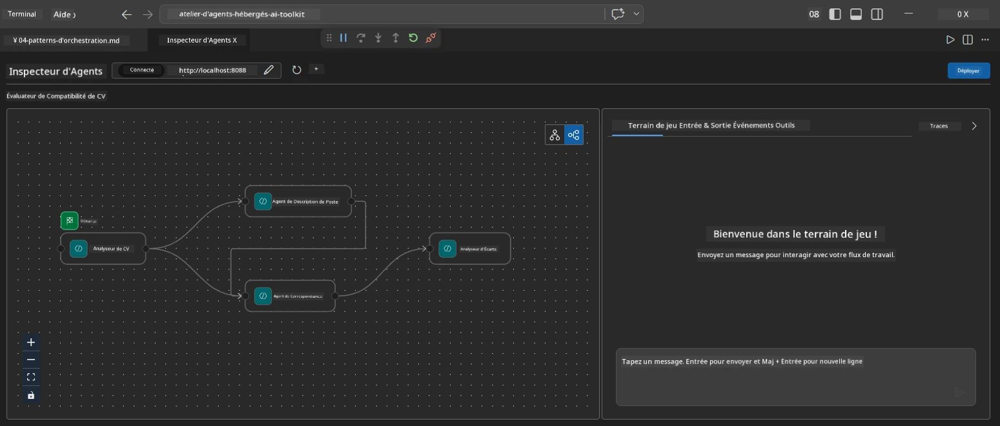
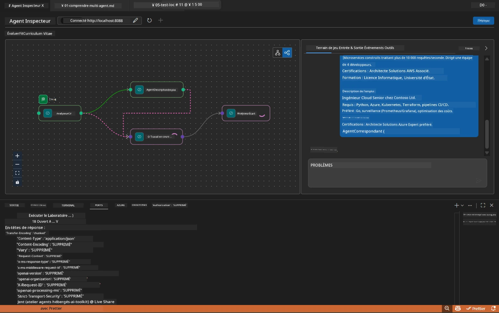
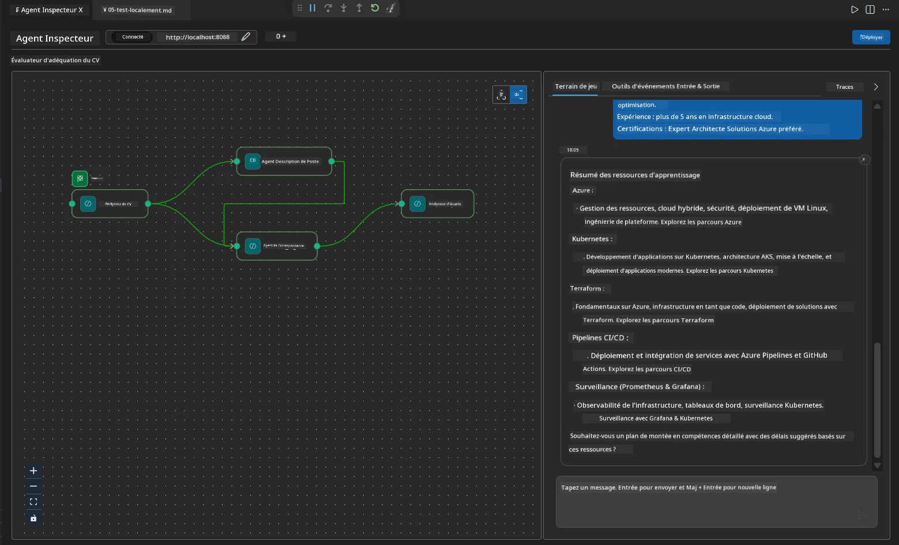

# Module 5 - Tester localement

⏱️ ~15 min

Dans ce module, vous exécutez le workflow multi-agent localement, le testez avec Agent Inspector, et vérifiez que les quatre agents ainsi que l’outil MCP fonctionnent correctement avant le déploiement.

---

## Étape 1 : Démarrer le serveur agent

### Option A : Utiliser la tâche VS Code (recommandé)

1. Ouvrez `workshop/lab02-multi-agent/PersonalCareerCopilot/` en tant que dossier VS Code.
2. Appuyez sur `Ctrl+Shift+P` → tapez **Tasks: Run Task** → sélectionnez **Run Agent HTTP Server**.
3. La tâche démarre le serveur avec debugpy attaché sur le port `5679` et l’agent sur le port `8088`.
4. Attendez que la sortie affiche :

```
INFO:resume-job-fit:Starting Resume -> Job Fit Evaluator HTTP server...
INFO:resume-job-fit:Server running on http://localhost:8088
```

### Option B : Utiliser F5 (mode débogage)

1. Appuyez sur `F5` → sélectionnez **Debug Local Agent HTTP Server**.
2. Le serveur démarre avec un support complet des points d’arrêt – utile pour inspecter les réponses MCP ou les sorties des agents.

---

## Étape 2 : Ouvrir Agent Inspector

1. Appuyez sur `Ctrl+Shift+P` → tapez **Foundry Toolkit: Open Agent Inspector**.
2. Agent Inspector s’ouvre en tant que panneau VS Code connecté à `http://localhost:8088`.
3. Vous devriez voir l’interface de l’agent prête à recevoir des messages.



> **Si Agent Inspector ne s’ouvre pas :** Assurez-vous que le serveur est complètement démarré (vous voyez le log "Server running"). Si le port 5679 est occupé, consultez [Module 8 - Dépannage](08-troubleshooting.md).

---

## Étape 2b : (Optionnel) Ouvrir le visualiseur de workflow

Le Foundry Toolkit inclut un **Visualiseur de Workflow** en temps réel qui montre comment les agents interagissent lors de l’exécution du graphe. C’est particulièrement utile pour le débogage multi-agent.

1. Appuyez sur `Ctrl+Shift+P` → tapez **Foundry Toolkit: Open Visualizer for Hosted Agents**.
2. Un nouvel onglet VS Code s’ouvre affichant le graphe d’exécution en direct.
3. Lorsque vous envoyez des messages dans Agent Inspector, le visualiseur se met à jour automatiquement : les nœuds verts indiquent les agents terminés, et les arêtes animées montrent le flux de données entre eux.

> **Conflit de port :** Si le port du visualiseur est déjà utilisé, changez-le dans Paramètres VS Code → **Extensions** → **Microsoft Foundry Configuration** → **Hosted Agents: Visualizer Port**.

---

## Étape 3 : Exécuter des tests rapides

Exécutez ces trois tests dans l’ordre. Chacun teste progressivement plus du workflow.

### Test 1 : CV basique + description de poste

Collez ce qui suit dans Agent Inspector :

```
Resume:
Jane Doe
Senior Software Engineer with 5 years of experience in Python, Django, and AWS.
Built microservices handling 10K+ requests/second. Led a team of 4 developers.
Certifications: AWS Solutions Architect Associate.
Education: B.S. Computer Science, State University.

Job Description:
Senior Cloud Engineer at Contoso Ltd.
Required: Python, Azure, Kubernetes, Terraform, CI/CD pipelines.
Preferred: Go, monitoring (Prometheus/Grafana), cost optimization.
Experience: 5+ years in cloud infrastructure.
Certifications: Azure Solutions Architect Expert preferred.
```

**Structure de sortie attendue :**

La réponse doit contenir la sortie des quatre agents en séquence :

1. **Sortie du Parseur de CV** – Deux sections étiquetées : `[PARSED RESUME]` (profil du candidat avec compétences regroupées) et `[JOB DESCRIPTION PASS-THROUGH]` (texte JD à l’identique qui alimente l’agent JD)
2. **Sortie de l’agent JD** – Exigences structurées avec compétences requises versus préférées séparées
3. **Sortie de l’agent Matching** – Score d’adéquation (0-100) avec ventilation, compétences correspondantes, compétences manquantes, écarts
4. **Sortie de l’Analyseur d’écarts** – Cartes d’écart individuelles pour chaque compétence manquante, chacune avec des URLs Microsoft Learn





### À vérifier dans le Test 1

| Vérifier | Attendu | Réussi ? |
|---------|---------|----------|
| La réponse contient un score d’adéquation | Nombre entre 0-100 avec ventilation | |
| Les compétences correspondantes sont listées | Python, CI/CD (partiel), etc. | |
| Les compétences manquantes sont listées | Azure, Kubernetes, Terraform, etc. | |
| Cartes d’écarts présentes pour chaque compétence manquante | Une carte par compétence | |
| URLs Microsoft Learn présentes | Liens réels `learn.microsoft.com` | |
| Pas de messages d’erreur dans la réponse | Sortie structurée propre | |

### Test 2 : Cas limite - candidat très adapté

Collez un CV qui correspond étroitement à la JD pour vérifier que l’Analyseur d’écarts gère les scénarios de haute adéquation :

```
Resume:
Alex Chen
Senior Cloud Engineer with 7 years of experience.
Skills: Python, Azure (AKS, Functions, DevOps), Kubernetes, Terraform, CI/CD (GitHub Actions, Azure Pipelines), Go, Prometheus, Grafana, cost optimization.
Certifications: Azure Solutions Architect Expert, Azure DevOps Engineer Expert.
Led infrastructure migration to Azure for 3 enterprise clients.
Education: M.S. Computer Science, Tech University.

Job Description:
Senior Cloud Engineer at Contoso Ltd.
Required: Python, Azure, Kubernetes, Terraform, CI/CD pipelines.
Preferred: Go, monitoring (Prometheus/Grafana), cost optimization.
Experience: 5+ years in cloud infrastructure.
Certifications: Azure Solutions Architect Expert preferred.
```

**Comportement attendu :**
- Le score d’adéquation devrait être **80+** (la plupart des compétences correspondent)
- Les cartes d’écarts devraient se concentrer sur la finition/la préparation à l’entretien plutôt que sur l’apprentissage fondamental
- Les instructions de l’Analyseur d’écarts indiquent : "Si adéquation >= 80, se concentrer sur la finition/la préparation à l’entretien"

---

## Étape 4 : Tester avec vos propres données (optionnel)

Essayez de coller votre propre CV et une vraie description de poste. Cela permet de vérifier :

- Que les agents gèrent différents formats de CV (chronologique, fonctionnel, hybride)
- Que l’agent JD gère différents styles de JD (points par puces, paragraphes, structurés)
- Que l’outil MCP retourne des ressources pertinentes pour les compétences réelles
- Que les cartes d’écarts sont personnalisées à votre parcours spécifique

> **Confidentialité - Chemin A (Foundry cloud) :** Le texte du CV et de la JD est envoyé à votre déploiement Azure OpenAI pour inférence. Il n’est pas journalisé ni stocké par l’infrastructure de l’atelier. Utilisez des noms fictifs (ex. "Jane Doe") si vous préférez.
>
> **Confidentialité - Chemin B (Foundry Local) :** Les quatre inférences agents tournent entièrement sur votre appareil. Votre CV et la description du poste **ne quittent jamais votre machine**. La seule requête sortante est celle de l’outil MCP qui récupère des ressources depuis `https://learn.microsoft.com/api/mcp` ; cette requête contient uniquement le nom de la compétence, pas vos données personnelles.

---

### Point de contrôle

- [ ] Serveur démarré avec succès sur le port `8088` (le log affiche "Server running")
- [ ] Agent Inspector ouvert et connecté à l’agent
- [ ] Test 1 : Réponse complète avec score d’adéquation, compétences correspondantes/manquantes, cartes d’écarts, et URLs Microsoft Learn
- [ ] Test 2 : Candidat très adapté obtient un score 80+ avec recommandations axées sur la finition
- [ ] Toutes les cartes d’écarts présentes (une par compétence manquante, pas de troncature)
- [ ] Pas d’erreurs ni traces de pile dans le terminal serveur

---

**Précédent :** [04 - Orchestration Patterns](04-orchestration-patterns.md) · **Suivant :** [06 - Deploy to Foundry →](06-deploy-to-foundry.md)

---

<!-- CO-OP TRANSLATOR DISCLAIMER START -->
**Avertissement** :
Ce document a été traduit à l'aide du service de traduction automatique [Co-op Translator](https://github.com/Azure/co-op-translator). Bien que nous nous efforçions d'assurer l'exactitude, veuillez noter que les traductions automatisées peuvent contenir des erreurs ou des inexactitudes. Le document original dans sa langue native doit être considéré comme la source faisant autorité. Pour les informations critiques, il est recommandé de recourir à une traduction professionnelle réalisée par un humain. Nous ne saurions être tenus responsables des malentendus ou erreurs d'interprétation découlant de l'utilisation de cette traduction.
<!-- CO-OP TRANSLATOR DISCLAIMER END -->