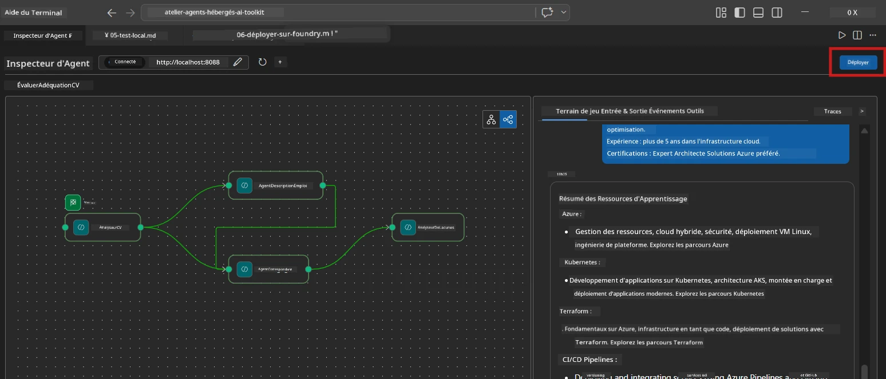
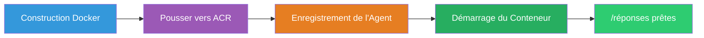
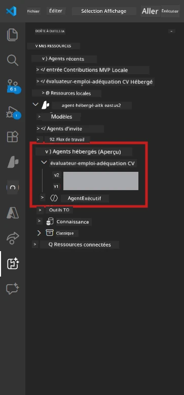

# Module 6 - Déployer sur Foundry Agent Service

Dans ce module, vous déployez votre workflow multi-agent testé localement sur [Microsoft Foundry](https://learn.microsoft.com/azure/foundry/agents/concepts/hosted-agents) en tant qu'**Agent Hébergé**. Le processus de déploiement construit une image de conteneur Docker, la pousse vers le [Azure Container Registry (ACR)](https://learn.microsoft.com/azure/container-registry/container-registry-intro), et crée une version d'agent hébergé dans le [Foundry Agent Service](https://learn.microsoft.com/azure/foundry/agents/how-to/publish-agent).

> **Différence clé avec le Lab 01 :** Le processus de déploiement est identique. Foundry considère votre workflow multi-agent comme un seul agent hébergé - la complexité est à l'intérieur du conteneur, mais la surface de déploiement est le même point d'extrémité `/responses`.

---

## Vérification des prérequis

Avant de déployer, vérifiez chaque élément ci-dessous :

1. **L'agent passe les tests locaux de base :**
   - Vous avez complété les 3 tests dans [Module 5](05-test-locally.md) et le workflow a produit une sortie complète avec cartes d'écart et URL Microsoft Learn.

2. **Vous avez le rôle [Azure AI User](https://learn.microsoft.com/azure/foundry/concepts/rbac-foundry) :**
   - Assigné dans [Lab 01, Module 2](../../lab01-single-agent/docs/02-create-foundry-project.md). Vérifiez :
   - [Portail Azure](https://portal.azure.com) → votre ressource **projet** Foundry → **Contrôle d’accès (IAM)** → **Attributions de rôles** → confirmez que **[Azure AI User](https://aka.ms/foundry-ext-project-role)** est listé pour votre compte.

3. **Vous êtes connecté à Azure dans VS Code :**
   - Vérifiez l'icône de comptes en bas à gauche de VS Code. Votre nom de compte doit être visible.

4. **Le fichier `agent.yaml` a les bonnes valeurs :**
   - Ouvrez `PersonalCareerCopilot/agent.yaml` et vérifiez :
     ```yaml
     environment_variables:
       - name: PROJECT_ENDPOINT
         value: ${PROJECT_ENDPOINT}
       - name: MODEL_DEPLOYMENT_NAME
         value: ${MODEL_DEPLOYMENT_NAME}
     ```
   - Ces valeurs doivent correspondre aux variables d’environnement que lit votre `main.py`.

5. **Le fichier `requirements.txt` a les bonnes versions :**
   ```
   agent-framework-azure-ai==1.0.0rc3
   agent-framework-core==1.0.0rc3
   azure-ai-agentserver-agentframework==1.0.0b16
   azure-ai-agentserver-core==1.0.0b16
   debugpy
   agent-dev-cli --pre
   ```

---

## Étape 1 : Démarrer le déploiement

### Option A : Déployer depuis l’Agent Inspector (recommandé)

Si l’agent tourne via F5 avec l’Agent Inspector ouvert :

1. Regardez en **haut à droite** du panneau Agent Inspector.
2. Cliquez sur le bouton **Déployer** (icône nuage avec une flèche vers le haut ↑).
3. L’assistant de déploiement s’ouvre.



### Option B : Déployer depuis la palette de commandes

1. Appuyez sur `Ctrl+Shift+P` pour ouvrir la **Palette de commandes**.
2. Tapez : **Microsoft Foundry : Déployer un agent hébergé** et sélectionnez-le.
3. L’assistant de déploiement s’ouvre.

---

## Étape 2 : Configurer le déploiement

### 2.1 Sélectionner le projet cible

1. Un menu déroulant affiche vos projets Foundry.
2. Sélectionnez le projet que vous avez utilisé pendant l’atelier (par exemple, `workshop-agents`).

### 2.2 Sélectionner le fichier agent conteneurisé

1. Vous serez invité à sélectionner le point d’entrée de l’agent.
2. Naviguez jusqu’à `workshop/lab02-multi-agent/PersonalCareerCopilot/` et choisissez **`main.py`**.

### 2.3 Configurer les ressources

| Paramètre | Valeur recommandée | Notes |
|---------|------------------|-------|
| **CPU** | `0.25` | Par défaut. Les workflows multi-agents n’ont pas besoin de plus de CPU car les appels aux modèles sont limités par les entrées/sorties |
| **Mémoire** | `0.5Gi` | Par défaut. Augmentez à `1Gi` si vous ajoutez de gros outils de traitement de données |

---

## Étape 3 : Confirmer et déployer

1. L’assistant affiche un résumé du déploiement.
2. Passez en revue puis cliquez sur **Confirmer et déployer**.
3. Suivez la progression dans VS Code.

### Ce qui se passe pendant le déploiement

Regardez le panneau **Sortie** de VS Code (sélectionnez le menu déroulant "Microsoft Foundry") :


1. **Construction Docker** - Construit le conteneur à partir de votre `Dockerfile` :
   ```
   Step 1/6 : FROM python:3.14-slim
   Step 2/6 : WORKDIR /app
   ...
   Successfully built abc123def456
   ```

2. **Push Docker** - Pousse l’image vers ACR (1 à 3 minutes lors du premier déploiement).

3. **Enregistrement de l’agent** - Foundry crée un agent hébergé en utilisant les métadonnées `agent.yaml`. Le nom de l’agent est `resume-job-fit-evaluator`.

4. **Démarrage du conteneur** - Le conteneur démarre dans l’infrastructure gérée de Foundry avec une identité gérée par le système.

> **Le premier déploiement est plus lent** (Docker pousse toutes les couches). Les déploiements suivants réutilisent les couches en cache et sont plus rapides.

### Notes spécifiques au multi-agent

- **Les quatre agents sont dans un seul conteneur.** Foundry voit un seul agent hébergé. Le graphe WorkflowBuilder s’exécute en interne.
- **Les appels MCP sortent vers l’extérieur.** Le conteneur a besoin d’un accès internet pour atteindre `https://learn.microsoft.com/api/mcp`. L’infrastructure gérée de Foundry fournit cela par défaut.
- **[Identité gérée](https://learn.microsoft.com/python/api/overview/azure/identity-readme#managed-identity-support).** Dans l’environnement hébergé, `get_credential()` dans `main.py` retourne `ManagedIdentityCredential()` (car `MSI_ENDPOINT` est défini). C’est automatique.

---

## Étape 4 : Vérifier le statut du déploiement

1. Ouvrez la barre latérale **Microsoft Foundry** (cliquez sur l’icône Foundry dans la barre d’activité).
2. Développez **Agents hébergés (Preview)** sous votre projet.
3. Trouvez **resume-job-fit-evaluator** (ou le nom de votre agent).
4. Cliquez sur le nom de l’agent → développez les versions (par exemple, `v1`).
5. Cliquez sur la version → vérifiez les **Détails du conteneur** → **Statut** :



| Statut | Signification |
|--------|---------|
| **Démarré** / **En cours** | Le conteneur tourne, l’agent est prêt |
| **En attente** | Le conteneur est en cours de démarrage (attendez 30-60 secondes) |
| **Échec** | Le conteneur n’a pas réussi à démarrer (vérifiez les logs - voir ci-dessous) |

> **Le démarrage multi-agent prend plus de temps** que pour un agent unique car le conteneur crée 4 instances d’agent au démarrage. "En attente" jusqu’à 2 minutes est normal.

---

## Erreurs courantes de déploiement et corrections

### Erreur 1 : Permission refusée - `agents/write`

```
Error: lacks the required data action 
Microsoft.CognitiveServices/accounts/AIServices/agents/write
```

**Correction :** Assignez le rôle **[Azure AI User](https://learn.microsoft.com/azure/foundry/concepts/rbac-foundry)** au niveau du **projet**. Voir [Module 8 - Dépannage](08-troubleshooting.md) pour les instructions pas à pas.

### Erreur 2 : Docker non lancé

```
Error: Docker build failed / Cannot connect to Docker daemon
```

**Correction :**
1. Lancez Docker Desktop.
2. Attendez que "Docker Desktop is running" apparaisse.
3. Vérifiez : `docker info`
4. **Windows :** Assurez-vous que le backend WSL 2 est activé dans les paramètres Docker Desktop.
5. Réessayez.

### Erreur 3 : Échec d’installation pip pendant la construction Docker

```
Error: Could not find a version that satisfies the requirement agent-dev-cli
```

**Correction :** Le flag `--pre` dans `requirements.txt` est traité différemment dans Docker. Assurez-vous que votre `requirements.txt` contient :
```
agent-dev-cli --pre
```

Si Docker échoue toujours, créez un fichier `pip.conf` ou passez le `--pre` via un argument de build. Voir [Module 8](08-troubleshooting.md).

### Erreur 4 : L’outil MCP échoue dans l’agent hébergé

Si Gap Analyzer cesse de produire des URL Microsoft Learn après déploiement :

**Cause racine :** Une politique réseau peut bloquer le HTTPS sortant depuis le conteneur.

**Correction :**
1. Ceci n’est généralement pas un problème avec la configuration par défaut de Foundry.
2. Si cela arrive, vérifiez si le réseau virtuel du projet Foundry possède un NSG bloquant le HTTPS sortant.
3. L’outil MCP possède des URLs de secours intégrées, donc l’agent produira toujours une sortie (sans URLs en direct).

---

### Point de contrôle

- [ ] La commande de déploiement s’est terminée sans erreur dans VS Code
- [ ] L’agent apparaît sous **Agents hébergés (Preview)** dans la barre latérale Foundry
- [ ] Le nom de l’agent est `resume-job-fit-evaluator` (ou le nom choisi)
- [ ] Le statut du conteneur montre **Démarré** ou **En cours**
- [ ] (En cas d’erreurs) Vous avez identifié l’erreur, appliqué la correction et redéployé avec succès

---

**Précédent :** [05 - Tester localement](05-test-locally.md) · **Suivant :** [07 - Vérifier dans Playground →](07-verify-in-playground.md)

---

<!-- CO-OP TRANSLATOR DISCLAIMER START -->
**Clause de non-responsabilité** :  
Ce document a été traduit à l'aide du service de traduction automatique [Co-op Translator](https://github.com/Azure/co-op-translator). Bien que nous nous efforcions d'assurer la précision, veuillez noter que les traductions automatiques peuvent contenir des erreurs ou des inexactitudes. Le document original dans sa langue d'origine doit être considéré comme la source faisant autorité. Pour les informations critiques, une traduction professionnelle réalisée par un humain est recommandée. Nous n'assumons aucune responsabilité pour toute mauvaise compréhension ou interprétation résultant de l'utilisation de cette traduction.
<!-- CO-OP TRANSLATOR DISCLAIMER END -->