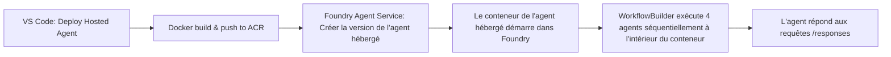
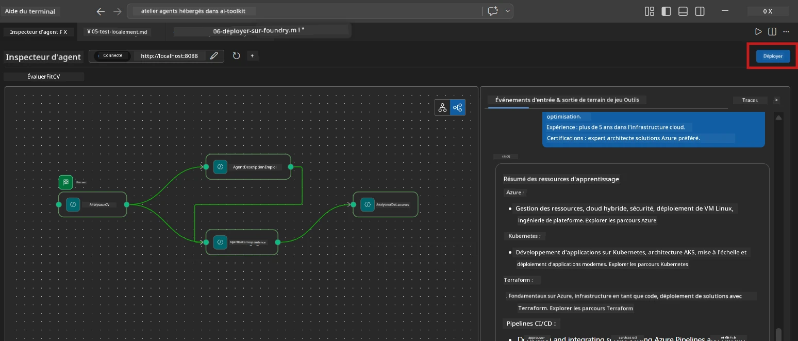
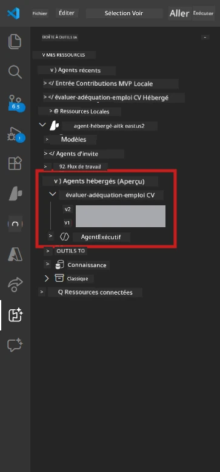

# Module 6 - Déployer sur Foundry Agent Service

⏱️ ~10 min

Dans ce module, vous déployez votre workflow multi-agent testé localement sur [Microsoft Foundry](https://learn.microsoft.com/azure/foundry/agents/concepts/hosted-agents) en tant que **Agent Hébergé**. Le processus de déploiement construit une image de conteneur Docker, la pousse vers [Azure Container Registry (ACR)](https://learn.microsoft.com/azure/container-registry/container-registry-intro), et crée une version agent hébergé dans [Foundry Agent Service](https://learn.microsoft.com/azure/foundry/agents/how-to/publish-agent).

> **Différence clé par rapport au Lab 01 :** Le processus de déploiement est identique. Foundry considère votre workflow multi-agent comme un seul agent hébergé - la complexité est à l'intérieur du conteneur, mais la surface de déploiement est la même endpoint `/responses`.

### Pipeline de déploiement


```mermaid
flowchart LR
    A[VS Code: Deploy Hosted Agent] --> B[Docker build & push to ACR]
    B --> C[Foundry Agent Service: Créer la version de l'agent hébergé]
    C --> D[Le conteneur de l'agent hébergé démarre dans Foundry]
    D --> E[WorkflowBuilder exécute 4 agents séquentiellement à l'intérieur du conteneur]
    E --> F[L'agent répond aux requêtes /responses]
```

---

## Vérification des prérequis

Avant de déployer, vérifiez chaque élément ci-dessous :

1. **L’agent réussit les tests simples locaux :**
   - Vous avez complété les 3 tests dans [Module 5](05-test-locally.md) et le workflow a produit une sortie complète avec des cartes d’écart et des URL Microsoft Learn.

2. **Vous avez le rôle [Foundry User](https://learn.microsoft.com/azure/foundry/concepts/rbac-foundry)** (pour déployer, vous avez besoin au minimum du rôle **Foundry Project Manager** au niveau projet) :

   > **Note :** Les rôles RBAC Foundry ont été récemment renommés - **Foundry User**, **Foundry Owner** et **Foundry Project Manager** étaient auparavant nommés Azure AI User, Azure AI Owner et Azure AI Project Manager. Les IDs de rôles et permissions restent inchangés.

   - Vérifiez dans le [Portail Azure](https://portal.azure.com) → votre ressource de **projet** Foundry → **Contrôle d’accès (IAM)** → **Attributions des rôles** → confirmez que **Foundry User** (ou supérieur) est listé pour votre compte.

3. **Vous êtes connecté à Azure dans VS Code :**
   - Vérifiez l’icône Comptes dans le coin inférieur gauche de VS Code. Le nom de votre compte doit être visible.

4. **`agent.yaml` a les bonnes valeurs :**
   - Ouvrez `PersonalCareerCopilot/agent.yaml` et vérifiez :
     ```yaml
     environment_variables:
       - name: AZURE_AI_MODEL_DEPLOYMENT_NAME
         value: ${AZURE_AI_MODEL_DEPLOYMENT_NAME}
     ```
   - `FOUNDRY_PROJECT_ENDPOINT` n’est **pas** listé ici - Foundry l’injecte à l’exécution. Seul `AZURE_AI_MODEL_DEPLOYMENT_NAME` doit être déclaré.

5. **`requirements.txt` a les bonnes versions :**
   ```
   agent-framework-foundry
   agent-framework-foundry-hosting
   mcp<2,>=1.24.0
   debugpy
   ```

---

## Étape 1 : Démarrer le déploiement

### Option A : Déployer depuis l’Agent Inspector (recommandé)

Si l’agent tourne via F5 avec l’Agent Inspector ouvert :

1. Regardez en **haut à droite** du panneau Agent Inspector.
2. Cliquez sur le bouton **Déployer** (icône nuage avec une flèche vers le haut ↑).
3. L’assistant de déploiement s’ouvre.



### Option B : Déployer depuis la Palette de commandes

1. Appuyez sur `Ctrl+Shift+P` pour ouvrir la **Palette de commandes**.
2. Tapez : **Foundry Toolkit: Deploy Hosted Agent** et sélectionnez-le.
3. L’assistant de déploiement s’ouvre.

---

## Étape 2 : Configurer le déploiement

### 2.1 Sélectionnez le projet cible

1. Un menu déroulant affiche vos projets Foundry.
2. Sélectionnez le projet utilisé tout au long de l’atelier (par exemple, `workshop-agents`).

### 2.2 Sélectionnez le fichier agent conteneur

1. On vous demandera de sélectionner le point d’entrée de l’agent.
2. Naviguez vers `workshop/lab02-multi-agent/PersonalCareerCopilot/` et choisissez **`main.py`**.

### 2.3 Configurer les ressources

| Paramètre | Valeur recommandée | Notes |
|---------|------------------|-------|
| **Méthode de déploiement** | **Conteneur** (recommandé) ou **Code** | Conteneur construit une image Docker ; Code télécharge le code source en ZIP (aperçu) |
| **Registre conteneur** | **ACR par défaut** | Foundry en crée et gère un pour vous |
| **CPU** | `0.25` | Par défaut. Les workflows multi-agents n’ont pas besoin de plus CPU car les appels aux modèles sont liés à I/O |
| **Mémoire** | `0.5Gi` | Par défaut. Augmentez à `1Gi` si vous ajoutez des outils de traitement de données volumineuses |

---

## Étape 3 : Confirmer et déployer

1. L’assistant affiche un résumé du déploiement.
2. Vérifiez et cliquez sur **Confirmer et déployer**.
3. Suivez la progression dans VS Code.

### Que se passe-t-il pendant le déploiement

Regardez le panneau **Sortie** de VS Code (sélectionnez le menu déroulant "Microsoft Foundry") :

1. **Construction Docker** - Construit le conteneur à partir de votre `Dockerfile`
   ```
   Step 1/6 : FROM python:3.12-slim
   Step 2/6 : WORKDIR /app
   ...
   Successfully built abc123def456
   ```

2. **Push Docker** - Pousse l’image vers ACR (1-3 minutes lors du premier déploiement).

3. **Enregistrement de l’agent** - Foundry crée un agent hébergé en utilisant les métadonnées de `agent.yaml`. Le nom de l’agent est `resume-job-fit-evaluator`.

4. **Démarrage du conteneur** - Le conteneur démarre dans l’infrastructure gérée de Foundry avec une identité gérée par le système.

> **Le premier déploiement est plus lent** (Docker pousse toutes les couches). Les déploiements suivants réutilisent les couches en cache et sont plus rapides.

### Notes spécifiques au multi-agent

- **Les quatre agents sont dans un seul conteneur.** Foundry voit un agent hébergé unique. Le graphe WorkflowBuilder s’exécute en interne.
- **Les appels MCP sortent vers l’extérieur.** Le conteneur a besoin d’accès internet pour atteindre `https://learn.microsoft.com/api/mcp`. L’infrastructure gérée de Foundry le fournit par défaut.
- **[Identité gérée](https://learn.microsoft.com/azure/foundry/agents/concepts/agent-identity).** Foundry crée automatiquement une **identité Entra dédiée par agent** pour chaque agent hébergé au moment du déploiement. Dans l’environnement hébergé, `DefaultAzureCredential` résout automatiquement cette identité agent - aucune configuration manuelle d’identité gérée n’est nécessaire.

---

## Étape 4 : Vérifier le statut du déploiement

1. Ouvrez la barre latérale **Microsoft Foundry** (cliquez sur l’icône Foundry dans la barre d’activités).
2. Déployez **Hosted Agents (Preview)** sous votre projet.
3. Trouvez **resume-job-fit-evaluator** (ou le nom de votre agent).
4. Cliquez sur le nom de l’agent → développez les versions (par exemple, `v1`).
5. Cliquez sur la version → vérifiez **Détails du conteneur** → **Statut** :



| Statut | Signification |
|--------|---------|
| **active** | L’agent fonctionne et est prêt à recevoir des requêtes |
| **creating** | Le conteneur démarre (attendez 30 à 60 secondes) |
| **failed** | Échec du démarrage du conteneur (vérifiez les logs - voir ci-dessous) |

> **Note :** La barre latérale VS Code peut afficher des étiquettes comme "Running" ou "Started" tandis que le statut API sous-jacent utilise `active`/`creating`. Ces affichages indiquent le même état.

> **Le démarrage multi-agent prend plus de temps** que pour un seul agent car le conteneur crée 4 instances d’agents au démarrage. `creating` jusqu’à 2 minutes est normal.

---

## Erreurs communes de déploiement et correctifs

### Erreur 1 : Permission refusée - `agents/write`

```
Error: lacks the required data action 
Microsoft.CognitiveServices/accounts/AIServices/agents/write
```

**Correction :** Assignez le rôle **[Foundry User](https://learn.microsoft.com/azure/foundry/concepts/rbac-foundry)** (précédemment **Azure AI User**) au niveau **projet**. Voir [Module 8 - Dépannage](08-troubleshooting.md) pour les instructions pas à pas.

### Erreur 2 : Docker non lancé

```
Error: Docker build failed / Cannot connect to Docker daemon
```

**Correction :**
1. Lancez Docker Desktop.
2. Attendez que "Docker Desktop is running".
3. Vérifiez : `docker info`
4. **Windows :** Assurez-vous que le backend WSL 2 est activé dans les paramètres Docker Desktop.
5. Réessayez.

### Erreur 3 : pip install échoue pendant la construction Docker

```
Error: Could not find a version that satisfies the requirement agent-framework-foundry
```

**Correction :** Vérifiez que `requirements.txt` correspond :
```
agent-framework-foundry
agent-framework-foundry-hosting
mcp<2,>=1.24.0
debugpy
```

Si la construction échoue toujours, votre réseau Docker peut bloquer PyPI. Vérifiez les paramètres proxy dans `docker info`.

### Erreur 4 : l’outil MCP échoue dans l’agent hébergé

Si l’Analyser d’écarts cesse de produire les URL Microsoft Learn après déploiement :

**Cause racine :** La politique réseau peut bloquer le HTTPS sortant depuis le conteneur.

**Correction :**
1. Ce n’est généralement pas un problème avec la configuration par défaut de Foundry.
2. Si c’est le cas, vérifiez si le réseau virtuel du projet Foundry a un NSG bloquant le HTTPS sortant.
3. L’outil MCP a des URLs de secours intégrées, donc l’agent produira encore une sortie (sans URLs actives).

---

### Point de contrôle

- [ ] La commande de déploiement s’est terminée sans erreurs dans VS Code
- [ ] L’agent apparaît sous **Hosted Agents (Preview)** dans la barre latérale Foundry
- [ ] Le nom de l’agent est `resume-job-fit-evaluator` (ou celui choisi)
- [ ] Le statut du conteneur affiche **Started** ou **Running**
- [ ] (En cas d’erreurs) Vous avez identifié l’erreur, appliqué la correction, et redéployé avec succès

---

**Précédent :** [05 - Tester localement](05-test-locally.md) · **Suivant :** [07 - Vérifier dans le Playground →](07-verify-in-playground.md)

---

<!-- CO-OP TRANSLATOR DISCLAIMER START -->
**Avertissement** :
Ce document a été traduit à l'aide du service de traduction automatique [Co-op Translator](https://github.com/Azure/co-op-translator). Bien que nous nous efforçions d'assurer l'exactitude, veuillez noter que les traductions automatisées peuvent contenir des erreurs ou des inexactitudes. Le document original dans sa langue native doit être considéré comme la source faisant autorité. Pour les informations critiques, il est recommandé de recourir à une traduction professionnelle réalisée par un humain. Nous ne saurions être tenus responsables des malentendus ou erreurs d'interprétation découlant de l'utilisation de cette traduction.
<!-- CO-OP TRANSLATOR DISCLAIMER END -->