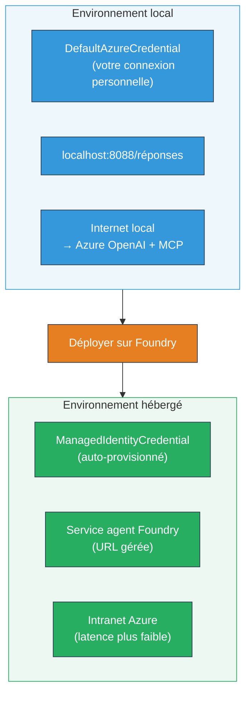

# Module 7 - Vérifier dans le Playground

Dans ce module, vous testez votre workflow multi-agent déployé à la fois dans **VS Code** et sur le **[Portail Foundry](https://ai.azure.com)**, en confirmant que l'agent se comporte de façon identique aux tests locaux.

---

## Pourquoi vérifier après le déploiement ?

Votre workflow multi-agent a parfaitement fonctionné localement, alors pourquoi tester à nouveau ? L'environnement hébergé diffère à plusieurs égards :


| Différence | Local | Hébergé |
|------------|-------|---------|
| **Identité** | [`DefaultAzureCredential`](https://learn.microsoft.com/azure/developer/python/sdk/authentication/credential-chains#defaultazurecredential-overview) (votre connexion personnelle) | [`ManagedIdentityCredential`](https://learn.microsoft.com/python/api/overview/azure/identity-readme#managed-identity-support) (auto-provisionné) |
| **Point de terminaison** | `http://localhost:8088/responses` | point de terminaison [Foundry Agent Service](https://learn.microsoft.com/azure/foundry/agents/concepts/hosted-agents) (URL gérée) |
| **Réseau** | Machine locale → Azure OpenAI + MCP sortant | Backbone Azure (latence réduite entre services) |
| **Connectivité MCP** | Internet local → `learn.microsoft.com/api/mcp` | Conteneur sortant → `learn.microsoft.com/api/mcp` |

Si une variable d'environnement est mal configurée, si le RBAC diffère ou si le trafic sortant MCP est bloqué, vous le détecterez ici.

---

## Option A : Tester dans le Playground de VS Code (recommandé en premier)

L'[extension Foundry](https://marketplace.visualstudio.com/items?itemName=TeamsDevApp.vscode-ai-foundry) inclut un Playground intégré qui vous permet de discuter avec votre agent déployé sans quitter VS Code.

### Étape 1 : Naviguer vers votre agent hébergé

1. Cliquez sur l'icône **Microsoft Foundry** dans la **Barre d’activité** de VS Code (barre latérale gauche) pour ouvrir le panneau Foundry.
2. Développez votre projet connecté (par ex., `workshop-agents`).
3. Développez **Hosted Agents (Preview)**.
4. Vous devriez voir le nom de votre agent (par ex., `resume-job-fit-evaluator`).

### Étape 2 : Sélectionner une version

1. Cliquez sur le nom de l'agent pour développer ses versions.
2. Cliquez sur la version que vous avez déployée (par ex., `v1`).
3. Un **panneau de détails** s'ouvre affichant les détails du conteneur.
4. Vérifiez que le statut est **Started** ou **Running**.

### Étape 3 : Ouvrir le Playground

1. Dans le panneau de détails, cliquez sur le bouton **Playground** (ou clic droit sur la version → **Open in Playground**).
2. Une interface de chat s'ouvre dans un onglet VS Code.

### Étape 4 : Exécuter vos tests de validation

Utilisez les mêmes 3 tests du [Module 5](05-test-locally.md). Tapez chaque message dans la zone d'entrée du Playground et appuyez sur **Envoyer** (ou **Entrée**).

#### Test 1 - CV complet + description de poste (flux standard)

Collez la invite complète du CV + description de poste du Module 5, Test 1 (Jane Doe + Senior Cloud Engineer chez Contoso Ltd).

**Attendu :**
- Score d’adéquation avec décomposition mathématique (échelle sur 100 points)
- Section Compétences correspondantes
- Section Compétences manquantes
- **Une carte de lacune par compétence manquante** avec URLs Microsoft Learn
- Feuille de route d’apprentissage avec chronologie

#### Test 2 - Test rapide court (input minimal)

```
RESUME: 3 years Python developer, knows Django and PostgreSQL, no cloud experience.

JOB: Cloud DevOps Engineer requiring AWS, Kubernetes, Terraform, CI/CD. 5 years needed.
```

**Attendu :**
- Score d’adéquation plus faible (< 40)
- Évaluation honnête avec parcours d’apprentissage progressif
- Plusieurs cartes de lacune (AWS, Kubernetes, Terraform, CI/CD, lacune d'expérience)

#### Test 3 - Candidat très adapté

```
RESUME:
10 years Azure Cloud Architect. AZ-305 certified. Expert in AKS, Terraform, Azure DevOps, 
Azure Functions, Helm, Prometheus, Grafana, Python, Go. Led platform team of 8.

JOB:
Senior Cloud Engineer. Required: AKS, Terraform, Azure DevOps, Python. Preferred: Helm, Go.
5+ years experience. AZ-305 preferred.
```

**Attendu :**
- Score d’adéquation élevé (≥ 80)
- Accent mis sur la préparation à l’entretien et l’amélioration
- Peu ou pas de cartes de lacune
- Chronologie courte axée sur la préparation

### Étape 5 : Comparer avec les résultats locaux

Ouvrez vos notes ou l’onglet navigateur du Module 5 où vous avez sauvegardé les réponses locales. Pour chaque test :

- La réponse a-t-elle la **même structure** (score d’adéquation, cartes de lacune, feuille de route) ?
- Suit-elle la **même grille de notation** (décomposition à 100 points) ?
- Les **URLs Microsoft Learn** sont-elles toujours présentes dans les cartes de lacune ?
- Y a-t-il **une carte de lacune par compétence manquante** (non tronquée) ?

> **Des différences mineures de formulation sont normales** - le modèle est non déterministe. Concentrez-vous sur la structure, la cohérence de notation et l’utilisation de l’outil MCP.

---

## Option B : Tester dans le Portail Foundry

Le [Portail Foundry](https://ai.azure.com) offre un playground web utile pour partager avec des coéquipiers ou des parties prenantes.

### Étape 1 : Ouvrir le Portail Foundry

1. Ouvrez votre navigateur et rendez-vous sur [https://ai.azure.com](https://ai.azure.com).
2. Connectez-vous avec le même compte Azure que vous avez utilisé tout au long de l’atelier.

### Étape 2 : Naviguer vers votre projet

1. Sur la page d’accueil, cherchez **Projects récents** dans la barre latérale gauche.
2. Cliquez sur le nom de votre projet (par ex., `workshop-agents`).
3. Si vous ne le voyez pas, cliquez sur **Tous les projets** et recherchez-le.

### Étape 3 : Trouver votre agent déployé

1. Dans la navigation gauche du projet, cliquez sur **Build** → **Agents** (ou cherchez la section **Agents**).
2. Vous devriez voir la liste des agents. Trouvez votre agent déployé (par ex., `resume-job-fit-evaluator`).
3. Cliquez sur le nom de l’agent pour ouvrir sa page de détails.

### Étape 4 : Ouvrir le Playground

1. Sur la page de détails de l’agent, regardez la barre d’outils supérieure.
2. Cliquez sur **Open in playground** (ou **Try in playground**).
3. Une interface de chat s’ouvre.

### Étape 5 : Exécuter les mêmes tests de validation

Répétez les 3 tests du Playground VS Code ci-dessus. Comparez chaque réponse avec les résultats locaux (Module 5) et ceux du Playground VS Code (Option A).

---

## Vérification spécifique multi-agent

Au-delà de la correction basique, vérifiez ces comportements spécifiques multi-agent :

### Exécution de l’outil MCP

| Vérification | Comment vérifier | Condition de réussite |
|--------------|------------------|----------------------|
| Appels MCP réussis | Cartes de lacune contiennent des URLs `learn.microsoft.com` | URLs réelles, pas des messages de repli |
| Appels MCP multiples | Chaque lacune prioritaire haute/moyenne a des ressources | Pas seulement la première carte de lacune |
| Repli MCP fonctionne | Si les URLs manquent, vérifier texte de repli | L’agent produit toujours des cartes de lacune (avec ou sans URLs) |

### Coordination des agents

| Vérification | Comment vérifier | Condition de réussite |
|--------------|------------------|----------------------|
| Les 4 agents ont tourné | Sortie contient score d’adéquation ET cartes de lacune | Score provient de MatchingAgent, cartes de GapAnalyzer |
| Exécution parallèle | Temps de réponse raisonnable (< 2 min) | Si > 3 min, exécution parallèle peut ne pas fonctionner |
| Intégrité du flux de données | Cartes de lacune référencent des compétences de la rapport matching | Pas de compétences hallucinéess non présentes dans la description de poste |

---

## Grille de validation

Utilisez cette grille pour évaluer le comportement hébergé de votre workflow multi-agent :

| # | Critère | Condition de réussite | Réussi ? |
|---|---------|-----------------------|----------|
| 1 | **Correction fonctionnelle** | L’agent répond au CV + JD avec score d’adéquation et analyse des lacunes | |
| 2 | **Cohérence de notation** | Score d’adéquation utilise une échelle de 100 points avec décomposition mathématique | |
| 3 | **Complétude des cartes de lacune** | Une carte par compétence manquante (non tronquée ou combinée) | |
| 4 | **Intégration de l’outil MCP** | Cartes de lacune incluent des URLs Microsoft Learn réelles | |
| 5 | **Cohérence structurelle** | Structure de sortie identique entre exécution locale et hébergée | |
| 6 | **Temps de réponse** | L’agent hébergé répond en moins de 2 minutes pour l’évaluation complète | |
| 7 | **Pas d’erreurs** | Pas d’erreur HTTP 500, de timeout ou de réponses vides | |

> Un "pass" signifie que les 7 critères sont remplis pour les 3 tests dans au moins un playground (VS Code ou Portail).

---

## Résolution des problèmes du playground

| Symptôme | Cause probable | Solution |
|----------|----------------|----------|
| Playground ne charge pas | Statut du conteneur différent de « Started » | Retour à [Module 6](06-deploy-to-foundry.md), vérifiez le statut de déploiement. Attendez s’il est "Pending" |
| Agent retourne une réponse vide | Nom du déploiement du modèle non conforme | Vérifiez dans `agent.yaml` → `environment_variables` → `MODEL_DEPLOYMENT_NAME` correspond à votre modèle déployé |
| Agent retourne un message d’erreur | Permission [RBAC](https://learn.microsoft.com/azure/foundry/concepts/rbac-foundry) manquante | Assignez **[Azure AI User](https://aka.ms/foundry-ext-project-role)** au niveau du projet |
| Pas d’URLs Microsoft Learn dans les cartes de lacune | Trafic MCP sortant bloqué ou serveur MCP indisponible | Vérifiez que le conteneur peut accéder à `learn.microsoft.com`. Voir [Module 8](08-troubleshooting.md) |
| Seulement 1 carte de lacune (tronquée) | Instructions GapAnalyzer manquant le bloc "CRITICAL" | Relisez [Module 3, Étape 2.4](03-configure-agents.md) |
| Score d’adéquation très différent du local | Modèle ou instructions déployées différentes | Comparez les variables d’environnement `agent.yaml` avec `.env` local. Redéployez si nécessaire |
| "Agent not found" dans le Portail | Déploiement en cours de propagation ou échoué | Attendez 2 minutes, rafraîchissez. Si manquant, redéployez depuis [Module 6](06-deploy-to-foundry.md) |

---

### Point de contrôle

- [ ] Agent testé dans le Playground VS Code - tous les 3 tests validés
- [ ] Agent testé dans le Playground du [Portail Foundry](https://ai.azure.com) - tous les 3 tests validés
- [ ] Réponses structurellement cohérentes avec les tests locaux (score, cartes de lacunes, feuille de route)
- [ ] URLs Microsoft Learn présentes dans les cartes de lacune (outil MCP fonctionnant en environnement hébergé)
- [ ] Une carte de lacune par compétence manquante (pas de troncature)
- [ ] Aucune erreur ou timeout durant les tests
- [ ] Grille de validation complétée (tous les 7 critères validés)

---

**Précédent :** [06 - Déployer sur Foundry](06-deploy-to-foundry.md) · **Suivant :** [08 - Dépannage →](08-troubleshooting.md)

---

<!-- CO-OP TRANSLATOR DISCLAIMER START -->
**Avertissement** :  
Ce document a été traduit à l’aide du service de traduction automatique [Co-op Translator](https://github.com/Azure/co-op-translator). Bien que nous nous efforçons d’assurer l’exactitude, veuillez noter que les traductions automatiques peuvent contenir des erreurs ou des inexactitudes. Le document original dans sa langue native doit être considéré comme la source faisant foi. Pour des informations critiques, une traduction professionnelle réalisée par un humain est recommandée. Nous ne sommes pas responsables des malentendus ou interprétations erronées résultant de l’utilisation de cette traduction.
<!-- CO-OP TRANSLATOR DISCLAIMER END -->