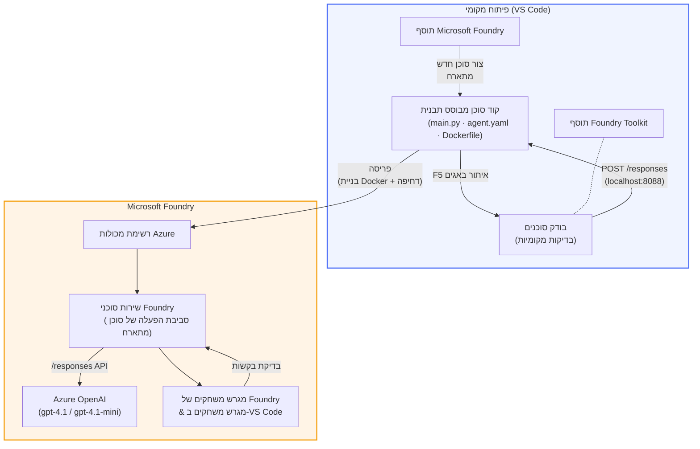

# Foundry Toolkit + סדנת סוכנים מתארחים Foundry Hosted Agents

[](https://www.python.org/)
[](https://github.com/microsoft/agents)
[](https://learn.microsoft.com/azure/ai-foundry/agents/concepts/hosted-agents/)
[](https://ai.azure.com/)
[](https://learn.microsoft.com/azure/ai-services/openai/)
[](https://learn.microsoft.com/cli/azure/install-azure-cli)
[](https://learn.microsoft.com/azure/developer/azure-developer-cli/install-azd)
[](https://www.docker.com/)
[](https://marketplace.visualstudio.com/items?itemName=ms-windows-ai-studio.windows-ai-studio)
[](LICENSE)

בנו, בדקו ופרסמו סוכני AI ל-**Microsoft Foundry Agent Service** בתור **סוכנים מתארחים** - הכל מתוך VS Code באמצעות **ההרחבה של Microsoft Foundry** ו-**Foundry Toolkit**.

> **סוכנים מתארחים נמצאים כרגע בבטא.** האזורים הנתמכים מוגבלים - ראו [זמינות אזורים](https://learn.microsoft.com/azure/foundry/agents/concepts/hosted-agents#region-availability).

> תיקיית `agent/` שבתוך כל מעבדה נבנית **באופן אוטומטי** על ידי ההרחבה של Foundry - לאחר מכן אתם מתאימים את הקוד, בודקים מקומית ומפרסמים.

<!-- CO-OP TRANSLATOR LANGUAGES TABLE START -->
[Arabic](../ar/README.md) | [Bengali](../bn/README.md) | [Bulgarian](../bg/README.md) | [Burmese (Myanmar)](../my/README.md) | [Chinese (Simplified)](../zh-CN/README.md) | [Chinese (Traditional, Hong Kong)](../zh-HK/README.md) | [Chinese (Traditional, Macau)](../zh-MO/README.md) | [Chinese (Traditional, Taiwan)](../zh-TW/README.md) | [Croatian](../hr/README.md) | [Czech](../cs/README.md) | [Danish](../da/README.md) | [Dutch](../nl/README.md) | [Estonian](../et/README.md) | [Finnish](../fi/README.md) | [French](../fr/README.md) | [German](../de/README.md) | [Greek](../el/README.md) | [Hebrew](./README.md) | [Hindi](../hi/README.md) | [Hungarian](../hu/README.md) | [Indonesian](../id/README.md) | [Italian](../it/README.md) | [Japanese](../ja/README.md) | [Kannada](../kn/README.md) | [Khmer](../km/README.md) | [Korean](../ko/README.md) | [Lithuanian](../lt/README.md) | [Malay](../ms/README.md) | [Malayalam](../ml/README.md) | [Marathi](../mr/README.md) | [Nepali](../ne/README.md) | [Nigerian Pidgin](../pcm/README.md) | [Norwegian](../no/README.md) | [Persian (Farsi)](../fa/README.md) | [Polish](../pl/README.md) | [Portuguese (Brazil)](../pt-BR/README.md) | [Portuguese (Portugal)](../pt-PT/README.md) | [Punjabi (Gurmukhi)](../pa/README.md) | [Romanian](../ro/README.md) | [Russian](../ru/README.md) | [Serbian (Cyrillic)](../sr/README.md) | [Slovak](../sk/README.md) | [Slovenian](../sl/README.md) | [Spanish](../es/README.md) | [Swahili](../sw/README.md) | [Swedish](../sv/README.md) | [Tagalog (Filipino)](../tl/README.md) | [Tamil](../ta/README.md) | [Telugu](../te/README.md) | [Thai](../th/README.md) | [Turkish](../tr/README.md) | [Ukrainian](../uk/README.md) | [Urdu](../ur/README.md) | [Vietnamese](../vi/README.md)

> **מעדיפים לשכפל מקומית?**
>
> מאגר זה כולל מעל 50 תרגומים לשפות שונות, דבר שמגדיל משמעותית את גודל ההורדה. כדי לשכפל ללא התרגומים, השתמשו בספירס אאוט:
>
> **Bash / macOS / Linux:**
> ```bash
> git clone --filter=blob:none --sparse https://github.com/microsoft-foundry/Foundry_Toolkit_for_VSCode_Lab.git
> cd Foundry_Toolkit_for_VSCode_Lab
> git sparse-checkout set --no-cone '/*' '!translations' '!translated_images'
> ```
>
> **CMD (Windows):**
> ```cmd
> git clone --filter=blob:none --sparse https://github.com/microsoft-foundry/Foundry_Toolkit_for_VSCode_Lab.git
> cd Foundry_Toolkit_for_VSCode_Lab
> git sparse-checkout set --no-cone "/*" "!translations" "!translated_images"
> ```
>
> זה נותן לכם את כל מה שצריך כדי להשלים את הקורס עם הורדה מהירה יותר.
<!-- CO-OP TRANSLATOR LANGUAGES TABLE END -->

---

## ארכיטקטורה


**זרימה:** הרחבת Foundry יוצרת את הסוכן → אתם מתאימים קוד והוראות → בודקים מקומית עם Agent Inspector → מפרסמים ל-Foundry (תמונת Docker נדחפת ל-ACR) → מאמתים בפליילגרound.

---

## מה תבנו

| מעבדה | תיאור | סטטוס |
|-----|-------------|--------|
| **מעבדה 01 - סוכן בודד** | בנו את הסוכן **"תסביר כאילו אני מנכ"ל"**, בדקו אותו מקומית ופרסמו ל-Foundry | ✅ זמין |
| **מעבדה 02 - זרימת עבודה עם סוכנים מרובים** | בנו את ה**"מגייס קורות חיים → מעריך התאמת משרה"** - 4 סוכנים משתפים פעולה לניקוד התאמת קורות החיים וליצירת מפת דרכים ללמידה | ✅ זמין |

---

## הכירו את הסוכן המנכ"ל

בסדנה זו תבנו את הסוכן **"תסביר כאילו אני מנכ"ל"** - סוכן AI שלוקח ז'רגון טכני מסובך ומתרגם אותו לסיכומים רגועים ומוכנים לחדר הנהלה. כי בואו נהיה כנים, אף אחד בצוות ההנהלה לא רוצה לשמוע על "תשישות בריכת תהליכים שנגרמה על ידי קריאות סינכרוניות שהוכנסו ב-v3.2."

בניתי את הסוכן הזה לאחר יותר מדי מקרים בהם הדוח שהכנתי בקפידה קיבל את התגובה: *"אז... האתר נפל או לא?"*

### איך זה עובד

אתם מזינים עדכון טכני. הוא מחזיר סיכום מנהלים - שלוש נקודות, בלי ז'רגון, בלי עקבות מבנה, בלי תחושה קיומית מפחידה. רק **מה קרה**, **השפעה עסקית**, ו**הצעד הבא**.

### ראה את זה בפעולה

**אתה אומר:**
> "השהיית ה-API עלתה עקב תשישות בריכת תהליכים שנגרמה על ידי קריאות סינכרוניות שהוכנסו ב-v3.2."

**הסוכן עונה:**

> **סיכום מנהלים:**
> - **מה קרה:** אחרי ההשקה האחרונה, המערכת התייבשה.
> - **השפעה עסקית:** כמה משתמשים חוו עיכובים בשימוש בשירות.
> - **הצעד הבא:** השינוי בוטל ומתכונן תיקון לפני הפצה מחדש.

### למה הסוכן הזה?

הוא סוכן פשוט, חד-מטרתי - מושלם ללמידת זרימת העבודה של סוכן מתארח מקצה לקצה בלי להסתבך בשרשראות כלים מסובכות. וכנות? כל צוות הנדסה יכול להיעזר באחד כזה.

---

## מבנה הסדנה

```
📂 Foundry_Toolkit_for_VSCode_Lab/
├── 📄 README.md                      ← You are here
├── 📂 ExecutiveAgent/                ← Standalone hosted agent project
│   ├── agent.yaml
│   ├── Dockerfile
│   ├── main.py
│   └── requirements.txt
└── 📂 workshop/
    ├── 📂 lab01-single-agent/        ← Full lab: docs + agent code
    │   ├── README.md                 ← Hands-on lab instructions
    │   ├── 📂 docs/                  ← Step-by-step tutorial modules
    │   │   ├── 00-prerequisites.md
    │   │   ├── 01-install-foundry-toolkit.md
    │   │   ├── 02-create-foundry-project.md
    │   │   ├── 03-create-hosted-agent.md
    │   │   ├── 04-configure-and-code.md
    │   │   ├── 05-test-locally.md
    │   │   ├── 06-deploy-to-foundry.md
    │   │   ├── 07-verify-in-playground.md
    │   │   └── 08-troubleshooting.md
    │   └── 📂 agent/                 ← Reference solution (auto-scaffolded by Foundry extension)
    │       ├── agent.yaml
    │       ├── Dockerfile
    │       ├── main.py
    │       └── requirements.txt
    └── 📂 lab02-multi-agent/         ← Resume → Job Fit Evaluator
        ├── README.md                 ← Hands-on lab instructions (end-to-end)
        ├── 📂 docs/                  ← Step-by-step tutorial modules
        │   ├── 00-prerequisites.md
        │   ├── 01-understand-multi-agent.md
        │   ├── 02-scaffold-multi-agent.md
        │   ├── 03-configure-agents.md
        │   ├── 04-orchestration-patterns.md
        │   ├── 05-test-locally.md
        │   ├── 06-deploy-to-foundry.md
        │   ├── 07-verify-in-playground.md
        │   └── 08-troubleshooting.md
        └── 📂 PersonalCareerCopilot/ ← Reference solution (multi-agent workflow)
            ├── agent.yaml
            ├── Dockerfile
            ├── main.py
            └── requirements.txt
```

> **הערה:** תיקיית `agent/` בתוך כל מעבדה נוצרת ע"י **ההרחבה של Microsoft Foundry** כשאתם מריצים `Microsoft Foundry: Create a New Hosted Agent` מפלטת הפקודות. הקבצים מותאמים בהמשך עם ההוראות, הכלים וההגדרות של הסוכן שלכם. מעבדה 01 תלווה אתכם בתהליך יצירת זאת מאפס.

---

## התחלה

### 1. שכפלו את המאגר

```bash
git clone https://github.com/microsoft-foundry/Foundry_Toolkit_for_VSCode_Lab.git
cd Foundry_Toolkit_for_VSCode_Lab
```

### 2. הקימו סביבה וירטואלית של פייתון

```bash
python -m venv venv
```

הפעילו אותה:

- **Windows (PowerShell):**
  ```powershell
  .\venv\Scripts\Activate.ps1
  ```
- **macOS / Linux:**
  ```bash
  source venv/bin/activate
  ```

### 3. התקינו תלותיות

```bash
pip install -r workshop/lab01-single-agent/agent/requirements.txt
```

### 4. הגדירו משתני סביבה

העתיקו את קובץ הדוגמה `.env` שבתיקיית הסוכן ומלאו את הערכים שלכם:

```bash
cp workshop/lab01-single-agent/agent/.env.example workshop/lab01-single-agent/agent/.env
```

ערכו את `workshop/lab01-single-agent/agent/.env`:

```env
AZURE_AI_PROJECT_ENDPOINT=https://<your-account>.services.ai.azure.com/api/projects/<your-project>
MODEL_DEPLOYMENT_NAME=<your-model-deployment-name>
```

### 5. עקבו אחרי מעבדות הסדנה

כל מעבדה עצמאית עם המודולים שלה. התחילו עם **מעבדה 01** ללמידת היסודות, ואז עברו ל-**מעבדה 02** לזרימות עבודה עם סוכנים מרובים.

#### מעבדה 01 - סוכן בודד ([הוראות מלאות](workshop/lab01-single-agent/README.md))

| # | מודול | קישור |
|---|--------|------|
| 1 | קראו את הדרישות המקדימות | [00-prerequisites.md](workshop/lab01-single-agent/docs/00-prerequisites.md) |
| 2 | התקינו Foundry Toolkit והרחבת Foundry | [01-install-foundry-toolkit.md](workshop/lab01-single-agent/docs/01-install-foundry-toolkit.md) |
| 3 | צרו פרויקט Foundry | [02-create-foundry-project.md](workshop/lab01-single-agent/docs/02-create-foundry-project.md) |
| 4 | צרו סוכן מתארח | [03-create-hosted-agent.md](workshop/lab01-single-agent/docs/03-create-hosted-agent.md) |
| 5 | הגדירו הוראות וסביבה | [04-configure-and-code.md](workshop/lab01-single-agent/docs/04-configure-and-code.md) |
| 6 | בדקו מקומית | [05-test-locally.md](workshop/lab01-single-agent/docs/05-test-locally.md) |
| 7 | פרסמו ל-Foundry | [06-deploy-to-foundry.md](workshop/lab01-single-agent/docs/06-deploy-to-foundry.md) |
| 8 | אימתו בפליילגרound | [07-verify-in-playground.md](workshop/lab01-single-agent/docs/07-verify-in-playground.md) |
| 9 | פתרון בעיות | [08-troubleshooting.md](workshop/lab01-single-agent/docs/08-troubleshooting.md) |

#### מעבדה 02 - זרימת עבודה עם סוכנים מרובים ([הוראות מלאות](workshop/lab02-multi-agent/README.md))

| # | מודול | קישור |
|---|--------|------|
| 1 | דרישות מקדימות (מעבדה 02) | [00-prerequisites.md](workshop/lab02-multi-agent/docs/00-prerequisites.md) |
| 2 | הבנת ארכיטקטורת סוכנים מרובים | [01-understand-multi-agent.md](workshop/lab02-multi-agent/docs/01-understand-multi-agent.md) |
| 3 | יצירת פרויקט סוכנים מרובים | [02-scaffold-multi-agent.md](workshop/lab02-multi-agent/docs/02-scaffold-multi-agent.md) |
| 4 | הקמת סוכנים וסביבה | [03-configure-agents.md](workshop/lab02-multi-agent/docs/03-configure-agents.md) |
| 5 | דפוסי תזמור | [04-orchestration-patterns.md](workshop/lab02-multi-agent/docs/04-orchestration-patterns.md) |
| 6 | בדיקה מקומית (סוכנים מרובים) | [05-test-locally.md](workshop/lab02-multi-agent/docs/05-test-locally.md) |
| 7 | פריסה ל-Foundry | [06-deploy-to-foundry.md](workshop/lab02-multi-agent/docs/06-deploy-to-foundry.md) |
| 8 | אימות ב-playground | [07-verify-in-playground.md](workshop/lab02-multi-agent/docs/07-verify-in-playground.md) |
| 9 | פתרון תקלות (multi-agent) | [08-troubleshooting.md](workshop/lab02-multi-agent/docs/08-troubleshooting.md) |

---

## אחראי תחזוקה

<table>
<tr>
    <td align="center"><a href="https://github.com/ShivamGoyal03">
        <br />
        <sub><b>שיבאם גויאל</b></sub>
    </a><br />
    </td>
</tr>
</table>

---

## הרשאות נדרשות (עיון מהיר)

| תרחיש | תפקידים נדרשים |
|----------|---------------|
| יצירת פרויקט Foundry חדש | **Azure AI Owner** על משאב Foundry |
| פריסה לפרויקט קיים (משאבים חדשים) | **Azure AI Owner** + **Contributor** על מנוי |
| פריסה לפרויקט מוגדר במלואו | **Reader** על חשבון + **Azure AI User** על הפרויקט |

> **חשוב:** תפקידי Azure `Owner` ו-`Contributor` כוללים רק הרשאות *ניהול*, לא הרשאות *פיתוח* (פעולות נתונים). נדרש **Azure AI User** או **Azure AI Owner** כדי לבנות ולפרוס סוכנים.

---

## הפניות

- [התחלה מהירה: פריסת הסוכן המתארח הראשון שלך (VS Code)](https://learn.microsoft.com/azure/foundry/agents/quickstarts/quickstart-hosted-agent)
- [מהם סוכנים מתארחים?](https://learn.microsoft.com/azure/foundry/agents/concepts/hosted-agents)
- [יצירת זרימות עבודה לסוכנים מתארחים ב-VS Code](https://learn.microsoft.com/azure/foundry/agents/how-to/vs-code-agents-workflow-pro-code)
- [פריסת סוכן מתארח](https://learn.microsoft.com/azure/foundry/agents/how-to/deploy-hosted-agent)
- [RBAC עבור Microsoft Foundry](https://learn.microsoft.com/azure/foundry/concepts/rbac-foundry)
- [דוגמת סוכן לבחינת ארכיטקטורה](https://github.com/Azure-Samples/agent-architecture-review-sample) - סוכן מתארח מהעולם האמיתי עם כלי MCP, דיאגרמות Excalidraw ופריסה כפולה

---


## רישיון

[MIT](../../LICENSE)

---

<!-- CO-OP TRANSLATOR DISCLAIMER START -->
**כתב ויתור**:  
מסמך זה תורגם באמצעות שירות תרגום בינה מלאכותית [Co-op Translator](https://github.com/Azure/co-op-translator). בעוד שאנו שואפים לדיוק, יש להיות מודעים לכך שתרגומים אוטומטיים עשויים להכיל טעויות או אי-דיוקים. המסמך המקורי בשפה המקורית שלו מהווה את המקור הסמכותי. עבור מידע קריטי, מומלץ לבצע תרגום מקצועי על ידי אדם. איננו אחראים לכל אי-הבנה או פרשנות שגויה הנובעים משימוש בתרגום זה.
<!-- CO-OP TRANSLATOR DISCLAIMER END -->