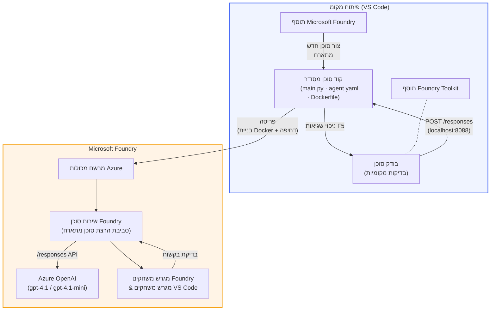

# Foundry Toolkit + סדנת סוכנים מתארחים של Foundry

[](https://www.python.org/)
[](https://github.com/microsoft/agents)
[](https://learn.microsoft.com/azure/ai-foundry/agents/concepts/hosted-agents/)
[](https://ai.azure.com/)
[](https://learn.microsoft.com/azure/ai-services/openai/)
[](https://learn.microsoft.com/cli/azure/install-azure-cli)
[](https://learn.microsoft.com/azure/developer/azure-developer-cli/install-azd)
[](https://www.docker.com/)
[](https://marketplace.visualstudio.com/items?itemName=ms-windows-ai-studio.windows-ai-studio)
[](LICENSE)

בנו, בדקו ופרסמו סוכני בינה מלאכותית ל-**Microsoft Foundry Agent Service** כ-**סוכנים מתארחים** - הכל מתוך VS Code באמצעות **תוסף Microsoft Foundry** ו-**Foundry Toolkit**.

> **סוכנים מתארחים נמצאים כרגע במצב תצוגה מוקדמת.** האזורים הנתמכים מוגבלים - ראה [זמינות אזור](https://learn.microsoft.com/azure/foundry/agents/concepts/hosted-agents#region-availability).

> תיקיית `agent/` בתוך כל מעבדה נוצרת **באוטומציה** על ידי תוסף Foundry - לאחר מכן אתה מתאים את הקוד, בודק מקומית ומפרסם.

### 🌐 תמיכה מרובת שפות

#### נתמך באמצעות GitHub Action (אוטומטי ותמיד מעודכן)

<!-- CO-OP TRANSLATOR LANGUAGES TABLE START -->
[ערבית](../ar/README.md) | [בנגלית](../bn/README.md) | [בולגרית](../bg/README.md) | [בורמזית (מיאנמר)](../my/README.md) | [סינית (מפושטת)](../zh-CN/README.md) | [סינית (מסורתית, הונג קונג)](../zh-HK/README.md) | [סינית (מסורתית, מקאו)](../zh-MO/README.md) | [סינית (מסורתית, טייוואן)](../zh-TW/README.md) | [קרואטית](../hr/README.md) | [צ'כית](../cs/README.md) | [דנית](../da/README.md) | [הולנדית](../nl/README.md) | [אסטונית](../et/README.md) | [פינית](../fi/README.md) | [צרפתית](../fr/README.md) | [גרמנית](../de/README.md) | [יוונית](../el/README.md) | [עברית](./README.md) | [הינדית](../hi/README.md) | [הונגרית](../hu/README.md) | [אינדונזית](../id/README.md) | [איטלקית](../it/README.md) | [יפנית](../ja/README.md) | [קאנדה](../kn/README.md) | [חמרית](../km/README.md) | [קוריאנית](../ko/README.md) | [ליטאית](../lt/README.md) | [מלאית](../ms/README.md) | [מלאלאית](../ml/README.md) | [מרטהית](../mr/README.md) | [נפאלית](../ne/README.md) | [פיג'ין ניגרית](../pcm/README.md) | [נורווגית](../no/README.md) | [פרסית (פרסי)](../fa/README.md) | [פולנית](../pl/README.md) | [פורטוגזית (ברזיל)](../pt-BR/README.md) | [פורטוגזית (פורטוגל)](../pt-PT/README.md) | [פונג'אבית (ג'ורמוכי)](../pa/README.md) | [רומנית](../ro/README.md) | [רוסית](../ru/README.md) | [סרבית (קירילית)](../sr/README.md) | [סלובקית](../sk/README.md) | [סלובנית](../sl/README.md) | [ספרדית](../es/README.md) | [סווויהילי](../sw/README.md) | [שוודית](../sv/README.md) | [טגלוג (פיליפינית)](../tl/README.md) | [טמילית](../ta/README.md) | [טלוגו](../te/README.md) | [תאית](../th/README.md) | [טורקית](../tr/README.md) | [אוקראינית](../uk/README.md) | [אורדו](../ur/README.md) | [ויאטנמית](../vi/README.md)

> **מעדיף לשכפל מקומית?**
>
> מאגר זה כולל יותר מ-50 תרגומים בשפות שונות, מה שמגדיל משמעותית את גודל ההורדה. כדי לשכפל ללא התרגומים, השתמש ב-sparse checkout:
>
> **Bash / macOS / Linux:**
> ```bash
> git clone --filter=blob:none --sparse https://github.com/microsoft-foundry/Foundry_Toolkit_for_VSCode_Lab.git
> cd Foundry_Toolkit_for_VSCode_Lab
> git sparse-checkout set --no-cone '/*' '!translations' '!translated_images'
> ```
>
> **CMD (Windows):**
> ```cmd
> git clone --filter=blob:none --sparse https://github.com/microsoft-foundry/Foundry_Toolkit_for_VSCode_Lab.git
> cd Foundry_Toolkit_for_VSCode_Lab
> git sparse-checkout set --no-cone "/*" "!translations" "!translated_images"
> ```
>
> זה נותן לך את כל מה שאתה צריך כדי להשלים את הקורס במהירות הורדה גבוהה בהרבה.
<!-- CO-OP TRANSLATOR LANGUAGES TABLE END -->

---

## אדריכלות


**זרימה:** תוסף Foundry יוצר את הסוכן → אתה מתאים את הקוד וההוראות → בודק מקומית עם Agent Inspector → מפיץ ל-Foundry (דימוי Docker מועלה ל-ACR) → מאמת ב-Playground.

---

## מה תבנה

| מעבדה | תיאור | סטטוס |
|-------|---------|--------|
| **מעבדה 01 - סוכן יחיד** | בנה את ה-**"הסבר כאילו אני מנהל בכיר"**, בדוק אותו מקומית והפץ ל-Foundry | ✅ זמין |
| **מעבדה 02 - תהליך עבודה מרובה סוכנים** | בנה את ה-**"הערכת התאמת קורות חיים → עבודה"** - 4 סוכנים משתפים פעולה לדירוג התאמת קורות החיים וליצירת מסלול למידה | ✅ זמין |

---

## הכירו את סוכן המנהלים

בסדנה זו תבנה את ה-**"הסבר כאילו אני מנהל בכיר"** - סוכן בינה מלאכותית שלוקח מונחים טכניים מסובכים ומתרגם אותם לסיכומים רגועים, מתאימים לחדר ישיבות. כי בואו נהיה כנים, אף אחד ברמת המנהלים לא רוצה לשמוע על "התשה של Thread Pool שנגרמה מקליטות סינכרוניות שהוכנסו בגרסה v3.2."

בניתי את הסוכן הזה אחרי יותר מדי מקרים שבהם הפוסט-מורמתי שהכנתי היטב קיבל את התגובה: *"אז... האם האתר לא עובד או כן?"*

### איך זה עובד

אתה מזין עדכון טכני. הסוכן מחזיר סיכום מנהלים - שלוש נקודות, בלי ז'רגון, בלי עקבות שרת, בלי ייאוש קיומי. פשוט **מה קרה**, **השפעה עסקית**, ו-**השלב הבא**.

### ראה את זה בפעולה

**אתה אומר:**
> "השהיית ה-API עלתה עקב התשה של thread pool שנגרמה מקליטות סינכרוניות שהוכנסו בגרסה v3.2."

**הסוכן משיב:**

> **סיכום מנהלים:**
> - **מה קרה:** אחרי העדכון האחרון, המערכת התעכבה.
> - **השפעה עסקית:** חלק מהמשתמשים חוו עיכובים בעת השימוש בשירות.
> - **השלב הבא:** השינוי בוטל ותיקון מוכן לפני הפצה מחודשת.

### למה דווקא סוכן זה?

זה סוכן פשוט, למטרות ספציפיות - מושלם ללמידה של תהליך העבודה של סוכן מתארח מקצה לקצה בלי להסתבך בשרשראות כלים מורכבות. וכנות? כל צוות הנדסה היה יכול להשתמש באחד כזה.

---

## מבנה הסדנה

```
📂 Foundry_Toolkit_for_VSCode_Lab/
├── 📄 README.md                      ← You are here
├── 📂 ExecutiveAgent/                ← Standalone hosted agent project
│   ├── agent.yaml
│   ├── Dockerfile
│   ├── main.py
│   └── requirements.txt
└── 📂 workshop/
    ├── 📂 lab01-single-agent/        ← Full lab: docs + agent code
    │   ├── README.md                 ← Hands-on lab instructions
    │   ├── 📂 docs/                  ← Step-by-step tutorial modules
    │   │   ├── 00-prerequisites.md
    │   │   ├── 01-install-foundry-toolkit.md
    │   │   ├── 02-create-foundry-project.md
    │   │   ├── 03-create-hosted-agent.md
    │   │   ├── 04-configure-and-code.md
    │   │   ├── 05-test-locally.md
    │   │   ├── 06-deploy-to-foundry.md
    │   │   ├── 07-verify-in-playground.md
    │   │   └── 08-troubleshooting.md
    │   └── 📂 agent/                 ← Reference solution (auto-scaffolded by Foundry extension)
    │       ├── agent.yaml
    │       ├── Dockerfile
    │       ├── main.py
    │       └── requirements.txt
    └── 📂 lab02-multi-agent/         ← Resume → Job Fit Evaluator
        ├── README.md                 ← Hands-on lab instructions (end-to-end)
        ├── 📂 docs/                  ← Step-by-step tutorial modules
        │   ├── 00-prerequisites.md
        │   ├── 01-understand-multi-agent.md
        │   ├── 02-scaffold-multi-agent.md
        │   ├── 03-configure-agents.md
        │   ├── 04-orchestration-patterns.md
        │   ├── 05-test-locally.md
        │   ├── 06-deploy-to-foundry.md
        │   ├── 07-verify-in-playground.md
        │   └── 08-troubleshooting.md
        └── 📂 PersonalCareerCopilot/ ← Reference solution (multi-agent workflow)
            ├── agent.yaml
            ├── Dockerfile
            ├── main.py
            └── requirements.txt
```

> **הערה:** תיקיית `agent/` בתוך כל מעבדה היא מה שמייצר **תוסף Microsoft Foundry** כאשר אתה מריץ את `Microsoft Foundry: Create a New Hosted Agent` מפלטת הפקודות. הקבצים מותאמים לאחר מכן עם ההוראות, הכלים והקונפיגורציה של הסוכן שלך. מעבדה 01 מדריכה אותך כיצד ליצור זאת מהתחלה.

---

## התחלה

### 1. שכפל את המאגר

```bash
git clone https://github.com/microsoft-foundry/Foundry_Toolkit_for_VSCode_Lab.git
cd Foundry_Toolkit_for_VSCode_Lab
```

### 2. צור סביבה וירטואלית לפייתון

```bash
python -m venv venv
```

הפעל אותה:

- **ווינדוס (PowerShell):**
  ```powershell
  .\venv\Scripts\Activate.ps1
  ```
- **macOS / Linux:**
  ```bash
  source venv/bin/activate
  ```

### 3. התקן תלותיות

```bash
pip install -r workshop/lab01-single-agent/agent/requirements.txt
```

### 4. הגדר משתני סביבה

העתק את הקובץ `.env` לדוגמה שבתיקיית הסוכן ומלא את הערכים שלך:

```bash
cp workshop/lab01-single-agent/agent/.env.example workshop/lab01-single-agent/agent/.env
```

ערוך את `workshop/lab01-single-agent/agent/.env`:

```env
AZURE_AI_PROJECT_ENDPOINT=https://<your-account>.services.ai.azure.com/api/projects/<your-project>
MODEL_DEPLOYMENT_NAME=<your-model-deployment-name>
```

### 5. עקוב אחר מעבדות הסדנה

כל מעבדה היא עצמאית עם המודולים שלה. התחל עם **מעבדה 01** כדי ללמוד את היסודות, ואז המשך ל-**מעבדה 02** לתהליכי עבודה מרובי סוכנים.

#### מעבדה 01 - סוכן יחיד ([הוראות מלאות](workshop/lab01-single-agent/README.md))

| # | מודול | קישור |
|---|--------|------|
| 1 | קרא את דרישות המערכת | [00-prerequisites.md](workshop/lab01-single-agent/docs/00-prerequisites.md) |
| 2 | התקן את Foundry Toolkit ותוסף Foundry | [01-install-foundry-toolkit.md](workshop/lab01-single-agent/docs/01-install-foundry-toolkit.md) |
| 3 | צור פרויקט Foundry | [02-create-foundry-project.md](workshop/lab01-single-agent/docs/02-create-foundry-project.md) |
| 4 | צור סוכן מתארח | [03-create-hosted-agent.md](workshop/lab01-single-agent/docs/03-create-hosted-agent.md) |
| 5 | הגדר הוראות וסביבה | [04-configure-and-code.md](workshop/lab01-single-agent/docs/04-configure-and-code.md) |
| 6 | בדוק מקומית | [05-test-locally.md](workshop/lab01-single-agent/docs/05-test-locally.md) |
| 7 | פרסם ל-Foundry | [06-deploy-to-foundry.md](workshop/lab01-single-agent/docs/06-deploy-to-foundry.md) |
| 8 | אמת ב-playground | [07-verify-in-playground.md](workshop/lab01-single-agent/docs/07-verify-in-playground.md) |
| 9 | פתרון תקלות | [08-troubleshooting.md](workshop/lab01-single-agent/docs/08-troubleshooting.md) |

#### מעבדה 02 - תהליך עבודה מרובה סוכנים ([הוראות מלאות](workshop/lab02-multi-agent/README.md))

| # | מודול | קישור |
|---|--------|------|
| 1 | דרישות מערכת (מעבדה 02) | [00-prerequisites.md](workshop/lab02-multi-agent/docs/00-prerequisites.md) |
| 2 | הבנת אדריכלות מרובת סוכנים | [01-understand-multi-agent.md](workshop/lab02-multi-agent/docs/01-understand-multi-agent.md) |
| 3 | יצירת מבנה לפרויקט מרובת סוכנים | [02-scaffold-multi-agent.md](workshop/lab02-multi-agent/docs/02-scaffold-multi-agent.md) |
| 4 | הגדר סוכנים וסביבה | [03-configure-agents.md](workshop/lab02-multi-agent/docs/03-configure-agents.md) |
| 5 | דפוסי תזמור | [04-orchestration-patterns.md](workshop/lab02-multi-agent/docs/04-orchestration-patterns.md) |
| 6 | בדיקה מקומית (מרובי סוכנים) | [05-test-locally.md](workshop/lab02-multi-agent/docs/05-test-locally.md) |
| 7 | פריסה ל-Foundry | [06-deploy-to-foundry.md](workshop/lab02-multi-agent/docs/06-deploy-to-foundry.md) |
| 8 | אימות בשדה המשחק | [07-verify-in-playground.md](workshop/lab02-multi-agent/docs/07-verify-in-playground.md) |
| 9 | פתרון בעיות (מספר סוכנים) | [08-troubleshooting.md](workshop/lab02-multi-agent/docs/08-troubleshooting.md) |

---

## מנהל

<table>
<tr>
    <td align="center"><a href="https://github.com/ShivamGoyal03">
        <br />
        <sub><b>שיוואם גואיאל</b></sub>
    </a><br />
    </td>
</tr>
</table>

---

## הרשאות נדרשות (התייחסות מהירה)

| תרחיש | תפקידים נדרשים |
|----------|---------------|
| יצירת פרויקט Foundry חדש | **Azure AI Owner** על משאב Foundry |
| פריסה לפרויקט קיים (משאבים חדשים) | **Azure AI Owner** + **Contributor** במנוי |
| פריסה לפרויקט מכוון במלואו | **Reader** על חשבון + **Azure AI User** על הפרויקט |

> **חשוב:** תפקידי `Owner` ו-`Contributor` ב-Azure כוללים רק הרשאות *ניהול*, לא הרשאות *פיתוח* (פעולות על נתונים). דרוש **Azure AI User** או **Azure AI Owner** לבניית סוכנים ופריסתם.

---

## הפניות

- [התחלה מהירה: פריסת הסוכן המתארח הראשון שלך (VS Code)](https://learn.microsoft.com/azure/foundry/agents/quickstarts/quickstart-hosted-agent)
- [מהם סוכנים מתארחים?](https://learn.microsoft.com/azure/foundry/agents/concepts/hosted-agents)
- [יצירת זרימות עבודה לסוכנים מתארחים ב-VS Code](https://learn.microsoft.com/azure/foundry/agents/how-to/vs-code-agents-workflow-pro-code)
- [פריסת סוכן מתארח](https://learn.microsoft.com/azure/foundry/agents/how-to/deploy-hosted-agent)
- [RBAC עבור Microsoft Foundry](https://learn.microsoft.com/azure/foundry/concepts/rbac-foundry)
- [דוגמת סוכן לסקירת ארכיטקטורה](https://github.com/Azure-Samples/agent-architecture-review-sample) - סוכן מתארח ממוחשב עם כלי MCP, דיאגרמות Excalidraw, ופריסת כפולה

---


## רישיון

[MIT](../../LICENSE)

---

<!-- CO-OP TRANSLATOR DISCLAIMER START -->
**כתב ויתור**:
מסמך זה תורגם באמצעות שירות התרגום בינה מלאכותית [Co-op Translator](https://github.com/Azure/co-op-translator). למרות שאנו שואפים לדיוק, יש לזכור כי תרגומים אוטומטיים עלולים להכיל שגיאות או אי דיוקים. יש להתייחס למסמך המקורי בשפתו המקורית כמקור הסמכותי. למידע קריטי מומלץ תרגום מקצועי על ידי אדם. אנו לא נושאים באחריות לכל אי הבנות או פרשנויות שגויות הנובעות משימוש בתרגום זה.
<!-- CO-OP TRANSLATOR DISCLAIMER END -->