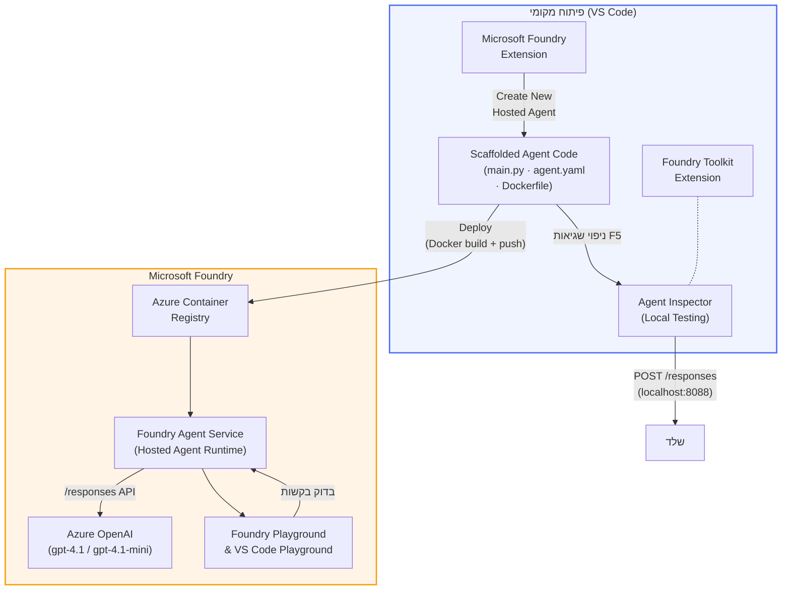

# Foundry Toolkit + סדנת סוכני Foundry Hosted  

[](https://www.python.org/)
[](https://github.com/microsoft/agents)
[](https://learn.microsoft.com/azure/foundry/agents/concepts/hosted-agents)
[](https://ai.azure.com/)
[](https://learn.microsoft.com/azure/ai-services/openai/)
[](https://learn.microsoft.com/cli/azure/install-azure-cli)
[](https://learn.microsoft.com/azure/developer/azure-developer-cli/install-azd)
[](https://www.docker.com/)
[](https://marketplace.visualstudio.com/items?itemName=ms-windows-ai-studio.windows-ai-studio)
[](LICENSE)

בנה, בדוק ופרוס סוכני בינה מלאכותית לשירות הסוכנים של **Microsoft Foundry Agent Service** כסוכנים **Hosted Agents** — הכל ישירות מ־VS Code בעזרת **ההרחבה Microsoft Foundry** ו־**Foundry Toolkit**.

> **Hosted Agents נמצאים כרגע בבטא.** האזורים הנתמכים מוגבלים - ראה [זמינות האזור](https://learn.microsoft.com/azure/foundry/agents/concepts/hosted-agents#region-availability).

> התיקייה `agent/` בכל מעבדה נוצרת **אוטומטית** על ידי ההרחבה Foundry — לאחר מכן אתה מתאים את הקוד, בודק מקומית, ומפרוס.

### 🌐 תמיכה בריבוי שפות

#### נתמך באמצעות GitHub Action (אוטומטי ותמיד מעודכן)

<!-- CO-OP TRANSLATOR LANGUAGES TABLE START -->
[Arabic](../ar/README.md) | [Bengali](../bn/README.md) | [Bulgarian](../bg/README.md) | [Burmese (Myanmar)](../my/README.md) | [Chinese (Simplified)](../zh-CN/README.md) | [Chinese (Traditional, Hong Kong)](../zh-HK/README.md) | [Chinese (Traditional, Macau)](../zh-MO/README.md) | [Chinese (Traditional, Taiwan)](../zh-TW/README.md) | [Croatian](../hr/README.md) | [Czech](../cs/README.md) | [Danish](../da/README.md) | [Dutch](../nl/README.md) | [Estonian](../et/README.md) | [Finnish](../fi/README.md) | [French](../fr/README.md) | [German](../de/README.md) | [Greek](../el/README.md) | [Hebrew](./README.md) | [Hindi](../hi/README.md) | [Hungarian](../hu/README.md) | [Indonesian](../id/README.md) | [Italian](../it/README.md) | [Japanese](../ja/README.md) | [Kannada](../kn/README.md) | [Khmer](../km/README.md) | [Korean](../ko/README.md) | [Lithuanian](../lt/README.md) | [Malay](../ms/README.md) | [Malayalam](../ml/README.md) | [Marathi](../mr/README.md) | [Nepali](../ne/README.md) | [Nigerian Pidgin](../pcm/README.md) | [Norwegian](../no/README.md) | [Persian (Farsi)](../fa/README.md) | [Polish](../pl/README.md) | [Portuguese (Brazil)](../pt-BR/README.md) | [Portuguese (Portugal)](../pt-PT/README.md) | [Punjabi (Gurmukhi)](../pa/README.md) | [Romanian](../ro/README.md) | [Russian](../ru/README.md) | [Serbian (Cyrillic)](../sr/README.md) | [Slovak](../sk/README.md) | [Slovenian](../sl/README.md) | [Spanish](../es/README.md) | [Swahili](../sw/README.md) | [Swedish](../sv/README.md) | [Tagalog (Filipino)](../tl/README.md) | [Tamil](../ta/README.md) | [Telugu](../te/README.md) | [Thai](../th/README.md) | [Turkish](../tr/README.md) | [Ukrainian](../uk/README.md) | [Urdu](../ur/README.md) | [Vietnamese](../vi/README.md)

> **מעדיף לשכפל מקומית?**
>
> מאגר זה כולל 50+ תרגומים בשפות שמגדילים משמעותית את גודל ההורדה. כדי לשכפל בלי תרגומים, השתמש ב-sparse checkout:
>
> **Bash / macOS / Linux:**
> ```bash
> git clone --filter=blob:none --sparse https://github.com/microsoft-foundry/Foundry_Toolkit_for_VSCode_Lab.git
> cd Foundry_Toolkit_for_VSCode_Lab
> git sparse-checkout set --no-cone '/*' '!translations' '!translated_images'
> ```
>
> **CMD (Windows):**
> ```cmd
> git clone --filter=blob:none --sparse https://github.com/microsoft-foundry/Foundry_Toolkit_for_VSCode_Lab.git
> cd Foundry_Toolkit_for_VSCode_Lab
> git sparse-checkout set --no-cone "/*" "!translations" "!translated_images"
> ```
>
> כך תקבל את כל מה שצריך כדי להשלים את הקורס במהירות הורדה גבוה.
<!-- CO-OP TRANSLATOR LANGUAGES TABLE END -->

---

## ארכיטקטורה


```mermaid
flowchart TB
    subgraph Local["פיתוח מקומי (VS Code)"]
        direction TB
        FE["Microsoft Foundry
        Extension"]
        FoundryToolkit["Foundry Toolkit
        Extension"]
        Scaffold["Scaffolded Agent Code
        (main.py · agent.yaml · Dockerfile)"]
        Inspector["Agent Inspector
        (Local Testing)"]
        FE -- "Create New
        Hosted Agent" --> Scaffold
        Scaffold -- "ניפוי שגיאות F5" --> Inspector
        FoundryToolkit -.- Inspector
    end

    subgraph Cloud["Microsoft Foundry"]
        direction TB
        ACR["Azure Container
        Registry"]
        AgentService["Foundry Agent Service
        (Hosted Agent Runtime)"]
        Model["Azure OpenAI
        (gpt-4.1 / gpt-4.1-mini)"]
        Playground["Foundry Playground
        & VS Code Playground"]
        ACR --> AgentService
        AgentService -- "/responses API" --> Model
        AgentService --> Playground
    end

    Scaffold -- "Deploy
    (Docker build + push)" --> ACR
    Inspector -- "POST /responses
    (localhost:8088)" --> שלד
    Playground -- "בדוק בקשות" --> AgentService

    style Local fill:#f0f4ff,stroke:#4a6cf7,stroke-width:2px
    style Cloud fill:#fff4e6,stroke:#f59e0b,stroke-width:2px
```

**זרימה:** הרחבת Foundry יוצרת את הסוכן → אתה מתאים קוד והוראות → בודק מקומית עם Agent Inspector → מפרוס ל־Foundry (תמונת Docker נדחפת ל-ACR) → מאמת ב-Playground.

---

## מה תבנה

| מעבדה | תיאור | מצב |
|-----|-------------|--------|
| **מעבדה 01 - סוכן יחיד** | בנה את סוכן ה־**"הסבר כאילו אני מנהל בכיר"**, בדוק מקומית ופרוס ל־Foundry | ✅ זמין |
| **מעבדה 02 - זרימת עבודה רב-סוכנים** | בנה את ה־**"מגיש קורות חיים → מעריך התאמת משרה"** – 4 סוכנים עובדים יחד כדי לדרג התאמת קורות חיים וליצור מפת דרכים ללמידה | ✅ זמין |

---

## הכירו את הסוכן המנהל

בסדנה זו תבנה את סוכן ה־**"הסבר כאילו אני מנהל בכיר"** — סוכן AI שלוקח ז'רגון טכני מסובך ומתרגם אותו לסיכומים שקטים ומוכנים לחדר ישיבות. כי בוא נהיה כנים, אף אחד מבכירות ההנהלה לא רוצה לשמוע על "מיצוי מאגר תהליכים בגלל קריאות סינכרוניות שהוכנסו בגרסה 3.2."

בניתי את הסוכן הזה אחרי יותר מדי מקרים שבהם הפוסט-מורטם המושלם שלי קיבל את התגובה: *"אז… האתר קרס או לא?"*

### איך זה עובד

אתה מזין עדכון טכני. הסוכן מחזיר סיכום מנהלים — שלוש נקודות מפתח, בלי ז'רגון, בלי עקבות שגיאה, בלי פחד קיומי. רק **מה קרה**, **השפעה עסקית**, ו**הצעד הבא**.

### ראה את זה בפועל

**אתה אומר:**
> "השהיית ה-API עלתה בגלל מיצוי מאגר תהליכים שנגרם מקריאות סינכרוניות שהוכנסו בגרסה 3.2."

**הסוכן עונה:**

> **סיכום מנהלים:**
> - **מה קרה:** לאחר השחרור האחרון, המערכת האטה.
> - **השפעה עסקית:** חלק מהמשתמשים חוו עיכובים בזמן השימוש בשירות.
> - **הצעד הבא:** השינוי בוטל ומתכוננת תיקון לפני הפריסה מחדש.

### למה הסוכן הזה?

זה סוכן פשוט, חד-תכליתי — מושלם ללמידת תהליך זרימת העבודה של סוכן Hosted מקצה לקצה בלי להסתבך בשרשראות כלים מורכבות. וכנות? כל צוות הנדסה יכול להרוויח אחד כזה.

---

## מבנה הסדנה

```
📂 Foundry_Toolkit_for_VSCode_Lab/
├── 📄 README.md                      ← You are here
└── 📂 workshop/
    ├── 📂 lab01-single-agent/        ← Full lab: docs + agent code
    │   ├── README.md                 ← Hands-on lab instructions
    │   ├── 📂 docs/                  ← Step-by-step tutorial modules
    │   │   ├── 00-prerequisites.md
    │   │   ├── 01-setup.md
    │   │   ├── 02-create-hosted-agent.md
    │   │   ├── 03-configure-and-code.md
    │   │   ├── 04-test-locally.md
    │   │   ├── 05-deploy-to-foundry.md
    │   │   ├── 06-verify-in-playground.md
    │   │   ├── 07-summary.md
    │   │   └── 08-troubleshooting.md
    │   └── 📂 agent/                 ← Reference solution (auto-scaffolded by Foundry extension)
    │       ├── agent.yaml
    │       ├── Dockerfile
    │       ├── main.py
    │       └── requirements.txt
    └── 📂 lab02-multi-agent/         ← Resume → Job Fit Evaluator
        ├── README.md                 ← Hands-on lab instructions (end-to-end)
        ├── 📂 docs/                  ← Step-by-step tutorial modules
        │   ├── 00-prerequisites.md
        │   ├── 01-understand-multi-agent.md
        │   ├── 02-scaffold-multi-agent.md
        │   ├── 03-configure-agents.md
        │   ├── 04-orchestration-patterns.md
        │   ├── 05-test-locally.md
        │   ├── 06-deploy-to-foundry.md
        │   ├── 07-verify-in-playground.md
        │   └── 08-troubleshooting.md
        └── 📂 PersonalCareerCopilot/ ← Reference solution (multi-agent workflow)
            ├── agent.yaml
            ├── Dockerfile
            ├── main.py
            └── requirements.txt
```

> **הערה:** התיקייה `agent/` בתוך כל מעבדה היא מה שההרחבה **Microsoft Foundry** יוצרת כשמריצים `Microsoft Foundry: Create a New Hosted Agent` מפלטת הפקודות. קבצים אלו מותאמים לאחר מכן עם ההוראות, הכלים וההגדרות של הסוכן שלך. מעבדה 01 מלווה אותך בתהליך בניית זה מאפס.

---

## התחלה

### 1. שכפל את המאגר

```bash
git clone https://github.com/microsoft-foundry/Foundry_Toolkit_for_VSCode_Lab.git
cd Foundry_Toolkit_for_VSCode_Lab
```

### 2. הגדר סביבה וירטואלית לפייתון

```bash
python -m venv venv
```

הפעל אותה:

- **Windows (PowerShell):**
  ```powershell
  .\venv\Scripts\Activate.ps1
  ```
- **macOS / Linux:**
  ```bash
  source venv/bin/activate
  ```

### 3. התקן תלותים

```bash
pip install -r workshop/lab01-single-agent/agent/requirements.txt
```

### 4. הגדר משתני סביבה

העתק את קובץ הדוגמה `.env` שבתיקיית הסוכן ומלא את הערכים שלך:

```bash
cp workshop/lab01-single-agent/agent/.env.example workshop/lab01-single-agent/agent/.env
```

ערוך את הקובץ `workshop/lab01-single-agent/agent/.env`:

```env
AZURE_AI_PROJECT_ENDPOINT=https://<your-account>.services.ai.azure.com/api/projects/<your-project>
AZURE_AI_MODEL_DEPLOYMENT_NAME=<your-model-deployment-name>
```

### 5. עקוב אחר מעבדות הסדנה

כל מעבדה היא עצמאית עם המודולים שלה. התחל עם **מעבדה 01** ללמידת היסודות, ואז עבור ל־**מעבדה 02** לזרימות עבודה רב-סוכנים.

#### מעבדה 01 - סוכן יחיד ([הוראות מלאות](workshop/lab01-single-agent/README.md))

| # | מודול | קישור |
|---|--------|------|
| 1 | קריאת דרישות מוקדמות | [00-prerequisites.md](workshop/lab01-single-agent/docs/00-prerequisites.md) |
| 2 | התקנת Foundry Toolkit וההרחבה Foundry | [01-setup.md](workshop/lab01-single-agent/docs/01-setup.md) |
| 3 | יצירת פרויקט Foundry | [01-setup.md](workshop/lab01-single-agent/docs/01-setup.md) |
| 4 | יצירת סוכן Hosted | [02-create-hosted-agent.md](workshop/lab01-single-agent/docs/02-create-hosted-agent.md) |
| 5 | הגדרת הוראות וסביבה | [03-configure-and-code.md](workshop/lab01-single-agent/docs/03-configure-and-code.md) |
| 6 | בדיקה מקומית | [04-test-locally.md](workshop/lab01-single-agent/docs/04-test-locally.md) |
| 7 | פריסה ל־Foundry | [05-deploy-to-foundry.md](workshop/lab01-single-agent/docs/05-deploy-to-foundry.md) |
| 8 | אימות ב־playground | [06-verify-in-playground.md](workshop/lab01-single-agent/docs/06-verify-in-playground.md) |
| 9 | פתרון בעיות | [08-troubleshooting.md](workshop/lab01-single-agent/docs/08-troubleshooting.md) |

#### מעבדה 02 - זרימת עבודה רב-סוכנים ([הוראות מלאות](workshop/lab02-multi-agent/README.md))

| # | מודול | קישור |
|---|--------|------|
| 1 | דרישות מוקדמות (מעבדה 02) | [00-prerequisites.md](workshop/lab02-multi-agent/docs/00-prerequisites.md) |
| 2 | הבנת ארכיטקטורת רב-סוכנים | [01-understand-multi-agent.md](workshop/lab02-multi-agent/docs/01-understand-multi-agent.md) |
| 3 | יצירת פרויקט רב-סוכנים | [02-scaffold-multi-agent.md](workshop/lab02-multi-agent/docs/02-scaffold-multi-agent.md) |
| 4 | קביעת הגדרות הסוכנים והסביבה | [03-configure-agents.md](workshop/lab02-multi-agent/docs/03-configure-agents.md) |
| 5 | תבניות ארכיטקטורה | [04-orchestration-patterns.md](workshop/lab02-multi-agent/docs/04-orchestration-patterns.md) |
| 6 | בדיקה מקומית (רב-סוכנים) | [05-test-locally.md](workshop/lab02-multi-agent/docs/05-test-locally.md) |

| 7 | פריסה ל-Foundry | [06-deploy-to-foundry.md](workshop/lab02-multi-agent/docs/06-deploy-to-foundry.md) |
| 8 | אימות ב-playground | [07-verify-in-playground.md](workshop/lab02-multi-agent/docs/07-verify-in-playground.md) |
| 9 | פתרון בעיות (רב-סוכנים) | [08-troubleshooting.md](workshop/lab02-multi-agent/docs/08-troubleshooting.md) |

---

## אחראי תחזוקה

<table>
<tr>
    <td align="center"><a href="https://github.com/ShivamGoyal03">
        <br />
        <sub><b>שיוואם גויאל</b></sub>
    </a><br />
    </td>
</tr>
</table>

---

## הרשאות נדרשות (עיון מהיר)

| תרחיש | תפקידים נדרשים |
|----------|---------------|
| יצירת פרויקט Foundry חדש | **בעלים של Azure AI** על משאב Foundry |
| פריסה לפרויקט קיים (משאבים חדשים) | **בעלים של Azure AI** + **משתתף** במנוי |
| פריסה לפרויקט שהוגדר במלואו | **קורא** בחשבון + **משתמש Azure AI** בפרויקט |

> **חשוב:** תפקידי `בעלים` ו`משתתף` של Azure כוללים רק הרשאות *ניהול*, לא הרשאות *פיתוח* (פעולת נתונים). אתה צריך **משתמש Azure AI** או **בעלים של Azure AI** על מנת לבנות ולפרוס סוכנים.

---

## הפניות

- [התחלה מהירה: פריסה של הסוכן המתארח הראשון שלך (VS Code)](https://learn.microsoft.com/azure/foundry/agents/quickstarts/quickstart-hosted-agent)
- [מהם סוכנים מתארחים?](https://learn.microsoft.com/azure/foundry/agents/concepts/hosted-agents)
- [יצירת זרמי עבודה לסוכנים מתארחים ב-VS Code](https://learn.microsoft.com/azure/foundry/agents/how-to/vs-code-agents-workflow-pro-code)
- [פריסה של סוכן מתארח](https://learn.microsoft.com/azure/foundry/agents/how-to/deploy-hosted-agent)
- [RBAC עבור Microsoft Foundry](https://learn.microsoft.com/azure/foundry/concepts/rbac-foundry)
- [דוגמת סוכן לסקירת ארכיטקטורה](https://github.com/Azure-Samples/agent-architecture-review-sample) - סוכן מתארח מעשי עם כלי MCP, דיאגרמות Excalidraw, ופריסה כפולה

---


## רישיון

[MIT](../../LICENSE)

---

<!-- CO-OP TRANSLATOR DISCLAIMER START -->
**כתב ויתור**:
מסמך זה תורגם באמצעות שירות תרגום אוטומטי [Co-op Translator](https://github.com/Azure/co-op-translator). למרות שאנו שואפים לדיוק, יש לקחת בחשבון שתרגומים אוטומטיים עלולים להכיל שגיאות או אי-דיוקים. יש להחשיב את המסמך המקורי בשפתו הטבעית כמקור הסמכות. למידע קריטי מומלץ להשתמש בתרגום מקצועי על ידי מתרגם אדם. אנו לא אחראים לכל אי-הבנה או פירוש שגוי הנובע מהשימוש בתרגום זה.
<!-- CO-OP TRANSLATOR DISCLAIMER END -->