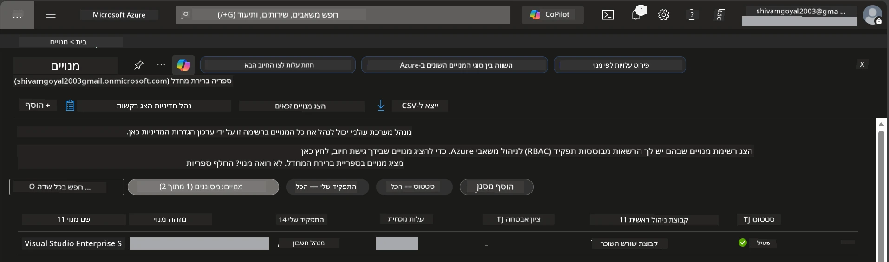

# מודול 0 - דרישות מוקדמות

לפני שתתחיל את הסדנה, ודא שיש לך את הכלים, הגישה והסביבה הבאים מוכנים. עקוב אחרי כל שלב למטה - אל תדלג קדימה.

---

## 1. חשבון ומנוי Azure

### 1.1 צור או אמת את מנוי Azure שלך

1. פתח דפדפן ועבור אל [https://azure.microsoft.com/free/](https://azure.microsoft.com/free/).
2. אם אין לך חשבון Azure, לחץ על **Start free** ופעל לפי תהליך ההרשמה. תצטרך חשבון Microsoft (או ליצור אחד) וכרטיס אשראי לאימות זהות.
3. אם כבר יש לך חשבון, התחבר ב-[https://portal.azure.com](https://portal.azure.com).
4. בפורטל, לחץ על לוחית **Subscriptions** בניווט השמאלי (או חפש "Subscriptions" בשורת החיפוש העליונה).
5. אמת כי מופיע לפחות מנוי **Active** אחד. רשום את **Subscription ID** - תזדקק לו מאוחר יותר.



### 1.2 הבן את תפקידי ה-RBAC הנדרשים

פריסת [Hosted Agent](https://learn.microsoft.com/azure/foundry/agents/concepts/hosted-agents) דורשת הרשאות **data action** שתפקידי Azure הסטנדרטיים `Owner` ו-`Contributor` אינם כוללים. תזדקק לאחד מאלה [שילובי התפקידים](https://learn.microsoft.com/azure/foundry/concepts/rbac-foundry#built-in-roles):

| תרחיש | תפקידים נדרשים | היכן להקצות אותם |
|----------|---------------|----------------------|
| יצירת פרויקט Foundry חדש | **Azure AI Owner** על משאב Foundry | משאב Foundry בפורטל Azure |
| פריסה לפרויקט קיים (משאבים חדשים) | **Azure AI Owner** + **Contributor** במנוי | מנוי + משאב Foundry |
| פריסה לפרויקט מוגדר במלואו | **Reader** בחשבון + **Azure AI User** בפרויקט | חשבון + פרויקט בפורטל Azure |

> **נקודה מרכזית:** תפקידי `Owner` ו-`Contributor` ב-Azure מכסים רק הרשאות *ניהול* (פעולות ARM). אתה צריך את [**Azure AI User**](https://learn.microsoft.com/azure/foundry/concepts/rbac-foundry#built-in-roles) (או גבוה יותר) לפעולות *data* כמו `agents/write` הדרושות ליצירה ופריסת סוכנים. תקצה את התפקידים האלה ב-[מודול 2](02-create-foundry-project.md).

---

## 2. התקנת כלים מקומיים

התקן כל כלי למטה. לאחר ההתקנה, אמת שהוא פועל על ידי הרצת פקודת הבדיקה.

### 2.1 Visual Studio Code

1. עבור אל [https://code.visualstudio.com/](https://code.visualstudio.com/).
2. הורד את המתקין עבור מערכת ההפעלה שלך (Windows/macOS/Linux).
3. הרץ את המתקין עם ההגדרות המובנות.
4. פתח את VS Code כדי לאמת שהוא עולה.

### 2.2 Python 3.10+

1. עבור אל [https://www.python.org/downloads/](https://www.python.org/downloads/).
2. הורד את Python 3.10 או יותר מאוחר (מומלץ 3.12+).
3. **Windows:** במהלך ההתקנה סמן את **"Add Python to PATH"** במסך הראשון.
4. פתח טרמינל ואמת:

   ```powershell
   python --version
   ```

   פלט צפוי: `Python 3.10.x` או יותר.

### 2.3 Azure CLI

1. עבור אל [https://learn.microsoft.com/cli/azure/install-azure-cli](https://learn.microsoft.com/cli/azure/install-azure-cli).
2. פעל לפי הוראות ההתקנה עבור מערכת ההפעלה שלך.
3. אמת:

   ```powershell
   az --version
   ```

   צפוי: `azure-cli 2.80.0` או יותר.

4. היכנס:

   ```powershell
   az login
   ```

### 2.4 Azure Developer CLI (azd)

1. עבור אל [https://learn.microsoft.com/azure/developer/azure-developer-cli/install-azd](https://learn.microsoft.com/azure/developer/azure-developer-cli/install-azd).
2. פעל לפי הוראות ההתקנה עבור מערכת ההפעלה שלך. ב-Windows:

   ```powershell
   winget install microsoft.azd
   ```

3. אמת:

   ```powershell
   azd version
   ```

   צפוי: `azd version 1.x.x` או יותר.

4. היכנס:

   ```powershell
   azd auth login
   ```

### 2.5 Docker Desktop (אופציונלי)

Docker דרוש רק אם תרצה לבנות ולבדוק את תמונת המכולה מקומית לפני הפריסה. תוסף Foundry מטפל בבניית מכולות בזמן הפריסה אוטומטית.

1. עבור אל [https://docs.docker.com/get-docker/](https://docs.docker.com/get-docker/).
2. הורד והתקן את Docker Desktop למערכת ההפעלה שלך.
3. **Windows:** ודא ש-WSL 2 נבחר כ-backend במהלך ההתקנה.
4. הפעל את Docker Desktop וחכה שהאייקון בשורת המשימות יציג **"Docker Desktop is running"**.
5. פתח טרמינל ואמת:

   ```powershell
   docker info
   ```

   זה צריך להדפיס מידע על מערכת Docker ללא שגיאות. אם תראה `Cannot connect to the Docker daemon`, חכה עוד מספר שניות עד שה-Docker יופעל במלואו.

---

## 3. התקנת תוספים ל-VS Code

אתה צריך שלושה תוספים. התקן אותם **לפני** תחילת הסדנה.

### 3.1 Microsoft Foundry עבור VS Code

1. פתח את VS Code.
2. לחץ `Ctrl+Shift+X` כדי לפתוח את לוח התוספים.
3. בתיבת החיפוש, הקלד **"Microsoft Foundry"**.
4. מצא את **Microsoft Foundry for Visual Studio Code** (המפרסם: Microsoft, מזהה: `TeamsDevApp.vscode-ai-foundry`).
5. לחץ על **Install**.
6. לאחר ההתקנה, אמור להופיע אייקון **Microsoft Foundry** בסרגל הפעילות (סרגל הצד השמאלי).

### 3.2 Foundry Toolkit

1. בלוח התוספים (`Ctrl+Shift+X`), חפש **"Foundry Toolkit"**.
2. מצא את **Foundry Toolkit** (המפרסם: Microsoft, מזהה: `ms-windows-ai-studio.windows-ai-studio`).
3. לחץ על **Install**.
4. אייקון **Foundry Toolkit** אמור להופיע בסרגל הפעילות.

### 3.3 Python

1. בלוח התוספים, חפש **"Python"**.
2. מצא את **Python** (המפרסם: Microsoft, מזהה: `ms-python.python`).
3. לחץ על **Install**.

---

## 4. התחבר ל-Azure מתוך VS Code

[Microsoft Agent Framework](https://learn.microsoft.com/agent-framework/overview/) משתמש ב-[`DefaultAzureCredential`](https://learn.microsoft.com/azure/developer/python/sdk/authentication/credential-chains#defaultazurecredential-overview) לאימות. עליך להיות מחובר ל-Azure ב-VS Code.

### 4.1 התחבר דרך VS Code

1. הסתכל לפינה השמאלית התחתונה של VS Code ולחץ על האייקון **Accounts** (סילואט אדם).
2. לחץ על **Sign in to use Microsoft Foundry** (או **Sign in with Azure**).
3. נפתח דפדפן - התחבר עם חשבון Azure שיש לו גישה למנוי שלך.
4. חזור ל-VS Code. אמור להופיע שם שם החשבון בפינה השמאלית התחתונה.

### 4.2 (אופציונלי) התחבר דרך Azure CLI

אם התקנת את Azure CLI ומעדיף אימות דרך CLI:

```powershell
az login
```

זה יפתח דפדפן לצורך התחברות. לאחר ההתחברות, הגדר את המנוי הנכון:

```powershell
az account set --subscription "<your-subscription-id>"
```

אמת:

```powershell
az account show --query "{name:name, id:id, state:state}" --output table
```

אמור להופיע שם שם המנוי, מזהה ומצב = `Enabled`.

### 4.3 (אלטרנטיבי) אימות באמצעות Service principal

ל-CI/CD או סביבות משותפות, הגדר במקום זאת את משתני הסביבה האלה:

```powershell
$env:AZURE_TENANT_ID = "<your-tenant-id>"
$env:AZURE_CLIENT_ID = "<your-client-id>"
$env:AZURE_CLIENT_SECRET = "<your-client-secret>"
```

---

## 5. מגבלות תצוגת מקדימה

לפני ההמשך, שים לב למגבלות הנוכחיות:

- [**Hosted Agents**](https://learn.microsoft.com/azure/foundry/agents/concepts/hosted-agents) נמצאים כרגע ב**ביקורת ציבורית** - לא מומלץ לעומסים בייצור.
- **האזורים הנתמכים מוגבלים** - בדוק את [זמינות האזור](https://learn.microsoft.com/azure/foundry/agents/concepts/hosted-agents#region-availability) לפני יצירת משאבים. אם תבחר אזור שאינו נתמך, הפריסה תכשל.
- חבילת `azure-ai-agentserver-agentframework` היא בגרסת טרום-שחרור (`1.0.0b16`) - ממשקי API עשויים להשתנות.
- מגבלות סקלינג: הסוכנים המאותחלים תומכים ב-0-5 שכפולים (כולל סקלינג לאפס).

---

## 6. רשימת בדיקה מוקדמת

רוץ על כל פריט למטה. אם שלב כלשהו נכשל, חזור ותתקן לפני ההמשך.

- [ ] VS Code נפתח ללא שגיאות
- [ ] Python 3.10+ נמצא ב-PATH (`python --version` מדפיס `3.10.x` או יותר)
- [ ] Azure CLI מותקן (`az --version` מדפיס `2.80.0` או יותר)
- [ ] Azure Developer CLI מותקן (`azd version` מדפיס מידע על גרסה)
- [ ] תוסף Microsoft Foundry מותקן (אייקון גלוי בסרגל הפעילות)
- [ ] תוסף Foundry Toolkit מותקן (אייקון גלוי בסרגל הפעילות)
- [ ] תוסף Python מותקן
- [ ] אתה מחובר ל-Azure ב-VS Code (בדוק אייקון Accounts בפינה השמאלית התחתונה)
- [ ] `az account show` מחזיר את המנוי שלך
- [ ] (אופציונלי) Docker Desktop רץ (`docker info` מחזיר מידע על המערכת ללא שגיאות)

### נקודת בדיקה

פתח את סרגל הפעילות ב-VS Code ואמת שאתה רואה גם את תצוגות הסרגל הצדדי של **Foundry Toolkit** וגם של **Microsoft Foundry**. לחץ על כל אחת כדי לוודא שהן נטענות ללא שגיאות.

---

**הבא:** [01 - התקנת Foundry Toolkit והוספת Foundry →](01-install-foundry-toolkit.md)

---

<!-- CO-OP TRANSLATOR DISCLAIMER START -->
**כתב ויתור**:  
מסמך זה תורגם באמצעות שירות תרגום בינה מלאכותית [Co-op Translator](https://github.com/Azure/co-op-translator). למרות שאנו שואפים לדייק, יש להיות מודעים לכך שתרגומים אוטומטיים עשויים להכיל שגיאות או אי דיוקים. המסמך המקורי בשפתו המקורית צריך להיחשב כמקור הסמכותי. למידע קריטי מומלץ תרגום מקצועי שנעשה על ידי אדם. איננו אחראים לכל אי הבנה או פרשנות שגויה הנובעות מהשימוש בתרגום זה.
<!-- CO-OP TRANSLATOR DISCLAIMER END -->