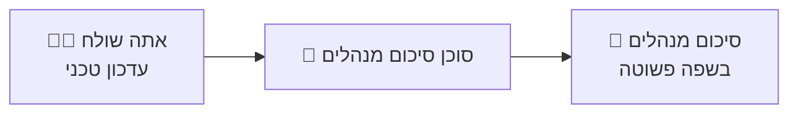

# מודול 0 - מבוא

⏱️ ~10 דקות

> [!WARNING]
> **תצוגה מוקדמת ומגבלות:** [סוכנים מאוחסנים](https://learn.microsoft.com/azure/foundry/agents/concepts/hosted-agents) נמצאים כרגע ב**תצוגה מוקדמת ציבורית** - לא מומלץ לעומסי עבודה בפרודקשן. שים לב לניתן הבאים:
> - **האזורים הנתמכים מוגבלים** - בדוק את [זמינות האזור](https://learn.microsoft.com/azure/foundry/agents/concepts/hosted-agents#region-availability) לפני יצירת משאבים. אם תבחר באזור שאינו נתמך, הפריסה תיכשל.
> - חבילת `azure-ai-agentserver-agentframework` היא בגרסת פרה-ריליס - ממשקי API עשויים להשתנות בין גרסאות.
> - מגבלות קנה מידה: סוכנים מאוחסנים תומכים ב-0–5 שכפולים (כולל סקייל-טו-זירו).
> - ייתכנו שינויים בתכונות המוצגות בסדנה זו ככל שהשירות יתקרב ל-GA.

## מה תבנה

בסדנה זו, תבנה סוכן **"הסבר כמו שאני בכיר"** - סוכן AI מאוחסן שלוקח עדכונים טכניים מורכבים ומסכם אותם בתמצית באנגלית פשוטה עבור בכירים.

```mermaid
flowchart LR
    A["🧑‍💻 אתה שולח\nעדכון טכני"] --> B["🤖 סוכן סיכום מנהלים"]
    B --> C["📝 סיכום מנהלים\nבשפה פשוטה"]
```

**הסוכן משתמש ב:**
- **Microsoft Agent Framework** - ללוגיקה ולמבנה הסוכן
- **Foundry Toolkit עבור VS Code** - לסקפולד, בדיקה מקומית ופריסה
- **מודל AI** (למשל, `gpt-4.1-mini/gpt-5-mini`) - ליצירת הסיכומים

עם סיום המעבדה תקבל סוכן מתפקד שתוכל לבדוק מקומית דרך Agent Inspector, ובאופן אופציונלי לפרוס לענן.

---

## מה הם סוכנים מאוחסנים?

**סוכן מאוחסן** הוא סוכן AI שרץ כשירות מנוהל ב-Microsoft Foundry. במקום לנהל תשתית בעצמך, אתה אורז את קוד הסוכן במכולה ו-Foundry מנהלת את הסקיילינג, האחסון והחשיפה דרך נקודת קצה HTTP סטנדרטית.

| מונח | משמעות |
|---------|--------------|
| **סוכן** | קוד פייתון שלך שמקבל הודעת משתמש, קורא למודל AI ומחזיר תגובה מובנית |
| **מאוחסן** | Foundry מריצה את המכולה שלך עבורך - אין צורך ב-VMs, Kubernetes או ניהול תשתית |
| **פרוטוקול תגובות** | API HTTP סטנדרטי (`POST /responses`) שכל לקוח יכול לקרוא כדי לתקשר עם הסוכן שלך |
| **Agent Inspector** | ממשק בדיקה מקומי (משולב ב-Foundry Toolkit) שמאפשר לך לשוחח עם הסוכן לפני הפריסה |

בסדנה זו תעבור מאפס לסוכן מאוחסן מלא - או תעצור בבדיקה מקומית אם תרצה.

---

## בחר את הנתיב שלך

> ⚠️ **בחר נתיב לפני שתמשיך.** הבחירה שלך תקבע אילו כלים להתקין ואילו מודולים חלים. אפשר לעבור מנתיב ב׳ לנתיב א׳ במועד מאוחר יותר אם תקבל מנוי.

<strong>🅰️ נתיב א - ענן Azure (דורש מנוי Azure)</strong>

| | פרטים |
|---|---|
| **למי זה מיועד?** | יש לך מנוי Azure פעיל ויכולת ליצור משאבי Foundry |
| **מודל** | Azure OpenAI דרך Foundry (למשל, `gpt-4.1-mini/gpt-5-mini`) |
| **מודולים מכוסים** | כל המודולים (00–07) |
| **פרוס לענן?** | ✅ כן - פריסה מלאה בקצה לקצה |

<strong>🅱️ נתיב ב - מקומי / שכבת חינמית (אין צורך במנוי Azure)</strong>

| | פרטים |
|---|---|
| **למי זה מיועד?** | MVPים, סטודנטים, או מי שאין לו גישת Azure |
| **מודל** | **Foundry Local** (חינמי, רץ במכונה שלך) |
| **מודולים מכוסים** | מודולים 00–04 (דילג על פריסה ואימות ענן) |
| **פרוס לענן?** | ❌ לא - בדיקה מקומית בלבד דרך Agent Inspector |

---

## כל הנתיבים: כלים נדרשים

התקן כל כלי מטה. לאחר ההתקנה, ודא שהוא פועל ע"י הרצת פקודת הבדיקה.

| # | כלי | גרסה | התקנה | אימות (פלט צפוי) |
|---|------|---------|---------|---------------------------|
| 1 | **Visual Studio Code** | העדכנית ביותר | [code.visualstudio.com](https://code.visualstudio.com/) | נפתח ללא שגיאות |
| 2 | **Python** | 3.12 או יותר | [python.org/downloads](https://www.python.org/downloads/) | `python --version` $\rightarrow$ `Python 3.12.x` |
| 3 | **Foundry Toolkit עבור VS Code** | העדכנית ביותר | Extension ID: `ms-windows-ai-studio.windows-ai-studio` | סמל Foundry בסרגל הפעילות |
| 4 | **תוסף Python עבור VS Code** | העדכנית ביותר | Extension ID: `ms-python.python` | מותקן בלוח התוספים |

> [!TIP]
> **טיפים מקצועיים להתקנה:**
> - **Python PATH (Windows):** תמיד סמן **"Add Python to PATH"** במסך הראשון של מתקין הפייתון. בלעדיו, `python` לא יזוהה בטרמינל.
> - **גרסאות Python מרובות:** אם מותקן לך גם Python 3.10 וגם 3.12, השתמש ב-`python3.12 -m venv .venv` כדי להבטיח שגרסת הוירטואלית היא הנכונה.
> - **Docker WSL 2 (Windows):** במהלך התקנת Docker Desktop וודא ש-**backend WSL 2** נבחר. שימוש ב-Docker עם Hyper-V איטי יותר ועלול לגרום לבעיות בבניית מכולות Foundry.
> - **Docker לא מתחיל?** המתן 30-60 שניות לאחר הפעלת Docker Desktop. הפעל `docker info` - אם מופיע "Cannot connect to the Docker daemon," Docker עדיין מאותחל.
> - **תוספים של VS Code לא נטענים?** לאחר התקנת התוספים, טען את החלון מחדש: `Ctrl+Shift+P` → `Developer: Reload Window`.

> **משתמשי Windows:** וודאו שסימנתם את **"Add Python to PATH"** במהלך התקנת פייתון.

**הבא:** [01 - Setup →](01-setup.md)

---

<!-- CO-OP TRANSLATOR DISCLAIMER START -->
**כתב ויתור**:
מסמך זה תורגם באמצעות שירות תרגום אוטומטי [Co-op Translator](https://github.com/Azure/co-op-translator). למרות שאנו שואפים לדיוק, יש לקחת בחשבון שתרגומים אוטומטיים עלולים להכיל שגיאות או אי-דיוקים. יש להחשיב את המסמך המקורי בשפתו הטבעית כמקור הסמכות. למידע קריטי מומלץ להשתמש בתרגום מקצועי על ידי מתרגם אדם. אנו לא אחראים לכל אי-הבנה או פירוש שגוי הנובע מהשימוש בתרגום זה.
<!-- CO-OP TRANSLATOR DISCLAIMER END -->