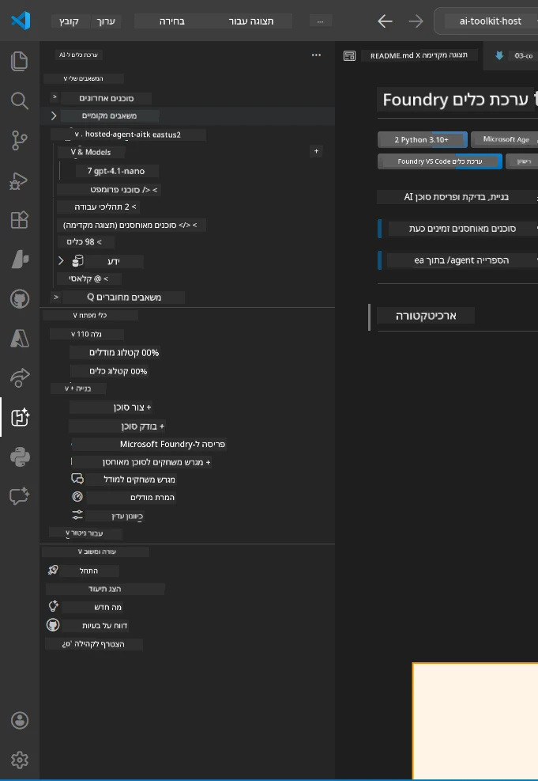
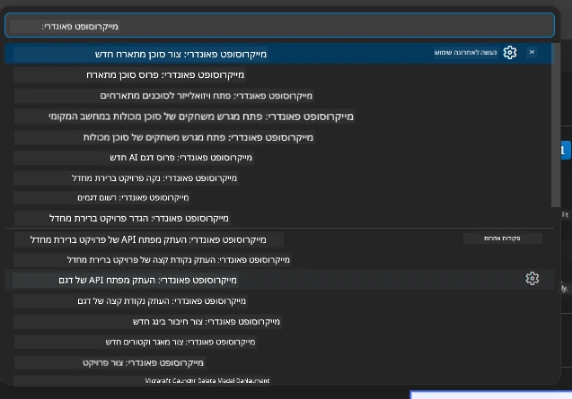

# מודול 1 - התקנת Foundry Toolkit והרחבת Foundry

מודול זה ילווה אותך בתהליך ההתקנה והאימות של שני ההרחבות המרכזיות ל-VS Code עבור סדנה זו. אם כבר התקנת אותן במהלך [מודול 0](00-prerequisites.md), השתמש במודול זה כדי לוודא שהן פועלות כראוי.

---

## שלב 1: התקנת ההרחבה Microsoft Foundry

ההרחבה **Microsoft Foundry for VS Code** היא הכלי הראשי שלך ליצירת פרויקטים ב-Foundry, פריסת מודלים, שלדינג סוכנים מאוחסנים ופריסה ישירה מ-VS Code.

1. פתח את VS Code.
2. לחץ `Ctrl+Shift+X` כדי לפתוח את לוח ההרחבות.
3. בתיבת החיפוש למעלה, הקלד: **Microsoft Foundry**
4. חפש את התוצאה שכותרתה **Microsoft Foundry for Visual Studio Code**.
   - מו"ל: **Microsoft**
   - מזהה ההרחבה: `TeamsDevApp.vscode-ai-foundry`
5. לחץ על כפתור **התקן**.
6. המתן לסיום ההתקנה (תראה מחוון התקדמות קטן).
7. לאחר ההתקנה, הסתכל על **סרגל הפעילות** (סרגל האייקונים האנכי בצד שמאל של VS Code). אמור להופיע אייקון חדש של **Microsoft Foundry** (נראה כמו יהלום/אייקון AI).
8. לחץ על אייקון **Microsoft Foundry** כדי לפתוח את תצוגת הסרגל הצדדי שלו. אמורות להופיע חלקים עבור:
   - **משאבים** (או פרויקטים)
   - **סוכנים**
   - **מודלים**

> **אם האייקון לא מופיע:** נסה לטעון מחדש את VS Code (`Ctrl+Shift+P` → `Developer: Reload Window`).

---

## שלב 2: התקנת ההרחבה Foundry Toolkit

ההרחבה **Foundry Toolkit** מספקת את [**מבחין הסוכנים**](https://learn.microsoft.com/azure/foundry/agents/how-to/vs-code-agents-workflow-pro-code) - ממשק חזותי לבדיקת סוכנים וניפוי שגיאות באופן מקומי - בנוסף לכלים לפלייגראונד, ניהול מודלים וכלי הערכה.

1. בלוח ההרחבות (`Ctrl+Shift+X`), נקה את תיבת החיפוש והקלד: **Foundry Toolkit**
2. מצא את **Foundry Toolkit** בתוצאות.
   - מו"ל: **Microsoft**
   - מזהה ההרחבה: `ms-windows-ai-studio.windows-ai-studio`
3. לחץ על **התקן**.
4. לאחר ההתקנה, אייקון **Foundry Toolkit** מופיע בסרגל הפעילות (נראה כמו רובוט/אייקון נוצץ).
5. לחץ על אייקון **Foundry Toolkit** כדי לפתוח את תצוגת הסרגל הצדדי שלו. אמור להופיע מסך הפתיחה של Foundry Toolkit עם אפשרויות עבור:
   - **מודלים**
   - **פלייגראונד**
   - **סוכנים**

---

## שלב 3: אמת ששתי ההרחבות פועלות

### 3.1 אמת את ההרחבה Microsoft Foundry

1. לחץ על אייקון **Microsoft Foundry** בסרגל הפעילות.
2. אם נכנסת ל-Azure (ממודול 0), אמורים להופיע הפרויקטים שלך תחת **משאבים**.
3. אם מתבקש להתחבר, לחץ **Sign in** ופעל לפי תהליך האימות.
4. ודא שניתן לראות את הסרגל הצדדי ללא שגיאות.

### 3.2 אמת את ההרחבה Foundry Toolkit

1. לחץ על אייקון **Foundry Toolkit** בסרגל הפעילות.
2. ודא שתצוגת קבלת הפנים או הלוח המרכזי נטענים ללא שגיאות.
3. אין צורך להגדיר כרגע דבר - נשתמש במבחין הסוכנים ב-[מודול 5](05-test-locally.md).

### 3.3 אמת דרך פקודות הפלטה (Command Palette)

1. לחץ `Ctrl+Shift+P` כדי לפתוח את פקודות הפלטה.
2. הקלד **"Microsoft Foundry"** - אמורות להופיע פקודות כמו:
   - `Microsoft Foundry: Create a New Hosted Agent`
   - `Microsoft Foundry: Deploy Hosted Agent`
   - `Microsoft Foundry: Open Model Catalog`
3. לחץ `Escape` כדי לסגור את פקודות הפלטה.
4. פתח שוב את פקודות הפלטה והקלד **"Foundry Toolkit"** - אמורות להופיע פקודות כמו:
   - `Foundry Toolkit: Open Agent Inspector`

> אם אינך רואה פקודות אלו, ייתכן שההרחבות לא הותקנו כראוי. נסה להסיר ולהתקין אותן מחדש.

---

## מה ההרחבות האלו עושות בסדנה זו

| הרחבה | מה היא עושה | מתי תשתמש בה |
|-----------|-------------|-------------------|
| **Microsoft Foundry for VS Code** | יצירת פרויקטים ב-Foundry, פריסת מודלים, **שלדינג [סוכנים מאוחסנים](https://learn.microsoft.com/azure/foundry/agents/concepts/hosted-agents)** (יוצר אוטומטית `agent.yaml`, `main.py`, `Dockerfile`, `requirements.txt`), פריסה לשירות [Foundry Agent Service](https://learn.microsoft.com/azure/foundry/agents/overview) | מודולים 2, 3, 6, 7 |
| **Foundry Toolkit** | מבחין סוכנים לבדיקות וניפוי שגיאות מקומי, ממשק פלייגראונד, ניהול מודלים | מודולים 5, 7 |

> **ההרחבה Foundry היא הכלי הקריטי ביותר בסדנה זו.** היא מנהלת את כל מחזור החיים מקצה לקצה: שלדינג → הגדרה → פריסה → אימות. Foundry Toolkit משלימה אותה על ידי מתן מבחין סוכנים חזותי לבדיקות מקומיות.

---

### נקודת בדיקה

- [ ] האייקון של Microsoft Foundry נראה בסרגל הפעילות
- [ ] לחיצה עליו פותחת את הסרגל הצדדי ללא שגיאות
- [ ] האייקון של Foundry Toolkit נראה בסרגל הפעילות
- [ ] לחיצה עליו פותחת את הסרגל הצדדי ללא שגיאות
- [ ] `Ctrl+Shift+P` → הקלדת "Microsoft Foundry" מראה פקודות זמינות
- [ ] `Ctrl+Shift+P` → הקלדת "Foundry Toolkit" מראה פקודות זמינות

---

**קודם:** [00 - דרישות מוקדמות](00-prerequisites.md) · **הבא:** [02 - יצירת פרויקט Foundry →](02-create-foundry-project.md)

---

<!-- CO-OP TRANSLATOR DISCLAIMER START -->
**כתב ויתור**:  
מסמך זה תורגם באמצעות שירות התרגום הממוחשב [Co-op Translator](https://github.com/Azure/co-op-translator). למרות שאנו שואפים לדיוק, יש להיות מודעים לכך שתרגומים אוטומטיים עלולים להכיל שגיאות או אי דיוקים. המסמך המקורי בשפת המקור נחשב למקור הסמכותי. למידע חיוני, מומלץ לתרגום מקצועי על ידי אדם. אנו לא נושאים באחריות לכל אי הבנה או פרשנות שגויה שנגרמו כתוצאה משימוש בתרגום זה.
<!-- CO-OP TRANSLATOR DISCLAIMER END -->