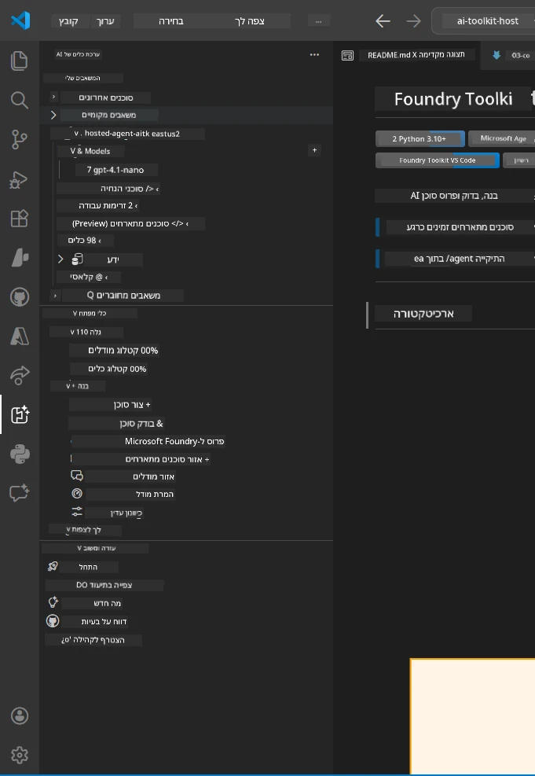
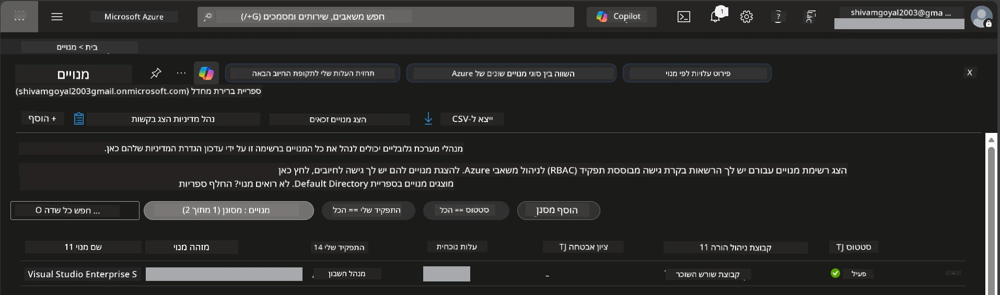
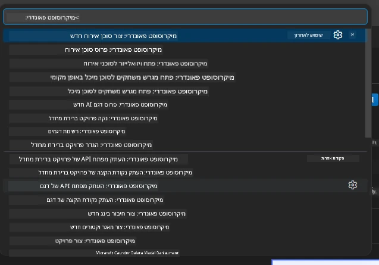
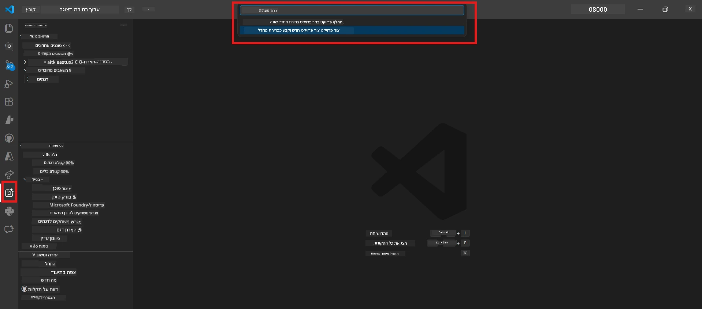
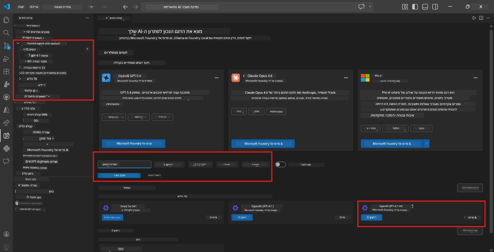
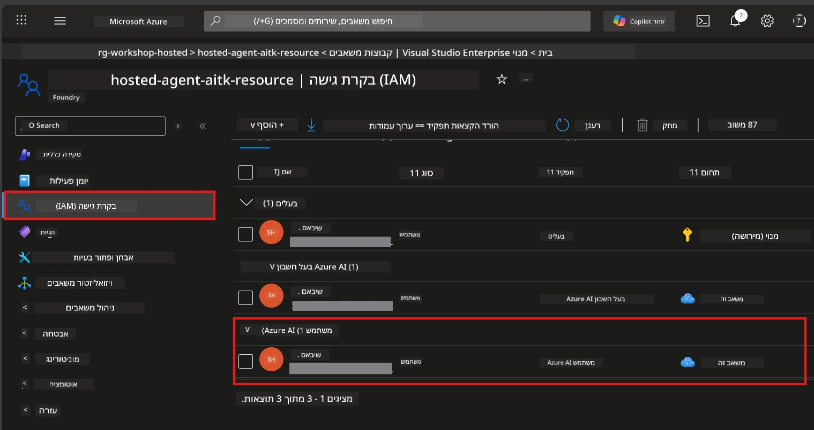

# התקנה: תוסף, פרויקט ודגם

⏱️ ~15 דקות

במודול זה, תתקין ותאמת את תוסף Foundry Toolkit, תיצור (או תתחבר ל) פרויקט Foundry, ותפרוס דגם שסוכן שלך ישתמש בו.

## שלב 1: התקנת Foundry Toolkit

**Foundry Toolkit עבור VS Code** הוא התוסף הראשי לסדנה זו. הוא מספק יצירת פרויקטים, פריסת דגמים, יצירת שלד לסוכן, בדיקות מקומיות (Agent Inspector) ופריסה לענן – הכל מתוך VS Code.

1. פתח את VS Code ואז לחץ `Ctrl+Shift+X` לפתיחת לוח **תוספים**.
2. חפש **Foundry Toolkit**.
3. התקן את **Foundry Toolkit for VS Code** (מוציא לאור: Microsoft, מזהה: `ms-windows-ai-studio.windows-ai-studio`).
4. לאחר ההתקנה, סמל **Foundry Toolkit** יופיע בסרגל הפעילות (סרגל צד שמאלי).

> *הערה: סרגל הפעילות עשוי להציג "AI TOOLKIT" בגירסאות ישנות יותר של התוסף. הפונקציונליות זהה.*



## שלב 2: הגדר לפי הגישה שלך

> **בחר את הדרך שלך:** הרחב את הסעיף שמתאים להגדרות שלך. יש להשלים **דרך אחת בלבד**.

<details>
<summary><strong>🅰️ דרך א - ענן Azure (דרוש מנוי ל-Azure)</strong></summary>

### Azure CLI

1. התקן מ-[learn.microsoft.com/cli/azure/install-azure-cli](https://learn.microsoft.com/cli/azure/install-azure-cli).
2. אמת: `az --version` (מצופה 2.80.0+).
3. התחבר: `az login`

### אפשרויות אימות

[מסגרת הסוכן של Microsoft](https://learn.microsoft.com/agent-framework/overview/) משתמשת ב-[`DefaultAzureCredential`](https://learn.microsoft.com/azure/developer/python/sdk/authentication/credential-chains#defaultazurecredential-overview) שמנסה מספר שיטות אימות לפי סדר. בחר את המתאים לסביבה שלך:

#### אפשרות 1: חשבונות VS Code (מומלץ לסדנאות)
1. לחץ על סמל **חשבונות** (סילואט של אדם) בפינה השמאלית התחתונה של VS Code.
2. בחר **Sign in to use Microsoft Foundry** (או **Sign in with Azure**).
3. דפדפן ייפתח - התחבר עם חשבון Azure שיש לו גישה למנוי שלך.
4. חזור ל-VS Code. אמור להופיע שמך בפינה השמאלית התחתונה.

#### אפשרות 2: Azure CLI
```bash
az login
az account set --subscription "<your-subscription-id>"
```

#### אפשרות 3: Service Principal (ארגוני/CI)
עבור סביבות מוגבלות או צינורות CI/CD, הגדר את משתני הסביבה האלה בקובץ `.env` שלך:
```env
AZURE_TENANT_ID=<your-tenant-id>
AZURE_CLIENT_ID=<your-client-id>
AZURE_CLIENT_SECRET=<your-client-secret>
```

> **איך `DefaultAzureCredential` עובד:** הוא מנסה משתני סביבה קודם, אחר כך זהות מנוהלת, אחר כך כניסה ל-VS Code, ואחר כך Azure CLI - ומשתמש במה שמצליח ראשון. ראה [תיעוד שרשרת האימות](https://learn.microsoft.com/azure/developer/python/sdk/authentication/credential-chains#defaultazurecredential-overview).

### Azure Developer CLI (azd)

1. התקן: `winget install microsoft.azd` (Windows) או ראה [תיעוד התקנה](https://learn.microsoft.com/azure/developer/azure-developer-cli/install-azd).
2. אמת: `azd version`
3. התחבר: `azd auth login`

### Docker Desktop (אופציונלי)

דרוקר דרוש רק אם ברצונך לבנות מכולות באופן מקומי. תוסף Foundry מטפל בבנייה אוטומטית במהלך הפריסה.

1. התקן מ-[docs.docker.com/get-docker](https://docs.docker.com/get-docker/).
2. אמת: `docker info`

### מנוי Azure ו-RBAC

1. התחבר ב-[portal.azure.com](https://portal.azure.com).
2. עבור ל**Subscriptions** ואמת לפחות מנוי אחד שהוא **פעיל**.
3. רשום את **זהות המנוי** שלך - תזדקק לה במודול 01.



#### טבלת תרחישי RBAC

פריסת [Hosted Agent](https://learn.microsoft.com/azure/foundry/agents/concepts/hosted-agents) דורשת הרשאות *פעולת נתונים* שסוגי התפקידים הרגילים של Azure `Owner` ו-`Contributor` לא כוללים. השתמש בטבלה שלמטה לקביעת התפקידים הנדרשים:

| תרחיש | תפקידים נדרשים | היכן להקצות אותם |
|----------|---------------|----------------------|
| יצירת פרויקט Foundry חדש | **Azure AI Owner** על משאב Foundry | משאב Foundry בפורטל Azure |
| פריסה לפרויקט קיים (משאבים חדשים) | **Azure AI Owner** + **Contributor** על המנוי | מנוי + משאב Foundry |
| פריסה לפרויקט מוגדר במלואו | **Reader** על החשבון + **Azure AI User** על הפרויקט | חשבון + פרויקט בפורטל Azure |
| בדיקה מקומית בלבד (ללא פריסה) | **Azure AI User** על הפרויקט | פרויקט בפורטל Azure |

> **נקודה מרכזית:** תפקידי Azure `Owner` ו-`Contributor` מכסים רק הרשאות *ניהול* (פעולות ARM). אתה צריך [**Azure AI User**](https://learn.microsoft.com/azure/foundry/concepts/rbac-foundry#built-in-roles) (או גבוה יותר) עבור *פעולות נתונים* כמו `agents/write` הדרושות ליצירה ופריסת סוכנים.

## התחבר או צור פרויקט Foundry



1. לחץ `Ctrl+Shift+P` → הקלד **Foundry Toolkit: Create Project** → בחר את הפקודה.
2. בחר את **מנוי Azure** מהרשימה הנפתחת.
3. בחר או צור **קבוצת משאבים** (למשל, `rg-hosted-agents-workshop`).
4. בחר **אזור** התומך בסוכנים מארחים: `East US`, `West US 2` או `Sweden Central`. ראה [זמינות אזורים](https://learn.microsoft.com/azure/foundry/agents/concepts/hosted-agents#region-availability).
5. הזן שם לפרויקט (למשל, `workshop-agents`).
6. המתן 2–5 דקות לפרוביזיה. הודעת התקדמות תוצג ב-VS Code.
7. בסיום, הפרויקט יופיע בסרגל הצד של **Foundry Toolkit** תחת **MY RESOURCES**.



## פרוס דגם והקצה RBAC

הסוכן שלך המארח זקוק לדגם AI כדי ליצור תגובות.

#### מטריצת בחירת דגם
בהתאם לצרכים שלך, ניתן לבחור מרמות דגם שונות:

| דגם | מתאים ביותר ל | עלות | הערות |
|-------|----------|------|-------|
| `gpt-4.1` | תגובות איכותיות ומדויקות | גבוה יותר | התוצאות הטובות ביותר, מומלץ לבדיקה סופית |
| `gpt-4.1-mini/gpt-5-mini` | איטרציה מהירה, עלות נמוכה יותר | נמוכה יותר | טוב לפיתוח בסדנה ובדיקות מהירות |
| `gpt-4.1-nano` | משימות קלות | הנמוכה ביותר | החסכוני ביותר, אך תגובות פשוטות יותר |

1. לחץ `Ctrl+Shift+P` → **Foundry Toolkit: Open Model Catalog** (או לחץ **Model Catalog** בסרגל הצד תחת TOOLS DEVELOPER → Discover).
2. חפש **gpt-4.1** בקטלוג.
3. מצא את **OpenAI GPT-4.1-mini** (או `gpt-5-mini` לאיכות טובה יותר) ולחץ **Deploy**.



4. בקונפיגורציית הפריסה:
   - **שם פריסה:** השאר את ברירת המחדל או הכנס שם מותאם. **זכור את השם הזה.**
   - **יעד:** בחר **Deploy to Foundry Toolkit** → בחר את הפרויקט שלך.
5. לחץ **Deploy** והמתן 1–3 דקות.

> **המלצה:** השתמש ב-`gpt-4.1-mini/gpt-5-mini` לסדנה – מהיר, זול ומשיג תוצאות טובות.

### רשום את הערכים שלך

לאחר הפריסה, רשום את שני הערכים האלה (תצטרך אותם במודול 03):

| ערך | היכן למצוא אותו |
|-------|-----------------|
| **נקודת הקצה של הפרויקט** | לחץ על הפרויקט בסרגל הצד → פרטי התצוגה מציגים את כתובת ה-URL (למשל, `https://<account>.services.ai.azure.com/api/projects/<project>`) |
| **שם פריסת הדגם** | הרחב את הפרויקט → **Models** → השם ליד הדגם שפורסם (למשל, `gpt-4.1-mini/gpt-5-mini`) |

### הקצה תפקיד RBAC

> ⚠️ **זהו השלב שנפנק הכי הרבה.** ללא התפקיד הנכון, הפריסה במודול 05 תכשל.

#### איזה תפקיד דרוש לי?
בהתאם לתרחיש שלך, אתה צריך את שילובי התפקידים הבאים:

| תרחיש | תפקידים נדרשים | היכן להקצות אותם |
|----------|---------------|----------------------|
| יצירת פרויקט Foundry חדש | **Azure AI Owner** על משאב Foundry | משאב Foundry בפורטל Azure |
| פריסה לפרויקט קיים (משאבים חדשים) | **Azure AI Owner** + **Contributor** על מנוי | מנוי + משאב Foundry |
| פריסה לפרויקט מוגדר במלואו | **Reader** על חשבון + **Azure AI User** על הפרויקט | חשבון + פרויקט בפורטל Azure |

**נקודה מרכזית:** תפקידי Azure `Owner` ו-`Contributor` מכסים רק הרשאות *ניהול*. אתה צריך **Azure AI User** (או מעל) עבור *פעולות נתונים* כגון `agents/write` הדרושות ליצירה ופריסה של סוכנים.

1. פתח את [portal.azure.com](https://portal.azure.com).
2. חפש את שם **פרויקט Foundry** שלך → לחץ על התוצאה מסוג **"Foundry Toolkit project"** (לא החשבון הראשי).
3. לחץ על **Access control (IAM)** בניווט השמאלי.
4. לחץ **+ הוסף** → **הוסף הקצאת תפקיד**.
5. **כרטיסיית תפקיד:** חפש **Azure AI User**, בחר אותו, לחץ **הבא**.
6. **כרטיסיית חברים:** בחר **משתמש, קבוצה או שירות ראשי** → לחץ **+ בחר חברים** → מצא ובחר את עצמך → לחץ **בחר**.
7. לחץ **סקירה והקצאה** → לחץ **סקירה והקצאה** שוב.
8. **המתן 1–2 דקות** להפצה.

> **למה התפקיד הזה?** תפקידי Azure `Owner`/`Contributor` מעניקים רק הרשאות ניהול. תפקיד **Azure AI User** מעניק את פעולת הנתונים `agents/write` הדרושה ליצירה ופריסת סוכנים. ראה [תיעוד RBAC של Foundry](https://learn.microsoft.com/azure/foundry/concepts/rbac-foundry#built-in-roles).



</details>

<details>
<summary><strong>🅱️ דרך ב - מקומית / שכבת חינם (אין צורך במנוי Azure)</strong></summary>

### Foundry Local

Foundry Local מאפשר לך להריץ דגמי AI במחשבך – אין צורך בחשבון ענן. ניתן לגשת לדגמי Foundry Local באמצעות Foundry Toolkit דרך קטלוג הדגמים כך:

1. עבור לתוסף Foundry Toolkit.
2. בניווט Foundry Toolkit עבור ל**Developer Tools** > ובחר **Model Catalog**
3. בחלון החדש, בחר **local** בסרגל הניווט.
4. גלול למטה ל-**Phi 4 Mini,** ולחץ על כפתור ההוספה – תופיע הודעה שמראה שהדגם מורד.
5. ברגע שהדגם יורד, תוכל להמשיך לשלב הבא.

</details>

### ✅ נקודת בדיקה


- [ ] `Ctrl+Shift+P` → "Foundry Toolkit" מציג פקודות זמינות
- [ ] תוסף Foundry Toolkit מותקן וסרגל הצד נטען ללא שגיאות
- [ ] VS Code נפתח ופועל נכונה
- [ ] `python --version` מציג 3.10+
- [ ] סמל Foundry Toolkit נראה בסרגל הפעילות של VS Code
- [ ] **דרך א:** `az login` מצליח, המנוי פעיל
- [ ] **דרך ב:** Foundry Local פועל (`foundry local status`)
- [ ] **דרך א:** פרויקט Foundry נראה בסרגל הצד, דגם פרוס, מוקצה תפקיד Azure AI User
- [ ] **דרך ב:** Foundry Local פועל עם דגם
- [ ] רשמת את **נקודת הקצה** ואת **שם פריסת הדגם**


**הקודם:** [00 - דרישות מוקדמות](00-prerequisites.md) · **הבא:** [02 - יצירת סוכן מארח →](02-create-hosted-agent.md)

---

<!-- CO-OP TRANSLATOR DISCLAIMER START -->
**כתב ויתור**:
מסמך זה תורגם באמצעות שירות תרגום אוטומטי [Co-op Translator](https://github.com/Azure/co-op-translator). למרות שאנו שואפים לדיוק, יש לקחת בחשבון שתרגומים אוטומטיים עלולים להכיל שגיאות או אי-דיוקים. יש להחשיב את המסמך המקורי בשפתו הטבעית כמקור הסמכות. למידע קריטי מומלץ להשתמש בתרגום מקצועי על ידי מתרגם אדם. אנו לא אחראים לכל אי-הבנה או פירוש שגוי הנובע מהשימוש בתרגום זה.
<!-- CO-OP TRANSLATOR DISCLAIMER END -->