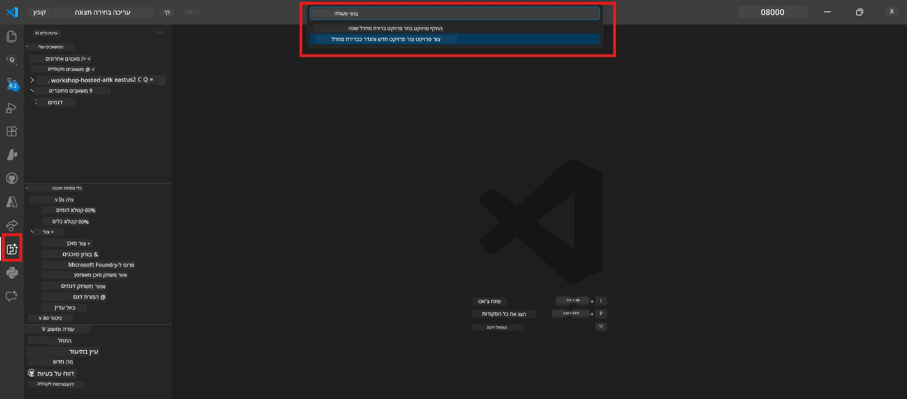
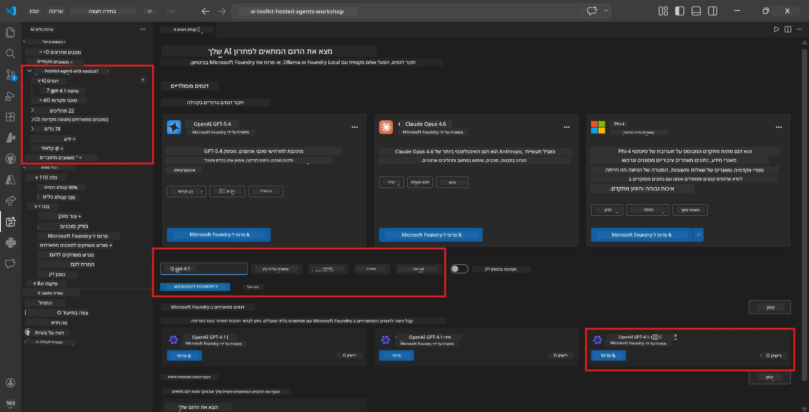
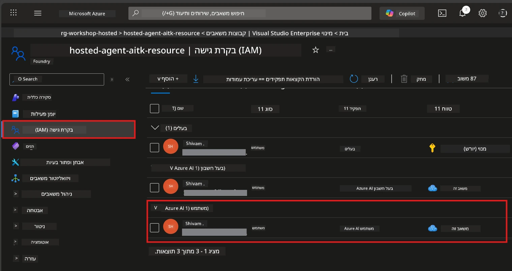

# מודול 2 - יצירת פרויקט Foundry ופריסת מודל

במודול זה, תיצור (או תבחר) פרויקט Microsoft Foundry ופרוס מודל שהסוכן שלך ישתמש בו. כל שלב כתוב במפורש – עקוב אחריהם לפי הסדר.

> אם כבר יש לך פרויקט Foundry עם מודל פרוס, דלג ל-[מודול 3](03-create-hosted-agent.md).

---

## שלב 1: יצירת פרויקט Foundry מתוך VS Code

תשתמש בהרחבת Microsoft Foundry כדי ליצור פרויקט מבלי לצאת מ-VS Code.

1. לחץ על `Ctrl+Shift+P` לפתיחת **Command Palette**.
2. הקלד: **Microsoft Foundry: Create Project** ובחר בה.
3. יופיע תפריט נפתח - בחר את **המנוי של Azure** מהרשימה.
4. תתבקש לבחור או ליצור **Resource Group**:
   - ליצירת חדש: הקלד שם (לדוגמה, `rg-hosted-agents-workshop`) ולחץ Enter.
   - לשימוש בקיים: בחר אותו מהרשימה הנפתחת.
5. בחר **אזור**. **חשוב:** בחר אזור התומך בסוכנים מארחים. בדוק [זמינות אזורים](https://learn.microsoft.com/azure/foundry/agents/concepts/hosted-agents#region-availability) – אפשרויות נפוצות הן `East US`, `West US 2` או `Sweden Central`.
6. הזן **שם** לפרויקט Foundry (לדוגמה, `workshop-agents`).
7. לחץ Enter וחכה להשלמת ההקמה.

> **ההקמה לוקחת 2-5 דקות.** תראה התראה על ההתקדמות בפינה הימנית התחתונה של VS Code. אל תסגור את VS Code בזמן ההקמה.

8. כשההקמה תסתיים, הסרגל הצדדי של **Microsoft Foundry** יציג את הפרויקט החדש תחת **Resources**.
9. לחץ על שם הפרויקט להרחבה ואמת שהוא מציג חלקים כמו **Models + endpoints** ו-**Agents**.



### אלטרנטיבה: יצירה דרך פורטל Foundry

אם אתה מעדיף להשתמש בדפדפן:

1. פתח [https://ai.azure.com](https://ai.azure.com) והיכנס.
2. לחץ על **Create project** בדף הבית.
3. הזן שם לפרויקט, בחר מנוי, Resource Group ואזור.
4. לחץ על **Create** וחכה להשלמת ההקמה.
5. לאחר שיצרת, חזור ל-VS Code - הפרויקט צריך להופיע בסרגל הצדדי של Foundry לאחר ריענון (לחץ על סמל הרענון).

---

## שלב 2: פריסת מודל

ל-[הסוכן המארח שלך](https://learn.microsoft.com/azure/foundry/agents/concepts/hosted-agents) יש צורך במודל Azure OpenAI כדי לייצר תגובות. ת[פרוס אחד עכשיו](https://learn.microsoft.com/azure/ai-foundry/openai/how-to/create-resource#deploy-a-model).

1. לחץ על `Ctrl+Shift+P` לפתיחת **Command Palette**.
2. הקלד: **Microsoft Foundry: Open [Model Catalog](https://learn.microsoft.com/azure/ai-foundry/openai/concepts/models)** ובחר בו.
3. נפתח תצוגת קטלוג המודלים ב-VS Code. דפדף או השתמש בסרגל החיפוש כדי למצוא את **gpt-4.1**.
4. לחץ על כרטיס המודל **gpt-4.1** (או `gpt-4.1-mini` אם אתה מעדיף עלות נמוכה יותר).
5. לחץ על **Deploy**.



6. בקונפיגורציית הפריסה:
   - **שם הפריסה**: השאר את ברירת המחדל (לדוגמה, `gpt-4.1`) או הזן שם מותאם אישית. **זכור שם זה** – תצטרך אותו במודול 4.
   - **יעד**: בחר **Deploy to Microsoft Foundry** ובחר את הפרויקט שיצרת.
7. לחץ **Deploy** וחכה לסיום הפריסה (1-3 דקות).

### בחירת מודל

| מודל | מתאים ל | עלות | הערות |
|-------|----------|------|-------|
| `gpt-4.1` | תגובות איכותיות ומורכבות | גבוה | תוצאות הטובות ביותר, מומלץ לבדיקות סופיות |
| `gpt-4.1-mini` | איטרציה מהירה, עלות נמוכה יותר | נמוך | טוב לפיתוח בסדנה ובדיקות מהירות |
| `gpt-4.1-nano` | משימות קלות | הנמוך ביותר | חסכוני ביותר, תגובות פשוטות יותר |

> **המלצה לסדנה זו:** השתמש ב-`gpt-4.1-mini` לפיתוח ובדיקות. הוא מהיר, זול ומפיק תוצאות טובות לתרגילים.

### אימות פריסת המודל

1. בסרגל הצדדי של **Microsoft Foundry**, הרחב את הפרויקט שלך.
2. חפש תחת **Models + endpoints** (או חלק דומה).
3. אמור להופיע המודל שפרסת (לדוגמה, `gpt-4.1-mini`) עם סטטוס **Succeeded** או **Active**.
4. לחץ על הפריסה של המודל כדי לראות את פרטיה.
5. **רשום** את שני הערכים האלה – תצטרך אותם במודול 4:

   | הגדרה | איפה למצוא | ערך לדוגמה |
   |---------|-----------------|---------------|
   | **נקודת קצה של הפרויקט** | לחץ על שם הפרויקט בסרגל Foundry. כתובת ה-URL של נקודת הקצה מופיעה בפרטי הצפייה. | `https://<account>.services.ai.azure.com/api/projects/<project>` |
   | **שם פריסת המודל** | השם שמופיע לצד המודל הפרוס. | `gpt-4.1-mini` |

---

## שלב 3: הקצאת תפקידי RBAC נדרשים

זהו **השלב שנשכח הכי הרבה פעמים**. ללא התפקידים הנכונים, הפריסה במודול 6 תיכשל עם שגיאת הרשאות.

### 3.1 הקצה לעצמך את תפקיד Azure AI User

1. פתח דפדפן וגש ל-[https://portal.azure.com](https://portal.azure.com).
2. בסרגל החיפוש העליון, הקלד את שם **פרויקט Foundry** שלך ולחץ עליו בתוצאות.
   - **חשוב:** נווט למשאב **הפרויקט** (סוג: "Microsoft Foundry project") ולא למשאב האב/חשבון.
3. בניווט השמאלי של הפרויקט, לחץ על **Access control (IAM)**.
4. לחץ על כפתור **+ הוסף** למעלה → בחר **Add role assignment**.
5. בלשונית **Role**, חפש את [**Azure AI User**](https://learn.microsoft.com/azure/foundry/concepts/rbac-foundry#built-in-roles) ובחר אותו. לחץ **Next**.
6. בלשונית **Members**:
   - בחר **User, group, or service principal**.
   - לחץ על **+ Select members**.
   - חפש את שמך או המייל, בחר את עצמך ולחץ **Select**.
7. לחץ **Review + assign** → ואחר כך לחץ שוב **Review + assign** לאישור.



### 3.2 (אופציונלי) הקצה את תפקיד Azure AI Developer

אם אתה צריך ליצור משאבים נוספים בפרויקט או לנהל פריסות באופן תוכנתי:

1. חזור על השלבים לעיל, אך בשלב 5 בחר **Azure AI Developer** במקום.
2. הקצה זאת ברמת **Foundry resource (חשבון)**, לא רק ברמת הפרויקט.

### 3.3 אמת את ההקצאות שלך

1. בדף **Access control (IAM)** של הפרויקט, לחץ על לשונית **Role assignments**.
2. חפש את שמך.
3. אמור להופיע לפחות תפקיד **Azure AI User** ברמת הפרויקט.

> **למה זה חשוב:** תפקיד [`Azure AI User`](https://learn.microsoft.com/azure/foundry/concepts/rbac-foundry#built-in-roles) מעניק את פעולת הנתונים `Microsoft.CognitiveServices/accounts/AIServices/agents/write`. בלעדיו, תראה שגיאת הרשאה בזמן הפריסה:
>
> ```
> Error: lacks the required data action 
> Microsoft.CognitiveServices/accounts/AIServices/agents/write 
> to perform POST /api/projects/{projectName}/assistants operation.
> ```
>
> עיין ב-[מודול 8 - פתרון תקלות](08-troubleshooting.md) לפרטים נוספים.

---

### נקודת בדיקה

- [ ] פרויקט Foundry קיים וגלוי בסרגל הצדדי של Microsoft Foundry ב-VS Code
- [ ] לפחות מודל אחד פרוס (לדוגמה, `gpt-4.1-mini`) עם סטטוס **Succeeded**
- [ ] רשמת את כתובת **נקודת הקצה של הפרויקט** ואת **שם פריסת המודל**
- [ ] יש לך תפקיד **Azure AI User** מוקצה ברמת **הפרויקט** (אמת ב-Azure Portal → IAM → Role assignments)
- [ ] הפרויקט נמצא ב[אזור נתמך](https://learn.microsoft.com/azure/foundry/agents/concepts/hosted-agents#region-availability) לסוכנים מארחים

---

**קודם:** [01 - התקנת Foundry Toolkit](01-install-foundry-toolkit.md) · **הבא:** [03 - יצירת סוכן מארח →](03-create-hosted-agent.md)

---

<!-- CO-OP TRANSLATOR DISCLAIMER START -->
**כתב ויתור**:  
מסמך זה תורגם באמצעות שירות תרגום מבוסס בינה מלאכותית [Co-op Translator](https://github.com/Azure/co-op-translator). בעוד שאנו שואפים לדיוק, יש להתייחס לכך שתרגומים אוטומטיים עשויים להכיל שגיאות או אי-דיוקים. המסמך המקורי בשפת המקור שלו ייחשב למקור הסמכותי. למידע קריטי מומלץ להשתמש בתרגום מקצועי מבוצע על ידי אדם. אנו לא נושאים באחריות על אי-הבנות או פרשנויות שגויות הנובעות מהשימוש בתרגום זה.
<!-- CO-OP TRANSLATOR DISCLAIMER END -->