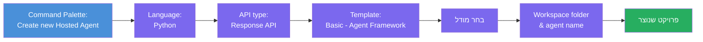
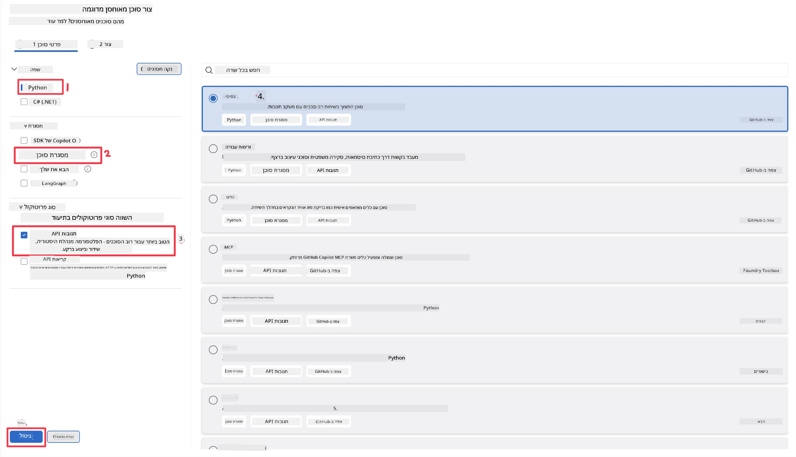
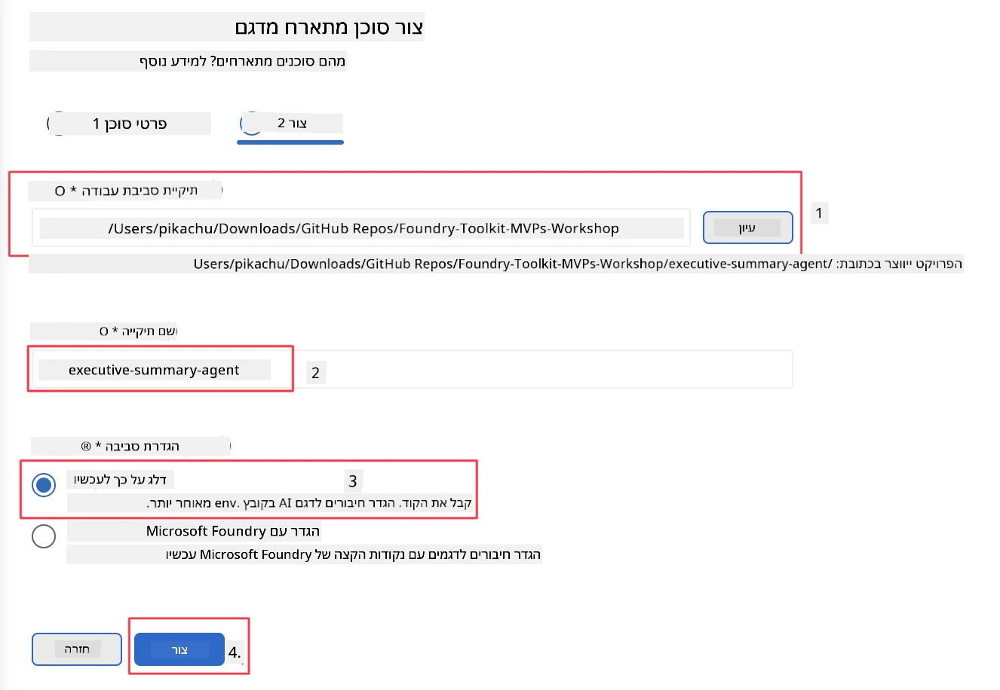

# מודול 2 - יצירת סוכן מתארח חדש

⏱️ ~5 דקות

במודול זה, אתה משתמש ב-Foundry Toolkit כדי **ליצור תבנית לפרויקט סוכן מתארח**. התבנית מייצרת את מבנה הפרויקט המלא - `agent.yaml`, `main.py`, `Dockerfile`, `requirements.txt`, והגדרת דיבוג ב-VS Code - כדי שתוכל להתמקד בהתאמת התנהגות הסוכן.

> **מושג מפתח:** התיקייה `agent/` במעבדה זו היא דוגמה למה ש-Foundry Toolkit מייצר. אינך כותב קבצים אלו מאפס.

### זרימת אשף התבנית



---

## שלב 1: פתח את אשף יצירת סוכן מתארח

1. לחץ `Ctrl+Shift+P` כדי לפתוח את **חלון הפקודות**.
2. הקלד: **Foundry Toolkit: Create new Hosted Agent** ובחר בו.

> **אלטרנטיבה: יצירה דרך פורטל Foundry**
> אם אתה מעדיף דפדפן, ניתן ליצור את הפרויקט בכתובת [https://ai.azure.com](https://ai.azure.com). לאחר שהפרויקט מתקין, חזור ל-VS Code והשתמש בסרגל הצד של **Foundry Toolkit** להתחבר אליו.

> **אלטרנטיבה:** לחץ על סמל **+** ליד **Hosted Agents (Preview)** בסרגל הצד של Foundry Toolkit.

## שלב 2: בחר הגדרות



1. בסעיף הניווט/אפשרויות השמאלי בחר את הבאים:

| תפריט | בחירה | הערות |
|--------|-----------|-------|
| **שפה** | Python | תומך גם ב-C# |
| **מסגרת** | Agent Framework | נקודת התחלה פשוטה עם Agent Framework SDK |
| **סוג API** | Response API | `POST /responses` - שיחתי, עם היסטוריה שמנוהלת על ידי הפלטפורמה |
| **תבנית** | בסיסית | נקודת התחלה פשוטה עם Agent Framework SDK |

2. לאחר הבחירה, לחץ על **הבא**



3. בחלון הבא, בחר את הבאים:

| תפריט | בחירה | הערות |
|--------|-----------|-------|
| **תיקיית עבודה** | בחר תיקיית יעד | לדוגמה, `/workspace/Foundry_Toolkit_for_VSCode_Lab/` או תיקייה משנה במאגר זה |
| **שם הסוכן** | הזן שם | לדוגמה, `executive-summary-agent` |
| **הגדרת סביבה** | דלג על ההגדרה לעת עתה |  |

לחץ **צור** כדי ליצור את הסוכן שלנו. תיקייה חדשה תיווצר עם שם הסוכן המתארח.

## שלב 3: בדוק את הפרויקט שנוצר

לאחר סיום יצירת התבנית, ודא שאתה רואה את הקבצים האלה ב-Explorer (`Ctrl+Shift+E`):

```
📂 my-agent/
├── .env                ← Environment variables (placeholders)
├── .vscode/
│   ├── launch.json     ← Debug config (F5 → run + Agent Inspector)
│   └── tasks.json      ← VS Code task definitions
├── agent.yaml          ← Agent definition (kind: hosted)
├── Dockerfile          ← Container config for deployment
├── main.py             ← Agent entry point (your main code)
└── requirements.txt    ← Python dependencies
```

### הסבר על קבצים מרכזיים

| קובץ | מטרה |
|------|---------|
| `agent.yaml` | מציין את הסוכן כ-`kind: hosted`, ממפה משתני סביבה, מגדיר את פרוטוקול `/responses` |
| `main.py` | יוצר `FoundryChatClient` → עוטף אותו ב-`Agent` עם הוראות → משרת דרך `ResponsesHostServer` בפורט 8088 |
| `Dockerfile` | משתמש ב-`python:3.12-slim`, מתקין תלותים, פותח פורט 8088, מריץ את `main.py` |
| `requirements.txt` | `agent-framework-foundry`, `agent-framework-foundry-hosting`, `mcp`, `debugpy` |

> **חשוב:** פתח את תיקיית הסוכן שתבניתה נוצרה ישירות ב-VS Code (התיקייה `agent/` עצמה) כדי ש־`.vscode/launch.json` ו־`tasks.json` יעבדו כראוי לביצוע דיבוג ב-F5.

---

### ✅ נקודת בדיקה

- [ ] פרויקט התבנית נוצר עם כל הקבצים הצפויים
- [ ] `agent.yaml` מציג `kind: hosted` ו-`protocol: responses`
- [ ] `main.py` מייבא את `Agent`, `FoundryChatClient`, `ResponsesHostServer`
- [ ] תיקיית הסוכן פתוחה ב-VS Code כשורש סביבת העבודה

---

**הקודם:** [01 - Setup](01-setup.md) · **הבא:** [03 - Configure & Code →](03-configure-and-code.md)

---

<!-- CO-OP TRANSLATOR DISCLAIMER START -->
**כתב ויתור**:
מסמך זה תורגם באמצעות שירות תרגום אוטומטי [Co-op Translator](https://github.com/Azure/co-op-translator). למרות שאנו שואפים לדיוק, יש לקחת בחשבון שתרגומים אוטומטיים עלולים להכיל שגיאות או אי-דיוקים. יש להחשיב את המסמך המקורי בשפתו הטבעית כמקור הסמכות. למידע קריטי מומלץ להשתמש בתרגום מקצועי על ידי מתרגם אדם. אנו לא אחראים לכל אי-הבנה או פירוש שגוי הנובע מהשימוש בתרגום זה.
<!-- CO-OP TRANSLATOR DISCLAIMER END -->