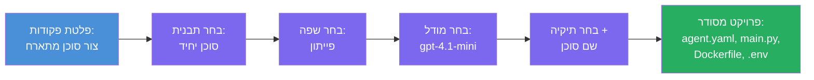

# מודול 3 - יצירת סוכן מאוחסן חדש (נאוטומט על ידי תוסף Foundry)

במודול זה, אתה משתמש בתוסף Microsoft Foundry כדי **ליצור פרויקט סוכן [מאוחסן](https://learn.microsoft.com/azure/foundry/agents/concepts/hosted-agents)**. התוסף יוצר עבורך את כל מבנה הפרויקט - כולל `agent.yaml`, `main.py`, `Dockerfile`, `requirements.txt`, קובץ `.env` ותצורת דיבוג ב-VS Code. לאחר היצירה, אתה מתאים את הקבצים האלה עם ההוראות, הכלים, וההגדרות של הסוכן שלך.

> **מושג מפתח:** התיקייה `agent/` במעבדה זו היא דוגמה למה שהתוסף Foundry מייצר כאשר אתה מריץ את פקודת הסקופולד הזאת. אינך כותב את הקבצים האלה מאפס - התוסף יוצר אותם, ואז אתה משנה אותם.

### זרימת אשף הסקופולד


---

## שלב 1: פתח את אשף יצירת הסוכן המאוחסן

1. לחץ `Ctrl+Shift+P` כדי לפתוח את **לוח הפקודות**.
2. הקלד: **Microsoft Foundry: Create a New Hosted Agent** ובחר אותו.
3. אשף יצירת הסוכן המאוחסן נפתח.

> **דרך חלופית:** ניתן גם להגיע לאשף זה מצד לוח הצד של Microsoft Foundry → לחץ על סמל **+** ליד **Agents** או לחץ לחיצה ימנית ובחר **Create New Hosted Agent**.

---

## שלב 2: בחר תבנית

האשי שואל אותך לבחור תבנית. תראה אפשרויות כמו:

| תבנית | תיאור | מתי משתמשים |
|--------|---------|--------------|
| **Single Agent** | סוכן אחד עם המודל שלו, הוראות וכלים אופציונליים | סדנה זו (מעבדה 01) |
| **Multi-Agent Workflow** | מספר סוכנים שמשתפים פעולה ברצף | מעבדה 02 |

1. בחר **Single Agent**.
2. לחץ **Next** (או הבחירה תמשיך אוטומטית).

---

## שלב 3: בחר שפת תכנות

1. בחר **Python** (מומלץ לסדנה זו).
2. לחץ **Next**.

> **C# נתמך גם כן** אם אתה מעדיף .NET. מבנה הסקופולד דומה (משתמש ב-`Program.cs` במקום `main.py`).

---

## שלב 4: בחר את המודל שלך

1. האשי מציג את המודלים שמופעלים בפרויקט Foundry שלך (מהמודול 2).
2. בחר את המודל שהפעלת - למשל, **gpt-4.1-mini**.
3. לחץ **Next**.

> אם אינך רואה מודלים, חזור ל-[מודול 2](02-create-foundry-project.md) והפעל מודל ראשון.

---

## שלב 5: בחר מיקום תיקייה ושם הסוכן

1. נפתח דו-שיח קבצים - בחר תיקייה **יעד** שבה ייווצר הפרויקט. בסדנה זו:
   - אם מתחילים חדש: בחר כל תיקייה (למשל, `C:\Projects\my-agent`)
   - אם עובדים בתוך רפו הסדנה: צור תיקייה חדשה תחת `workshop/lab01-single-agent/agent/`
2. הזן **שם** לסוכן המאוחסן (למשל, `executive-summary-agent` או `my-first-agent`).
3. לחץ **Create** (או לחץ Enter).

---

## שלב 6: המתן להשלמת הסקופולד

1. VS Code יפתח **חלון חדש** עם הפרויקט שנסקלפ.
2. המתן כמה שניות שהפרויקט ייטען במלואו.
3. תראה את הקבצים הבאים בפאנל הסייר (`Ctrl+Shift+E`):

```
📂 my-first-agent/
├── .env                ← Environment variables (auto-generated with placeholders)
├── .vscode/
│   └── launch.json     ← Debug configuration (F5 to run + Agent Inspector)
├── agent.yaml          ← Agent definition (kind: hosted)
├── Dockerfile          ← Container configuration for deployment
├── main.py             ← Agent entry point (your main code file)
└── requirements.txt    ← Python dependencies
```

> **זהו אותו מבנה כמו תיקיית `agent/`** במעבדה זו. תוסף Foundry יוצר את הקבצים האלה אוטומטית - אין צורך ליצור אותם ידנית.

> **הערת סדנה:** ברפו הסדנה הזו, התיקייה `.vscode/` נמצאת ב**שורש סביבת העבודה** (ולא בתוך כל פרויקט בנפרד). היא מכילה קבצי `launch.json` ו-`tasks.json` משותפים עם שתי תצורות דיבוג - **"Lab01 - Single Agent"** ו-**"Lab02 - Multi-Agent"** - כל אחת מצביעה על ה-`cwd` הנכון של המעבדה. כשאתה לוחץ F5, בחר את התצורה המתאימה למעבדה שאתה עובד עליה מהתפריט הנפתח.

---

## שלב 7: להבין כל קובץ שנוצר

קח רגע לבדוק כל קובץ שנוצר על ידי האשי. הבנתם חשובה למודול 4 (התאמה אישית).

### 7.1 `agent.yaml` - הגדרת הסוכן

פתח את `agent.yaml`. הוא נראה כך:

```yaml
# yaml-language-server: $schema=https://raw.githubusercontent.com/microsoft/AgentSchema/refs/heads/main/schemas/v1.0/ContainerAgent.yaml

kind: hosted
name: my-first-agent
description: >
  A hosted agent deployed to Microsoft Foundry Agent Service.
metadata:
  authors:
    - Microsoft
  tags:
    - Azure AI AgentServer
    - Microsoft Agent Framework
    - Hosted Agent
protocols:
  - protocol: responses
    version: v1
environment_variables:
  - name: AZURE_AI_PROJECT_ENDPOINT
    value: ${PROJECT_ENDPOINT}
  - name: AZURE_AI_MODEL_DEPLOYMENT_NAME
    value: ${MODEL_DEPLOYMENT_NAME}
dockerfile_path: Dockerfile
resources:
  cpu: '0.25'
  memory: 0.5Gi
```

**שדות מפתח:**

| שדה | מטרה |
|------|-------|
| `kind: hosted` | מציין שמדובר בסוכן מאוחסן (מבוסס קונטיינר, מופעל בשירות סוכן Foundry) |
| `protocols: responses v1` | הסוכן מציג את נקודת הקצה HTTP `/responses` התואמת ל-OpenAI |
| `environment_variables` | ממפה ערכי `.env` למשתני סביבה בקונטיינר בזמן הפריסה |
| `dockerfile_path` | מציין את מסלול ה-Dockerfile המשמש לבניית תמונת הקונטיינר |
| `resources` | הקצאת CPU וזיכרון לקונטיינר (0.25 CPU, 0.5Gi זיכרון) |

### 7.2 `main.py` - נקודת הכניסה של הסוכן

פתח את `main.py`. זהו קובץ הפייתון הראשי שבו מתבצע לוגיקת הסוכן שלך. הסקופולד כולל:

```python
from agent_framework.azure import AzureAIAgentClient
from azure.ai.agentserver.agentframework import from_agent_framework
from azure.identity.aio import DefaultAzureCredential
```

**ייבואים עיקריים:**

| ייבוא | מטרה |
|--------|-------|
| `AzureAIAgentClient` | מתחבר לפרויקט Foundry שלך ויוצר סוכנים דרך `.as_agent()` |
| [`DefaultAzureCredential`](https://learn.microsoft.com/azure/developer/python/sdk/authentication/credential-chains#defaultazurecredential-overview) | מטפל באימות (Azure CLI, התחברות ב-VS Code, זהות מנוהלת או שירות עיקרי) |
| `from_agent_framework` | עוטף את הסוכן כמשרת HTTP המציג את נקודת הסיום `/responses` |

הזרם הראשי הוא:
1. ליצור אישור → ליצור לקוח → לקרוא `.as_agent()` לקבל סוכן (מנהל הקשר אסינכרוני) → לעטוף לשרת → להריץ

### 7.3 `Dockerfile` - תמונת הקונטיינר

```dockerfile
FROM python:3.14-slim

WORKDIR /app

COPY ./ .

RUN pip install --upgrade pip && \
    if [ -f requirements.txt ]; then \
        pip install -r requirements.txt; \
    else \
        echo "No requirements.txt found" >&2; exit 1; \
    fi

EXPOSE 8088

CMD ["python", "main.py"]
```

**פרטים מרכזיים:**
- משתמש ב-`python:3.14-slim` כתמונת בסיס.
- מעתיק את כל קבצי הפרויקט ל-`/app`.
- מעדכן את `pip`, מתקין תלותות מ-`requirements.txt`, ונכשל במהירות אם הקובץ חסר.
- **פותח את הפורט 8088** - זה הפורט הנדרש לסוכנים המאוחסנים. אל תשנה אותו.
- מפעיל את הסוכן עם `python main.py`.

### 7.4 `requirements.txt` - תלותיות

```
agent-framework-azure-ai==1.0.0rc3
agent-framework-core==1.0.0rc3
azure-ai-agentserver-agentframework==1.0.0b16
azure-ai-agentserver-core==1.0.0b16
debugpy
agent-dev-cli
```

| חבילה | מטרה |
|---------|--------|
| `agent-framework-azure-ai` | אינטגרציה עם Azure AI במסגרת Microsoft Agent Framework |
| `agent-framework-core` | ריצה בסיסית לבניית סוכנים (כולל `python-dotenv`) |
| `azure-ai-agentserver-agentframework` | ריצה של שרת סוכן מאוחסן לשירות סוכן Foundry |
| `azure-ai-agentserver-core` | אבסטרקציות לשרת סוכן מרכזי |
| `debugpy` | תמיכה בדיבוג פייתון (מאפשר דיבוג F5 ב-VS Code) |
| `agent-dev-cli` | כלי שורת פקודה לפיתוח מקומי ובדיקת סוכנים (משמש בתצורת דיבוג/הרצה) |

---

## הבנת פרוטוקול הסוכן

סוכנים מאוחסנים מתקשרים באמצעות פרוטוקול **OpenAI Responses API**. בעת ריצה (לוקלית או בענן), הסוכן מציג נקודת קצה HTTP יחידה:

```
POST http://localhost:8088/responses
Content-Type: application/json

{
  "input": "Your prompt here",
  "stream": false
}
```

שירות Foundry Agent Service קורא לנקודה הזאת כדי לשלוח פרומפטים ממשתמש ולשחרר תגובות הסוכן. זהו אותו הפרוטוקול בו משתמשת ה-API של OpenAI, כך שהסוכן שלך תואם לכל לקוח שמדבר בפורמט OpenAI Responses.

---

### נקודת בדיקה

- [ ] אשף הסקופולד הושלם בהצלחה ונפתח **חלון VS Code חדש**
- [ ] אתה רואה את כל 5 הקבצים: `agent.yaml`, `main.py`, `Dockerfile`, `requirements.txt`, `.env`
- [ ] קובץ `.vscode/launch.json` קיים (מאפשר דיבוג F5 - בסדנה זו הוא בשורש סביבת העבודה עם תצורות ספציפיות למעבדה)
- [ ] קראת כל קובץ ומבין את מטרתו
- [ ] אתה מבין שהפורט `8088` הוא חובה ושהנקודה `/responses` היא הפרוטוקול

---

**קודם:** [02 - יצירת פרויקט Foundry](02-create-foundry-project.md) · **הבא:** [04 - הגדרה וקוד →](04-configure-and-code.md)

---

<!-- CO-OP TRANSLATOR DISCLAIMER START -->
**כתב ויתור**:
מסמך זה תורגם בעזרת שירות התרגום בינה מלאכותית [Co-op Translator](https://github.com/Azure/co-op-translator). למרות שאנו שואפים לדיוק, יש להיות מודעים לכך שתרגומים ממוחשבים עלולים להכיל שגיאות או אי-דיוקים. המסמך המקורי בשפתו הטבעית הוא המקור הסמכותי. למידע קריטי, מומלץ להשתמש בתרגום מקצועי אנושי. אנו לא אחראים לכל אי-הבנות או פרשנויות שגויות הנובעות מהשימוש בתרגום זה.
<!-- CO-OP TRANSLATOR DISCLAIMER END -->