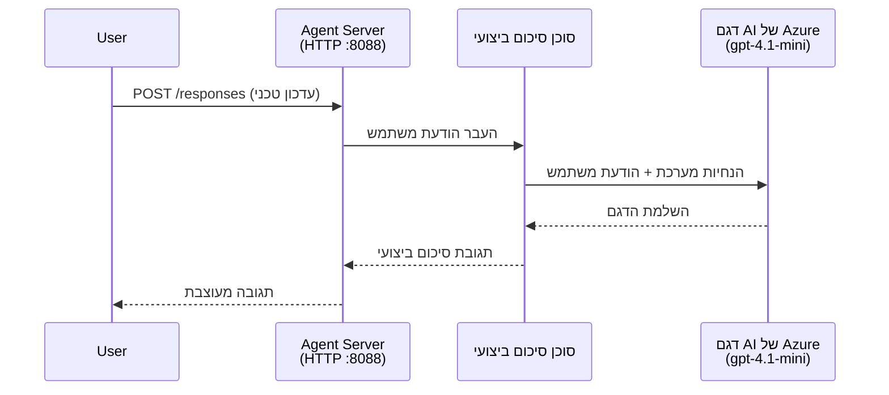
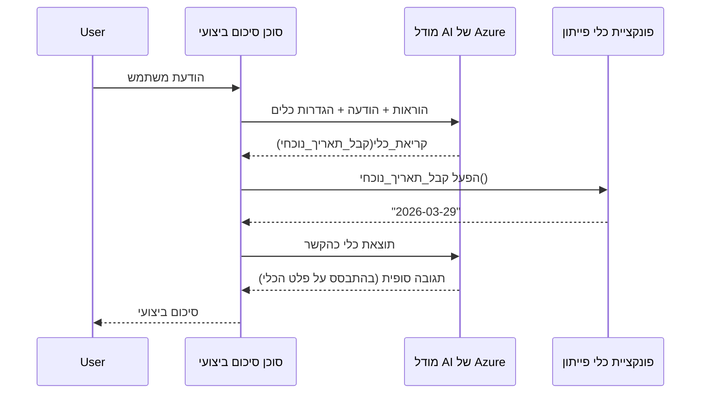

# מודול 4 - קביעת תצורת הוראות, סביבה והתקנת תלות

במודול זה, אתם מותאמים את הקבצים שנוצרו אוטומטית במודול 3. כאן אתם הופכים את התבנית הכללית ל-**הסוכן שלכם** - על ידי כתיבת הוראות, קביעת משתני סביבה, הוספת כלים (אופציונלי), והתקנת תלות.

> **תזכורת:** ההרחבה Foundry יצרה את קבצי הפרויקט שלכם אוטומטית. עכשיו אתם משנים אותם. ראו את התיקייה [`agent/`](../../../../../workshop/lab01-single-agent/agent) לדוגמה של סוכן מותאם שעובד במלואו.

---

## איך הרכיבים מתחברים יחד

### מחזור החיים של הבקשה (סוכן יחיד)


> **עם כלים:** אם לסוכן יש כלים רשומים, המודל עשוי להחזיר קריאה לכלי במקום השלמה ישירה. המסגרת מריצה את הכלי מקומית, מחזירה את התוצאה למודל, ואז המודל מייצר את התשובה הסופית.


---

## שלב 1: קביעת משתני סביבה

התבנית יצרה קובץ `.env` עם ערכי מחרוזת. עליכם למלא את הערכים האמיתיים מהמודול 2.

1. בפרויקט שיצרתם בתבנית, פתחו את הקובץ **`.env`** (הוא נמצא בשורש הפרויקט).
2. החליפו את ערכי המחרוזת בפרטי הפרויקט Foundry האמיתיים שלכם:

   ```env
   PROJECT_ENDPOINT=https://<your-account>.services.ai.azure.com/api/projects/<your-project>
   MODEL_DEPLOYMENT_NAME=gpt-4.1-mini
   ```

3. שמרו את הקובץ.

### היכן למצוא את הערכים האלה

| ערך | כיצד למצוא אותו |
|------|----------------|
| **נקודת קצה של הפרויקט** | פתחו את סרגל הצד של **Microsoft Foundry** ב-VS Code → לחצו על הפרויקט שלכם → כתובת ה-URL של נקודת הקצה מוצגת בתצוגת הפרטים. נראית כך `https://<account-name>.services.ai.azure.com/api/projects/<project-name>` |
| **שם פריסת המודל** | בסרגל Foundry, הרחיבו את הפרויקט שלכם → חפשו תחת **Models + endpoints** → השם מצויין לצד המודל המופעל (למשל, `gpt-4.1-mini`) |

> **אבטחה:** אל תעלו את קובץ `.env` למערכת ניהול הגרסאות. הוא כבר כלול בברירת המחדל בקובץ `.gitignore`. אם לא, הוסיפו אותו:
> ```
> .env
> ```

### איך משתני סביבה זורמים

שרשרת המיפוי היא: `.env` → `main.py` (קורא באמצעות `os.getenv`) → `agent.yaml` (מייצר מיפוי למשתנים בסביבה של הקונטיינר בזמן ההפעלה).

בקובץ `main.py`, התבנית קוראת את הערכים כך:

```python
PROJECT_ENDPOINT = os.getenv("AZURE_AI_PROJECT_ENDPOINT") or os.getenv("PROJECT_ENDPOINT")
MODEL_DEPLOYMENT_NAME = os.getenv("AZURE_AI_MODEL_DEPLOYMENT_NAME", os.getenv("MODEL_DEPLOYMENT_NAME", "gpt-4.1-mini"))
```

גם `AZURE_AI_PROJECT_ENDPOINT` וגם `PROJECT_ENDPOINT` מתקבלים (קובץ `agent.yaml` משתמש בקידומת `AZURE_AI_*`).

---

## שלב 2: כתיבת הוראות הסוכן

זהו שלב ההתאמה האישית החשוב ביותר. ההוראות מגדירות את אישיות הסוכן, ההתנהגות, פורמט הפלט, וההגבלות הבטיחותיות.

1. פתחו את `main.py` בפרויקט שלכם.
2. מצאו את מחרוזת ההוראות (התבנית כוללת מחרוזת ברירת מחדל/כללית).
3. החליפו אותה בהוראות מפורטות ומסודרות.

### מה כוללות הוראות טובות

| רכיב | מטרה | דוגמה |
|-------|--------|---------|
| **תפקיד** | מה הסוכן ומה הוא עושה | "אתה סוכן סיכום מנהלים" |
| **קהל יעד** | למי מיועדות התגובות | "מנהלים בכירים עם רקע טכני מוגבל" |
| **הגדרת קלט** | אילו סוגי פקודות הוא מטפל | "דוחות תקלות טכניות, עדכונים תפעוליים" |
| **פורמט פלט** | מבנה מדויק של התגובות | "סיכום מנהלים: - מה קרה: ... - השפעה עסקית: ... - הצעד הבא: ..." |
| **חוקים** | הגבלות ותנאי סירוב | "אל תוסיף מידע מעבר למה שסופק" |
| **בטיחות** | מניעת שימוש לרעה והזיות | "אם הקלט לא ברור, בקש הבהרה" |
| **דוגמאות** | זוגות קלט/פלט להכוונת ההתנהגות | כלול 2-3 דוגמאות עם קלטים שונים |

### דוגמה: הוראות סוכן סיכום מנהלים

הנה ההוראות שהיו במדריך בספריית [`agent/main.py`](../../../../../workshop/lab01-single-agent/agent/main.py):

```python
AGENT_INSTRUCTIONS = """You are an "Explain Like I'm an Executive" agent.

Purpose:
Your job is to translate complex technical or operational information into
clear, concise, and outcome-focused summaries that can be easily understood
by non-technical executives.

Audience:
Senior leaders with limited technical background who care about impact,
risk, and what happens next.

What you must do:
- Rephrase the input so it is understandable to a non-technical audience
- Prioritize clarity, brevity, and outcomes over technical accuracy
- Remove technical jargon, logs, metrics, stack traces, and deep root-cause details
- Translate technical causes into simple cause-and-effect statements
- Explicitly call out business impact
- Always include a clear next step or action
- Maintain a neutral, factual, and calm executive tone
- Do NOT add new facts or speculate beyond the input

Standard Output Structure (always use this wording):

Executive Summary:
- What happened: <plain-language description>
- Business impact: <clear, non-technical impact>
- Next step: <clear action or mitigation>

Rules:
- Keep responses under 100 words
- Do NOT add facts beyond the input
- If input is unclear, ask for clarification
"""
```

4. החליפו את מחרוזת ההוראות הקיימת ב`main.py` בהוראות מותאמות אישית שלכם.
5. שמרו את הקובץ.

---

## שלב 3: (אופציונלי) הוספת כלים מותאמים

סוכנים מתארחים יכולים להפעיל **פונקציות פייתון מקומיות** בתור [כלים](https://learn.microsoft.com/azure/foundry/agents/concepts/tool-catalog). זה יתרון קלוש לסוכנים מתארחים מבוססי קוד לעומת סוכנים מבוססי פקודות בלבד - הסוכן שלכם יכול להריץ לוגיקה שרתית מותאמת.

### 3.1 הגדרת פונקציית כלי

הוסיפו פונקציית כלי ל-`main.py`:

```python
from agent_framework import tool

@tool
def get_current_date() -> str:
    """Returns the current date in YYYY-MM-DD format."""
    from datetime import date
    return str(date.today())
```

הדקורטור `@tool` הופך פונקציית פייתון סטנדרטית לכלי סוכן. מחרוזת התיעוד הופכת לתיאור הכלי שהמודל רואה.

### 3.2 רישום הכלי אצל הסוכן

ביצירת הסוכן בעזרת מנהל ההקשר `.as_agent()`, העבירו את הכלי בפרמטר `tools`:

```python
async with AzureAIAgentClient(
    project_endpoint=PROJECT_ENDPOINT,
    model_deployment_name=MODEL_DEPLOYMENT_NAME,
    credential=credential,
).as_agent(
    name="my-agent",
    instructions=AGENT_INSTRUCTIONS,
    tools=[get_current_date],
) as agent:
    server = from_agent_framework(agent)
    await server.run_async()
```

### 3.3 איך קריאות כלי פועלות

1. המשתמש שולח פקודה.
2. המודל מחליט אם נדרש כלי (בהתבסס על הפקודה, ההוראות, ותיאורי הכלים).
3. אם הכלי נדרש, המסגרת קוראת לפונקציית הפייתון שלכם מקומית (בתוך הקונטיינר).
4. הערך שהכלי מחזיר נשלח חזרה למודל כהקשר.
5. המודל מייצר את התשובה הסופית.

> **כלים מריצים צד שרת** - הם רצים בתוך הקונטיינר שלכם, לא בדפדפן של המשתמש ולא במודל. זה מאפשר גישה למסדי נתונים, APIs, מערכות קבצים, או כל ספריית פייתון.

---

## שלב 4: יצירת והפעלת סביבה וירטואלית

לפני התקנת התלותים, צרו סביבת פייתון מבודדת.

### 4.1 יצירת הסביבה הווירטואלית

פתחו טרמינל ב-VS Code (`` Ctrl+` ``) והריצו:

```powershell
python -m venv .venv
```

זה יוצר תיקייה `.venv` בתיקיית הפרויקט שלכם.

### 4.2 הפעלת הסביבה הווירטואלית

**PowerShell (Windows):**

```powershell
.\.venv\Scripts\Activate.ps1
```

**Command Prompt (Windows):**

```cmd
.venv\Scripts\activate.bat
```

**macOS/Linux (Bash):**

```bash
source .venv/bin/activate
```

עליכם לראות את `(.venv)` בתחילת השורת הפקודה של הטרמינל, המציין שהסביבה הווירטואלית פעילה.

### 4.3 התקנת תלותים

עם הסביבה הווירטואלית פעילה, התקינו את החבילות הנדרשות:

```powershell
pip install -r requirements.txt
```

זה מתקין:

| חבילה | מטרה |
|---------|----------|
| `agent-framework-azure-ai==1.0.0rc3` | אינטגרציית Azure AI עבור [Microsoft Agent Framework](https://learn.microsoft.com/agent-framework/overview/) |
| `agent-framework-core==1.0.0rc3` | ליבת זמן ריצה לבניית סוכנים (כולל `python-dotenv`) |
| `azure-ai-agentserver-agentframework==1.0.0b16` | זמן ריצה של שרת סוכן מתארח ל-[Foundry Agent Service](https://learn.microsoft.com/azure/foundry/agents/overview) |
| `azure-ai-agentserver-core==1.0.0b16` | אבסטרקציות לשרת סוכן מרכזי |
| `debugpy` | ניפוי שגיאות בפייתון (מאפשר הדבגה עם F5 ב-VS Code) |
| `agent-dev-cli` | CLI לפיתוח מקומי ולבדיקת סוכנים |

### 4.4 אימות התקנה

```powershell
pip list | Select-String "agent-framework|agentserver"
```

פלט צפוי:
```
agent-framework-azure-ai   1.0.0rc3
agent-framework-core       1.0.0rc3
azure-ai-agentserver-agentframework 1.0.0b16
azure-ai-agentserver-core  1.0.0b16
```

---

## שלב 5: אימות הזדהות

הסוכן משתמש ב-[`DefaultAzureCredential`](https://learn.microsoft.com/azure/developer/python/sdk/authentication/credential-chains#defaultazurecredential-overview) שמנסה מספר שיטות הזדהות לפי הסדר הבא:

1. **משתני סביבה** - `AZURE_CLIENT_ID`, `AZURE_TENANT_ID`, `AZURE_CLIENT_SECRET` (עיקרון שירות)
2. **Azure CLI** - נוטל את סשן `az login` שלכם
3. **VS Code** - משתמש בחשבון שאליו התחברתם ב-VS Code
4. **Managed Identity** - משמש בעת ריצה ב-Azure (בעת פריסה)

### 5.1 אימות לפיתוח מקומי

לפחות אחת מהשיטות האלו אמורה לעבוד:

**אפשרות A: Azure CLI (מומלץ)**

```powershell
az account show --query "{name:name, id:id}" --output table
```

צפוי: מציג את שם המנוי ומספרו.

**אפשרות B: כניסה ל-VS Code**

1. הסתכלו בפינה השמאלית התחתונה של VS Code על סמל **Accounts**.
2. אם אתם רואים את שם החשבון שלכם, ההזדהות תקינה.
3. אם לא, לחצו על הסמל → **Sign in to use Microsoft Foundry**.

**אפשרות C: עיקרון שירות (CI/CD)**

```powershell
$env:AZURE_TENANT_ID = "<your-tenant-id>"
$env:AZURE_CLIENT_ID = "<your-client-id>"
$env:AZURE_CLIENT_SECRET = "<your-client-secret>"
```

### 5.2 בעיית הזדהות נפוצה

אם אתם מחוברים למספר חשבונות Azure, ודאו שהמנוי הנכון נבחר:

```powershell
az account set --subscription "<your-subscription-id>"
```

---

### נקודת ביקורת

- [ ] בקובץ `.env` ערכי `PROJECT_ENDPOINT` ו-`MODEL_DEPLOYMENT_NAME` תקינים (לא מחרוזות מיותרות)
- [ ] הוראות הסוכן מותאמות אישית ב-`main.py` - הן מגדירות את התפקיד, הקהל, פורמט הפלט, החוקים, והבטיחות
- [ ] (אופציונלי) כלים מותאמים מוגדרים ומרושמים
- [ ] הסביבה הווירטואלית נוצרה והופעלה (`(.venv)` נראה בטרמינל)
- [ ] הרצת `pip install -r requirements.txt` מסתיימת בהצלחה ללא שגיאות
- [ ] הרצת `pip list | Select-String "azure-ai-agentserver"` מראה שהחבילה מותקנת
- [ ] האימות תקין - `az account show` מחזיר את המנוי שלכם או שאתם מחוברים ל-VS Code

---

**קודם:** [03 - יצירת סוכן מתארח](03-create-hosted-agent.md) · **הבא:** [05 - בדיקה מקומית →](05-test-locally.md)

---

<!-- CO-OP TRANSLATOR DISCLAIMER START -->
**כתב ויתור**:  
מסמך זה תורגם באמצעות שירות תרגום מבוסס בינה מלאכותית [Co-op Translator](https://github.com/Azure/co-op-translator). למרות שאנו שואפים לדיוק, אנא שימו לב כי תרגומים אוטומטיים עלולים לכלול טעויות או אי-דיוקים. יש להתייחס למסמך המקורי בשפתו המקורית כמקור הסמכותי. למידע קריטי, מומלץ לתרגם באמצעות מתרגם מקצועי אנושי. אנו לא נושאים באחריות לכל אי-הבנה או פרשנות שגויה שעלולה להיגרם משימוש בתרגום זה.
<!-- CO-OP TRANSLATOR DISCLAIMER END -->