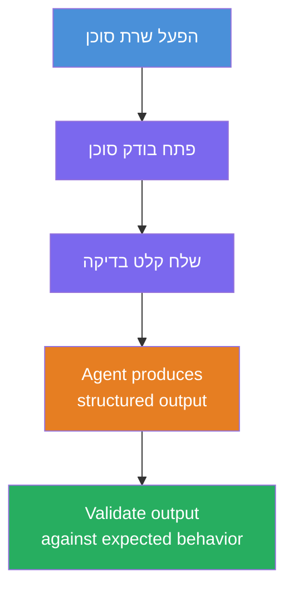
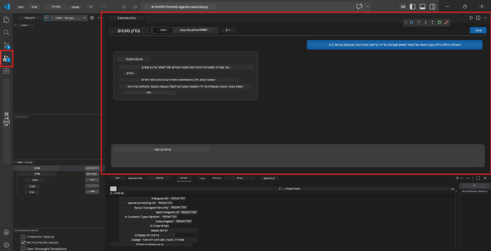
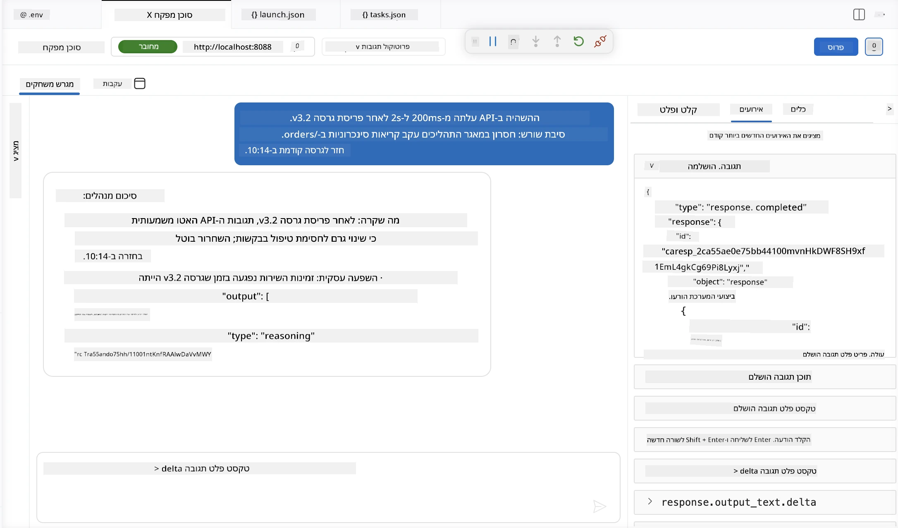

# מודול 4 - בדיקה מקומית

⏱️ ~10 דקות

במודול זה, תפעיל את הסוכן שלך מקומית ותאמת שהוא פועל כראוי באמצעות **בדיקות פונקציונליות בדרך טובה**. תשתמש ב-Agent Inspector (ממשק משתמש חזותי) או בקשות HTTP ישירות כדי לאשר שהסוכן מפיק תגובות מובנות ומדויקות.

### זרימת הבדיקה המקומית



---

## אפשרות 1: לחץ על F5 - ניפוי שגיאות עם Agent Inspector (מומלץ)

### הפעל את הדיבאגר

1. פתח את תיקיית **executive-summary-agent/** ישירות ב-VS Code (`File → Open Folder`).
2. פתח את הפאנל **Run and Debug** (`Ctrl+Shift+D`).
3. בחר **Debug Local Agent Server** בתפריט הנפתח.
4. לחץ על **F5** (או לחץ על ▶ Start Debugging).

> ⚠️ **קריטי: בחר את מפרש הפייתון שלך**
> אם אתה מקבל "ModuleNotFoundError" או שהדיבאגר לא מתחיל, עליך להגיד ל-VS Code להשתמש בסביבת העבודה הווירטואלית שלך:
  > 1. לחץ `Ctrl+Shift+P` $\rightarrow$ הקלד **Python: Select Interpreter**.
  > 2. בחר את המפרש שנמצא בתיקיית `.venv` של הפרויקט שלך (לדוגמה, `.\.venv\Scripts\python.exe` ב-Windows).
  > 3. הפעל מחדש את סשן ניפוי השגיאות.
> אם עדיין מתקבלים שגיאות, עדכן ידנית את הקובץ `tasks.json` כך:
  > 1. עבור לקובץ `.vscode/tasks.json`
  > 2. עבור לפקודה שכותרתה: `Run Agent/Workflow HTTP Server`
  > 3. עדכן את ערך הפקודה כך: `"value": "${workspaceFolder}/.venv/bin/python",`

### מה קורה

1. שרת ה-HTTP מתחיל בכתובת `http://localhost:8088/responses`.
2. הפאנל **Agent Inspector** נפתח אוטומטית - ממשק שיחה חזותי לבדיקות.
3. נקודות עצירה מופעלות ב-`main.py`.

צפה בטרמינל עבור:
```
Starting executive summary hosted agent
Executive agent server running on http://localhost:8088
```

> **אם Agent Inspector לא נפתח:** לחץ `Ctrl+Shift+P` → **Foundry Toolkit: Open Agent Inspector**.



> *ייתכן שהתמונה מציגה מיתוג ישן של 'AI TOOLKIT' מגרסה מוקדמת יותר של ההרחבה.*

---

## אפשרות 2: בדיקה דרך הטרמינל (אלטרנטיבי)

התחל את הסוכן בטרמינל אחד, שלח בקשות מטראמינל אחר:

```bash
# מסוף 1: הפעל סוכן
cd executive-summary-agent/
source .venv/bin/activate
python main.py
```

```bash
# מסוף 2: שלח בדיקה (curl)
curl -sS -X POST http://localhost:8088/responses \
  -H "Content-Type: application/json" \
  -d '{"input": "The API latency increased due to thread pool exhaustion caused by sync calls in v3.2.", "stream": false}'
```

---

## בדיקות תרחישים: אימות פונקציונלי בדרך טובה

הרץ **את כל השלושה** תרחישים להלן. אלו מאמתים שהסוכן שלך מייצר פלט נכון ומבוסס מבנה עבור קלטים מציאותיים.



### תרחיש 1: תקרית IT - זינוק בעיכוב API

**קלט:**
```
The API latency increased from 200ms to 2s after deploying v3.2.
Root cause: thread pool starvation from synchronous calls in /orders.
Rolled back at 10:14.
```

**התנהגות צפויה:**
- ✅ עוקב אחרי מבנה "Executive Summary" (מה קרה / השפעה עסקית / צעד הבא)
- ✅ ללא ז'רגון טכני (ללא "thread pool", ללא "/orders", ללא "v3.2")
- ✅ מציין בבירור את ההשפעה העסקית (למשל, משתמשים חוו עיכובים)
- ✅ כולל צעד הבא (למשל, תיקון הוטמע, ניטור בתהליך)

---

### תרחיש 2: נתיב נתונים - כשל ETL

**קלט:**
```
The nightly ETL job failed because the upstream schema changed. APAC dashboards show missing data.
```

**התנהגות צפויה:**
- ✅ מסכם את כשל רענון הנתונים בשפה פשוטה
- ✅ מזכיר את ההשפעה על לוח הבקרה של APAC
- ✅ כולל צעד תיקון הבא
- ✅ לא מזכיר "ETL", "schema" או מונחים טכניים אחרים

---

### תרחיש 3: אבטחה - חשיפת אישורי גישה

**קלט:**
```
Static analysis flagged a hardcoded secret in the repository.
The secret may have been exposed in commit history.
```

**התנהגות צפויה:**
- ✅ מתאר בעיה של אישורים/אבטחה בשפה ידידותית למנהלים
- ✅ מציין סיכון פוטנציאלי (גישה בלתי מורשית)
- ✅ מציין פעולה מתקנת (סיבוב אישורים, ביקורת)
- ✅ אינו כולל מונחים כמו "ניתוח סטטי", "היסטוריית קומיט" או "קוד קשה"

---

## קריטריוני אימות

עבור כל תרחיש, בדוק:

| # | קריטריון | תנאי מעבר |
|---|----------|---------------|
| 1 | **מבנה** | התגובה משתמשת בפורמט "Executive Summary" עם כל שלוש הנקודות |
| 2 | **שפה פשוטה** | ללא ז'רגון טכני שמנהל לא יבין |
| 3 | **דיוק** | הסיכום משקף את הקלט - ללא פרטים מומצאים |
| 4 | **תמציתיות** | התגובה היא פחות מ-100 מילים |
| 5 | **הצעד הבא** | מצוין בבירור פעולה או הפחתה |

---

## טיפים לניפוי שגיאות

| בעיה | תיקון |
|-------|-----|
| הסוכן לא מתחיל | בדוק ערכי `.env`, וודא שסביבת venv פעילה, הרץ `pip install -r requirements.txt` |
| תגובה ריקה או כללית | סקור את ההוראות ב-`main.py` - ודא שפירמט הפלט צוין |
| תגובה כוללת ז'רגון | חזק את כללי "הסרת מונחים טכניים" בהוראות |
| Agent Inspector לא נפתח | `Ctrl+Shift+P` → **Foundry Toolkit: Open Agent Inspector** |
| שגיאות במודל בטרמינל | וודא ש-`AZURE_AI_MODEL_DEPLOYMENT_NAME` תואם במדויק (רגיש לאותיות) |

---

### ✅ נקודת בדיקה

- [ ] הסוכן מתחיל מקומית ללא שגיאות
- [ ] Agent Inspector נפתח ומציג ממשק שיחה (אם משתמש ב-F5)
- [ ] **תרחיש 1** (תקרית IT) - סיכום מבוסס מבנה, ללא ז'רגון
- [ ] **תרחיש 2** (נתיב נתונים) - סיכום רלוונטי עם השפעה עסקית
- [ ] **תרחיש 3** (אזהרת אבטחה) - תקשורת סיכון מתאימה
- [ ] כל התגובות עומדות במבנה הפלט המוגדר

> **שמור את תגובותיך** (העתק או צילומסך) - תוכל להשוות אותן לתוצאות בענן במודול 06.

---

**הקודם:** [03 - Configure & Code](03-configure-and-code.md) · **הבא:** [05 - Deploy to Foundry →](05-deploy-to-foundry.md)

---

<!-- CO-OP TRANSLATOR DISCLAIMER START -->
**כתב ויתור**:
מסמך זה תורגם באמצעות שירות תרגום אוטומטי [Co-op Translator](https://github.com/Azure/co-op-translator). למרות שאנו שואפים לדיוק, יש לקחת בחשבון שתרגומים אוטומטיים עלולים להכיל שגיאות או אי-דיוקים. יש להחשיב את המסמך המקורי בשפתו הטבעית כמקור הסמכות. למידע קריטי מומלץ להשתמש בתרגום מקצועי על ידי מתרגם אדם. אנו לא אחראים לכל אי-הבנה או פירוש שגוי הנובע מהשימוש בתרגום זה.
<!-- CO-OP TRANSLATOR DISCLAIMER END -->