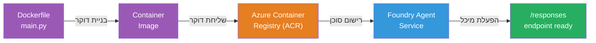
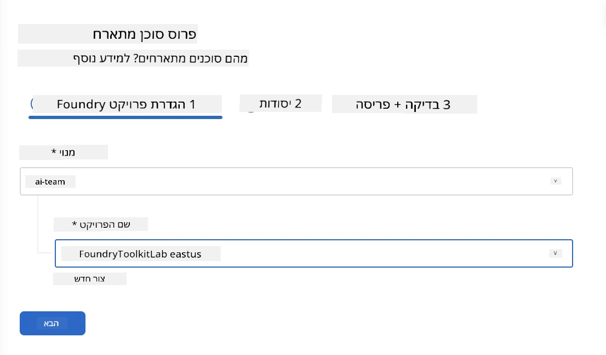
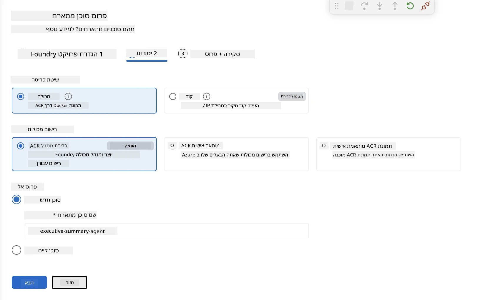
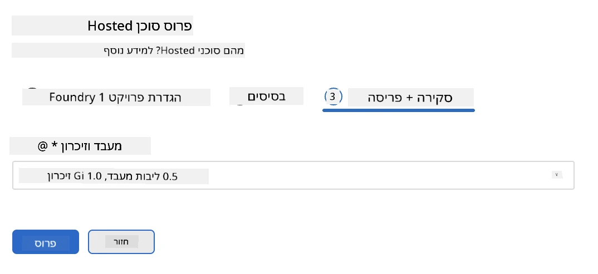
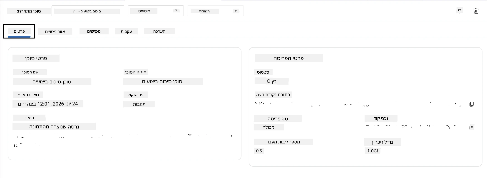

# מודול 5 - פריסה לשירות סוכן Foundry

⏱️ ~10 דקות

> ⚠️ **משתמשי מסלול B:** מודול זה דורש מנוי ל-Foundry. אם אתם משתמשים ב-Foundry Local, דלגו אל [מודול 07 - סיכום](07-summary.md). סיימתם בהצלחה את זרימת העבודה המקומית!

במודול זה, אתם מפעילים את הסוכן שנבדק מקומית ב-Microsoft Foundry כסוכן **מתארח**. הפריסה בונה תמונת מכולה, מעלה אותה ל-Azure Container Registry, ומתחילה את הסוכן בתשתית המנוהלת של Foundry.

### צינור הפריסה

---

## בדיקת דרישות מוקדמות

לפני הפריסה, ודאו:

- [ ] הסוכן עובר את כל 3 התרחישים המקומיים מ-[מודול 04](04-test-locally.md)
- [ ] יש לכם את תפקיד **Azure AI User** ברמת הפרויקט ([מודול 01, Assign RBAC](01-setup.md#deploy-a-model--assign-rbac))
- [ ] אתם מחוברים ל-Azure ב-VS Code (אייקון חשבונות מציג את שמכם)

---

## שלב 1: התחילו את הפריסה

### אפשרות A: פריסה מ-Agent Inspector (מומלץ)

אם Agent Inspector פתוח (משלב הבדיקה):
1. לחצו על כפתור **פריסה** בפינה הימנית העליונה (אייקון ענן ↑).

### אפשרות B: פריסה מפלטת הפקודות

1. לחצו `Ctrl+Shift+P` → **Foundry Toolkit: Deploy Hosted Agent**.

---

## שלב 2: הגדר את הפריסה

האשף יבקש מכם:

| בקשה | בחירה |
|--------|-----------|
| **מנוי** | מנוי ה-Azure שלך |
| **פרויקט יעד** | פרויקט Foundry שלך (למשל, `workshop-agents`) |

לחצו **הבא** כדי להגדיר את הסוכן.

| בקשה | בחירה |
|--------|-----------|
| **שיטת פריסה** | מכולה |
| **רשום מכולות** | **ברירת מחדל ACR** (Microsoft Foundry יוצר ומנהל אחד עבורך) |
| **פריסה ל** | סוכן חדש (שם, `executive-summary-agent`) |

לחצו **הבא** כדי לסקור ולפרוס את הסוכן שלך.

| בקשה | בחירה |
|--------|-----------|
| **CPU וזיכרון** | **0.25 ליבות CPU, 0.5 Gi זיכרון** (מספיק לסדנה) |

---

## שלב 3: פרסו ופיקחו

1. לחצו על **פרוס**.
2. צפו בפאנל **Output** (בחרו **Microsoft Foundry** מהרשימה הנפתחת).
3. הפריסה עוברת את השלבים הבאים:
   - **בניית Docker** - בונה מכולה מתוך Dockerfile שלך
   - **דחיפת Docker** - מעלה את התמונה ל-ACR (1–3 דקות בפריסה ראשונה)
   - **רישום סוכן** - יוצר סוכן מתארח ב-Foundry
   - **הפעלה מכולה** - מתחילה עם זהות מנוהלת מערכתית

4. כשמסתיים, מופיעה הודעה:
   > **הסוכן שלי פורס בהצלחה.** `צפה ביומנים` `הפעל סוכן`

5. לחצו על **הפעל סוכן** כדי לפתוח את Agent Playground.

### ערכי סטטוס פריסה

| סטטוס | משמעות |
|--------|---------|
| **רץ** | המכולה מוכנה, הסוכן מגיב |
| **ממתין** | המכולה מתחילה - המתן 30–60 שניות |
| **כשל** | בדוק יומנים (מדובר בטיפול בבעיות למטה) |

---

## שגיאות נפוצות בפריסה

| שגיאה | סיבה | תיקון |
|-------|-------|------|
| `agents/write` הרשאה נדחתה | חסר תפקיד **Azure AI User** ברמת הפרויקט | [מודול 01, Assign RBAC](01-setup.md#deploy-a-model--assign-rbac) |
| Docker לא רץ | Docker Desktop לא הופעל | הפעל את Docker Desktop → אשר `docker info` |
| הרשאת ACR | זהות מנוהלת לא יכולה למשוך תמונה | ראה [מודול 08 - טיפול בבעיות](08-troubleshooting.md) |

---

### ✅ נקודת בדיקה

- [ ] הפריסה הושלמה ללא שגיאות
- [ ] הסוכן מופיע תחת **Hosted Agents (Preview)** בסרגל הצד של Foundry
- [ ] סטטוס המכולה מציג **רץ**
- [ ] טאבו Agent Playground נפתח ומציג פרטים על הסוכן וכתובת הקצה

---

**קודם:** [04 - בדיקה מקומית](04-test-locally.md) · **הבא:** [06 - אימות ב-Playground →](06-verify-in-playground.md)

---

<!-- CO-OP TRANSLATOR DISCLAIMER START -->
**כתב ויתור**:
מסמך זה תורגם באמצעות שירות תרגום אוטומטי [Co-op Translator](https://github.com/Azure/co-op-translator). למרות שאנו שואפים לדיוק, יש לקחת בחשבון שתרגומים אוטומטיים עלולים להכיל שגיאות או אי-דיוקים. יש להחשיב את המסמך המקורי בשפתו הטבעית כמקור הסמכות. למידע קריטי מומלץ להשתמש בתרגום מקצועי על ידי מתרגם אדם. אנו לא אחראים לכל אי-הבנה או פירוש שגוי הנובע מהשימוש בתרגום זה.
<!-- CO-OP TRANSLATOR DISCLAIMER END -->