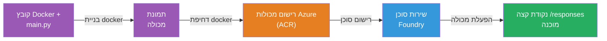
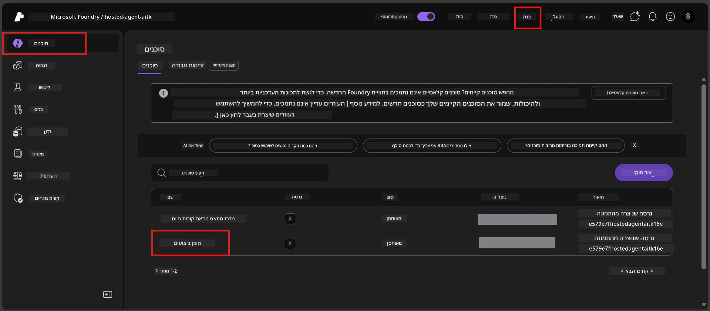

# מודול 6 - פריסה לשירות סוכן Foundry

במודול זה, אתה מבצע פריסה של הסוכן שנבדק מקומית שלך ל-Microsoft Foundry כסוכן [**מארח**](https://learn.microsoft.com/azure/foundry/agents/concepts/hosted-agents). תהליך הפריסה בונה תמונת מכולת Docker מהפרויקט שלך, דוחף אותה ל-[Azure Container Registry (ACR)](https://learn.microsoft.com/azure/container-registry/container-registry-intro), ויוצר גרסת סוכן מארח ב-[Foundry Agent Service](https://learn.microsoft.com/azure/foundry/agents/overview).

### צינור הפריסה


---

## בדיקת דרישות מוקדמות

לפני הפריסה, אמת כל פריט מטה. דילוג על אלה הוא הגורם הנפוץ ביותר לכישלונות בפריסה.

1. **הסוכן עובר בהצלחה בדיקות מקומיות:**
   - השלמת את כל 4 הבדיקות במודול [5](05-test-locally.md) והסוכן הגיב כראוי.

2. **יש לך תפקיד [Azure AI User](https://learn.microsoft.com/azure/foundry/concepts/rbac-foundry#built-in-roles):**
   - התפקיד הוקצה במודול [2, שלב 3](02-create-foundry-project.md). אם אינך בטוח, אמת עכשיו:
   - פורטל Azure → משאב **הפרויקט** שלך ב-Foundry → **בקרת גישה (IAM)** → לשונית **הקצאות תפקיד** → חפש את שמך → אמת כי מופיע **Azure AI User**.

3. **אתה מחובר ל-Azure ב-VS Code:**
   - בדוק את סמל החשבונות בפינה השמאלית התחתונה של VS Code. שם החשבון שלך אמור להיות גלוי.

4. **(אופציונלי) Docker Desktop פועל:**
   - Docker נחוץ רק אם תוסף Foundry מבקש ממך לבצע בניה מקומית. ברוב המקרים, התוסף מטפל בבניית מכולות אוטומטית במהלך הפריסה.
   - אם יש לך Docker מותקן, אמת שהוא פועל: `docker info`

---

## שלב 1: התחל את הפריסה

יש לך שתי דרכים לפרוס - שתיהן מובילות לאותה תוצאה.

### אפשרות א: פריסה מתוך Agent Inspector (מומלץ)

אם אתה מריץ את הסוכן עם ניפוי שגיאות (F5) ו-Agent Inspector פתוח:

1. הסתכל על **פינה ימנית עליונה** של פנל Agent Inspector.
2. לחץ על כפתור **פרוס** (אייקון ענן עם חץ למעלה ↑).
3. אשף הפריסה נפתח.

### אפשרות ב: פריסה מתוך Command Palette

1. לחץ `Ctrl+Shift+P` לפתיחת **Command Palette**.
2. הקלד: **Microsoft Foundry: Deploy Hosted Agent** ובחר אותו.
3. אשף הפריסה נפתח.

---

## שלב 2: הגדר את הפריסה

אשף הפריסה מנחה אותך בתהליך ההגדרה. מלא בכל שאלה:

### 2.1 בחר את הפרויקט היעד

1. תפריט נפתח מציג את פרויקטי Foundry שלך.
2. בחר את הפרויקט שיצרת במודול 2 (לדוגמה, `workshop-agents`).

### 2.2 בחר את קובץ הסוכן במכולה

1. תתבקש לבחור את נקודת הכניסה לסוכן.
2. בחר **`main.py`** (פייתון) - זהו הקובץ שאשף הפריסה משתמש בו לזיהוי הפרויקט שלך.

### 2.3 הגדר משאבים

| הגדרה | ערך מומלץ | הערות |
|---------|------------------|-------|
| **CPU** | `0.25` | ברירת מחדל, מספיקה לסדנה. הגדל לעומסי עבודה בייצור |
| **Memory** | `0.5Gi` | ברירת מחדל, מספיקה לסדנה |

אלה תואמים לערכים בקובץ `agent.yaml`. תוכל לקבל את ברירות המחדל.

---

## שלב 3: אשר ופרוס

1. האשף מציג סיכום פריסה עם:
   - שם הפרויקט היעד
   - שם הסוכן (מהקובץ `agent.yaml`)
   - קובץ המכולה והמשאבים
2. עבר על הסיכום ולחץ על **אשר ופרוס** (או **פרוס**).
3. עקוב אחר ההתקדמות ב-VS Code.

### מה קורה במהלך הפריסה (שלב אחר שלב)

הפריסה היא תהליך רב-שלבי. צפה בפאנל **Output** של VS Code (בחר "Microsoft Foundry" מהתפריט הנפתח) כדי לעקוב:

1. **בניית Docker** - VS Code בונה תמונת מכולת Docker מהקובץ `Dockerfile` שלך. תראה הודעות על שכבות Docker:
   ```
   Step 1/6 : FROM python:<version>-slim
   Step 2/6 : WORKDIR /app
   ...
   Successfully built abc123def456
   ```

2. **דחיפת Docker** - התמונה נדחפת ל-**Azure Container Registry (ACR)** המשויך לפרויקט Foundry שלך. זה עשוי לקחת 1-3 דקות בפריסה הראשונה (תמונת הבסיס גדולה מ-100MB).

3. **רישום סוכן** - Foundry Agent Service יוצר סוכן מארח חדש (או גרסה חדשה אם הסוכן כבר קיים). המטא-דאטה של הסוכן מ-`agent.yaml` משמשת.

4. **הפעלת המכולה** - המכולה מתחילה בתשתית מנוהלת של Foundry. הפלטפורמה מייעדת [זהות מנוהלת ע״י המערכת](https://learn.microsoft.com/azure/foundry/agents/concepts/agent-identity) ופותחת את נקודת הקצה `/responses`.

> **הפריסה הראשונה אטית יותר** (Docker צריך לדחוף את כל השכבות). הפריסות הבאות מהירות יותר כי Docker שומר במטמון שכבות שלא השתנו.

---

## שלב 4: אמת את מצב הפריסה

לאחר שהפקודת פריסה מסתיימת:

1. פתח את סרגל הצד של **Microsoft Foundry** על ידי לחיצה על אייקון Foundry בסרגל הפעילויות.
2. הרחב את הסעיף **Hosted Agents (Preview)** במסגרת הפרויקט שלך.
3. אמור להופיע שם הסוכן שלך (לדוגמה, `ExecutiveAgent` או השם מ-`agent.yaml`).
4. **לחץ על שם הסוכן** כדי להרחיבו.
5. תראה אחת או יותר **גרסאות** (לדוגמה, `v1`).
6. לחץ על הגרסה כדי לראות **פרטי המכולה**.
7. בדוק את שדה **Status**:

   | סטטוס | משמעות |
   |--------|---------|
   | **Started** או **Running** | המכולה רצה והסוכן מוכן |
   | **Pending** | המכולה מתחילה לפעול (המתן 30-60 שניות) |
   | **Failed** | כשל בהפעלת המכולה (בדוק יומנים - ראה פתרון בעיות למטה) |



> **אם אתה רואה "Pending" יותר מ-2 דקות:** ייתכן שהמכולה מושכת את תמונת הבסיס. המתן קצת יותר. אם נשאר במצב ממתין, בדוק את יומני המכולה.

---

## שגיאות נפוצות בפריסה ודרכי תיקונן

### שגיאה 1: Permission denied - `agents/write`

```
Error: lacks the required data action 
Microsoft.CognitiveServices/accounts/AIServices/agents/write 
to perform POST /api/projects/{projectName}/assistants operation.
```

**סיבה לשורש הבעיה:** אין לך תפקיד `Azure AI User` ברמת **הפרויקט**.

**פתרון שלב אחר שלב:**

1. פתח [https://portal.azure.com](https://portal.azure.com).
2. בשורת החיפוש, הקלד את שם **הפרויקט** שלך ב-Foundry ולחץ עליו.
   - **קריטי:** ודא שאתה נכנס למשאב **הפרויקט** (סוג: "Microsoft Foundry project"), ולא למשאב האב החשבון/המרכז.
3. בתפריט השמאלי, לחץ על **Access control (IAM)**.
4. לחץ **+ הוסף** → **הוסף הקצאת תפקיד**.
5. בלשונית **Role**, חפש את [**Azure AI User**](https://learn.microsoft.com/azure/foundry/concepts/rbac-foundry#built-in-roles) ובחר אותו. לחץ **הבא**.
6. בלשונית **Members**, בחר **User, group, or service principal**.
7. לחץ **+ בחר חברים**, חפש את שמך/אימייל שלך, סמן את עצמך, לחץ **בחר**.
8. לחץ **סקירה + הקצה** → שוב **סקירה + הקצה**.
9. המתן 1-2 דקות להפצת ההקצאה.
10. **נסה מחדש את הפריסה** משלב 1.

> התפקיד חייב להיות בהיקף ה**פרויקט**, לא רק בהיקף החשבון. זהו הגורם מספר 1 לכישלונות בפריסה.

### שגיאה 2: Docker לא רץ

```
Error: Docker build failed / Cannot connect to Docker daemon
```

**תיקון:**
1. הפעל את Docker Desktop (מצא אותו בתפריט התחל או באזור ההודעות של המערכת).
2. המתן עד שיופיע "Docker Desktop is running" (30-60 שניות).
3. אמת: `docker info` בטרמינל.
4. **Windows בלבד:** ודא ש-WSL 2 פעיל בהגדרות Docker Desktop → **כללי** → **Use the WSL 2 based engine**.
5. נסה שוב לפרוס.

### שגיאה 3: הרשאת ACR - `AcrPullUnauthorized`

```
Error: AcrPullUnauthorized
```

**סיבה לשורש הבעיה:** לזהות המנוהלת של פרויקט Foundry אין גישה למשיכת תמונות מה-registry של המכולות.

**תיקון:**
1. בפורטל Azure, עבור ל-[רישום המכולות שלך (Container Registry)](https://learn.microsoft.com/azure/container-registry/container-registry-intro) (נמצא באותה קבוצת משאבים כמו פרויקט Foundry שלך).
2. עבור ל**Access control (IAM)** → **הוסף** → **הוסף הקצאת תפקיד**.
3. בחר את תפקיד **[AcrPull](https://learn.microsoft.com/azure/container-registry/container-registry-roles)**.
4. תחת חברים, בחר **Managed identity** → מצא את זהות המנוהלת של פרויקט Foundry.
5. **סקירה + הקצה**.

> בדרך כלל זה מוגדר אוטומטית ע״י תוסף Foundry. אם אתה רואה שגיאה זו, ייתכן שההגדרה האוטומטית נכשלה.

### שגיאה 4: אי התאמה בפלטפורמת המכולה (Apple Silicon)

אם אתה מבצע פריסה ממכשיר Apple Silicon Mac (M1/M2/M3), המכולה חייבת להיבנות עבור `linux/amd64`:

```bash
docker build --platform linux/amd64 -t myagent:v1 .
```

> תוסף Foundry מתמודד עם זה אוטומטית עבור רוב המשתמשים.

---

### נקודת בדיקה

- [ ] פקודת הפריסה הושלמה ללא שגיאות ב-VS Code
- [ ] הסוכן מופיע תחת **Hosted Agents (Preview)** בסרגל הצד של Foundry
- [ ] לחצת על הסוכן → בחרת גרסה → צפית ב**פרטי המכולה**
- [ ] סטטוס המכולה מציג **Started** או **Running**
- [ ] (במידה והיו שגיאות) זיהית את השגיאה, יישמת את התיקון ופרסת מחדש בהצלחה

---

**קודם:** [05 - בדיקה מקומית](05-test-locally.md) · **הבא:** [07 - אימות ב-Playground →](07-verify-in-playground.md)

---

<!-- CO-OP TRANSLATOR DISCLAIMER START -->
**כתב ויתור**:  
מסמך זה תורגם באמצעות שירות תרגום בינה מלאכותית [Co-op Translator](https://github.com/Azure/co-op-translator). למרות שאנו שואפים לדיוק, יש לקחת בחשבון שתרגומים אוטומטיים עלולים להכיל טעויות או אי-דיוקים. המסמך המקורי בשפת המקור הוא המקור הסמכותי שיש להתייחס אליו. למידע קריטי מומלץ להשתמש בתרגום מקצועי של אדם. אנו לא נושאים באחריות לכל אי-הבנות או פרשנויות שגויות הנובעות מהשימוש בתרגום זה.
<!-- CO-OP TRANSLATOR DISCLAIMER END -->