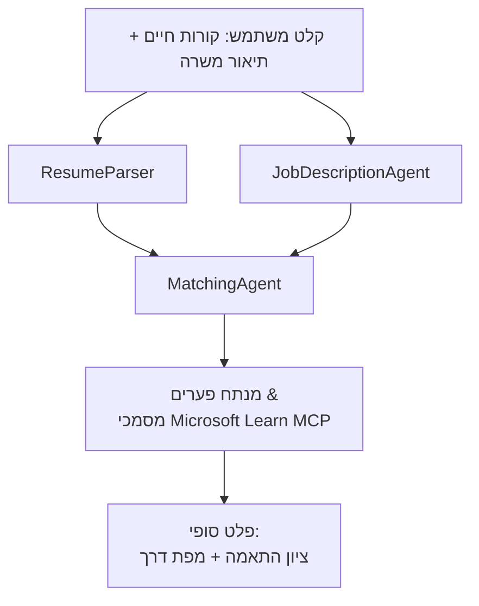

# PersonalCareerCopilot - הערכת התאמת קורות חיים למשרה

תהליך מרובה-סוכנים שמעריך עד כמה קורות חיים מתאימים לתיאור משרה, ואז מייצר מפת דרכים ללמידה מותאמת אישית לסגירת הפערים.

---

## סוכנים

| סוכן | תפקיד | כלים |
|-------|------|-------|
| **ResumeParser** | מחלץ מיומנויות, ניסיון, ותעודות מובנות מטקסט קורות החיים | - |
| **JobDescriptionAgent** | מחלץ מיומנויות נדרשות/מועדפות, ניסיון, ותעודות מתיאור משרה | - |
| **MatchingAgent** | משווה פרופיל מול דרישות → ציון התאמה (0-100) + מיומנויות תואמות/חסרות | - |
| **GapAnalyzer** | בונה מפת דרכים ללמידה מותאמת אישית עם משאבי Microsoft Learn | `search_microsoft_learn_for_plan` (MCP) |

## תהליך עבודה


---

## התחלה מהירה

### 1. הגדר סביבה

```powershell
cd workshop\lab02-multi-agent\PersonalCareerCopilot
python -m venv .venv
.\.venv\Scripts\Activate.ps1          # Windows PowerShell
# source .venv/bin/activate            # macOS / לינוקס
pip install -r requirements.txt
```


### 2. הגדר אישורים

העתק את קובץ הדוגמה של הסביבה ומלא את פרטי הפרויקט Foundry שלך:

```powershell
cp .env.example .env
```


ערוך את `.env`:

```env
PROJECT_ENDPOINT=https://<your-account>.services.ai.azure.com/api/projects/<your-project>
MODEL_DEPLOYMENT_NAME=gpt-4.1-mini
```

| ערך | היכן למצוא אותו |
|-------|-----------------|
| `PROJECT_ENDPOINT` | סרגל הצד של Microsoft Foundry ב-VS Code → קליק ימני על הפרויקט שלך → **העתק נקודת קצה של הפרויקט** |
| `MODEL_DEPLOYMENT_NAME` | סרגל הצד של Foundry → הרחב את הפרויקט → **Models + endpoints** → שם פריסת מודל |

### 3. הרץ מקומית

```powershell
python -m debugpy --listen 127.0.0.1:5679 -m agentdev run main.py --verbose --port 8088
```

או השתמש במשימת VS Code: `Ctrl+Shift+P` → **Tasks: Run Task** → **Run Lab02 HTTP Server**.

### 4. בדוק עם Agent Inspector

פתח את Agent Inspector: `Ctrl+Shift+P` → **Foundry Toolkit: Open Agent Inspector**.

הדבק את הפקודה הבאה לבדיקה:

```
Resume:
Jane Doe
Senior Software Engineer with 5 years of experience in Python, Django, and AWS.
Built microservices handling 10K+ requests/second. Led a team of 4 developers.
Certifications: AWS Solutions Architect Associate.
Education: B.S. Computer Science, State University.

Job Description:
Senior Cloud Engineer at Contoso Ltd.
Required: Python, Azure, Kubernetes, Terraform, CI/CD pipelines.
Preferred: Go, monitoring (Prometheus/Grafana), cost optimization.
Experience: 5+ years in cloud infrastructure.
Certifications: Azure Solutions Architect Expert preferred.
```

**צפוי:** ציון התאמה (0-100), מיומנויות תואמות/חסרות, ומפת דרכים מותאמת אישית עם כתובות URL של Microsoft Learn.

### 5. פרוס ל-Foundry

`Ctrl+Shift+P` → **Microsoft Foundry: Deploy Hosted Agent** → בחר את הפרויקט שלך → אשר.

---

## מבנה הפרויקט

```
PersonalCareerCopilot/
├── .env.example        ← Template for environment variables
├── .env                ← Your credentials (git-ignored)
├── agent.yaml          ← Hosted agent definition (name, resources, env vars)
├── Dockerfile          ← Container image for Foundry deployment
├── main.py             ← 4-agent workflow (instructions, MCP tool, WorkflowBuilder)
└── requirements.txt    ← Python dependencies
```


## קבצים מרכזיים

### `agent.yaml`

מגדיר את הסוכן המתארח עבור שירות סוכני Foundry:
- `kind: hosted` - רץ כמכולה מנוהלת
- `protocols: [responses v1]` - מפעיל נקודת קצה HTTP `/responses`
- `environment_variables` - משתני `PROJECT_ENDPOINT` ו-`MODEL_DEPLOYMENT_NAME` מוזרקים בעת הפריסה

### `main.py`

מכיל:
- **הוראות לסוכנים** - ארבעה קבועים `*_INSTRUCTIONS`, אחד לכל סוכן
- **כלי MCP** - `search_microsoft_learn_for_plan()` קורא ל- `https://learn.microsoft.com/api/mcp` דרך HTTP סטרימבילי
- **יצירת סוכנים** - `create_agents()` כמנהל הקשר באמצעות `AzureAIAgentClient.as_agent()`
- **גרף זרימת עבודה** - `create_workflow()` משתמש ב-WorkflowBuilder לחבר סוכנים בדפוסי פאנ-אאוט/פאנ-אין/רציף
- **הפעלה של שרת** - `from_agent_framework(agent).run_async()` על פורט 8088

### `requirements.txt`

| חבילה | גרסה | מטרה |
|---------|---------|---------|
| `agent-framework-azure-ai` | `1.0.0rc3` | אינטגרציית Azure AI למסגרת סוכנים של Microsoft |
| `agent-framework-core` | `1.0.0rc3` | סביבת ריצה מרכזית (כולל WorkflowBuilder) |
| `azure-ai-agentserver-agentframework` | `1.0.0b16` | סביבת ריצה לסוכן מתארח |
| `azure-ai-agentserver-core` | `1.0.0b16` | הפשטות מרכזיות לשרת סוכנים |
| `debugpy` | עדכנית ביותר | ניפוי שגיאות בפייתון (F5 ב-VS Code) |
| `agent-dev-cli` | `--pre` | CLI לפיתוח מקומי + backend ל-Agent Inspector |

---

## פתרון בעיות

| בעיה | תיקון |
|-------|-----|
| `RuntimeError: Missing required environment variable(s)` | צור `.env` עם `PROJECT_ENDPOINT` ו-`MODEL_DEPLOYMENT_NAME` |
| `ModuleNotFoundError: No module named 'agent_framework'` | הפעל venv והריץ `pip install -r requirements.txt` |
| אין כתובות URL של Microsoft Learn בפלט | בדוק את חיבור האינטרנט ל- `https://learn.microsoft.com/api/mcp` |
| רק כרטיס פער אחד (קטוע) | ודא ש-`GAP_ANALYZER_INSTRUCTIONS` כוללת את הגוש `CRITICAL:` |
| פורט 8088 בשימוש | עצור שרתים אחרים: `netstat -ano \| findstr :8088` |

לפרטים נוספים על פתרון בעיות עיין ב-[מודול 8 - פתרון בעיות](../docs/08-troubleshooting.md).

---

**מדריך מלא:** [מסמכי Lab 02](../docs/README.md) · **חזרה ל:** [README של Lab 02](../README.md) · [דף הבית של הסדנה](../../../README.md)

---

<!-- CO-OP TRANSLATOR DISCLAIMER START -->
**כתב ויתור**:  
מסמך זה תורגם באמצעות שירות תרגום מבוסס בינה מלאכותית [Co-op Translator](https://github.com/Azure/co-op-translator). בעוד שאנו שואפים לדיוק, יש לשים לב כי תרגומים אוטומטיים עלולים להכיל טעויות או אי דיוקים. המסמך המקורי בשפת המקור שלו יש להיחשב כמקור הסמכותי. למידע קריטי מומלץ להיעזר בתרגום מקצועי של אדם. אנו לא נושאים באחריות לכל אי הבנה או פרשנות שגויה הנובעים משימוש בתרגום זה.
<!-- CO-OP TRANSLATOR DISCLAIMER END -->